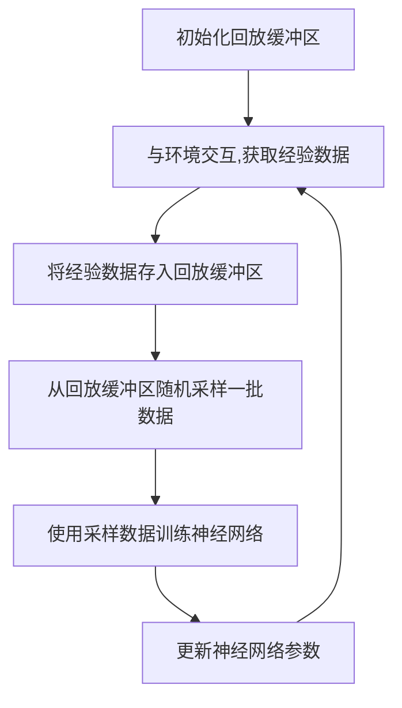

# 一切皆是映射：解析经验回放的原理与代码实现

## 1.背景介绍

### 1.1 经验回放的概念

经验回放(Experience Replay)是一种强化学习算法中常用的技术,它可以显著提高训练效率并增强模型的泛化能力。在传统的强化学习中,智能体与环境进行交互时,每一步的经验(状态、动作、奖励等)仅被使用一次,然后被丢弃。而经验回放则允许智能体将过去的经验存储在回放缓冲区中,并在之后的训练过程中多次重复利用这些数据。

### 1.2 经验回放的重要性

引入经验回放机制有以下几个重要原因:

1. **打破相关性**: 在强化学习中,连续的经验数据往往存在很强的相关性,这会导致训练过程收敛缓慢。经验回放通过随机采样,打破了经验数据之间的相关性,提高了训练效率。

2. **数据利用率提高**: 传统方法每次只使用一次经验数据,而经验回放则可以重复利用历史数据,提高了数据的利用率。

3. **增强泛化能力**: 通过随机采样,智能体可以接触到更多样化的状态,从而增强了模型的泛化能力。

4. **离线学习**: 经验回放使得智能体可以在与环境交互后,脱离环境进行训练,这为并行计算和分布式训练提供了可能。

经验回放已被广泛应用于各种强化学习算法中,如DQN、A3C、PPO等,是提高训练效率和泛化能力的关键技术之一。

## 2.核心概念与联系

### 2.1 经验回放的核心概念

经验回放的核心概念包括:

1. **回放缓冲区(Replay Buffer)**: 用于存储智能体与环境交互过程中产生的经验数据。

2. **采样(Sampling)**: 从回放缓冲区中随机采样一批经验数据,用于训练神经网络。

3. **优先经验回放(Prioritized Experience Replay)**: 根据经验数据的重要性进行采样,提高训练效率。

### 2.2 经验回放与其他概念的联系

经验回放与强化学习中的其他概念密切相关:

1. **马尔可夫决策过程(MDP)**: 经验回放并不违背马尔可夫性质,因为它只是对历史数据进行重复利用,而不影响当前状态的转移概率。

2. **时序差分学习(Temporal Difference Learning)**: 经验回放可以看作是一种对时序差分目标的采样方式。

3. **目标网络(Target Network)**: 经验回放常与目标网络一起使用,以提高训练稳定性。

4. **梯度下降(Gradient Descent)**: 经验回放为神经网络提供了训练数据,使得可以通过梯度下降优化网络参数。

## 3.核心算法原理具体操作步骤

经验回放算法的核心步骤如下:



1. **初始化回放缓冲区**: 创建一个固定大小的数据结构(如队列或环形缓冲区),用于存储经验数据。

2. **与环境交互,获取经验数据**: 智能体与环境进行交互,获取当前状态、执行的动作、获得的奖励以及下一个状态等经验数据。

3. **将经验数据存入回放缓冲区**: 将获得的经验数据存入回放缓冲区中。如果缓冲区已满,可以采用先进先出(FIFO)或其他策略替换旧数据。

4. **从回放缓冲区随机采样一批数据**: 从回放缓冲区中随机采样一批经验数据,作为神经网络的训练数据。采样过程可以是完全随机,也可以根据优先级进行采样(优先经验回放)。

5. **使用采样数据训练神经网络**: 将采样的经验数据输入神经网络,计算损失函数,并通过梯度下降等优化算法更新网络参数。

6. **更新神经网络参数**: 根据计算得到的梯度,更新神经网络的参数。

上述过程在每个训练步骤中重复进行,直到模型收敛或达到预期性能。通过不断重复利用历史经验数据,神经网络可以更快地学习环境动态,提高训练效率和泛化能力。

## 4.数学模型和公式详细讲解举例说明

### 4.1 经验回放的数学表示

在强化学习中,我们通常使用马尔可夫决策过程(MDP)来描述环境。一个MDP可以表示为一个元组$(S, A, P, R, \gamma)$,其中:

- $S$是状态空间
- $A$是动作空间
- $P(s'|s,a)$是状态转移概率,表示在状态$s$下执行动作$a$后,转移到状态$s'$的概率
- $R(s,a)$是奖励函数,表示在状态$s$下执行动作$a$获得的即时奖励
- $\gamma \in [0,1)$是折扣因子,用于权衡即时奖励和长期累积奖励的重要性

在经验回放中,我们将智能体与环境交互过程中获得的经验数据存储在回放缓冲区$D$中。每个经验数据$e_t=(s_t,a_t,r_t,s_{t+1})$包含当前状态$s_t$、执行的动作$a_t$、获得的即时奖励$r_t$以及下一个状态$s_{t+1}$。

### 4.2 经验回放的目标函数

在强化学习中,我们通常使用值函数$V(s)$或动作值函数$Q(s,a)$来评估一个状态或状态-动作对的价值。对于具有离散动作空间的任务,我们通常优化动作值函数$Q(s,a)$,其目标是最大化期望的累积折扣奖励:

$$
Q^*(s,a) = \mathbb{E}\left[ \sum_{t=0}^\infty \gamma^t r_{t+1} | s_0=s, a_0=a \right]
$$

其中$r_{t+1}$是在时间步$t+1$获得的即时奖励,$\gamma$是折扣因子。

在经验回放中,我们从回放缓冲区$D$中随机采样一批经验数据$e_i=(s_i,a_i,r_i,s_{i+1})$,并使用这些数据来优化神经网络的参数$\theta$,使得预测的动作值函数$Q(s,a;\theta)$尽可能接近真实的动作值函数$Q^*(s,a)$。

常用的损失函数是平方损失(Mean Squared Error):

$$
\mathcal{L}(\theta) = \mathbb{E}_{(s,a,r,s')\sim D}\left[ \left(Q(s,a;\theta) - y\right)^2 \right]
$$

其中$y$是目标值,可以通过贝尔曼方程计算:

$$
y = r + \gamma \max_{a'}Q(s',a';\theta^-)
$$

$\theta^-$表示目标网络的参数,用于提高训练稳定性。

通过梯度下降等优化算法,我们可以最小化损失函数$\mathcal{L}(\theta)$,从而使$Q(s,a;\theta)$逼近$Q^*(s,a)$。

### 4.3 优先经验回放

在普通的经验回放中,我们是从回放缓冲区中完全随机采样经验数据。然而,并非所有的经验数据对训练都同样重要。一些经验数据可能包含了更多有价值的信息,而另一些则可能是冗余或无用的。

优先经验回放(Prioritized Experience Replay)就是根据经验数据的重要性,对其进行不同的采样概率。通常,我们使用时序差分误差(Temporal Difference Error)来衡量一个经验数据的重要性:

$$
\delta_i = \left|r_i + \gamma \max_{a'}Q(s_{i+1},a';\theta^-) - Q(s_i,a_i;\theta)\right|
$$

时序差分误差$\delta_i$反映了当前的$Q$值估计与实际获得的奖励加上下一状态的最大$Q$值之间的差异。误差越大,说明该经验数据对训练越重要。

我们可以根据$\delta_i$计算每个经验数据的优先级$p_i$,并据此进行重要性采样。常用的优先级计算公式为:

$$
p_i = (\delta_i + \epsilon)^\alpha
$$

其中$\epsilon$是一个小常数,用于避免$\delta_i=0$时优先级为0;$\alpha$是一个超参数,控制优先级分布的程度。

在实际采样时,我们可以根据优先级$p_i$计算每个经验数据被采样的概率$P(i)$,并据此进行采样。同时,为了避免只采样高优先级的经验数据,我们通常会对采样概率进行修正,使得每个经验数据至少有一定的被采样概率。

优先经验回放可以显著提高训练效率,因为它使神经网络更多地关注那些重要的、难以学习的经验数据,从而加快收敛速度。

## 5.项目实践:代码实例和详细解释说明

为了更好地理解经验回放的实现,我们将基于PyTorch框架,提供一个简单的代码示例。该示例实现了一个基于DQN算法的经验回放模块,用于训练一个简单的CartPole环境。

### 5.1 环境和模型定义

首先,我们导入所需的库,并定义环境和神经网络模型:

```python
import gym
import torch
import torch.nn as nn
import torch.optim as optim
import numpy as np

# 定义环境
env = gym.make('CartPole-v1')

# 定义神经网络模型
class DQN(nn.Module):
    def __init__(self, state_size, action_size):
        super(DQN, self).__init__()
        self.fc1 = nn.Linear(state_size, 24)
        self.fc2 = nn.Linear(24, 24)
        self.fc3 = nn.Linear(24, action_size)

    def forward(self, x):
        x = torch.relu(self.fc1(x))
        x = torch.relu(self.fc2(x))
        x = self.fc3(x)
        return x

# 初始化模型
state_size = env.observation_space.shape[0]
action_size = env.action_space.n
model = DQN(state_size, action_size)
target_model = DQN(state_size, action_size)
optimizer = optim.Adam(model.parameters())
```

### 5.2 经验回放缓冲区

接下来,我们定义经验回放缓冲区,用于存储智能体与环境交互的经验数据:

```python
class ReplayBuffer:
    def __init__(self, capacity):
        self.buffer = []
        self.capacity = capacity
        self.position = 0

    def push(self, state, action, reward, next_state, done):
        if len(self.buffer) < self.capacity:
            self.buffer.append(None)
        self.buffer[self.position] = (state, action, reward, next_state, done)
        self.position = (self.position + 1) % self.capacity

    def sample(self, batch_size):
        batch = random.sample(self.buffer, batch_size)
        state, action, reward, next_state, done = map(np.stack, zip(*batch))
        return state, action, reward, next_state, done

    def __len__(self):
        return len(self.buffer)
```

这个`ReplayBuffer`类提供了`push`方法用于存储经验数据,以及`sample`方法用于从缓冲区中随机采样一批数据。

### 5.3 训练循环

下面是经验回放的主要训练循环:

```python
def train(num_episodes, batch_size, gamma, eps_start, eps_end, eps_decay):
    replay_buffer = ReplayBuffer(10000)
    steps_done = 0
    eps_threshold = eps_start

    for episode in range(num_episodes):
        state = env.reset()
        episode_reward = 0

        while True:
            # 选择动作
            if np.random.rand() > eps_threshold:
                action = model(torch.tensor(state, dtype=torch.float32)).max(0)[1].view(1, 1)
            else:
                action = torch.tensor([[env.action_space.sample()]], dtype=torch.int64)

            # 执行动作并获取经验
            next_state, reward, done, _ = env.step(action.item())
            replay_buffer.push(state, action.item(), reward, next_state, done)
            