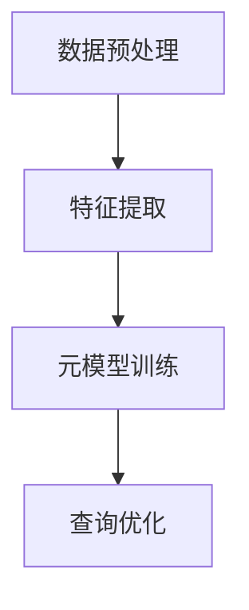

# 一切皆是映射：面向复杂查询的数据库优化通过元学习

## 1.背景介绍

在现代数据驱动的世界中，数据库系统是信息存储和检索的核心。随着数据量的爆炸性增长和查询复杂性的增加，传统的数据库优化技术面临着前所未有的挑战。元学习（Meta-Learning）作为一种新兴的机器学习方法，提供了一种通过学习如何学习来解决复杂问题的途径。本文将探讨如何通过元学习来优化复杂查询的数据库性能。

## 2.核心概念与联系

### 2.1 数据库优化

数据库优化是指通过各种技术手段提高数据库系统的性能，使其能够更高效地处理查询请求。常见的优化技术包括索引优化、查询重写、缓存机制等。

### 2.2 复杂查询

复杂查询通常涉及多个表的连接、嵌套子查询、聚合操作等。这类查询不仅计算量大，而且对数据库系统的资源消耗也非常高。

### 2.3 元学习

元学习是一种机器学习方法，旨在通过学习多个任务的经验来提高新任务的学习效率。元学习的核心思想是“学习如何学习”，即通过元模型来指导具体任务的学习过程。

### 2.4 映射关系

在数据库优化中，映射关系指的是将查询优化问题转化为一个学习问题，通过元学习模型来预测最优的查询执行计划。

## 3.核心算法原理具体操作步骤

### 3.1 数据预处理

在进行元学习之前，需要对数据库查询日志进行预处理。包括提取查询特征、执行时间、资源消耗等信息。

### 3.2 特征提取

特征提取是元学习的关键步骤。通过分析查询的结构和执行计划，提取出能够反映查询复杂度和资源消耗的特征。

### 3.3 元模型训练

使用提取的特征和历史查询数据，训练元学习模型。常用的元学习算法包括元神经网络、元决策树等。

### 3.4 查询优化

在实际查询过程中，使用训练好的元模型来预测最优的查询执行计划，从而实现查询优化。



## 4.数学模型和公式详细讲解举例说明

### 4.1 特征提取公式

设 $Q$ 为查询，$F(Q)$ 为查询的特征向量，则特征提取公式为：
$$
F(Q) = [f_1(Q), f_2(Q), \ldots, f_n(Q)]
$$
其中，$f_i(Q)$ 表示查询 $Q$ 的第 $i$ 个特征。

### 4.2 元模型训练公式

设 $D = \{(F(Q_i), y_i)\}_{i=1}^m$ 为训练数据集，其中 $y_i$ 表示查询 $Q_i$ 的执行时间或资源消耗。元模型训练的目标是找到一个函数 $M$，使得：
$$
M(F(Q)) \approx y
$$

### 4.3 查询优化公式

在实际查询过程中，使用训练好的元模型 $M$ 来预测查询 $Q$ 的执行时间或资源消耗，从而选择最优的查询执行计划：
$$
\hat{y} = M(F(Q))
$$

## 5.项目实践：代码实例和详细解释说明

### 5.1 数据预处理

```python
import pandas as pd

# 读取查询日志数据
query_log = pd.read_csv('query_log.csv')

# 提取查询特征
def extract_features(query):
    # 示例特征提取逻辑
    return {
        'num_tables': len(query.split('JOIN')),
        'num_conditions': len(query.split('WHERE'))
    }

query_log['features'] = query_log['query'].apply(extract_features)
```

### 5.2 元模型训练

```python
from sklearn.model_selection import train_test_split
from sklearn.ensemble import RandomForestRegressor

# 准备训练数据
X = list(query_log['features'])
y = query_log['execution_time']

X_train, X_test, y_train, y_test = train_test_split(X, y, test_size=0.2)

# 训练元模型
model = RandomForestRegressor()
model.fit(X_train, y_train)
```

### 5.3 查询优化

```python
def optimize_query(query):
    features = extract_features(query)
    predicted_time = model.predict([features])
    return predicted_time

# 示例查询优化
query = "SELECT * FROM table1 JOIN table2 ON table1.id = table2.id WHERE table1.value > 100"
optimized_time = optimize_query(query)
print(f"Predicted execution time: {optimized_time}")
```

## 6.实际应用场景

### 6.1 电商平台

在电商平台中，复杂查询通常用于推荐系统、用户行为分析等场景。通过元学习优化查询，可以显著提高系统的响应速度和用户体验。

### 6.2 金融系统

金融系统中的复杂查询主要用于风险评估、交易分析等。通过元学习优化查询，可以提高数据处理的效率和准确性，从而降低风险。

### 6.3 医疗系统

在医疗系统中，复杂查询用于病历检索、药物相互作用分析等。通过元学习优化查询，可以提高数据检索的速度和准确性，从而提升医疗服务质量。

## 7.工具和资源推荐

### 7.1 数据库优化工具

- **PostgreSQL**：开源关系型数据库，支持复杂查询优化。
- **MySQL**：流行的开源数据库，提供多种查询优化选项。

### 7.2 元学习工具

- **TensorFlow**：开源机器学习框架，支持元学习模型的训练和部署。
- **PyTorch**：另一款流行的开源机器学习框架，适用于元学习研究。

### 7.3 数据集

- **TPC-H**：标准化的数据库基准测试数据集，适用于复杂查询优化研究。
- **IMDB**：电影数据库，包含丰富的查询场景，适用于元学习模型的训练。

## 8.总结：未来发展趋势与挑战

### 8.1 未来发展趋势

随着数据量的持续增长和查询复杂性的增加，元学习在数据库优化中的应用前景广阔。未来，元学习模型将更加智能化和自动化，能够更好地适应不同的查询场景和数据特征。

### 8.2 挑战

尽管元学习在数据库优化中展现了巨大的潜力，但仍面临一些挑战。首先，元学习模型的训练需要大量的历史查询数据，这对数据收集和处理提出了较高的要求。其次，元学习模型的预测精度和泛化能力仍需进一步提升，以适应不同的查询场景和数据特征。

## 9.附录：常见问题与解答

### 9.1 什么是元学习？

元学习是一种机器学习方法，通过学习多个任务的经验来提高新任务的学习效率。其核心思想是“学习如何学习”。

### 9.2 如何提取查询特征？

查询特征可以通过分析查询的结构和执行计划来提取。常见的特征包括表的数量、连接条件的数量、聚合操作的数量等。

### 9.3 元学习模型如何优化查询？

元学习模型通过预测查询的执行时间或资源消耗，选择最优的查询执行计划，从而实现查询优化。

### 9.4 元学习在数据库优化中的应用前景如何？

随着数据量的持续增长和查询复杂性的增加，元学习在数据库优化中的应用前景广阔。未来，元学习模型将更加智能化和自动化，能够更好地适应不同的查询场景和数据特征。

---

作者：禅与计算机程序设计艺术 / Zen and the Art of Computer Programming