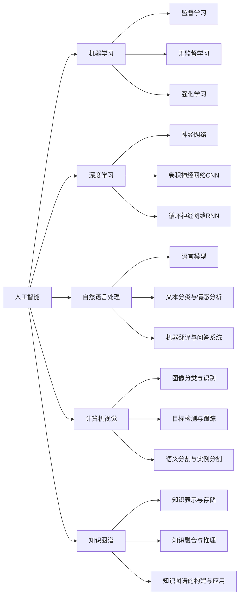

# 人工智能前沿研究热点与发展趋势原理与代码实战案例讲解

## 1.背景介绍
### 1.1 人工智能的发展历程
#### 1.1.1 人工智能的起源与早期发展
#### 1.1.2 人工智能的黄金时期与低谷期
#### 1.1.3 人工智能的复兴与快速发展
### 1.2 人工智能的重要性与影响力
#### 1.2.1 人工智能在科技领域的重要地位  
#### 1.2.2 人工智能对社会经济的深远影响
#### 1.2.3 人工智能在各行各业的广泛应用

## 2.核心概念与联系
### 2.1 机器学习
#### 2.1.1 监督学习
#### 2.1.2 无监督学习  
#### 2.1.3 强化学习
### 2.2 深度学习
#### 2.2.1 神经网络
#### 2.2.2 卷积神经网络(CNN)
#### 2.2.3 循环神经网络(RNN)
### 2.3 自然语言处理(NLP)  
#### 2.3.1 语言模型
#### 2.3.2 文本分类与情感分析
#### 2.3.3 机器翻译与问答系统
### 2.4 计算机视觉(CV)
#### 2.4.1 图像分类与识别
#### 2.4.2 目标检测与跟踪  
#### 2.4.3 语义分割与实例分割
### 2.5 知识图谱(KG)
#### 2.5.1 知识表示与存储
#### 2.5.2 知识融合与推理
#### 2.5.3 知识图谱的构建与应用



## 3.核心算法原理具体操作步骤
### 3.1 反向传播算法(Backpropagation)
#### 3.1.1 前向传播
#### 3.1.2 损失函数计算
#### 3.1.3 反向传播与梯度计算
#### 3.1.4 参数更新
### 3.2 卷积神经网络(CNN)的关键技术
#### 3.2.1 卷积层
#### 3.2.2 池化层
#### 3.2.3 全连接层 
#### 3.2.4 激活函数
### 3.3 循环神经网络(RNN)的关键技术
#### 3.3.1 基本RNN结构
#### 3.3.2 长短期记忆网络(LSTM) 
#### 3.3.3 门控循环单元(GRU)
#### 3.3.4 双向RNN
### 3.4 注意力机制(Attention Mechanism)
#### 3.4.1 Seq2Seq模型中的注意力机制
#### 3.4.2 自注意力机制(Self-Attention)
#### 3.4.3 多头注意力(Multi-Head Attention)
#### 3.4.4 注意力在CV和NLP中的应用
### 3.5 Transformer模型
#### 3.5.1 Transformer的整体结构
#### 3.5.2 位置编码(Positional Encoding) 
#### 3.5.3 编码器(Encoder)与解码器(Decoder)
#### 3.5.4 残差连接与层归一化

## 4.数学模型和公式详细讲解举例说明
### 4.1 线性回归(Linear Regression)
#### 4.1.1 一元线性回归模型
假设有一组数据点 $(x_1,y_1), (x_2,y_2), ..., (x_n,y_n)$，我们希望找到一条直线 $y=wx+b$ 来拟合这些数据点。其中，$w$ 是直线的斜率，$b$ 是截距。我们可以通过最小化均方误差(MSE)来找到最优的 $w$ 和 $b$：

$$MSE=\frac{1}{n}\sum_{i=1}^n(y_i-\hat{y}_i)^2=\frac{1}{n}\sum_{i=1}^n(y_i-(wx_i+b))^2$$

通过求导并令导数为0，我们可以得到 $w$ 和 $b$ 的最优解：

$$w=\frac{\sum_{i=1}^n(x_i-\bar{x})(y_i-\bar{y})}{\sum_{i=1}^n(x_i-\bar{x})^2}, b=\bar{y}-w\bar{x}$$

其中，$\bar{x}$ 和 $\bar{y}$ 分别是 $x$ 和 $y$ 的均值。

#### 4.1.2 多元线性回归模型
对于多个自变量 $x_1, x_2, ..., x_m$，我们可以建立多元线性回归模型：

$$y=w_1x_1+w_2x_2+...+w_mx_m+b$$

类似地，我们可以通过最小化MSE来求解最优的参数 $w_1, w_2, ..., w_m$ 和 $b$。

### 4.2 逻辑回归(Logistic Regression)
#### 4.2.1 二分类问题
对于二分类问题，我们可以使用逻辑回归模型。假设有一组数据点 $(x_1,y_1), (x_2,y_2), ..., (x_n,y_n)$，其中 $y_i \in \{0,1\}$。我们希望找到一个函数 $h(x)$ 来预测给定 $x$ 时 $y=1$ 的概率。逻辑回归模型使用sigmoid函数作为 $h(x)$：

$$h(x)=\frac{1}{1+e^{-(wx+b)}}$$

其中，$w$ 和 $b$ 是模型的参数。我们可以通过最大化对数似然函数来求解最优的 $w$ 和 $b$：

$$\mathcal{L}(w,b)=\sum_{i=1}^n[y_i\log h(x_i)+(1-y_i)\log(1-h(x_i))]$$

#### 4.2.2 多分类问题
对于多分类问题，我们可以使用softmax回归模型。假设有 $K$ 个类别，我们希望找到一个函数 $h(x)$ 来预测给定 $x$ 时属于每个类别的概率。softmax回归模型使用softmax函数作为 $h(x)$：

$$h(x)_j=\frac{e^{w_j^Tx+b_j}}{\sum_{k=1}^Ke^{w_k^Tx+b_k}}, j=1,2,...,K$$

其中，$w_j$ 和 $b_j$ 是第 $j$ 个类别的参数。我们可以通过最大化对数似然函数来求解最优的参数：

$$\mathcal{L}(w,b)=\sum_{i=1}^n\sum_{j=1}^Ky_{ij}\log h(x_i)_j$$

其中，$y_{ij}=1$ 表示第 $i$ 个样本属于第 $j$ 个类别，否则 $y_{ij}=0$。

### 4.3 支持向量机(Support Vector Machine, SVM)
#### 4.3.1 线性可分支持向量机
对于线性可分的数据集，我们可以找到一个超平面 $wx+b=0$ 来将不同类别的样本分开。SVM的目标是找到一个最大间隔超平面，使得两个类别的样本到超平面的距离最大。我们可以通过求解以下优化问题来找到最优的 $w$ 和 $b$：

$$\min_{w,b} \frac{1}{2}\|w\|^2 \quad s.t. \quad y_i(w^Tx_i+b) \geq 1, i=1,2,...,n$$

其中，$y_i \in \{-1,+1\}$ 表示样本的类别标签。

#### 4.3.2 线性不可分支持向量机
对于线性不可分的数据集，我们可以引入松弛变量 $\xi_i$ 来允许一些样本被错误分类。此时，优化问题变为：

$$\min_{w,b,\xi} \frac{1}{2}\|w\|^2+C\sum_{i=1}^n\xi_i \quad s.t. \quad y_i(w^Tx_i+b) \geq 1-\xi_i, \xi_i \geq 0, i=1,2,...,n$$

其中，$C$ 是惩罚系数，用于平衡最大间隔和错误分类的样本数。

#### 4.3.3 核技巧(Kernel Trick)
对于非线性可分的数据集，我们可以使用核技巧将数据映射到高维空间，然后在高维空间中寻找最大间隔超平面。常用的核函数有：

- 多项式核函数：$K(x,x')=(x^Tx'+c)^d$
- 高斯核函数(RBF)：$K(x,x')=\exp(-\frac{\|x-x'\|^2}{2\sigma^2})$
- Sigmoid核函数：$K(x,x')=\tanh(\alpha x^Tx'+c)$

## 5.项目实践：代码实例和详细解释说明
### 5.1 使用TensorFlow实现卷积神经网络(CNN)进行图像分类
```python
import tensorflow as tf
from tensorflow import keras

# 加载MNIST数据集
(x_train, y_train), (x_test, y_test) = keras.datasets.mnist.load_data()

# 数据预处理
x_train = x_train.reshape((60000, 28, 28, 1)) / 255.0
x_test = x_test.reshape((10000, 28, 28, 1)) / 255.0
y_train = keras.utils.to_categorical(y_train)
y_test = keras.utils.to_categorical(y_test)

# 构建CNN模型
model = keras.Sequential([
    keras.layers.Conv2D(32, (3, 3), activation='relu', input_shape=(28, 28, 1)),
    keras.layers.MaxPooling2D((2, 2)),
    keras.layers.Conv2D(64, (3, 3), activation='relu'),
    keras.layers.MaxPooling2D((2, 2)),
    keras.layers.Conv2D(64, (3, 3), activation='relu'),
    keras.layers.Flatten(),
    keras.layers.Dense(64, activation='relu'),
    keras.layers.Dense(10, activation='softmax')
])

# 编译模型
model.compile(optimizer='adam',
              loss='categorical_crossentropy',
              metrics=['accuracy'])

# 训练模型
model.fit(x_train, y_train, epochs=5, batch_size=64, validation_data=(x_test, y_test))

# 评估模型
test_loss, test_acc = model.evaluate(x_test, y_test)
print('Test accuracy:', test_acc)
```

这个代码示例使用TensorFlow和Keras实现了一个简单的卷积神经网络(CNN)，用于对MNIST手写数字进行分类。主要步骤包括：

1. 加载MNIST数据集，并进行数据预处理，包括数据归一化和标签one-hot编码。
2. 构建CNN模型，包括卷积层、池化层、全连接层等。
3. 编译模型，指定优化器、损失函数和评估指标。
4. 训练模型，指定训练轮数、批量大小和验证数据。
5. 评估模型，输出测试集上的准确率。

### 5.2 使用PyTorch实现长短期记忆网络(LSTM)进行情感分析
```python
import torch
import torch.nn as nn
from torchtext import data, datasets

# 定义数据集
TEXT = data.Field(tokenize='spacy', lower=True)
LABEL = data.LabelField(dtype=torch.float)
train_data, test_data = datasets.IMDB.splits(TEXT, LABEL)

# 构建词汇表
TEXT.build_vocab(train_data, max_size=10000)
LABEL.build_vocab(train_data)

# 定义LSTM模型
class LSTMModel(nn.Module):
    def __init__(self, vocab_size, embedding_dim, hidden_dim, output_dim):
        super().__init__()
        self.embedding = nn.Embedding(vocab_size, embedding_dim)
        self.lstm = nn.LSTM(embedding_dim, hidden_dim)
        self.fc = nn.Linear(hidden_dim, output_dim)
        
    def forward(self, text):
        embedded = self.embedding(text)
        output, (hidden, cell) = self.lstm(embedded)
        return self.fc(hidden.squeeze(0))

# 初始化模型
vocab_size = len(TEXT.vocab)
embedding_dim = 100
hidden_dim = 256
output_dim = 1
model =