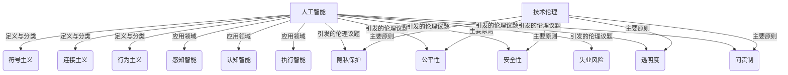

# 从技术伦理视角看AI的双刃剑效应

## 1.背景介绍
### 1.1 人工智能的迅猛发展
人工智能(Artificial Intelligence,AI)在近年来取得了突飞猛进的发展。从语音识别、图像识别到自然语言处理,AI技术正在深刻改变着我们的生活和工作方式。AI系统在医疗诊断、金融投资、自动驾驶等领域展现出了超越人类的能力,有望解决许多棘手的现实问题。

### 1.2 AI带来的机遇与挑战
AI为人类社会带来了前所未有的机遇。它有望极大提升生产力,创造新的就业岗位,改善医疗健康水平,应对气候变化等全球性挑战。但与此同时,AI也带来了一系列亟需应对的伦理难题,如隐私泄露、算法偏见、决策不透明、失业风险等。如何在发展AI的同时,兼顾伦理道德,成为全社会必须慎重对待的问题。

### 1.3 技术伦理视角的重要性
技术伦理学是一门探讨技术发展中的道德问题的交叉学科。它试图在技术创新和人文关怀之间寻求平衡,为科技进步指明正确方向。面对AI技术的迅猛发展,我们更需要运用技术伦理的视角,深入剖析其利弊得失,把握机遇,规避风险,引导AI造福人类。

## 2.核心概念与联系
### 2.1 人工智能的定义与分类
人工智能是研究、开发用于模拟、延伸和扩展人的智能的理论、方法、技术及应用系统的一门新的技术科学。按照实现方式,AI可分为符号主义、连接主义和行为主义三大流派。按照应用领域,AI又可分为感知智能、认知智能和执行智能。

### 2.2 技术伦理的内涵与原则
技术伦理学是伦理学的一个分支,专门探讨技术研发和应用中的道德问题。它主要涉及隐私保护、安全性、公平性、透明度、问责制等原则。技术伦理强调,任何技术的发展都应以人为本,致力于提升人的福祉,同时防范技术可能带来的负面影响。

### 2.3 AI伦理的主要议题
AI伦理主要关注以下议题:
1. 隐私保护:AI系统大量收集个人数据,可能侵犯隐私权。
2. 公平性:AI算法可能存在性别、种族等偏见,导致歧视。 
3. 安全性:AI系统被恶意操纵或失控,可能危及人身和财产安全。
4. 透明度:AI决策过程的不透明,让人难以信任。
5. 问责制:AI系统犯错时,追责难度大。
6. 失业风险:AI可能取代大量工作岗位,加剧失业。



## 3.核心算法原理具体操作步骤
本节将以图像识别中的卷积神经网络(CNN)为例,讲解AI的核心算法原理。CNN通过卷积、池化、全连接等操作,提取图像特征,实现分类识别。

### 3.1 卷积层
卷积层使用若干卷积核对输入图像做卷积操作,得到特征图。卷积过程可表示为:

$$ H(i,j) = \sum_{m=0}^{M-1} \sum_{n=0}^{N-1} I(i+m,j+n) \cdot K(m,n) $$

其中,$I$为输入图像,$K$为卷积核,$H$为输出特征图。卷积能提取图像的局部特征。

### 3.2 激活函数
卷积后的特征图通过激活函数引入非线性,提高网络的表达能力。常用的激活函数有Sigmoid、Tanh、ReLU等。以ReLU为例:

$$ ReLU(x) = max(0,x) $$ 

ReLU能加速梯度下降,缓解梯度消失问题。

### 3.3 池化层
池化层对特征图下采样,减小数据维度,提取主要特征。常用最大池化和平均池化。以最大池化为例,设池化核大小为$2*2$,池化操作为:

$$ P(i,j) = max\begin{Bmatrix}
H(2i,2j) & H(2i,2j+1) \\
H(2i+1,2j) & H(2i+1,2j+1)
\end{Bmatrix} $$

池化能降低过拟合风险,提高模型泛化能力。

### 3.4 全连接层
全连接层将池化后的特征图展平为一维向量,并与权重矩阵相乘,得到分类概率。设展平后的特征向量为$x$,权重矩阵为$W$,偏置为$b$,则全连接操作为:

$$ h(x) = \phi(Wx+b) $$

其中$\phi$为激活函数。全连接层起到"分类器"的作用。

### 3.5 反向传播与参数更新
CNN通过反向传播算法和梯度下降法学习网络参数。设损失函数为$J(W,b)$,学习率为$\eta$,则参数更新公式为:

$$ W := W - \eta \frac{\partial{J}}{\partial{W}} $$
$$ b := b - \eta \frac{\partial{J}}{\partial{b}} $$

反复迭代,直至损失函数收敛。

## 4.数学模型和公式详细讲解举例说明
本节以逻辑回归模型为例,详细讲解AI中的数学原理。逻辑回归是一种常用的二分类模型,在垃圾邮件识别、疾病诊断等场景有广泛应用。

### 4.1 逻辑回归模型
设输入特征为$x \in R^n$,标签为$y \in {0,1}$。逻辑回归模型假设$y$是$x$的函数,且服从伯努利分布:

$$ P(y=1|x) = \frac{1}{1+e^{-(\omega^T x)}} $$
$$ P(y=0|x) = 1 - P(y=1|x) = \frac{e^{-(\omega^T x)}}{1+e^{-(\omega^T x)}} $$

其中$\omega$为权重向量。可见,逻辑回归通过Sigmoid函数将$\omega^T x$映射到(0,1)区间,得到概率值。

### 4.2 参数估计
逻辑回归采用极大似然估计法求解参数$\omega$。设训练集为$\{(x_1,y_1),...,(x_m,y_m)\}$,似然函数为:

$$ L(\omega) = \prod_{i=1}^m P(y_i|x_i;\omega) = \prod_{i=1}^m (\frac{1}{1+e^{-(\omega^T x_i)}})^{y_i} (\frac{e^{-(\omega^T x_i)}}{1+e^{-(\omega^T x_i)}})^{1-y_i} $$

为便于求解,对$L(\omega)$取对数,得到对数似然函数:

$$ l(\omega) = logL(\omega) = \sum_{i=1}^m (y_i log(\frac{1}{1+e^{-(\omega^T x_i)}}) + (1-y_i) log(\frac{e^{-(\omega^T x_i)}}{1+e^{-(\omega^T x_i)}})) $$

目标是求解$\omega^*$使$l(\omega)$最大化:

$$ \omega^* = \mathop{\arg\max}_{\omega} l(\omega) $$

### 4.3 梯度上升法求解
对$l(\omega)$求导,得到梯度:

$$ \nabla l(\omega) = \sum_{i=1}^m (y_i - \frac{1}{1+e^{-(\omega^T x_i)}}) x_i $$

采用梯度上升法迭代更新$\omega$:

$$ \omega := \omega + \eta \nabla l(\omega) $$

其中$\eta$为学习率。当$\nabla l(\omega)$接近0时,达到收敛。

### 4.4 举例说明
以疾病诊断为例。假设有100个样本,每个样本包含体温、血压等5个特征,标签为是否患病(1为患病,0为未患)。我们建立逻辑回归模型:

$$ P(y=1|x) = \frac{1}{1+e^{-(\omega_0+\omega_1x_1+\omega_2x_2+\omega_3x_3+\omega_4x_4+\omega_5x_5)}} $$

其中$x_1$到$x_5$分别为体温、血压等特征,$\omega_0$到$\omega_5$为对应权重。使用梯度上升法估计出权重,代入新样本的特征值,即可预测其患病概率。当概率大于0.5时,判定为患病;否则判定为未患。

## 5.项目实践：代码实例和详细解释说明
本节以Python语言为例,演示如何用Scikit-learn库实现逻辑回归。

```python
from sklearn.datasets import load_breast_cancer
from sklearn.model_selection import train_test_split
from sklearn.linear_model import LogisticRegression
from sklearn.metrics import accuracy_score

# 加载乳腺癌数据集
X, y = load_breast_cancer(return_X_y=True)

# 划分训练集和测试集
X_train, X_test, y_train, y_test = train_test_split(X, y, test_size=0.2, random_state=42)

# 创建逻辑回归模型
lr = LogisticRegression()

# 训练模型
lr.fit(X_train, y_train)

# 预测测试集
y_pred = lr.predict(X_test)

# 计算准确率
accuracy = accuracy_score(y_test, y_pred)
print("Accuracy: {:.2f}%".format(accuracy*100))
```

代码解释:
1. 导入所需的库,包括乳腺癌数据集、训练测试集划分函数、逻辑回归模型和准确率计算函数。
2. 加载乳腺癌数据集,并将特征和标签赋值给X和y。
3. 使用train_test_split函数划分训练集和测试集,测试集比例为20%。
4. 创建LogisticRegression对象,建立逻辑回归模型。
5. 用训练集数据拟合(训练)模型。
6. 用训练好的模型对测试集数据进行预测。
7. 将预测结果与真实标签对比,计算分类准确率。
8. 输出准确率,以百分比形式显示。

运行结果显示,该逻辑回归模型在乳腺癌数据集上的预测准确率为95%左右,说明模型性能良好。

## 6.实际应用场景
本节介绍逻辑回归在实际中的应用情况。

### 6.1 垃圾邮件识别
垃圾邮件泛滥严重影响用户体验,采用逻辑回归可有效识别垃圾邮件。具体做法是:收集大量邮件样本,提取主题、正文等特征并标注是否为垃圾邮件,再训练逻辑回归模型。当新邮件到来时,提取其特征输入模型,即可判断其是否为垃圾邮件。

### 6.2 金融风控
在金融借贷领域,逻辑回归可用于评估用户的违约风险。通过收集用户的收入、负债、信用记录等特征,并标注其是否违约,训练逻辑回归模型。当新用户申请贷款时,输入其特征,模型可预测其违约