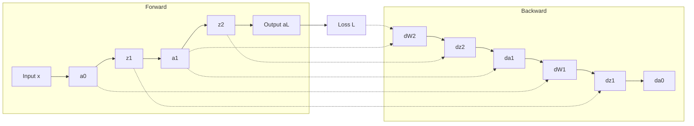

# 从零开始大模型开发与微调：反向传播神经网络两个基础算法详解

## 1. 背景介绍
### 1.1 人工智能与深度学习的发展
人工智能(Artificial Intelligence, AI)是计算机科学的一个重要分支,其目标是研究如何让计算机模拟甚至超越人类的智能。近年来,随着计算机硬件性能的飞速提升以及海量数据的积累,人工智能技术取得了突破性进展,尤其是在深度学习(Deep Learning)领域。

深度学习是机器学习的一个重要分支,它模仿人脑的结构和功能,通过构建由多层神经网络组成的深度模型,从海量数据中自动学习特征和知识。深度学习在计算机视觉、语音识别、自然语言处理等领域取得了远超传统方法的性能,引领了人工智能新一轮的发展浪潮。

### 1.2 大模型的兴起与应用
近年来,随着算力和数据规模的持续增长,以 Transformer 为代表的大规模预训练语言模型(Large Pre-trained Language Models)迅速崛起,掀起了 NLP 领域的一场革命。这些大模型通过在海量无标注文本语料上进行自监督预训练,学习到了丰富的语言知识和常识,具备强大的语言理解和生成能力。

代表性的大模型包括 GPT 系列、BERT、XLNet、RoBERTa 等,它们在机器翻译、问答系统、文本分类、命名实体识别、情感分析等任务上取得了 SOTA 的表现。大模型的出现极大地提升了 NLP 系统的性能,同时也降低了下游任务的开发成本,使得更多的开发者和研究者能够基于大模型进行应用创新。

### 1.3 大模型微调面临的挑战
尽管大模型展现出了强大的能力,但直接应用于具体任务时往往还存在一定的gap。为了进一步提升模型在特定领域的表现,需要在下游任务的标注数据上对大模型进行微调(fine-tuning)。然而,大模型微调也面临着一些挑战:

1. 计算资源要求高:大模型动辄上亿的参数量对计算资源提出了很高的要求,给模型训练和推理带来困难。 
2. 训练不稳定:相比从头训练,在预训练模型上微调更容易出现过拟合、梯度爆炸/消失等问题,需要精心设计训练策略。
3. 泛化能力不足:模型过于依赖预训练数据的分布,在样本量较小或分布差异较大的任务上容易泛化不佳。
4. 可解释性差:大模型内部的工作机制仍是一个黑箱,缺乏可解释性,难以分析和调试。

因此,掌握大模型微调的基本原理和实践技巧,对于进一步发挥大模型的潜力、促进其在各领域的应用至关重要。本文将重点介绍大模型微调背后的两大基础算法:随机梯度下降和反向传播,揭示其数学原理,并给出代码实例,帮助读者系统地理解和掌握大模型微调的核心技术。

## 2. 核心概念与联系
### 2.1 神经网络基础
神经网络(Neural Network)是一种模仿生物神经系统结构和功能的数学模型,由大量的节点(即神经元)通过带权重的连接组成。一个典型的前馈神经网络由输入层、隐藏层和输出层构成,每一层的神经元通过激活函数对上一层的加权输入进行非线性变换,并将结果传递给下一层,直至输出预测结果。

神经网络具有强大的表达能力和学习能力。通过调整神经元之间的连接权重,神经网络可以拟合非常复杂的函数,从数据中自动学习特征。同时,神经网络还具有记忆性、容错性、并行处理等优点。这些特性使得神经网络在模式识别、数据挖掘、自动控制等领域得到了广泛应用。

### 2.2 损失函数与优化目标
训练神经网络的目标是找到一组最优的模型参数,使得模型在给定的训练数据上的预测结果与真实标签尽可能接近。为了量化这种接近程度,需要定义一个损失函数(Loss Function)。常见的损失函数包括均方误差(MSE)、交叉熵(Cross Entropy)等。

假设模型的输出为 $\hat{y}$,真实标签为 $y$,则 MSE 损失函数定义为:

$$L_{MSE} = \frac{1}{N}\sum_{i=1}^{N}(\hat{y}_i - y_i)^2$$

其中 $N$ 为样本数。MSE 刻画了预测值与真实值之间的平均平方误差。

交叉熵损失函数定义为:

$$L_{CE} = -\frac{1}{N}\sum_{i=1}^{N}y_i\log\hat{y}_i$$

交叉熵衡量了两个概率分布之间的差异性,在分类任务中被广泛使用。

神经网络的优化目标就是最小化整个训练集上的平均损失:

$$\min_{\theta} \frac{1}{N}\sum_{i=1}^{N}L(f(x_i;\theta), y_i)$$

其中 $\theta$ 为模型参数,$f(x;\theta)$ 为模型的输出函数。

### 2.3 梯度下降法
梯度下降(Gradient Descent)是一种简单而有效的优化算法,被广泛用于训练神经网络。其基本思想是沿着损失函数梯度的反方向更新模型参数,使得损失函数不断下降,直到收敛到一个局部最小值。

假设 $\theta$ 为待优化的参数向量,$\eta$ 为学习率,则梯度下降的更新公式为:

$$\theta_{t+1} = \theta_t - \eta \nabla_{\theta}L(\theta_t)$$

其中 $\nabla_{\theta}L(\theta_t)$ 为损失函数 $L$ 在 $\theta_t$ 处的梯度。

然而,在大规模数据集和复杂模型(如大模型)的情况下,标准的梯度下降算法效率较低。因为它需要在每次更新前遍历整个训练集计算梯度,计算代价非常高。

### 2.4 随机梯度下降法
随机梯度下降(Stochastic Gradient Descent, SGD)是对标准梯度下降的一种改进。与标准梯度下降使用全量数据计算梯度不同,SGD 每次从训练集中随机抽取一个样本 $(x_i,y_i)$ ,根据该样本计算梯度并更新参数:

$$\theta_{t+1} = \theta_t - \eta \nabla_{\theta}L(f(x_i;\theta_t), y_i)$$

这里的梯度是对单个样本的损失函数的梯度。

SGD 通过每次只使用一个样本大大提高了效率,但也引入了梯度估计的随机性。为了兼顾效率和稳定性,实践中通常使用小批量随机梯度下降(Mini-batch SGD),即每次随机抽取一个小批量(batch)的样本来计算梯度:

$$\theta_{t+1} = \theta_t - \eta \nabla_{\theta}\frac{1}{|B|}\sum_{i\in B}L(f(x_i;\theta_t), y_i)$$

其中 $B$ 为随机抽取的小批量样本的下标集合。

### 2.5 反向传播算法
反向传播(Backpropagation)是一种高效计算神经网络梯度的算法,是随机梯度下降的基础。

对于一个 $L$ 层的前馈神经网络,假设第 $l$ 层的输入为 $a^{(l-1)}$,权重矩阵为 $W^{(l)}$,偏置向量为 $b^{(l)}$,激活函数为 $\sigma^{(l)}$,则正向传播过程为:

$$z^{(l)} = W^{(l)}a^{(l-1)} + b^{(l)}$$
$$a^{(l)} = \sigma^{(l)}(z^{(l)})$$

其中 $a^{(0)} = x$ 为网络的输入。

反向传播通过链式法则,从输出层开始,逐层计算出损失函数对每一层权重和偏置的梯度。设 $\delta^{(l)}$ 为第 $l$ 层的误差项,则有:

$$\delta^{(L)} = \nabla_{a^{(L)}}L \odot \sigma'^{(L)}(z^{(L)})$$
$$\delta^{(l)} = (W^{(l+1)})^T\delta^{(l+1)} \odot \sigma'^{(l)}(z^{(l)})$$

其中 $\odot$ 表示 Hadamard 乘积(即逐元素相乘),$\sigma'^{(l)}$ 为激活函数的导数。

有了误差项,就可以计算出梯度:

$$\nabla_{W^{(l)}}L = \delta^{(l)}(a^{(l-1)})^T$$
$$\nabla_{b^{(l)}}L = \delta^{(l)}$$

反向传播的计算过程可以用下图表示:

反向传播通过一次正向传播和一次反向传播高效地计算出所有参数的梯度,使得随机梯度下降算法能够快速训练大规模神经网络。

## 3. 核心算法原理具体操作步骤
本节将详细介绍随机梯度下降和反向传播算法的具体操作步骤。

### 3.1 随机梯度下降算法步骤
输入:训练集 $\{(x_1,y_1),...,(x_N,y_N)\}$,学习率 $\eta$,批量大小 $m$,迭代次数 $T$
输出:优化后的模型参数 $\theta$

1. 随机初始化模型参数 $\theta$
2. for t = 1,2,...,T do
3.     从训练集中随机抽取 $m$ 个样本 $\{(x_{i_1},y_{i_1}),...,(x_{i_m},y_{i_m})\}$
4.     计算小批量样本的平均损失: $L = \frac{1}{m}\sum_{j=1}^{m}L(f(x_{i_j};\theta), y_{i_j})$
5.     计算平均损失 $L$ 关于 $\theta$ 的梯度 $\nabla_{\theta}L$
6.     更新参数: $\theta \leftarrow \theta - \eta \nabla_{\theta}L$
7. end for
8. return $\theta$

其中第 5 步计算梯度通常使用反向传播算法完成。

### 3.2 反向传播算法步骤
考虑一个 $L$ 层的前馈神经网络,设第 $l$ 层的权重矩阵为 $W^{(l)}$,偏置向量为 $b^{(l)}$,激活函数为 $\sigma^{(l)}$。给定一个小批量样本 $\{(x_1,y_1),...,(x_m,y_m)\}$,反向传播算法的步骤如下:

1. 正向传播:
   for i = 1,2,...,m do
       $a^{(0)} = x_i$
       for l = 1,2,...,L do
           $z^{(l)} = W^{(l)}a^{(l-1)} + b^{(l)}$
           $a^{(l)} = \sigma^{(l)}(z^{(l)})$
       end for
       $\hat{y}_i = a^{(L)}$
   end for
   
2. 计算输出层误差项:
   $\delta^{(L)} = \frac{1}{m}\sum_{i=1}^{m}\nabla_{a^{(L)}}L(f(x_i;\theta), y_i) \odot \sigma'^{(L)}(z^{(L)})$

3. 反向传播误差项:
   for l = L-1,L-2,...,1 do
       $\delta^{(l)} = (W^{(l+1)})^T\delta^{(l+1)} \odot \sigma'^{(l)}(z^{(l)})$
   end for

4. 计算梯