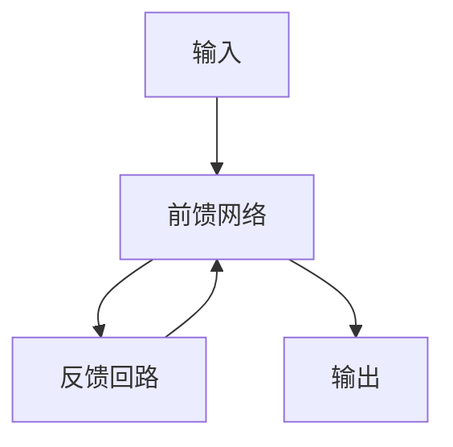
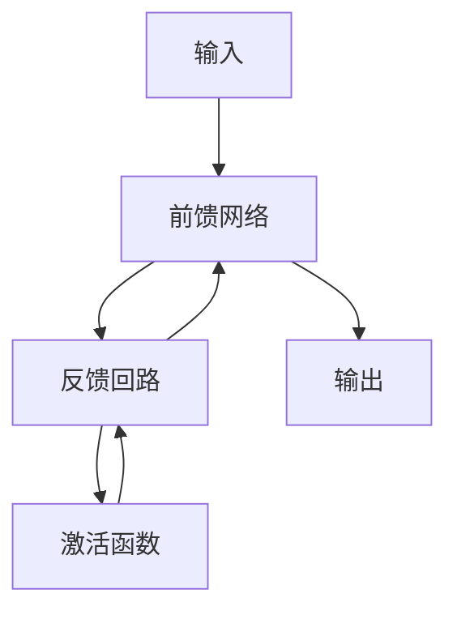

# 从零开始大模型开发与微调：反馈神经网络原理的激活函数

## 1.背景介绍

### 1.1 大模型时代的到来

近年来,大型神经网络模型在自然语言处理、计算机视觉等领域取得了令人瞩目的成就。这些庞大的模型拥有数十亿甚至数万亿个参数,能够从海量的数据中学习到丰富的知识表示,展现出惊人的泛化能力。以 GPT-3 为代表的大型语言模型可以生成逼真的文本、回答复杂的问题、甚至编写计算机程序。而像 DALL-E 这样的大型视觉模型,则可以根据自然语言描述生成逼真的图像。

### 1.2 大模型面临的挑战

尽管大模型取得了巨大的成功,但它们也面临着一些挑战和局限性。首先,训练这些庞大的模型需要消耗大量的计算资源,对硬件设备和能源消耗提出了很高的要求。其次,大模型容易受到训练数据中存在的偏差和噪声的影响,可能会产生不公平、不安全或不道德的输出。此外,大模型的内部机理往往是一个"黑箱",很难解释它们是如何做出决策的。

### 1.3 反馈神经网络的潜力

为了解决大模型面临的挑战,研究人员提出了反馈神经网络(Feedback Neural Network,FNN)的概念。FNN 是一种新型的神经网络架构,它通过引入反馈回路,使得模型在进行推理时可以根据中间结果进行自我修正和调整,从而提高模型的性能和可解释性。与传统的前馈神经网络不同,FNN 具有更强的表达能力和更好的泛化性能,有望成为下一代大模型的核心架构。

## 2.核心概念与联系

### 2.1 反馈神经网络的基本思想

反馈神经网络的核心思想是在神经网络中引入反馈回路,使得网络的输出不仅依赖于输入,还依赖于网络自身的内部状态。这种反馈机制使得网络在进行推理时可以根据中间结果进行自我修正和调整,从而提高模型的性能和可解释性。

### 2.2 反馈神经网络与递归神经网络的关系

反馈神经网络与递归神经网络(Recurrent Neural Network,RNN)有一定的相似之处,都是通过引入反馈回路来处理序列数据。但是,反馈神经网络更加通用,不仅可以处理序列数据,还可以处理其他类型的数据,如图像、视频等。此外,反馈神经网络的反馈机制更加灵活,可以根据不同的任务和数据进行调整和优化。

### 2.3 反馈神经网络的优势

与传统的前馈神经网络相比,反馈神经网络具有以下优势:

1. **更强的表达能力**:反馈机制使得网络可以捕捉更复杂的模式和依赖关系,从而提高了模型的表达能力。

2. **更好的泛化性能**:通过引入反馈回路,网络可以在推理过程中进行自我修正和调整,从而提高了模型在新数据上的泛化性能。

3. **更好的可解释性**:反馈神经网络的决策过程更加透明,可以追踪网络在推理过程中的中间状态,从而提高了模型的可解释性。

4. **更高的效率**:反馈机制可以帮助网络更快地收敛,从而提高了训练和推理的效率。

## 3.核心算法原理具体操作步骤

### 3.1 反馈神经网络的基本架构

反馈神经网络的基本架构包括三个主要组件:前馈网络、反馈回路和激活函数。前馈网络负责从输入数据中提取特征,反馈回路则根据网络的中间状态对前馈网络的输出进行修正和调整,而激活函数则决定了反馈回路的具体行为。

### 3.2 反馈回路的实现

反馈回路可以通过多种方式实现,例如:

1. **门控循环单元(Gated Recurrent Unit,GRU)**:GRU 是一种常见的递归神经网络单元,它可以通过门控机制控制信息的流动,从而实现反馈回路。

2. **长短期记忆网络(Long Short-Term Memory,LSTM)**:LSTM 是另一种常见的递归神经网络单元,它通过引入记忆单元和门控机制来实现反馈回路。

3. **注意力机制(Attention Mechanism)**:注意力机制可以捕捉输入数据中的关键信息,并将这些信息反馈回网络,从而实现反馈回路。

4. **残差连接(Residual Connection)**:残差连接是一种常见的网络架构,它可以将网络的中间输出直接添加到后续层的输入中,从而实现反馈回路。

### 3.3 激活函数的选择

激活函数在反馈神经网络中扮演着关键的角色,它决定了反馈回路的具体行为。常见的激活函数包括:

1. **ReLU(Rectified Linear Unit)**:ReLU 是一种常见的激活函数,它可以引入非线性,从而提高网络的表达能力。

2. **Sigmoid**:Sigmoid 函数可以将输出值映射到 (0,1) 范围内,常用于二分类任务。

3. **Tanh**:Tanh 函数可以将输出值映射到 (-1,1) 范围内,常用于回归任务。

4. **Softmax**:Softmax 函数可以将输出值映射到概率分布,常用于多分类任务。

在反馈神经网络中,激活函数不仅决定了反馈回路的行为,还决定了网络的收敛性和泛化能力。因此,选择合适的激活函数对于反馈神经网络的性能至关重要。

### 3.4 反馈神经网络的训练

反馈神经网络的训练过程与传统的前馈神经网络类似,都是通过反向传播算法来优化网络参数。但是,由于引入了反馈回路,反馈神经网络的训练过程会更加复杂。具体来说,需要同时优化前馈网络和反馈回路的参数,并且需要考虑反馈回路对网络输出的影响。

为了提高反馈神经网络的训练效率,研究人员提出了一些优化策略,例如:

1. **层次化训练**:先训练前馈网络,然后在固定前馈网络的参数的情况下训练反馈回路。

2. **辅助损失函数**:在训练过程中引入辅助损失函数,例如对反馈回路的中间状态进行监督,从而提高网络的收敛速度。

3. **注意力机制**:引入注意力机制,帮助网络关注输入数据中的关键信息,从而提高训练效率。

4. **正则化技术**:采用正则化技术,如权重衰减、dropout 等,来防止过拟合。

## 4.数学模型和公式详细讲解举例说明

### 4.1 反馈神经网络的数学表示

我们可以使用以下公式来表示反馈神经网络的前向传播过程:

$$
\begin{aligned}
h_t &= f_{\theta}(x_t, h_{t-1}) \\
y_t &= g_{\phi}(h_t, c_t) \\
c_t &= \sigma(W_c h_t + b_c)
\end{aligned}
$$

其中:

- $x_t$ 表示时刻 $t$ 的输入
- $h_t$ 表示时刻 $t$ 的隐藏状态,由前馈网络 $f_{\theta}$ 计算得到
- $y_t$ 表示时刻 $t$ 的输出,由输出函数 $g_{\phi}$ 计算得到
- $c_t$ 表示时刻 $t$ 的反馈信号,由激活函数 $\sigma$ 计算得到
- $W_c$ 和 $b_c$ 分别表示反馈回路的权重和偏置

可以看出,反馈神经网络的输出不仅依赖于当前的输入 $x_t$,还依赖于前一时刻的隐藏状态 $h_{t-1}$ 和反馈信号 $c_t$。这种反馈机制使得网络可以根据中间结果进行自我修正和调整,从而提高模型的性能和可解释性。

### 4.2 反馈神经网络的反向传播

反馈神经网络的反向传播过程也需要考虑反馈回路的影响。我们可以使用动态计算图的方法来计算梯度。具体来说,我们需要计算损失函数 $L$ 对于网络参数 $\theta$、$\phi$、$W_c$ 和 $b_c$ 的梯度:

$$
\begin{aligned}
\frac{\partial L}{\partial \theta} &= \sum_t \frac{\partial L}{\partial h_t} \frac{\partial h_t}{\partial \theta} \\
\frac{\partial L}{\partial \phi} &= \sum_t \frac{\partial L}{\partial y_t} \frac{\partial y_t}{\partial \phi} \\
\frac{\partial L}{\partial W_c} &= \sum_t \frac{\partial L}{\partial c_t} \frac{\partial c_t}{\partial W_c} \\
\frac{\partial L}{\partial b_c} &= \sum_t \frac{\partial L}{\partial c_t} \frac{\partial c_t}{\partial b_c}
\end{aligned}
$$

其中,梯度项 $\frac{\partial L}{\partial h_t}$、$\frac{\partial L}{\partial y_t}$ 和 $\frac{\partial L}{\partial c_t}$ 可以通过反向传播算法计算得到。

需要注意的是,由于引入了反馈回路,反馈神经网络的计算图会形成一个循环,因此在计算梯度时需要采用一些特殊的技术,例如门控递归单元(GRU)或长短期记忆网络(LSTM)。

### 4.3 反馈神经网络的优化策略

为了提高反馈神经网络的训练效率和泛化能力,研究人员提出了一些优化策略,例如:

1. **辅助损失函数**:在训练过程中引入辅助损失函数,例如对反馈回路的中间状态进行监督,从而提高网络的收敛速度。具体来说,我们可以定义一个辅助损失函数 $L_{\text{aux}}$,并将其与主损失函数 $L_{\text{main}}$ 相加:

$$
L = L_{\text{main}} + \lambda L_{\text{aux}}
$$

其中 $\lambda$ 是一个超参数,用于平衡主损失函数和辅助损失函数的权重。

2. **注意力机制**:引入注意力机制,帮助网络关注输入数据中的关键信息,从而提高训练效率。具体来说,我们可以在反馈回路中引入注意力机制,计算注意力权重 $\alpha_t$:

$$
\alpha_t = \text{Attention}(h_t, c_t)
$$

然后,我们可以使用注意力权重 $\alpha_t$ 来加权隐藏状态 $h_t$,从而获得注意力加权的隐藏状态 $\tilde{h}_t$:

$$
\tilde{h}_t = \alpha_t \odot h_t
$$

最后,我们可以使用注意力加权的隐藏状态 $\tilde{h}_t$ 来计算输出 $y_t$:

$$
y_t = g_{\phi}(\tilde{h}_t, c_t)
$$

3. **正则化技术**:采用正则化技术,如权重衰减、dropout 等,来防止过拟合。例如,我们可以在损失函数中加入 L2 正则化项:

$$
L = L_{\text{main}} + \lambda \|W\|_2^2
$$

其中 $W$ 表示网络的权重参数,$\lambda$ 是一个超参数,用于控制正则化项的强度。

通过采用这些优化策略,我们可以提高反馈神经网络的训练效率和泛化能力,从而获得更好的模型性能。

## 5.项目实践:代码实例和详细解释说明

在本节中,我们将通过一