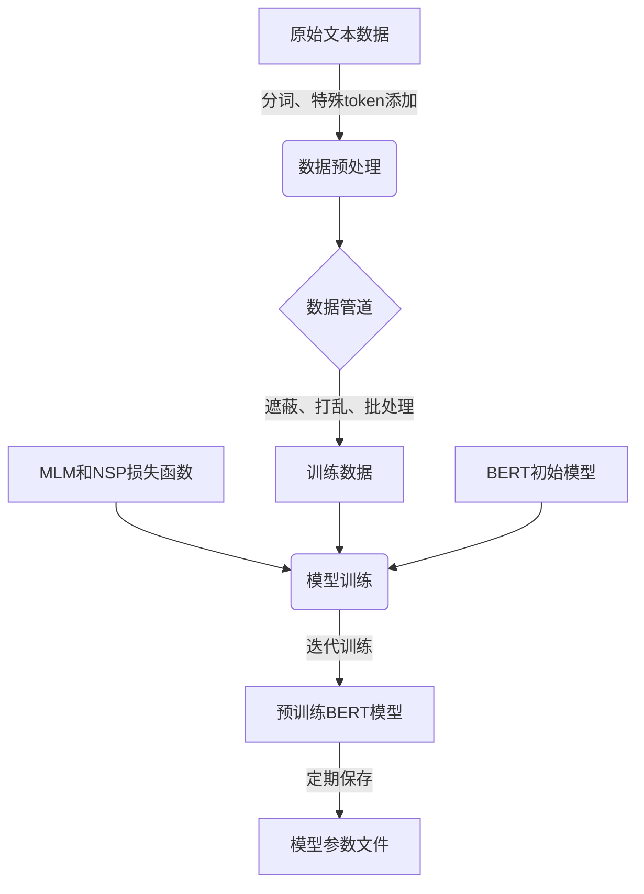
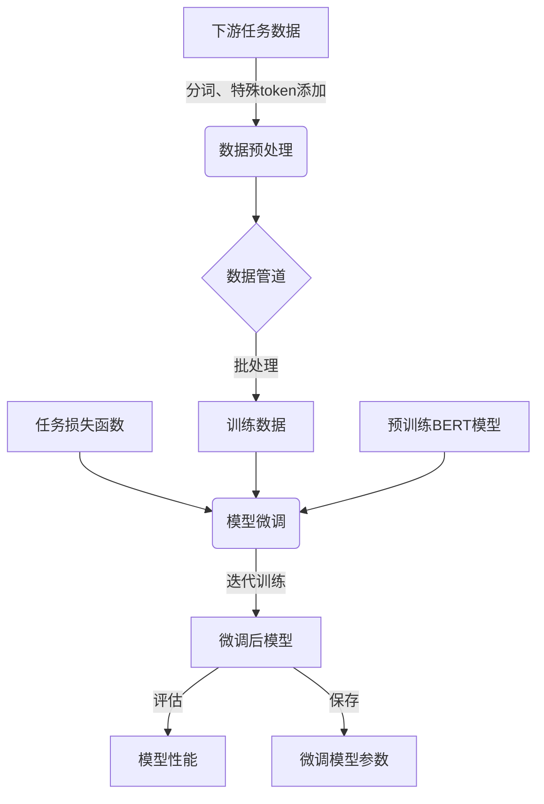
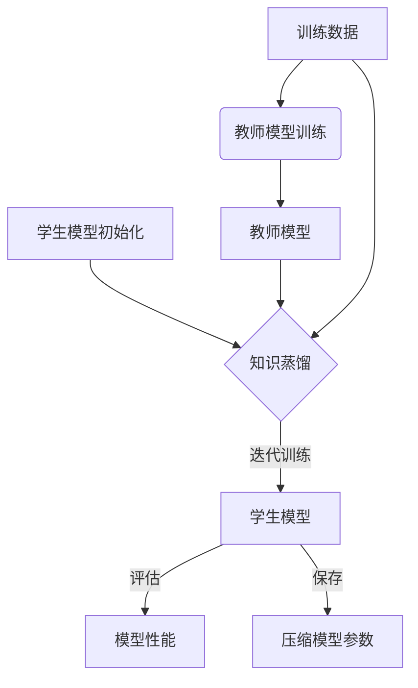

# 从零开始大模型开发与微调：基于深度学习的模型训练

## 1.背景介绍

### 1.1 大模型的兴起

近年来,大型神经网络模型在自然语言处理、计算机视觉等领域取得了令人瞩目的成就。随着算力和数据的不断增长,训练大规模深度学习模型成为可能。这些大模型通过在海量数据上进行预训练,学习到丰富的知识表示,能够在下游任务上取得出色的表现。

代表性的大模型包括 GPT(Generative Pre-trained Transformer)、BERT(Bidirectional Encoder Representations from Transformers)、ViT(Vision Transformer)等。这些模型通过自注意力机制和transformer编码器-解码器架构,有效地捕捉长距离依赖关系,在生成式任务和理解式任务上都表现出色。

### 1.2 大模型的挑战

尽管大模型展现出强大的能力,但其训练过程也面临诸多挑战:

1. **计算资源需求巨大**:大模型参数量通常在数十亿到数万亿不等,训练需要消耗大量算力和内存资源。
2. **数据需求海量**:为获取通用知识表示,大模型需要在海量无标注数据上进行预训练,对数据质量和多样性有极高要求。
3. **训练时间漫长**:由于参数量巨大,大模型的训练时间可能长达数周甚至数月。
4. **微调策略选择**:如何有效地将预训练模型迁移到下游任务,需要合理的微调策略。
5. **环境影响较大**:训练大模型需要消耗大量能源,对环境产生一定影响。

因此,如何高效地开发和微调大模型,成为当前研究的热点课题。

## 2.核心概念与联系

### 2.1 迁移学习

迁移学习(Transfer Learning)是一种重用已学习知识的技术,通过将在源领域学习到的知识迁移到目标领域,从而加速目标任务的学习过程。在大模型中,迁移学习体现为:先在大规模无标注数据上进行自监督预训练,获取通用知识表示;然后在有标注的下游数据上进行微调,将预训练模型迁移到特定任务。

### 2.2 自监督学习

自监督学习(Self-Supervised Learning)是一种无需人工标注的学习范式。通过设计预训练任务,如遮蔽语言模型、下一句预测等,模型可以从大量无标注数据中自动学习有用的表示。自监督学习是大模型获取通用知识表示的关键技术。

### 2.3 微调策略

微调(Fine-tuning)是将预训练模型迁移到下游任务的常用方法。根据任务复杂程度和数据量,可采用不同的微调策略:

1. **全模型微调**:在下游数据上对整个预训练模型进行微调。适用于数据量充足的情况。
2. **前馈微调**:只微调预训练模型的前馈层,保持其余层参数不变。适用于数据量较少的情况。
3. **提示微调**:通过设计任务相关的提示,引导预训练模型生成所需输出。适用于少量示例的情况。

不同微调策略在计算代价、性能提升等方面有所权衡。选择合适的策略对模型性能至关重要。

### 2.4 模型压缩

由于大模型参数量巨大,直接部署在终端设备上存在困难。模型压缩技术如量化、剪枝、知识蒸馏等,可以在保持模型性能的前提下,显著减小模型大小,降低推理时的计算和内存开销。

上述核心概念相互关联,共同构建了大模型开发与微调的技术体系。接下来将详细介绍各个环节的原理和实现方法。

## 3.核心算法原理具体操作步骤

### 3.1 自监督预训练

自监督预训练是大模型学习通用知识表示的关键步骤。常用的预训练任务包括:

1. **Masked Language Modeling(MLM)**:随机遮蔽输入序列中的部分token,模型需要预测被遮蔽的token。
2. **Next Sentence Prediction(NSP)**:判断两个句子是否为连续关系。
3. **Denoising Auto-Encoding**:从加噪的输入中重建原始输入。

以BERT为例,预训练过程包括以下步骤:

1. **数据预处理**:将原始文本数据转换为模型可接受的格式,包括分词、添加特殊token等。
2. **构建数据管道**:实现数据加载、遮蔽、打乱等操作,高效地产生训练batch。
3. **定义预训练目标**:根据MLM和NSP任务,定义相应的损失函数。
4. **模型初始化**:初始化BERT模型的参数。
5. **训练循环**:使用优化器如AdamW,在训练集上迭代训练,最小化损失函数。
6. **模型保存**:定期保存训练好的模型参数。

预训练过程通常需要消耗大量算力和时间,因此常采用分布式训练、梯度累积等策略提高效率。

### 3.2 模型微调

完成自监督预训练后,需要将大模型迁移到特定的下游任务。常用的微调方法包括:

1. **全模型微调**:对整个预训练模型的所有参数进行微调。适用于有足够下游数据的情况。
2. **前馈微调**:只微调预训练模型的前馈层参数,保持其他层参数不变。适用于下游数据较少的情况。
3. **提示微调**:设计任务相关的提示,引导预训练模型生成所需输出,无需微调模型参数。

以BERT全模型微调为例,步骤如下:

1. **准备下游数据**:根据任务,准备训练集和验证集。
2. **数据预处理**:将文本数据转换为模型可接受的格式。
3. **定义微调目标**:根据任务定义损失函数,如分类交叉熵损失等。
4. **加载预训练模型**:加载预训练好的BERT模型参数。
5. **微调训练**:使用优化器如AdamW,在训练集上迭代训练,最小化损失函数。
6. **模型评估**:在验证集上评估微调后模型的性能。
7. **模型保存**:保存微调好的模型参数,用于推理任务。

### 3.3 模型压缩

为了降低大模型的计算和存储开销,常采用模型压缩技术,主要包括:

1. **量化**:将原始的32位或16位浮点数参数量化为较低比特位(如8位或4位),从而降低模型大小和计算量。
2. **剪枝**:移除模型中不重要的连接或权重,进一步减小模型大小。
3. **知识蒸馏**:使用教师模型(大模型)指导学生模型(小模型)学习,将大模型的知识迁移到小模型。

以知识蒸馏为例,主要步骤包括:

1. **教师模型训练**:训练一个高性能的大模型作为教师模型。
2. **学生模型初始化**:初始化一个小型的学生模型。
3. **蒸馏损失函数**:设计合适的损失函数,将教师模型的知识传递给学生模型。
4. **蒸馏训练**:使用蒸馏损失函数,在训练数据上训练学生模型。
5. **模型评估**:在验证集上评估学生模型的性能。
6. **模型保存**:保存训练好的小型学生模型,用于推理部署。

通过上述步骤,可以获得一个精度较高但计算量和存储开销较小的压缩模型,便于部署在终端设备上。

## 4.数学模型和公式详细讲解举例说明

### 4.1 Transformer编码器

Transformer编码器是大模型的核心组件,能够有效捕捉输入序列的长距离依赖关系。其数学模型如下:

输入序列 $X = (x_1, x_2, \dots, x_n)$,其中 $x_i \in \mathbb{R}^{d_{model}}$ 为 $i$ 位置的词嵌入向量。

$$Z_0 = X + P_{pos}$$

其中 $P_{pos}$ 为位置编码,用于注入序列位置信息。

$$Z_l = \text{Transformer-Block}(Z_{l-1}), \quad l=1,2,\dots,L$$

Transformer-Block 包含多头自注意力(Multi-Head Attention)和前馈神经网络(Feed-Forward Network)两个子层:

1. **多头自注意力**:

$$\begin{aligned}
\text{MultiHead}(Q, K, V) &= \text{Concat}(\text{head}_1, \dots, \text{head}_h)W^O\\
\text{head}_i &= \text{Attention}(QW_i^Q, KW_i^K, VW_i^V)
\end{aligned}$$

其中 $Q$、$K$、$V$ 分别为查询(Query)、键(Key)和值(Value)矩阵,通过自注意力计算得到加权值表示。$W_i^Q$、$W_i^K$、$W_i^V$、$W^O$ 为可学习的线性投影参数。

2. **前馈神经网络**:

$$\text{FFN}(x) = \max(0, xW_1 + b_1)W_2 + b_2$$

其中 $W_1$、$W_2$、$b_1$、$b_2$ 为可学习参数。

最终的 Transformer 编码器输出为:

$$H_L = \text{Transformer-Block}^L \circ \cdots \circ \text{Transformer-Block}^2 \circ \text{Transformer-Block}^1(Z_0)$$

通过堆叠多个 Transformer-Block,模型可以学习到输入序列的深层次表示。

### 4.2 BERT 预训练目标

BERT 预训练过程中的两个主要目标是 Masked Language Model(MLM) 和 Next Sentence Prediction(NSP)。

1. **MLM 目标**:

给定输入序列 $X = (x_1, x_2, \dots, x_n)$,随机遮蔽 15% 的 token,得到遮蔽后的序列 $\hat{X}$。BERT 模型的目标是最大化遮蔽位置的条件概率:

$$\begin{aligned}
\mathcal{L}_{MLM} &= -\mathbb{E}_{X,\hat{X}}\left[\sum_{i=1}^n \mathbb{1}_{\hat{x}_i=\text{[MASK]}} \log P(x_i|\hat{X})\right]\\
P(x_i|\hat{X}) &= \text{Softmax}(h_i^TW_e)
\end{aligned}$$

其中 $h_i$ 为 BERT 编码器在位置 $i$ 的输出向量,通过线性投影和 Softmax 得到遮蔽词的预测概率分布。

2. **NSP 目标**:

给定两个句子 $A$ 和 $B$,BERT 需要预测它们是否为连续关系。令 $C \in \{0, 1\}$ 为二值标签,表示是否为连续关系。NSP 目标为:

$$\mathcal{L}_{NSP} = -\mathbb{E}_{A,B,C}\left