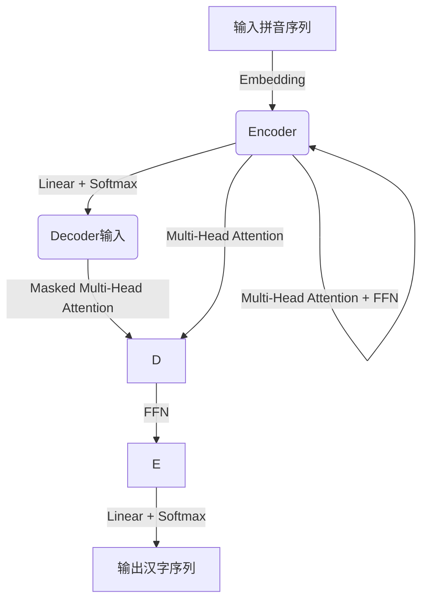

# 从零开始大模型开发与微调：拼音汉字模型的使用

## 1.背景介绍

### 1.1 自然语言处理的重要性

在当今信息时代,自然语言处理(NLP)已成为人工智能领域中最重要和最具挑战性的研究方向之一。它旨在使计算机能够理解和生成人类语言,实现人机自然交互,广泛应用于机器翻译、问答系统、语音识别、信息检索等诸多领域。

### 1.2 中文NLP的挑战

与英语等西方语言相比,中文作为一种源远流长的语言,在计算机处理上面临着诸多独特的挑战:

- 缺乏显式词边界
- 构词方式多样
- 同音异形现象普遍
- 语法复杂、规则多变

因此,开发高效准确的中文NLP模型一直是该领域的重中之重。

### 1.3 拼音汉字模型的重要性

在中文NLP任务中,拼音与汉字之间存在着内在的映射关系。利用这一映射关系,我们可以构建拼音到汉字的转换模型,为下游任务(如输入法、识字、机器翻译等)提供有力支持。这种将拼音序列转换为汉字序列的模型,被称为拼音汉字模型(Phonetic to Character Model, P2C)。

拼音汉字模型具有以下优势:

- 可解决输入法的主要痛点
- 为识字和阅读障碍辅助提供基础
- 为声音到文本的语音识别系统提供关键支持
- 可促进儿童语言学习

因此,构建高质量的拼音汉字模型不仅具有重要的理论意义,而且可以为实际应用带来广泛的好处。

## 2.核心概念与联系

### 2.1 序列到序列模型

拼音汉字模型本质上是一个将源序列(拼音序列)转换为目标序列(汉字序列)的序列到序列(Sequence-to-Sequence, Seq2Seq)模型。Seq2Seq模型由两部分组成:

1. **编码器(Encoder)**: 将源序列编码为中间表示
2. **解码器(Decoder)**: 根据中间表示生成目标序列

编码器和解码器通常都采用循环神经网络(RNN)或transformer等架构。


### 2.2 注意力机制

为了提高序列到序列模型的性能,注意力机制(Attention Mechanism)被广泛引入。注意力机制允许解码器在生成每个目标元素时,对输入序列的不同部分赋予不同的权重,从而更好地捕获输入和输出之间的长程依赖关系。


### 2.3 拼音到汉字的映射

在拼音汉字模型中,我们需要学习拼音和汉字之间的映射规则。这种映射关系通常是一对多的,即一个拼音序列可能对应多个汉字序列。例如,拼音"zhi"可以对应"知"、"治"、"织"等多个汉字。

为了解决这一问题,我们可以引入:

1. **前缀树(Prefix Tree)**: 将所有可能的拼音-汉字映射组织为树状结构,高效查找
2. **拼音-汉字映射表(Pronunciation to Character Mapping Table)**: 显式存储所有映射对

## 3.核心算法原理具体操作步骤

### 3.1 模型架构

拼音汉字模型的核心架构可以基于transformer或RNN,结合注意力机制。以transformer为例,架构如下:



1. **Encoder**:将输入拼音序列编码为中间表示
2. **Decoder**:基于中间表示和前一步输出,生成下一个汉字
    - Masked Multi-Head Attention: 对前一步输出进行注意力计算
    - Multi-Head Attention: 对编码器输出进行注意力计算
    - FFN: 前馈神经网络,融合注意力结果
    - Linear + Softmax: 生成下一个汉字的概率分布

### 3.2 训练流程

1. **准备数据集**: 收集大量拼音序列和对应的汉字序列作为训练数据
2. **数据预处理**: 
    - 拼音序列: 拆分为单个拼音字母
    - 汉字序列: 添加起止符号(BOS/EOS)
3. **设计模型**: 基于Seq2Seq架构(如Transformer)构建模型
4. **训练模型**: 
    - 损失函数: 交叉熵损失
    - 优化器: Adam等
    - 早停、梯度裁剪等策略
5. **评估模型**: 使用指标如BLEU、编辑距离等评估模型性能
6. **微调模型**: 根据评估结果,调整超参数、修改模型架构等,重复训练直至满意

### 3.3 预测(推理)流程

1. **输入拼音序列**
2. **模型编码**:将拼音序列编码为中间表示
3. **模型解码**:
    - 给定BOS作为起始输入
    - 基于中间表示和前一步输出,预测下一个汉字
    - 重复上一步,直至预测到EOS或达到最大长度
4. **输出汉字序列**

## 4.数学模型和公式详细讲解举例说明

### 4.1 Transformer模型

Transformer是Seq2Seq模型中的一种主流架构,包含编码器和解码器两部分。

#### 4.1.1 编码器(Encoder)

编码器由N个相同的层组成,每一层包含两个子层:

1. **Multi-Head Attention**
2. **前馈全连接网络(FFN)**

**Multi-Head Attention**

将输入序列$X=(x_1,x_2,...,x_n)$映射为$Q,K,V$三个向量序列:

$$\begin{aligned}
Q &= XW^Q\\
K &= XW^K\\
V &= XW^V
\end{aligned}$$

其中$W^Q,W^K,W^V$为可训练参数。

单头注意力计算公式为:

$$\text{Attention}(Q,K,V)=\text{softmax}(\frac{QK^T}{\sqrt{d_k}})V$$

Multi-Head注意力通过并行计算$h$个注意力头,再将结果拼接得到:

$$\begin{aligned}
\text{MultiHead}(Q,K,V)&=\text{Concat}(\text{head}_1,...,\text{head}_h)W^O\\
\text{where } \text{head}_i &= \text{Attention}(QW_i^Q,KW_i^K,VW_i^V)
\end{aligned}$$

**前馈全连接网络(FFN)**

$$\text{FFN}(x)=\max(0,xW_1+b_1)W_2+b_2$$

其中$W_1,W_2,b_1,b_2$为可训练参数。

#### 4.1.2 解码器(Decoder)

解码器也由N个相同的层组成,每一层包含三个子层:

1. **Masked Multi-Head Attention**: 只能关注当前位置之前的输出
2. **Multi-Head Attention**: 与编码器输出计算注意力
3. **前馈全连接网络(FFN)**

**Masked Multi-Head Attention**

与Multi-Head Attention类似,但在计算注意力时,对于序列中的每个位置,都对其之后的位置的输入加以遮掩(mask)。

$$\begin{aligned}
\text{MaskedAttention}(Q,K,V)&=\text{softmax}(\frac{QK^T}{\sqrt{d_k}}+M)V\\
M_{ij}&=\begin{cases}
0&\text{if }i\leq j\\
-\infty&\text{if }i>j
\end{cases}
\end{aligned}$$

其中$M$为掩码张量,确保每个位置只能关注之前的位置。

### 4.2 损失函数

拼音汉字模型的损失函数通常采用交叉熵损失:

$$\mathcal{L}=-\sum_{t=1}^{T}y_t\log p(y_t|y_1,...,y_{t-1},X)$$

其中:
- $T$为目标序列长度
- $y_t$为目标序列第$t$个位置的真实标签(one-hot编码)
- $p(y_t|y_1,...,y_{t-1},X)$为模型预测的第$t$个位置的概率分布

### 4.3 示例

假设输入拼音序列为"ni3 hao3",对应的汉字序列为"你好"。

1. 将拼音序列"ni3 hao3"编码为向量表示$X$
2. 编码器计算中间表示$Z=\text{Encoder}(X)$
3. 解码器给定BOS("<bos>")作为初始输入$y_0$
4. 对于时间步$t=1$:
    - 计算$p(y_1|y_0,Z)$,得到预测分布
    - 从分布中采样或取最大值,得到预测$\hat{y}_1$,例如"你"
5. 对于时间步$t=2$:
    - 计算$p(y_2|y_0,y_1,Z)$,得到预测分布  
    - 从分布中采样或取最大值,得到预测$\hat{y}_2$,例如"好"
6. 检测到EOS("<eos>")或达到最大长度,输出预测序列"你好<eos>"

通过上述步骤,模型学习了从拼音到汉字的映射规则。

## 5.项目实践:代码实例和详细解释说明

以下是一个使用PyTorch实现的简化版拼音汉字模型示例:

```python
import torch
import torch.nn as nn
import torch.optim as optim

# 定义模型
class Seq2Seq(nn.Module):
    def __init__(self, input_size, output_size, hidden_size, num_layers):
        super(Seq2Seq, self).__init__()
        self.input_size = input_size
        self.output_size = output_size
        self.hidden_size = hidden_size
        self.num_layers = num_layers
        
        self.encoder = nn.Embedding(input_size, hidden_size)
        self.encoder_rnn = nn.GRU(hidden_size, hidden_size, num_layers, batch_first=True)
        
        self.decoder = nn.Embedding(output_size, hidden_size)
        self.decoder_rnn = nn.GRU(hidden_size, hidden_size, num_layers, batch_first=True)
        self.out = nn.Linear(hidden_size, output_size)
        
    def forward(self, input, target, teacher_force_ratio=0.5):
        batch_size = input.shape[0]
        max_len = target.shape[1]
        vocab_size = self.output_size
        
        # 编码器
        encoder_embeds = self.encoder(input)
        encoder_hidden = torch.zeros(self.num_layers, batch_size, self.hidden_size)
        encoder_outputs, encoder_hidden = self.encoder_rnn(encoder_embeds, encoder_hidden)
        
        # 解码器
        decoder_input = torch.tensor([SOS_token] * batch_size)
        decoder_hidden = encoder_hidden
        
        use_teacher_forcing = True if random.random() < teacher_force_ratio else False
        
        decoded_outputs = []
        
        for di in range(max_len):
            decoder_output, decoder_hidden = self.decoder_rnn(self.decoder(decoder_input).unsqueeze(1), decoder_hidden)
            decoder_output = self.out(decoder_output).squeeze(1)
            decoded_outputs.append(decoder_output)
            
            if use_teacher_forcing:
                decoder_input = target[:, di]  # 下一个输入是正确答案
            else:
                topv, topi = decoder_output.topk(1)
                decoder_input = topi.squeeze().detach()  # 下一个输入是模型预测
                
        decoded_outputs = torch.stack(decoded_outputs).permute(1, 0, 2)
        
        return decoded_outputs

# 训练模型
input_size = len(pinyin_vocab)
output_size = len(hanzi_vocab)
hidden_size = 256
num_layers = 2

model = Seq2Seq(input_size, output_size, hidden_size, num_layers)
criterion = nn.CrossEntropyLoss()
optimizer = optim.Adam(model.parameters())

for epoch in range(num_epochs):
    for input_seq, target_seq in dataset:
        optimizer.zero_grad()
        outputs = model(input_seq, target_seq)
        loss = criterion(outputs.view(-1, output_size