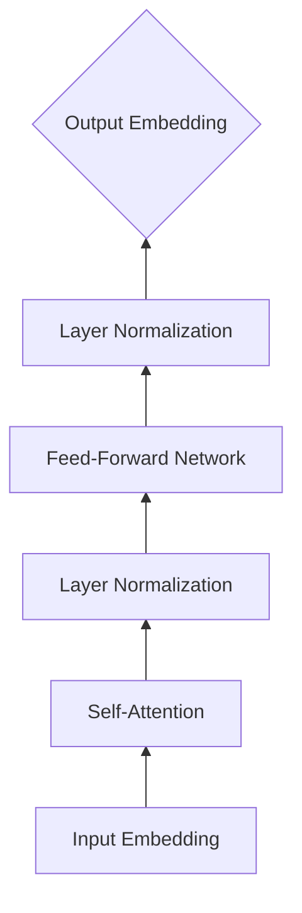

# 从零开始大模型开发与微调：自注意力层

## 1. 背景介绍

### 1.1 大语言模型的崛起

近年来,自然语言处理(NLP)领域出现了一种新的范式,即预训练大型语言模型(Pre-trained Language Models,PLMs)。这些模型在大规模无标注文本语料上进行预训练,学习到丰富的语言知识和常识,再通过微调(Fine-tuning)应用到下游任务,取得了显著的性能提升。代表性的模型包括BERT、GPT、T5、BART等。

### 1.2 Transformer架构的核心作用

支撑这些大语言模型的核心架构是Transformer[1]。与传统的RNN、CNN等结构相比,Transformer完全基于注意力机制(Attention Mechanism),通过自注意力(Self-Attention)和前馈神经网络(Feed-Forward Network)的堆叠,实现了高效并行和长距离依赖建模。其中,自注意力层是Transformer的关键组件。

### 1.3 自注意力层的重要意义

自注意力层使得模型能够在编码每个token时,综合考虑序列中其他所有token的信息。相比RNN按时间步顺序计算,自注意力通过矩阵乘法一次性计算序列内任意两个位置之间的关联,极大提升了训练和推理效率。同时,多头自注意力(Multi-head Self-Attention)引入多个注意力函数,从不同子空间学习序列的多样化表示。

因此,深入理解并掌握自注意力层的原理和实现,对于从事大模型相关研究和应用的AI工程师、NLP算法工程师等从业者来说至关重要。本文将从核心概念入手,结合数学推导、代码实践、应用场景等多角度,全面讲解自注意力层。

## 2. 核心概念与联系

### 2.1 注意力机制(Attention Mechanism)

注意力机制的核心思想是,在生成每个输出时,通过学习的方式自动聚焦到输入序列中与当前输出最相关的部分,并基于这些信息来预测输出[2]。常见的注意力函数有加性注意力(Additive Attention)、点积注意力(Dot-Product Attention)等。

### 2.2 自注意力(Self-Attention)

自注意力是一种特殊的注意力机制,其中Query向量、Key向量、Value向量来自同一个输入序列。对于序列中的每个位置,通过注意力计算与其他所有位置的相关性,得到该位置的新表示。自注意力可以建模输入序列内部的依赖关系。

### 2.3 Transformer中的自注意力

在Transformer中,编码器和解码器的每一层都使用了自注意力。编码器的自注意力允许每个位置的embedding综合整个输入序列的信息。解码器除了自注意力外,还引入了交叉注意力(Cross Attention),关注编码器的输出。

### 2.4 多头自注意力(Multi-head Self-Attention)

多头自注意力通过引入多组参数矩阵,将输入映射到多个子空间,并行计算多个注意力函数,然后拼接结果并再次线性变换,得到最终的输出表示。这种机制增强了模型的表达能力,使其能够从不同角度学习序列的多样化特征。

下图展示了自注意力层及其与Transformer其他组件的联系:



## 3. 核心算法原理具体操作步骤

### 3.1 自注意力计算流程

对于输入序列 $X \in \mathbb{R}^{n \times d}$,自注意力层的计算流程如下:

1. 根据输入 $X$,通过三个线性变换得到 Query 矩阵 $Q$、Key 矩阵 $K$、Value 矩阵 $V$:

$$
\begin{aligned}
Q = X W^Q \\
K = X W^K \\
V = X W^V
\end{aligned}
$$

其中 $W^Q, W^K, W^V \in \mathbb{R}^{d \times d_k}$ 是可学习的参数矩阵。

2. 计算 Query 和 Key 的相似度得分(Scores):

$$
\text{Scores} = \frac{QK^T}{\sqrt{d_k}}
$$

其中 $\sqrt{d_k}$ 是缩放因子,用于控制点积结果的方差。

3. 对 Scores 进行 Softmax 归一化,得到注意力权重(Attention Weights):

$$
\text{Attention Weights} = \text{softmax}(\text{Scores})
$$

4. 用注意力权重对 Value 进行加权求和,得到输出(Output):

$$
\text{Output} = \text{Attention Weights} \cdot V
$$

### 3.2 多头自注意力计算流程

多头自注意力的计算流程如下:

1. 对输入 $X$ 进行 $h$ 次线性变换,得到 $h$ 组 Query、Key、Value 矩阵:

$$
\begin{aligned}
Q_i = X W_i^Q \\  
K_i = X W_i^K \\
V_i = X W_i^V
\end{aligned}
$$

其中 $i=1,2,...,h$, $W_i^Q, W_i^K, W_i^V \in \mathbb{R}^{d \times d_k}$。

2. 对每组 Query、Key、Value 矩阵分别进行自注意力计算,得到 $h$ 个输出:

$$
\text{head}_i = \text{Attention}(Q_i, K_i, V_i)
$$

3. 将 $h$ 个输出拼接(Concatenate)起来:

$$
\text{MultiHead} = \text{Concat}(\text{head}_1, \text{head}_2, ..., \text{head}_h)
$$

4. 对拼接结果进行线性变换,得到最终输出:

$$
\text{Output} = \text{MultiHead} \cdot W^O
$$

其中 $W^O \in \mathbb{R}^{h d_k \times d}$ 是可学习的参数矩阵。

## 4. 数学模型和公式详细讲解举例说明

### 4.1 自注意力的矩阵计算

我们以一个简单的例子来说明自注意力的矩阵计算过程。假设输入序列 $X$ 包含4个长度为3的向量:

$$
X = \begin{bmatrix}
1 & 2 & 3 \\
4 & 5 & 6 \\
7 & 8 & 9 \\
10 & 11 & 12
\end{bmatrix}
$$

令 Query、Key、Value 的维度 $d_k=2$,对应的参数矩阵为:

$$
W^Q = W^K = W^V = \begin{bmatrix}
1 & 0 \\
0 & 1 \\
1 & 1
\end{bmatrix}
$$

1. 计算 Query、Key、Value 矩阵:

$$
\begin{aligned}
Q = X W^Q = \begin{bmatrix}
4 & 5 \\
7 & 11 \\  
16 & 17 \\
23 & 23
\end{bmatrix} \\
K = X W^K = \begin{bmatrix}
4 & 5 \\
7 & 11 \\
16 & 17 \\
23 & 23  
\end{bmatrix} \\
V = X W^V = \begin{bmatrix}
4 & 5 \\
7 & 11 \\
16 & 17 \\
23 & 23
\end{bmatrix}
\end{aligned}
$$

2. 计算 Scores 矩阵(这里假设缩放因子为1):

$$
\text{Scores} = QK^T = \begin{bmatrix}
41 & 74 & 157 & 230 \\
74 & 170 & 301 & 414 \\
157 & 301 & 578 & 833 \\ 
230 & 414 & 833 & 1242
\end{bmatrix}
$$

3. 对 Scores 矩阵进行 Softmax 归一化:

$$
\text{Attention Weights} = \text{softmax}(\text{Scores}) = \begin{bmatrix}
0.02 & 0.03 & 0.06 & 0.09 \\
0.03 & 0.07 & 0.12 & 0.16 \\
0.06 & 0.12 & 0.23 & 0.32 \\
0.09 & 0.16 & 0.32 & 0.48  
\end{bmatrix}
$$

4. 计算输出:

$$
\text{Output} = \text{Attention Weights} \cdot V = \begin{bmatrix}
15.35 & 16.09 \\
17.75 & 18.89 \\
19.45 & 20.79 \\
20.55 & 21.91
\end{bmatrix}
$$

通过这个简单例子,我们可以直观地看到自注意力是如何通过矩阵计算,使得每个位置的输出都融合了序列中其他位置的信息。不同位置的注意力权重分布反映了它们之间的相关性强弱。

### 4.2 多头自注意力的并行计算

多头自注意力实际上是 $h$ 个自注意力的并行计算。以2头自注意力为例,假设第一组参数为 $W_1^Q, W_1^K, W_1^V$,第二组参数为 $W_2^Q, W_2^K, W_2^V$,两组参数独立学习。

对于同一个输入序列 $X$,两个头分别计算:

$$
\begin{aligned}
\text{head}_1 &= \text{Attention}(X W_1^Q, X W_1^K, X W_1^V) \\
\text{head}_2 &= \text{Attention}(X W_2^Q, X W_2^K, X W_2^V)
\end{aligned}
$$

然后将结果拼接并线性变换:

$$
\text{Output} = \text{Concat}(\text{head}_1, \text{head}_2) \cdot W^O
$$

相比单头自注意力,多头机制通过引入多组参数,增加了模型的表达能力。不同的头可以学习到输入序列的不同方面的特征表示。

## 5. 项目实践：代码实例和详细解释说明

下面我们使用PyTorch实现基于注意力的Seq2Seq模型,并应用于机器翻译任务。

### 5.1 定义自注意力层

```python
import torch
import torch.nn as nn

class SelfAttention(nn.Module):
    def __init__(self, embed_dim, num_heads):
        super().__init__()
        self.embed_dim = embed_dim
        self.num_heads = num_heads
        self.head_dim = embed_dim // num_heads
        
        self.query = nn.Linear(embed_dim, embed_dim)
        self.key = nn.Linear(embed_dim, embed_dim)  
        self.value = nn.Linear(embed_dim, embed_dim)
        self.out = nn.Linear(embed_dim, embed_dim)
    
    def forward(self, x):
        batch_size, seq_len, _ = x.size()
        
        q = self.query(x).view(batch_size, seq_len, self.num_heads, self.head_dim).transpose(1, 2)
        k = self.key(x).view(batch_size, seq_len, self.num_heads, self.head_dim).transpose(1, 2)
        v = self.value(x).view(batch_size, seq_len, self.num_heads, self.head_dim).transpose(1, 2)
        
        scores = torch.matmul(q, k.transpose(-2, -1)) / (self.head_dim ** 0.5)
        attn_weights = torch.softmax(scores, dim=-1)
        attn_output = torch.matmul(attn_weights, v)
        
        attn_output = attn_output.transpose(1, 2).contiguous().view(batch_size, seq_len, self.embed_dim)
        output = self.out(attn_output)
        
        return output
```

这里我们定义了一个多头自注意力层。主要步骤包括:

1. 通过三个线性层(nn.Linear)得到 Query、Key、Value 矩阵。
2. 将 Query、Key、Value 矩阵分割成多个头,并转置维度以便后续计算。
3. 计算 Query 和 Key 的点积得到 Scores,并除以缩放因子。
4. 对 Scores 进行 Softmax 归一化得到注意力权重。
5. 用注意力权重对 Value 加权求和,得到多头输出。
6. 将多头输出拼接并通过线性层得到最终输出。

### 5.2 定义Transformer编码器层

```python
class TransformerEncoderLayer(nn.Module):
    def __init__(self, embed_dim, num_heads, ffn_dim, dropout=0.1):
        super().__init__()
        self.self_attn = SelfAttention(embed_dim, num_heads)
        self.norm1 = nn.LayerNorm(embed_dim)
        self.ffn = nn.Sequential(
            nn.Linear(