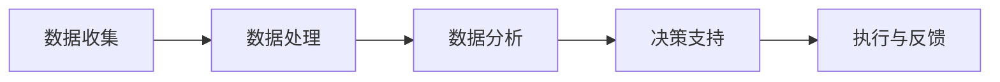
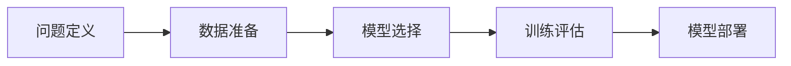

# 企业数字化转型中的数字化研发与创新管理

## 1. 背景介绍
随着信息技术的飞速发展，企业数字化转型已成为提升竞争力的关键。数字化研发与创新管理是转型过程中的核心环节，它涉及到企业如何利用数字技术优化产品开发流程、提高研发效率以及促进创新思维的培养。

## 2. 核心概念与联系
### 2.1 数字化研发
数字化研发指的是利用数字技术和工具来进行产品设计、测试和开发的过程。它包括但不限于使用计算机辅助设计（CAD）、计算机辅助工程（CAE）、计算机辅助制造（CAM）等技术。

### 2.2 创新管理
创新管理是指在组织内部建立一套系统的管理流程，以支持新思想的产生、评估、发展和实施。它涉及战略规划、组织文化、项目管理等多个方面。

### 2.3 数字化研发与创新管理的联系
数字化研发为创新管理提供了技术支持和数据分析能力，而创新管理则为数字化研发提供了战略指导和组织保障。

## 3. 核心算法原理具体操作步骤
### 3.1 数据驱动的决策过程

### 3.2 机器学习在研发中的应用


## 4. 数学模型和公式详细讲解举例说明
### 4.1 优化算法
在数字化研发中，常用的优化算法包括梯度下降法、遗传算法等。以梯度下降法为例，其数学公式为：
$$
\theta_{next} = \theta_{current} - \alpha \nabla J(\theta)
$$
其中，$\theta$ 表示参数，$\alpha$ 表示学习率，$J(\theta)$ 表示损失函数。

### 4.2 机器学习模型
以线性回归为例，其数学模型为：
$$
y = \theta_0 + \theta_1 x_1 + \theta_2 x_2 + ... + \theta_n x_n + \epsilon
$$
其中，$y$ 是目标变量，$x_i$ 是特征变量，$\theta_i$ 是参数，$\epsilon$ 是误差项。

## 5. 项目实践：代码实例和详细解释说明
### 5.1 使用Python进行数据分析
```python
import pandas as pd
# 加载数据
data = pd.read_csv('data.csv')
# 数据预处理
data = data.dropna()
# 数据分析
print(data.describe())
```
### 5.2 机器学习模型的训练
```python
from sklearn.linear_model import LinearRegression
# 初始化模型
model = LinearRegression()
# 拟合模型
model.fit(X_train, y_train)
# 预测
predictions = model.predict(X_test)
```

## 6. 实际应用场景
数字化研发与创新管理在多个领域都有广泛应用，例如汽车行业的智能制造、医药行业的新药研发、金融行业的风险管理等。

## 7. 工具和资源推荐
- **版本控制系统**：Git, SVN
- **项目管理工具**：Jira, Trello
- **数据分析工具**：Python, R
- **机器学习框架**：TensorFlow, PyTorch

## 8. 总结：未来发展趋势与挑战
数字化研发与创新管理的未来发展趋势将更加侧重于人工智能和大数据技术的融合应用。挑战包括数据安全、隐私保护以及跨学科人才的培养。

## 9. 附录：常见问题与解答
- **Q1**: 数字化研发如何提高效率？
- **A1**: 通过自动化工具和流程优化减少重复工作，利用数据分析进行决策支持。

- **Q2**: 创新管理在企业中如何落地？
- **A2**: 建立创新文化，设立专门的创新团队和流程，鼓励跨部门合作。

- **Q3**: 如何处理大数据分析中的隐私问题？
- **A3**: 遵守相关法律法规，使用数据脱敏和加密技术保护个人隐私。

作者：禅与计算机程序设计艺术 / Zen and the Art of Computer Programming