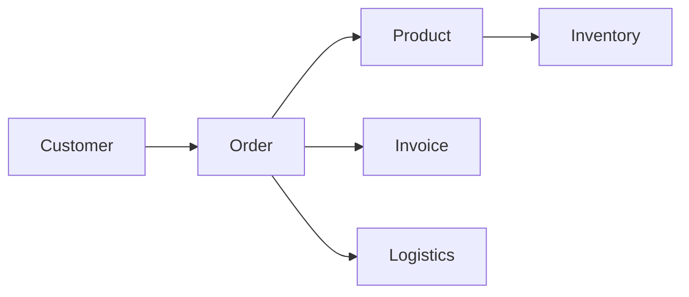
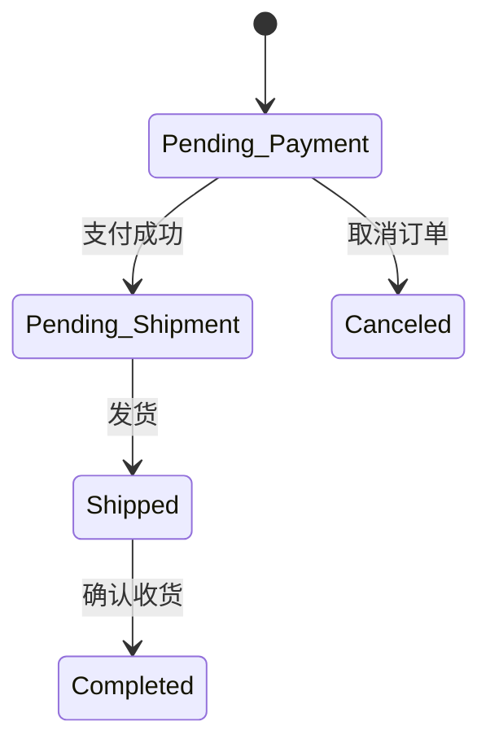

# 企业订单管理系统详细设计与具体代码实现

## 1. 背景介绍

在现代企业运营中,订单管理是一个至关重要的环节。高效、准确的订单管理可以提高企业的运营效率,减少错误,提升客户满意度。然而,传统的人工订单管理方式已经无法满足日益增长的业务需求。因此,开发一个功能完善、性能优异的企业订单管理系统势在必行。

本文将详细探讨企业订单管理系统的设计与实现。我们将从需求分析入手,梳理系统的核心功能和业务流程;然后进行系统架构设计,选择合适的技术方案;接着详细阐述系统的数据库设计、API接口设计和关键功能的代码实现;最后,讨论系统的部署与优化。通过本文,读者将全面了解企业订单管理系统的设计与开发,并能够举一反三,开发出满足自身业务需求的订单管理系统。

## 2. 核心概念与关系

在订单管理系统中,涉及到几个核心概念:

* 订单(Order):记录了客户购买商品或服务的详细信息,包括客户信息、商品信息、金额、状态等。
* 客户(Customer):下达订单的个人或组织。
* 商品(Product):订单中购买的产品或服务。
* 库存(Inventory):商品的库存量。
* 发票(Invoice):订单的付款凭证。
* 物流(Logistics):商品的运输和配送。

这些概念之间的关系可以用下面的 Mermaid 图表示:



从图中可以看出:

* 客户下达订单
* 一个订单包含多个商品
* 每个订单对应一个发票  
* 每个订单关联一次物流
* 商品与库存相关联

理解这些概念与关系,是设计订单管理系统的基础。

## 3. 核心算法原理与具体操作步骤

订单管理系统的核心算法主要体现在以下几个方面:

### 3.1 订单状态流转

订单状态流转指订单从创建到完成的整个生命周期中,所经历的各个状态以及状态之间的转换关系。常见的订单状态包括:

1. 待付款(Pending Payment)
2. 待发货(Pending Shipment) 
3. 已发货(Shipped)
4. 已完成(Completed)
5. 已取消(Canceled)

订单状态之间的流转关系可以用状态机来描述,如下图所示:



根据状态机,我们可以得出订单状态流转的具体操作步骤:

1. 创建订单时,订单状态为"待付款"。
2. 用户支付成功后,订单状态变为"待发货";如果用户取消订单,状态变为"已取消"。
3. 商家发货后,订单状态变为"已发货"。
4. 用户确认收货后,订单状态变为"已完成"。

### 3.2 库存分配与回滚

在用户下单时,需要对商品库存进行分配,以确保商品有足够的库存来满足订单需求。同时,如果订单取消或支付失败,需要将已分配的库存回滚,以避免库存错误。

库存分配与回滚的具体操作步骤如下:

1. 用户提交订单时,检查订单中每个商品的库存是否充足。
2. 如果库存充足,则将订单中的商品数量从库存中扣除,并将库存分配给该订单。
3. 如果库存不足,则提示用户库存不足,无法下单。
4. 如果订单支付失败或被取消,则将已分配给该订单的库存加回到商品库存中。

为了避免并发情况下的库存错误,需要使用事务来保证库存分配与回滚的原子性。

### 3.3 订单拆分与合并

在某些情况下,一个订单可能包含多个商品,这些商品可能来自不同的仓库或供应商。这时,需要将订单拆分成多个子订单,每个子订单对应一个仓库或供应商。

反之,如果用户同时下了多个订单,并且这些订单的商品可以合并发货,那么可以将这些订单合并为一个订单,以节省物流成本。

订单拆分与合并的具体操作步骤如下:

1. 根据订单中商品的仓库或供应商信息,将订单拆分成多个子订单。
2. 每个子订单独立进行库存分配、发货等操作。
3. 如果发现多个订单可以合并,则将这些订单合并为一个订单。
4. 对合并后的订单进行库存分配、发货等操作。

订单拆分与合并可以提高订单处理的效率,降低物流成本。

## 4. 数学模型和公式详细讲解举例说明

在订单管理系统中,经常需要用到一些数学模型和公式,例如:

### 4.1 订单金额计算

一个订单的总金额等于订单中所有商品的价格之和,再加上运费和税费,最后减去优惠券或折扣的金额。可以用以下公式表示:

$$
OrderTotal = \sum_{i=1}^{n} (Price_i \times Quantity_i) + Shipping + Tax - Discount
$$

其中,$OrderTotal$表示订单总金额,$Price_i$和$Quantity_i$分别表示第$i$种商品的单价和数量,$Shipping$表示运费,$Tax$表示税费,$Discount$表示优惠券或折扣金额。

举例说明:假设一个订单包含两种商品,第一种商品单价10元,购买2件;第二种商品单价20元,购买1件。订单的运费为5元,税费为订单金额的5%,且使用了一张10元的优惠券。那么这个订单的总金额计算如下:

$$
\begin{aligned}
OrderTotal &= (10 \times 2 + 20 \times 1) + 5 + (10 \times 2 + 20 \times 1) \times 5\% - 10 \\
           &= 40 + 5 + 2 - 10 \\
           &= 37
\end{aligned}
$$

### 4.2 销量预测

为了合理安排库存和生产,需要对未来一段时间内的销量进行预测。常用的销量预测模型有移动平均法、指数平滑法等。

以移动平均法为例,预测第$t$天的销量$\hat{y}_t$可以用过去$n$天的销量的平均值来估计:

$$
\hat{y}_t = \frac{1}{n} \sum_{i=1}^{n} y_{t-i}
$$

其中,$y_{t-i}$表示第$t-i$天的实际销量。

举例说明:假设过去5天的销量分别为10、12、15、13、11,则使用移动平均法预测第6天的销量为:

$$
\hat{y}_6 = \frac{10 + 12 + 15 + 13 + 11}{5} = 12.2
$$

### 4.3 客户价值计算

为了识别和维护高价值客户,需要计算每个客户的价值。一种常用的客户价值计算模型是RFM模型,即根据客户的最近购买时间(Recency)、购买频率(Frequency)和购买金额(Monetary)来评估客户价值。

具体来说,可以用以下公式计算客户价值$V$:

$$
V = \alpha \times R + \beta \times F + \gamma \times M
$$

其中,$R$、$F$、$M$分别表示客户的最近购买时间、购买频率和购买金额的得分,$\alpha$、$\beta$、$\gamma$为三个指标的权重,满足$\alpha + \beta + \gamma = 1$。

举例说明:假设一个客户最近一次购买时间是10天前,最近一年内购买了5次,总购买金额为1000元。我们将最近购买时间、购买频率、购买金额分别划分为5个等级,分别赋予1~5分。该客户的最近购买时间得分为4分,购买频率得分为3分,购买金额得分为5分。假设三个指标的权重分别为0.3、0.3、0.4,则该客户的价值得分为:

$$
V = 0.3 \times 4 + 0.3 \times 3 + 0.4 \times 5 = 4.1
$$

## 5. 项目实践:代码实例和详细解释说明

下面我们将使用Python和Django框架,实现一个简单的订单管理系统。

### 5.1 数据库设计

首先,我们需要设计订单管理系统的数据库模型。根据前面的分析,我们可以设计以下几个模型:

```python
from django.db import models

class Customer(models.Model):
    """客户模型"""
    name = models.CharField(max_length=50)
    email = models.EmailField()
    phone = models.CharField(max_length=20)
    address = models.TextField()

class Product(models.Model):
    """商品模型"""
    name = models.CharField(max_length=100)
    description = models.TextField()
    price = models.DecimalField(max_digits=8, decimal_places=2)
    stock = models.IntegerField()

class Order(models.Model):
    """订单模型"""
    ORDER_STATUS_CHOICES = (
        ('pending', 'Pending Payment'),
        ('paid', 'Paid'),
        ('shipped', 'Shipped'),
        ('completed', 'Completed'),
        ('canceled', 'Canceled'),
    )

    customer = models.ForeignKey(Customer, on_delete=models.PROTECT)
    status = models.CharField(max_length=20, choices=ORDER_STATUS_CHOICES)
    created_at = models.DateTimeField(auto_now_add=True)
    updated_at = models.DateTimeField(auto_now=True)

class OrderItem(models.Model):
    """订单项模型"""
    order = models.ForeignKey(Order, on_delete=models.CASCADE)
    product = models.ForeignKey(Product, on_delete=models.PROTECT)
    quantity = models.IntegerField()
    price = models.DecimalField(max_digits=8, decimal_places=2)
```

这里我们定义了四个模型:客户(Customer)、商品(Product)、订单(Order)和订单项(OrderItem)。每个订单包含多个订单项,每个订单项对应一种商品。

### 5.2 API设计

接下来,我们设计订单管理系统的API接口。我们将使用Django REST framework来实现RESTful API。

```python
from rest_framework import serializers, viewsets
from .models import Customer, Product, Order, OrderItem

class CustomerSerializer(serializers.ModelSerializer):
    class Meta:
        model = Customer
        fields = '__all__'

class ProductSerializer(serializers.ModelSerializer):
    class Meta:
        model = Product
        fields = '__all__'

class OrderItemSerializer(serializers.ModelSerializer):
    class Meta:
        model = OrderItem
        fields = '__all__'

class OrderSerializer(serializers.ModelSerializer):
    items = OrderItemSerializer(many=True, read_only=True)

    class Meta:
        model = Order
        fields = '__all__'

class CustomerViewSet(viewsets.ModelViewSet):
    queryset = Customer.objects.all()
    serializer_class = CustomerSerializer

class ProductViewSet(viewsets.ModelViewSet):
    queryset = Product.objects.all()
    serializer_class = ProductSerializer

class OrderViewSet(viewsets.ModelViewSet):
    queryset = Order.objects.all()
    serializer_class = OrderSerializer
```

这里我们定义了四个序列化器(Serializer)和三个视图集(ViewSet),分别对应客户、商品、订单和订单项。序列化器用于将模型实例序列化为JSON格式,视图集用于处理HTTP请求和响应。

### 5.3 订单状态流转

在订单模型中,我们定义了一个`status`字段来表示订单状态。当订单状态发生变化时,我们需要更新这个字段的值。我们可以使用Django信号(Signal)来自动更新订单状态。

```python
from django.db.models.signals import post_save
from django.dispatch import receiver
from .models import Order

@receiver(post_save, sender=Order)
def update_order_status(sender, instance, created, **kwargs):
    if created:
        # 新建订单时,状态为"待付款"
        instance.status = 'pending'
    elif instance.status == 'pending' and instance.paid_at:
        # 订单已支付,状态变为"已支付" 
        instance.status = 'paid'
    elif instance.status == 'paid' and instance.shipped_at:
        # 订单已发货,状态变为"已发货"
        instance.status = 'shipped'  
    elif instance.status == 'shipped' and instance.completed_at:
        # 订单已完成,状态变为"已完成"
        instance.status = 'completed'
    elif instance.canceled_at:
        # 订单已取消,状态变为"已取消"
        instance.