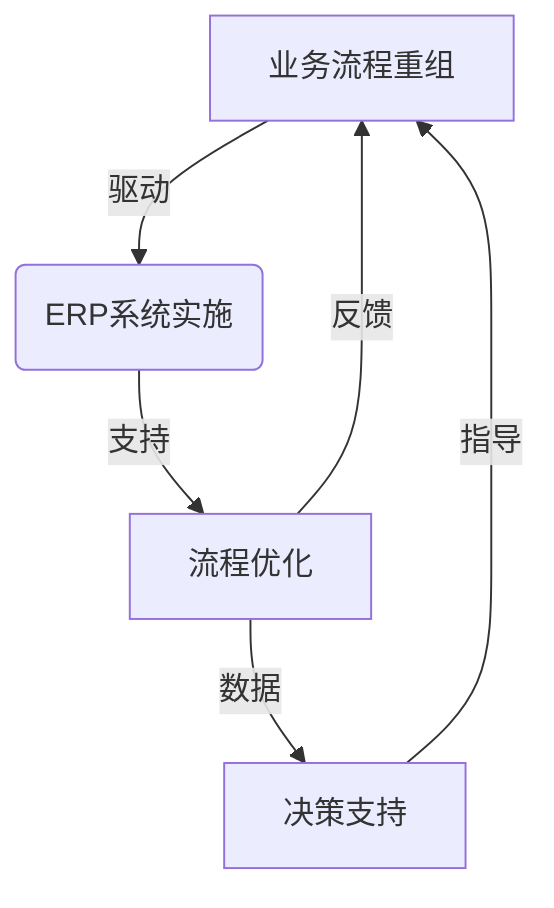

# "企业资源计划(ERP)在业务流程重组中的关键角色"

## 1.背景介绍

在当今瞬息万变的商业环境中,企业必须保持敏捷和高效,以应对日益激烈的市场竞争。业务流程重组(Business Process Reengineering,BPR)作为一种管理策略,旨在彻底重新思考和重新设计企业的业务流程,以实现显著的绩效提升。在这一背景下,企业资源计划(Enterprise Resource Planning,ERP)系统作为一种集成的企业信息系统,在业务流程重组中扮演着关键角色。

### 1.1 业务流程重组的概念

业务流程重组是一种从根本上重新思考和彻底重新设计业务流程的方法,旨在实现企业绩效的根本性改进,如降低成本、提高质量、缩短周期时间等。它不同于传统的流程改进,后者只是在现有流程的基础上进行渐进式的调整和改善。

### 1.2 ERP系统的作用

ERP系统是一种跨职能的企业管理信息系统,能够集成企业内部和外部的信息流,实现企业资源的高效配置和优化利用。它通过整合企业的核心业务流程,提供实时的数据共享和决策支持,从而提高企业的运营效率和竞争力。

## 2.核心概念与联系  

### 2.1 业务流程与ERP系统

业务流程是指企业为实现特定目标而执行的一系列有序活动。ERP系统则是一种支持和优化这些业务流程的信息系统。在业务流程重组中,ERP系统扮演着至关重要的角色,它能够:

1. 提供流程可视化和模拟工具,帮助企业识别和优化关键业务流程。
2. 实现跨部门的数据集成和信息共享,消除信息孤岛,提高协作效率。
3. 通过标准化和自动化流程,减少人工干预,降低错误率和浪费。
4. 提供实时的数据分析和决策支持,促进敏捷响应和持续改进。

### 2.2 ERP系统与业务流程重组的关系

ERP系统和业务流程重组之间存在着紧密的联系和相互影响。一方面,ERP系统为业务流程重组提供了必要的技术支持和数据基础;另一方面,业务流程重组也为ERP系统的实施和优化提供了机会和动力。

这种关系可以用下面的 Mermaid 流程图来表示:



## 3.核心算法原理具体操作步骤

在业务流程重组中,ERP系统通常遵循以下核心算法原理和操作步骤:

### 3.1 流程建模和分析

1. 绘制当前业务流程图(As-Is),识别流程中的瓶颈和低效环节。
2. 利用流程模拟工具(如ARIS等)对当前流程进行模拟和分析,评估改进空间。
3. 结合最佳实践和行业标准,设计理想的目标流程(To-Be)。

### 3.2 系统配置和集成

1. 根据目标流程,在ERP系统中配置相应的业务流程和规则。
2. 整合企业内外部的数据源,实现信息共享和一体化管理。
3. 建立统一的数据标准和编码体系,消除数据不一致性。

### 3.3 流程自动化和优化

1. 将重新设计的流程在ERP系统中自动化,减少人工干预。
2. 持续监控流程执行情况,识别新的瓶颈和改进机会。
3. 利用ERP系统提供的分析工具,优化资源配置和决策制定。

### 3.4 变更管理和持续改进

1. 建立变更管理机制,有序地实施流程和系统变更。
2. 培养员工的变革意识,提高参与度和适应能力。
3. 持续收集反馈,不断优化流程和系统,形成改进闭环。

## 4.数学模型和公式详细讲解举例说明

在业务流程重组中,ERP系统常常需要利用数学模型和公式来优化资源配置、评估流程效率等。以下是一些常见的数学模型和公式:

### 4.1 排队理论模型

排队理论模型可用于分析和优化服务流程,如客户服务中心、生产线等。常见的公式包括:

$$
L = \lambda W \\
W = \frac{W_q}{1-\rho} \\
W_q = \frac{\rho W}{1-\rho}
$$

其中:
- $L$表示系统长度(排队长度+正在服务的个数)
- $\lambda$表示到达率(单位时间内到达的个数)
- $W$表示在系统中的总体等待时间
- $W_q$表示排队等待时间
- $\rho = \lambda/\mu$表示系统利用率($\mu$为服务率)

通过调整服务率或到达率,可以优化等待时间和系统利用率。

### 4.2 线性规划模型

线性规划模型可用于求解资源配置、产品组合等优化问题。基本模型如下:

$$
\begin{aligned}
\max\ &z = c_1x_1 + c_2x_2 + \cdots + c_nx_n\\
\text{s.t.}\ &a_{11}x_1 + a_{12}x_2 + \cdots + a_{1n}x_n \leq b_1\\
&a_{21}x_1 + a_{22}x_2 + \cdots + a_{2n}x_n \leq b_2\\
&\cdots\\
&a_{m1}x_1 + a_{m2}x_2 + \cdots + a_{mn}x_n \leq b_m\\
&x_1, x_2, \cdots, x_n \geq 0
\end{aligned}
$$

其中:
- $z$表示目标函数(如利润、成本等)
- $x_i$表示决策变量(如产品产量等)
- $c_i$表示每单位决策变量对目标函数的贡献
- $a_{ij}$表示每单位决策变量对第$i$个约束条件的影响
- $b_i$表示第$i$个约束条件的右侧常数项

通过求解该模型,可以得到在给定约束条件下,目标函数的最优解。

### 4.3 仿真模型

对于复杂的业务流程,可以使用仿真模型来分析和优化。常见的仿真方法包括离散事件仿真(DES)、系统动力学(SD)等。

以DES为例,其核心思想是将系统看作一系列有序的事件序列,并模拟这些事件在系统中的传播过程。通过建立数学模型并进行计算机仿真,可以评估各种参数对系统性能的影响,从而优化流程设计。

## 5.项目实践:代码实例和详细解释说明

为了更好地理解ERP系统在业务流程重组中的应用,我们以一个实际项目为例,展示相关的代码实现和详细解释。

### 5.1 项目背景

某制造企业希望优化其产品生产流程,提高效率和产品质量。该企业已经实施了ERP系统,并决定利用ERP系统的功能来重新设计生产流程。

### 5.2 流程建模(Python代码)

我们首先使用Python和流程建模库(如pm4py)来绘制当前的生产流程图:

```python
import pm4py

# 导入事件日志数据
log = pm4py.read_xes("production_log.xes")

# 发现流程模型
net, im, fm = pm4py.discover_petri_net_inductive(log)

# 可视化流程模型
pm4py.view_petri_net(net, im, fm, format="png", fname="as-is.png")
```

这段代码从事件日志数据中发现当前的生产流程模型,并将其可视化为PNG图像文件。通过分析这个流程模型,我们可以识别出潜在的瓶颈和改进空间。

### 5.3 流程优化(BPMN代码)

接下来,我们使用BPMN(Business Process Model and Notation)标准来设计优化后的目标流程。以下是一个简化的BPMN示例(使用bpmn-js库):

```xml
<?xml version="1.0" encoding="UTF-8"?>
<bpmn:definitions xmlns:bpmn="http://www.omg.org/spec/BPMN/20100524/MODEL" xmlns:bpmndi="http://www.omg.org/spec/BPMN/20100524/DI" xmlns:dc="http://www.omg.org/spec/DD/20100524/DC" xmlns:di="http://www.omg.org/spec/DD/20100524/DI" id="Definitions_1" targetNamespace="http://bpmn.io/schema/bpmn">
  <bpmn:process id="Process_1" isExecutable="false">
    <bpmn:startEvent id="StartEvent_1"/>
    <bpmn:task id="Task_1" name="原材料采购"/>
    <bpmn:parallelGateway id="ParallelGateway_1"/>
    <bpmn:task id="Task_2" name="生产线A"/>
    <bpmn:task id="Task_3" name="生产线B"/>
    <bpmn:parallelGateway id="ParallelGateway_2"/>
    <bpmn:task id="Task_4" name="质量检测"/>
    <bpmn:exclusiveGateway id="ExclusiveGateway_1" default="Flow_5"/>
    <bpmn:endEvent id="EndEvent_1"/>
    <!-- 流程连线定义 -->
  </bpmn:process>
  <bpmndi:BPMNDiagram id="BPMNDiagram_1">
    <!-- 图形元素定义 -->
  </bpmndi:BPMNDiagram>
</bpmn:definitions>
```

这个BPMN模型定义了一个优化后的生产流程,包括原材料采购、并行生产线、质量检测和相关网关。通过可视化建模工具,我们可以与业务人员进行讨论和调整,直到达成一致。

### 5.4 系统集成(Java代码)

优化后的流程需要在ERP系统中进行配置和自动化