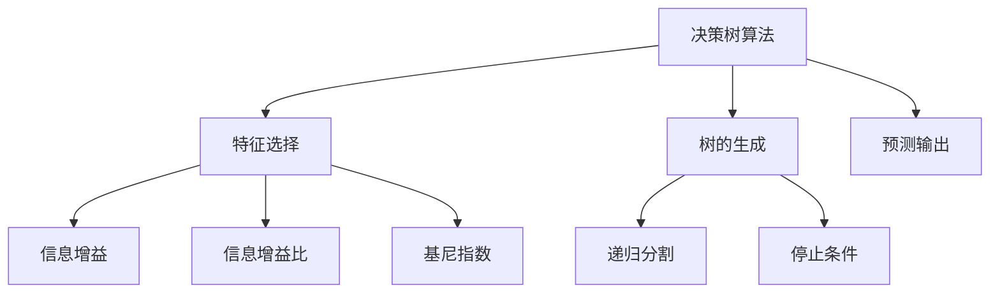
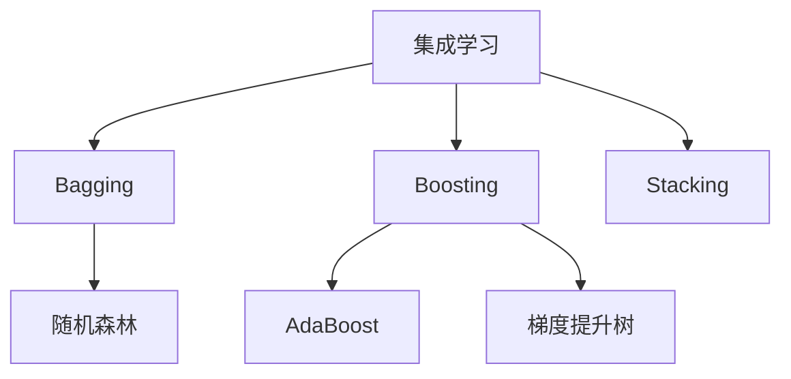
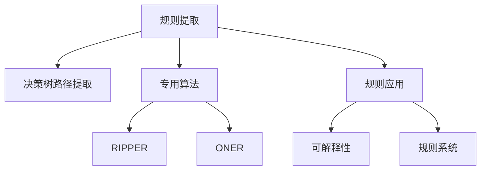

# 决策树与规则提取原理与代码实战案例讲解

## 1.背景介绍

在当今数据主导的时代,机器学习已经渗透到各个领域,成为驱动人工智能发展的核心力量。作为监督学习中最常用和最成功的技术之一,决策树及其衍生算法在分类和回归任务中发挥着重要作用。决策树的优势在于模型具有很好的可解释性,可以清晰地展现特征与目标值之间的决策逻辑,并以可视化的树状结构呈现,易于人类理解。

与黑盒模型(如深度神经网络)相比,决策树模型的决策过程是透明的,能够解释每一步决策的原因,这在一些对可解释性要求较高的领域(如医疗、金融等)尤为重要。此外,决策树算法对数据的前期假设较少,可以直接处理数值型和类别型特征,无需复杂的特征工程,使其具有广泛的适用性。

然而,单一决策树存在过拟合的风险,泛化性能往往不佳。为了提高模型的准确性和鲁棒性,集成学习方法应运而生,其中最著名的当属随机森林和梯度提升树算法。这些算法通过构建多棵决策树并对它们的预测结果进行合并,有效降低了过拟合风险,显著提升了模型的性能表现。

除了用于预测之外,决策树及其集成算法还可以用于规则提取。通过分析训练好的模型,可以提取出一系列 "IF-THEN" 形式的可解释规则,这些规则不仅能够解释模型的决策过程,还可以直接应用于一些规则驱动的系统中。规则提取技术为人工智能系统的可解释性提供了新的途径,有助于提高人们对模型的信任度。

## 2.核心概念与联系

### 2.1 决策树

决策树是一种有监督的机器学习算法,它以树状结构来表示对实例进行分类或回归的决策过程。决策树由节点和有向边组成,其中内部节点表示对特征的测试,分支代表测试的输出,而叶节点则代表了最终的决策结果。

在构建决策树时,算法会根据特征的信息增益或其他指标,选择最优的特征及其分割点,将训练数据分成两个或多个子集。这个过程会递归地重复,直到满足某些停止条件(如达到最大深度、节点纯度足够高等)。最终生成的决策树能够对新的实例进行预测,只需要从根节点开始,根据实例的特征值沿着树枝一直走到叶节点即可得到预测结果。

常用的决策树算法包括ID3、C4.5、CART等。其中,ID3算法使用信息增益作为选择特征的标准,C4.5算法则使用信息增益比,CART算法则基于基尼指数进行特征选择。这些算法在处理离散特征和连续特征上也有所不同。



### 2.2 集成学习

单一决策树容易过拟合,泛化能力有限。为了提高决策树模型的性能,集成学习(Ensemble Learning)方法应运而生。集成学习的核心思想是通过构建并结合多个基础模型来完成学习任务,从而获得比单个模型更佳的性能表现。

常见的集成算法包括:

- **Bagging(Bootstrap Aggregating)**:通过自助采样法(Bootstrapping)从原始训练集中有放回地抽取多个子集,分别在每个子集上训练一个基础模型,最后将所有基础模型的预测结果进行平均或投票,得到最终预测结果。代表算法为随机森林(Random Forest)。

- **Boosting**:基础模型是按序构建的,后面的模型会加大对前面模型错分样本的权重,使得新模型能够更好地预测这些难以分类的样本。代表算法为AdaBoost和梯度提升树(GBDT)。

- **Stacking**:先在原始训练集上训练出多个基础模型,然后使用这些基础模型的预测结果作为新的特征,再训练一个高级模型来对基础模型的预测结果进行集成。

通过集成多个基础模型,集成算法能够显著降低过拟合风险,提高决策树模型在未知数据上的泛化能力。



### 2.3 规则提取

决策树及其集成模型本身就具有很好的可解释性,但是对于复杂的模型,直接解释整个树状结构并不容易。因此,我们可以从训练好的模型中提取出一系列 "IF-THEN" 形式的可解释规则,以更清晰地展现模型的决策逻辑。

规则提取的基本思路是遍历决策树(或树集合),从根节点到叶节点的每一条路径就对应一条规则。例如,对于一个预测是否发生信用卡欺诈的决策树模型,可能会得到如下规则:

```
IF 交易金额 > 1000 AND 交易时间 = 夜间 THEN 欺诈 = True
IF 交易金额 <= 1000 AND IP地址 != 常用地址 THEN 欺诈 = True 
...
```

除了直接从决策树中提取规则外,还可以使用专门的规则提取算法,如RIPPER、ONER等,通过对训练数据进行采样和优化,生成一组简洁而高效的规则集。

提取出的规则集不仅能够解释模型的决策过程,还可以直接应用于一些规则驱动的系统中,如专家系统、推理引擎等,从而扩展了机器学习模型的应用场景。



## 3.核心算法原理具体操作步骤

在这一部分,我们将详细介绍决策树算法的核心原理,以及如何构建一棵决策树。我们将以 ID3 算法为例进行说明,因为它是最经典和最容易理解的决策树算法之一。

### 3.1 信息熵与信息增益

在构建决策树之前,我们首先需要了解信息熵(Entropy)和信息增益(Information Gain)的概念。

**信息熵**用于度量数据集的无序程度或不确定性。对于一个包含 k 个类别的数据集 D,其信息熵定义为:

$$Ent(D) = -\sum_{i=1}^{k} p_i \log_2 p_i$$

其中,$ p_i $表示 D 中属于第 i 个类别的比例。信息熵的取值范围为 [0, 1],当数据集中只有一个类别时,信息熵为 0;当各个类别的比例相等时,信息熵达到最大值。

**信息增益**则用于度量通过选择某个特征进行分割后,数据集的无序程度减少了多少。对于特征 A,其信息增益定义为:

$$Gain(D, A) = Ent(D) - \sum_{v=1}^{V} \frac{|D^v|}{|D|} Ent(D^v)$$

其中,V 是特征 A 的可取值个数,$ D^v $表示 D 中特征 A 取值为 v 的子集,$ |D^v| / |D| $是该子集的权重。

在构建决策树时,我们希望选择信息增益最大的特征进行分割,因为这样可以最大程度地减少数据集的无序程度,从而得到更好的分类效果。

### 3.2 ID3 算法步骤

ID3 算法的核心步骤如下:

1. **创建根节点**:根据整个训练数据集计算各个特征的信息增益,选择信息增益最大的特征作为根节点。

2. **构建内部节点**:对于根节点的每个分支(即该特征的每个可取值),创建一个内部节点,并将数据集按照该分支进行划分。

3. **生成叶节点或内部节点**:对于每个内部节点的子集:
   - 如果该子集中所有实例属于同一类别,则创建一个叶节点,标记为该类别。
   - 如果该子集为空,则创建一个叶节点,标记为训练集中最多的类别。
   - 否则,计算该子集中各个特征的信息增益,选择增益最大的特征作为该内部节点的分裂特征,并按照该特征的取值创建子节点。

4. **递归构建树**:对于每个新创建的内部节点,重复步骤 3,直到所有节点都是叶节点为止。

以下是一个简单的 ID3 算法示例:

```python
from math import log2

def calc_entropy(data):
    """计算数据集的信息熵"""
    label_counts = {}
    for instance in data:
        label = instance[-1]  # 假设最后一列是标签
        if label not in label_counts:
            label_counts[label] = 0
        label_counts[label] += 1
    
    entropy = 0
    for count in label_counts.values():
        prob = count / len(data)
        entropy -= prob * log2(prob)
    
    return entropy

def calc_info_gain(data, feature_index):
    """计算特征的信息增益"""
    entropy_before = calc_entropy(data)
    feature_values = set([instance[feature_index] for instance in data])
    weighted_entropy = 0
    for value in feature_values:
        subset = [instance for instance in data if instance[feature_index] == value]
        prob = len(subset) / len(data)
        weighted_entropy += prob * calc_entropy(subset)
    
    info_gain = entropy_before - weighted_entropy
    return info_gain

def id3(data, features):
    """ID3 算法实现"""
    # 如果数据集中所有实例属于同一类别,则返回该类别
    labels = set([instance[-1] for instance in data])
    if len(labels) == 1:
        return labels.pop()
    
    # 如果特征集为空,则返回数据集中最多的类别
    if not features:
        label_counts = {}
        for label in labels:
            label_counts[label] = 0
        for instance in data:
            label_counts[instance[-1]] += 1
        return max(label_counts, key=label_counts.get)
    
    # 选择信息增益最大的特征作为分裂特征
    best_feature = None
    max_info_gain = 0
    for feature_index in features:
        info_gain = calc_info_gain(data, feature_index)
        if info_gain > max_info_gain:
            max_info_gain = info_gain
            best_feature = feature_index
    
    # 创建根节点
    root = {best_feature: {}}
    
    # 递归构建决策树
    feature_values = set([instance[best_feature] for instance in data])
    for value in feature_values:
        subset = [instance for instance in data if instance[best_feature] == value]
        new_features = features.copy()
        new_features.remove(best_feature)
        subtree = id3(subset, new_features)
        root[best_feature][value] = subtree
    
    return root
```

上述代码实现了 ID3 算法的核心逻辑,包括计算信息熵、信息增益,以及递归构建决策树。需要注意的是,这只是一个简化版本,在实际应用中可能还需要考虑连续特征的处理、剪枝等问题。

## 4.数学模型和公式详细讲解举例说明

在前面的章节中,我们已经介绍了信息熵和信息增益的概念,它们是构建决策树算法的核心数学模型。在这一部分,我们将更深入地探讨它们的数学细节,并通过具体的例子来说明它们的计算过程。

### 4.1 信息熵

信息熵(Entropy)是信息论中的一个基本概念,用于度量随机变量的不确定性。在决策树算法中,我们将数据集中的类别标签视为一个随机变量,通过计算其信息熵来衡量数据集的无序程度。

对于一个包含 k 个类别的数据集 D,其信息熵的公式为:

$$Ent(D) = -\sum_{