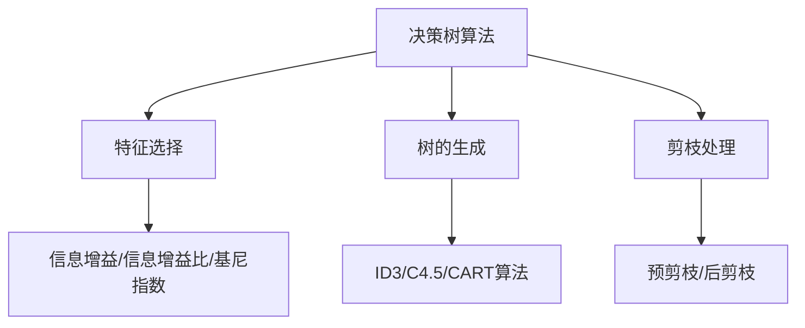
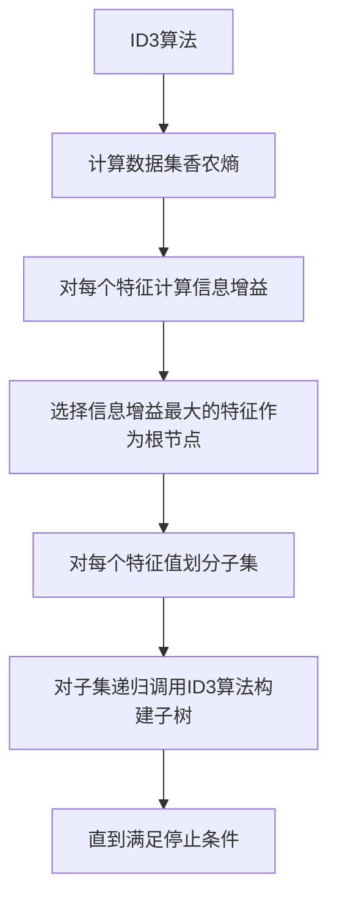

# 决策树算法在智能客服系统中的实战应用

## 1.背景介绍

### 1.1 智能客服系统的重要性

随着互联网技术和人工智能的飞速发展,越来越多的企业开始将注意力转移到提供优质客户服务体验上。传统的人工客服存在成本高、效率低下、服务质量参差不齐等诸多问题。因此,智能客服系统(Intelligent Customer Service System)应运而生,它利用自然语言处理、机器学习等人工智能技术,能够自动理解客户的问题,并给出相应的解决方案,大大提高了客户服务的效率和质量。

### 1.2 决策树算法在智能客服系统中的作用

在智能客服系统中,决策树算法扮演着非常重要的角色。它可以根据客户提出的问题及相关信息,按照预先设定的决策规则,自动生成分类树,将客户问题分类到特定的类别,从而为客户推荐合适的解决方案。决策树算法具有可解释性强、计算高效等优点,非常适合应用于智能客服场景。

## 2.核心概念与联系

### 2.1 决策树算法概述

决策树(Decision Tree)是一种基于树形结构的监督学习算法,它通过不断地将数据集按照特征值进行分割,构建出一个树状决策模型。这个模型可以用于分类或回归任务。决策树算法的核心思想是:根据训练数据集中样本的特征属性值,递归地构建一个决策树模型,使得每个叶节点都属于同一个类别。

### 2.2 决策树在智能客服系统中的应用

在智能客服场景中,我们可以将客户提问作为样本输入,客户问题的类别作为样本标签,客户问题中包含的关键词、上下文信息等作为特征属性,基于这些数据训练一个决策树分类器模型。当新的客户提问到来时,将其输入到训练好的决策树模型中,模型会根据问题的特征属性值,按照树的结构一步步进行分类,最终将问题归类到某个特定的类别,从而为客户推荐对应的解决方案。

## 3.核心算法原理具体操作步骤

决策树算法的核心步骤包括:特征选择、决策树的生成和决策树的剪枝。下面将详细介绍这三个步骤的具体原理和操作流程。

### 3.1 特征选择

特征选择是决策树算法中一个非常关键的步骤。它的目标是选择出对数据集进行分类时"增益"最大的特征作为决策树节点,使得训练数据集在该节点上被分割后,子节点的"纯度"更高。常用的特征选择标准有:

1. **信息增益(Information Gain)**

   信息增益是基于信息论中的信息熵来度量的。设有 $K$ 个类,样本点属于第 $k$ 类的概率为 $p_k$,则数据集 $D$ 的信息熵为:

   $$Ent(D) = -\sum_{k=1}^{K}p_k\log_2p_k$$

   对于特征 $A$,其可能取值有 $V$ 个,如果使用 $A$ 来对样本集 $D$ 进行划分,则会产生 $V$ 个分支节点,使得数据集被划分为 $V$ 个子集 $D_1,D_2,...,D_V$,于是在特征 $A$ 上的信息增益为:

   $$Gain(A) = Ent(D) - \sum_{v=1}^{V}\frac{|D_v|}{|D|}Ent(D_v)$$

   信息增益越大,意味着使用特征 $A$ 对数据集进行划分所获得的"纯度提升"越大。

2. **信息增益比(Information Gain Ratio)**

   信息增益比是对信息增益进行一定修正,它体现了分割时信息的增加程度。定义如下:

   $$GainRatio(A) = \frac{Gain(A)}{IV(A)}$$

   其中, $IV(A)$ 为分裂数据集 $D$ 的固有值(Intrinsic Value),表示对数据集 $D$ 进行随机划分所获得的信息量的定义为:

   $$IV(A) = -\sum_{v=1}^{V}\frac{|D_v|}{|D|}\log_2\frac{|D_v|}{|D|}$$

3. **基尼指数(Gini Index)**

   基尼指数用于度量一个数据集的不纯度,定义如下:

   $$Gini(D) = 1 - \sum_{k=1}^{K}p_k^2$$

   其中, $p_k$ 为数据集 $D$ 中属于第 $k$ 类的比例。基尼指数越小,数据集的不纯度就越小。

   对于特征 $A$,其基尼指数为:

   $$GiniIndex(A) = \sum_{v=1}^{V}\frac{|D_v|}{|D|}Gini(D_v)$$

   选择基尼指数最小的特征作为分裂特征。

通过计算每个特征的信息增益、信息增益比或基尼指数,选择增益最大或基尼指数最小的特征作为当前节点的分裂特征。

### 3.2 决策树的生成

决策树的生成算法包括 ID3、C4.5、CART 等,它们的基本思路是:从根节点开始,对每个节点根据特征选择标准选择最优分裂特征,生成子节点,递归地对子节点进行相同的操作,直到所有样本属于同一类别或满足其他停止条件为止。

以 ID3 算法为例,其生成决策树的步骤如下:

1. 计算数据集 $D$ 的香农熵 $Ent(D)$
2. 对每个特征 $A$,计算其信息增益 $Gain(A)$
3. 选择信息增益最大的特征 $A_g$,以 $A_g$ 为根节点
4. 对 $A_g$ 的每个值 $a_i$,将 $D$ 划分为若干个子集 $D_i$
5. 对每个子集 $D_i$,递归地调用 ID3 算法,构建子树
6. 直到所有实例属于同一类别,或没有剩余特征可供划分为止

### 3.3 决策树的剪枝

为了防止决策树过拟合训练数据,我们需要对生成的决策树进行剪枝操作。剪枝分为预剪枝(Pre-Pruning)和后剪枝(Post-Pruning)两种方式:

1. **预剪枝**

   在生成决策树的过程中,对每个节点在选择最优特征进行分裂时,先对分裂的数据集进行估计,若分裂不能对最终正确分类结果产生有益的影响,则停止分裂,将该节点视为叶节点。常用的估计方法有:

   - 统计显著性检验
   - 成本复杂度剪枝

2. **后剪枝**

   首先生成一棵完整的决策树,然后自底向上地对非叶节点进行剪枝,决定是否将该节点及其子树进行剪枝。判断标准通常是:

   - 如果将该节点剪枝后,不会使决策树的分类能力显著下降,则进行剪枝
   - 如果剪枝后,决策树在验证集上的精度提高,则进行剪枝

   后剪枝的优点是不会过早停止决策树的生长,但缺点是生成过程较为耗时。

剪枝操作能够有效避免过拟合,提高决策树在新数据上的泛化能力。

## 4.数学模型和公式详细讲解举例说明

在前面的内容中,我们已经介绍了信息增益、信息增益比和基尼指数等特征选择标准的公式,下面将通过具体的例子来详细说明这些公式的计算过程和含义。

### 4.1 信息增益的计算示例

假设我们有一个天气数据集,用于预测当天是否适合去野营。数据集包含 5 个特征:阴晴(Outlook)、温度(Temperature)、湿度(Humidity)、风力(Wind)和是否适合野营(Play)。

|  Outlook  | Temperature | Humidity | Wind | Play |
|:---------:|:-----------:|:--------:|:----:|:----:|
|    Sunny  |     Hot     |   High   | Weak | No   |
|    Sunny  |     Hot     |   High   | Strong| No  |
|  Overcast |     Hot     |   High   | Weak | Yes |
|    Rain   |    Mild     |   High   | Weak | Yes |
|    Rain   |    Cool     |  Normal  | Weak | Yes |
|    Rain   |    Cool     |  Normal  | Strong| No  |
|  Overcast |    Cool     |  Normal  | Strong| Yes |
|    Sunny  |    Mild     |   High   | Weak | No   |
|    Sunny  |    Cool     |  Normal  | Weak | Yes |
|    Rain   |    Mild     |  Normal  | Weak | Yes |
|    Sunny  |    Mild     |  Normal  | Strong| Yes |
|  Overcast |    Mild     |   High   | Strong| Yes |
|  Overcast |     Hot     |  Normal  | Weak | Yes |
|    Rain   |    Mild     |   High   | Strong| No  |

我们先计算整个数据集的信息熵:

$$\begin{aligned}
Ent(D) &= -\sum_{k=1}^{K}p_k\log_2p_k\\
       &= -\frac{9}{14}\log_2\frac{9}{14} - \frac{5}{14}\log_2\frac{5}{14}\\
       &\approx 0.94
\end{aligned}$$

其中, $p_1 = \frac{9}{14}$ 为适合野营的概率, $p_2 = \frac{5}{14}$ 为不适合野营的概率。

接下来,我们计算使用特征"Outlook"对数据集进行分割时的信息增益:

$$\begin{aligned}
Gain(Outlook) &= Ent(D) - \sum_{v=1}^{V}\frac{|D_v|}{|D|}Ent(D_v)\\
              &= 0.94 - \frac{5}{14}\times0 - \frac{4}{14}\times0 - \frac{5}{14}\times0.97\\
              &\approx 0.69
\end{aligned}$$

其中, $V=3$ 为特征"Outlook"的可取值个数。$D_1$ 为 Outlook=Sunny 的子集,包含 5 个样本,其中 2 个为 Yes,3 个为 No,因此 $Ent(D_1)=0$。$D_2$ 为 Outlook=Overcast 的子集,包含 4 个样本,全部为 Yes,因此 $Ent(D_2)=0$。$D_3$ 为 Outlook=Rain 的子集,包含 5 个样本,其中 3 个为 Yes,2 个为 No,因此 $Ent(D_3)\approx0.97$。

我们可以类似地计算使用其他特征进行分割时的信息增益,并选择增益最大的特征作为当前节点的分裂特征。

通过这个例子,我们可以看到,信息增益实际上反映了使用某个特征对数据集进行分割后,数据集的"纯度"提升的程度。信息增益越大,意味着使用该特征进行分割后,子节点的不确定性越小,数据越"纯"。

### 4.2 信息增益比的计算示例

我们继续使用上面的天气数据集,计算使用特征"Outlook"进行分割时的信息增益比:

$$\begin{aligned}
GainRatio(Outlook) &= \frac{Gain(Outlook)}{IV(Outlook)}\\
                   &= \frac{0.69}{-\sum_{v=1}^{3}\frac{|D_v|}{|D|}\log_2\frac{|D_v|}{|D|}}\\
                   &= \frac{0.69}{-\frac{5}{14}\log_2\frac{5}{14} - \frac{4}{14}\log_2\frac{4}{14} - \frac{5}{14}\log_2\frac{5