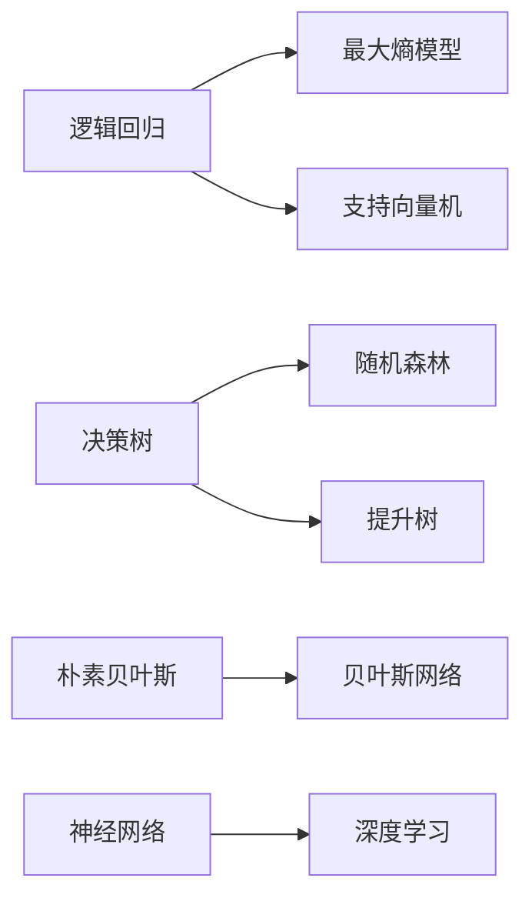

# 分类(Classification) - 原理与代码实例讲解

## 1. 背景介绍
### 1.1 分类的定义与意义
分类是机器学习和数据挖掘领域中的一项重要任务,旨在根据数据的特征将其划分到预定义的类别或组中。分类在许多实际应用中发挥着关键作用,如垃圾邮件检测、情感分析、图像识别等。通过学习历史数据的特征和对应的类别标签,分类模型能够对新的未知数据进行预测,自动判断其所属的类别。

### 1.2 分类问题的类型
分类问题可分为二分类和多分类两大类:  
- 二分类(Binary Classification):将样本划分为两个互斥的类别,如垃圾邮件检测(垃圾邮件/正常邮件)、医疗诊断(患病/未患病)等。
- 多分类(Multi-class Classification):将样本划分为三个或更多个类别,如手写数字识别(0-9十个类别)、新闻分类(体育、娱乐、政治等多个主题)等。

### 1.3 分类算法概览
常见的分类算法包括:
- 逻辑回归(Logistic Regression) 
- 决策树(Decision Tree)
- 支持向量机(Support Vector Machine, SVM)
- 朴素贝叶斯(Naive Bayes)
- K最近邻(K-Nearest Neighbors, KNN)
- 神经网络(Neural Networks)
- 集成学习(Ensemble Learning):如随机森林(Random Forest)、梯度提升决策树(Gradient Boosting Decision Tree, GBDT)等

不同的分类算法在模型复杂度、训练效率、泛化能力等方面各有优劣。算法的选择需要根据具体问题的特点、数据规模、对可解释性的要求等因素综合考虑。

## 2. 核心概念与联系
### 2.1 特征(Feature)
特征是描述数据属性的变量,是分类模型的基本输入。特征可分为数值型(如身高、体重)和类别型(如性别、血型)两类。特征选择和特征工程旨在从原始数据中提取出最具判别力的特征子集,去除冗余和无关特征,提高分类性能。

### 2.2 类别标签(Class Label) 
类别标签代表了样本的真实类别,是分类模型的期望输出。在监督学习中,训练数据需要包含特征和对应的类别标签。类别标签可以是二元的(二分类)或多元的(多分类)。

### 2.3 训练集(Training Set)与测试集(Test Set)
为了评估模型的泛化性能,通常将数据划分为训练集和测试集两部分。训练集用于模型的学习和参数估计,测试集用于模型性能的评估。测试样本应独立于训练样本,以免过拟合。常见的划分方法有留出法(Hold-out)、交叉验证(Cross Validation)等。

### 2.4 分类器(Classifier)
分类器是根据训练数据学习得到的模型,用于对新样本进行预测。分类器的性能通过测试集上的评估指标(如准确率、精确率、召回率、F1值等)来衡量。一个理想的分类器应能很好地拟合训练数据,同时又具备良好的泛化能力,避免过拟合和欠拟合。

### 2.5 损失函数(Loss Function)
损失函数衡量了模型预测值与真实值之间的差异,是模型优化的目标函数。常见的分类损失函数包括交叉熵损失(Cross Entropy Loss)、合页损失(Hinge Loss)等。模型通过最小化损失函数来调整参数,不断拟合训练数据。

### 2.6 评估指标(Evaluation Metric)
评估指标用于量化分类模型的性能表现。常见的评估指标包括:
- 准确率(Accuracy):正确预测的样本数占总样本数的比例
- 精确率(Precision):真正例中预测正确的比例 
- 召回率(Recall):真实正例中预测为正例的比例
- F1值(F1-score):精确率和召回率的调和平均
- ROC曲线和AUC值:反映不同阈值下的分类器性能

不同的评估指标侧重点有所不同,需要根据问题的特点和业务需求进行选择。

### 2.7 过拟合(Overfitting)与欠拟合(Underfitting)
- 过拟合是指模型过于复杂,过度拟合训练数据中的噪声和特异点,导致在测试集上泛化性能下降。
- 欠拟合是指模型过于简单,无法很好地捕捉数据的内在规律,在训练集和测试集上都表现不佳。

为了避免过拟合和欠拟合,可采取如下策略:
- 增大训练集,提供更多的样本
- 特征选择,去除冗余和无关特征
- 正则化,限制模型复杂度
- 集成学习,结合多个弱学习器

### 2.8 分类算法之间的联系
下图展示了几种常见分类算法之间的联系:

可以看出,一些算法之间存在着演化和借鉴的关系。例如,逻辑回归可看作是最大熵模型的特例,而支持向量机则在此基础上引入了核技巧。决策树则是随机森林和提升树的基本组件。不同算法的思想可以相互启发,形成新的算法。

## 3. 核心算法原理与具体步骤
下面以逻辑回归和决策树为例,介绍其核心原理和具体步骤。

### 3.1 逻辑回归(Logistic Regression)
#### 3.1.1 二元逻辑回归
对于二分类问题,逻辑回归通过Sigmoid函数将线性回归的输出映射到(0,1)区间,得到样本属于正类的概率。

设$\boldsymbol{x} = (x_1,x_2,\cdots,x_n)$为样本的特征向量,$y \in \{0,1\}$为样本的类别标签。逻辑回归模型的假设函数为:

$$
h_{\boldsymbol{w}}(\boldsymbol{x}) = \sigma(\boldsymbol{w}^T\boldsymbol{x}) = \frac{1}{1+e^{-\boldsymbol{w}^T\boldsymbol{x}}}
$$

其中$\boldsymbol{w} = (w_1,w_2,\cdots,w_n)$为模型的权重向量。对数似然函数为:

$$
\mathcal{L}(\boldsymbol{w}) = \sum_{i=1}^{m} \left[ y^{(i)}\log h_{\boldsymbol{w}}(\boldsymbol{x}^{(i)}) + (1-y^{(i)})\log (1-h_{\boldsymbol{w}}(\boldsymbol{x}^{(i)})) \right]
$$

通过最大化对数似然函数(等价于最小化交叉熵损失)来估计模型参数:

$$
\boldsymbol{w}^* = \arg\max_{\boldsymbol{w}} \mathcal{L}(\boldsymbol{w})
$$

求解过程通常采用梯度上升法或拟牛顿法等优化算法。

#### 3.1.2 多元逻辑回归
对于多分类问题,可将二元逻辑回归扩展为多元逻辑回归。设类别数为$K$,引入$K$个权重向量$\boldsymbol{w}_1,\boldsymbol{w}_2,\cdots,\boldsymbol{w}_K$,假设函数为:

$$
h_{\boldsymbol{w}}(\boldsymbol{x}) = \begin{bmatrix}
P(y=1|\boldsymbol{x};\boldsymbol{w}) \\
P(y=2|\boldsymbol{x};\boldsymbol{w}) \\
\vdots \\
P(y=K|\boldsymbol{x};\boldsymbol{w})
\end{bmatrix} = \frac{1}{\sum_{k=1}^{K} e^{\boldsymbol{w}_k^T\boldsymbol{x}}} \begin{bmatrix}
e^{\boldsymbol{w}_1^T\boldsymbol{x}} \\
e^{\boldsymbol{w}_2^T\boldsymbol{x}} \\
\vdots \\
e^{\boldsymbol{w}_K^T\boldsymbol{x}}
\end{bmatrix}
$$

其中$P(y=k|\boldsymbol{x};\boldsymbol{w})$表示样本$\boldsymbol{x}$属于第$k$类的概率。对数似然函数为:

$$
\mathcal{L}(\boldsymbol{w}) = \sum_{i=1}^{m} \sum_{k=1}^{K} I(y^{(i)}=k) \log P(y^{(i)}=k|\boldsymbol{x}^{(i)};\boldsymbol{w})
$$

其中$I(y^{(i)}=k)$为示性函数,当$y^{(i)}=k$时取1,否则取0。同样通过最大化对数似然函数来估计模型参数。

#### 3.1.3 逻辑回归算法步骤
1. 数据预处理:对特征进行归一化、缺失值处理等。
2. 初始化模型参数$\boldsymbol{w}$。
3. 计算当前参数下的对数似然函数值。
4. 计算对数似然函数关于$\boldsymbol{w}$的梯度。
5. 使用优化算法(如梯度上升、拟牛顿法)更新$\boldsymbol{w}$。
6. 重复步骤3-5,直到对数似然函数收敛或达到最大迭代次数。
7. 返回学习到的模型参数$\boldsymbol{w}^*$。
8. 使用学习到的模型对新样本进行预测。

### 3.2 决策树(Decision Tree)
决策树通过递归地选择最优划分特征,生成一棵树形结构的分类器。

#### 3.2.1 特征选择
决策树的关键在于如何选择最优划分特征。常用的特征选择准则有信息增益、信息增益比和基尼指数等。

以信息增益为例,设样本集合为$D$,类别数为$K$。信息熵定义为:

$$
H(D) = -\sum_{k=1}^{K} \frac{|C_k|}{|D|} \log_2 \frac{|C_k|}{|D|}
$$

其中$|C_k|$为属于第$k$类的样本数,$|D|$为总样本数。

设特征$A$有$V$个可能的取值$\{a_1,a_2,\cdots,a_V\}$,根据$A$的取值将$D$划分为$V$个子集$\{D_1,D_2,\cdots,D_V\}$。$A$对$D$的信息增益定义为:

$$
g(D,A) = H(D) - \sum_{v=1}^{V} \frac{|D_v|}{|D|} H(D_v)
$$

信息增益越大,表示特征$A$对样本集合$D$的划分效果越好。决策树学习过程中,每次选择信息增益最大的特征作为最优划分特征。

#### 3.2.2 决策树生成
1. 从根节点开始,选择信息增益最大的特征作为划分特征。
2. 根据划分特征的取值,将样本集合划分为若干子集。
3. 对每个子集递归地应用步骤1-2,生成子树。
4. 递归终止条件:
   - 子集中所有样本属于同一类别
   - 没有更多特征可用于划分
   - 达到预设的最大树深度
5. 将递归过程生成的子树连接起来,形成完整的决策树。

#### 3.2.3 决策树剪枝
为了避免过拟合,通常需要对生成的决策树进行剪枝。剪枝策略分为预剪枝和后剪枝两类:
- 预剪枝:在决策树生成过程中,提前停止某些分支的生长。可通过限制树深度、节点样本数等方式实现。
- 后剪枝:先生成完整的决策树,然后自底向上地考察非叶节点,决定是否将其替换为叶节点。可通过最小化损失函数(如误分类率)来选择最优剪枝操作。

#### 3.2.4 决策树算法步骤
1. 数据预处理:对特征进行离散化、缺失值处理等。
2. 初始化决策树为