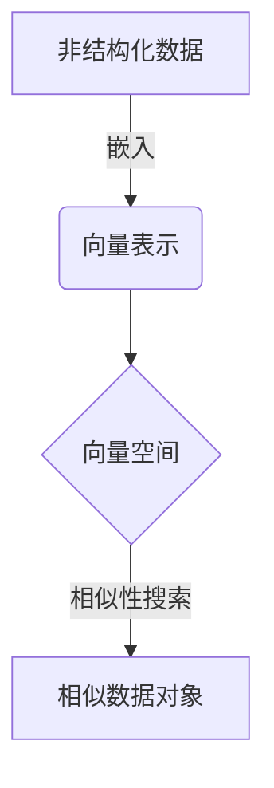

# 利用向量数据库加速生物信息数据分析

## 1.背景介绍

### 1.1 生物信息数据的爆炸式增长

随着高通量测序技术的不断发展和基因组学研究的深入,生物信息数据正以前所未有的速度快速积累。人类基因组计划耗时13年,耗资30亿美元,而现在一台高通量测序仪只需几天时间就可以完成人类全基因组的测序。大规模的生物数据不仅来自基因组测序,还包括蛋白质组学、转录组学、代谢组学等多种组学领域。

根据一项研究估计,截至2025年,全球生物信息数据总量将达到2艾字节(EB),相当于180万亿张高清照片。这些海量的生物数据蕴藏着丰富的生物学知识,对于疾病诊断、新药研发、作物育种等具有重要意义,但如何高效存储、检索和分析这些数据已经成为一个巨大挑战。

### 1.2 传统数据库在生物数据分析中的局限性

传统的关系型数据库和NoSQL数据库在处理结构化数据方面表现出色,但在处理非结构化的生物数据时存在一些局限性:

1. **数据模型不匹配**: 生物数据通常是非结构化的序列数据,如DNA序列、蛋白质序列等,很难用关系模型或键值对模型来表示。
2. **相似性搜索低效**: 生物数据分析中常见的操作是基于序列相似性进行搜索,而传统数据库对相似性查询的支持有限。
3. **计算能力有限**: 生物数据分析需要复杂的算法,如序列比对、聚类分析等,传统数据库缺乏这些计算能力。
4. **数据量大,难以扩展**: 随着数据量的不断增长,传统数据库在存储和查询性能上难以满足要求。

为了更好地支持生物信息数据的存储、检索和分析,需要一种新的数据库解决方案。

## 2.核心概念与联系

### 2.1 向量数据库概念

向量数据库(Vector Database)是一种新兴的数据库技术,它将非结构化数据(如文本、图像、音频等)映射为高维向量,并在向量空间中存储和检索这些向量。向量数据库的核心思想是利用向量之间的相似度来快速检索相关数据。

在向量数据库中,每个数据对象(如一段文本或一个基因序列)都被表示为一个固定长度的浮点数向量,这个向量捕获了数据对象的语义特征。相似的数据对象在向量空间中会聚集在一起,而不同的数据对象则相距较远。通过在向量空间中进行最近邻搜索,可以快速找到与查询对象最相似的数据对象。

### 2.2 生物信息数据的向量表示

要将生物信息数据存储到向量数据库中,首先需要将它们转换为向量表示。常用的方法包括:

1. **One-hot编码**: 将DNA/RNA/蛋白质序列转换为一个高维稀疏向量,每个维度对应一种核苷酸或氨基酸。
2. **k-mer嵌入**: 将序列分割成固定长度的k-mer,并使用Word2Vec等技术将k-mer嵌入到低维向量空间。
3. **基于注意力的语言模型**: 使用Transformer等注意力机制捕获序列上下文信息,生成序列的向量表示。

通过这些方法,生物序列数据可以被编码为数值向量,从而适合存储在向量数据库中并进行相似性搜索。

### 2.3 向量数据库与生物数据分析的联系

将生物信息数据存储在向量数据库中,可以极大地提高数据检索和分析的效率:

1. **快速相似性搜索**: 向量数据库擅长基于向量相似度的最近邻搜索,可以快速找到与查询序列相似的序列,支持同源序列检索、功能注释等应用。
2. **高效聚类分析**: 利用向量空间中的聚类特性,可以对生物序列进行高效的聚类分析,发现新的基因家族或功能模块。
3. **机器学习集成**: 向量数据库可以与机器学习模型无缝集成,支持基于向量相似度的推理和决策。
4. **大规模数据处理**: 向量数据库具有良好的水平扩展能力,可以支持PB级别的生物数据存储和分析。

通过将生物信息数据存储在向量数据库中,研究人员可以更高效地利用这些海量数据,加速生物学研究的进展。

## 3.核心算法原理具体操作步骤

### 3.1 向量数据库的核心算法

向量数据库的核心算法主要包括两个部分:向量嵌入算法和相似性搜索算法。

#### 3.1.1 向量嵌入算法

向量嵌入算法负责将非结构化数据映射为固定长度的向量表示。常用的嵌入算法包括:

1. **Word2Vec**: 基于浅层神经网络,通过上下文预测目标词或反过来预测上下文,将词语映射为向量。可用于嵌入k-mer。
2. **Doc2Vec**: 在Word2Vec的基础上,引入文档向量,可以直接生成整个序列或文档的向量表示。
3. **BERT**: 基于Transformer的预训练语言模型,通过掩码语言模型和下一句预测任务,学习上下文化的词向量表示。
4. **ESM**: 专门为生物序列设计的蛋白质语言模型,利用大规模蛋白质数据预训练,生成高质量的蛋白质向量表示。

这些算法通过自监督学习或迁移学习的方式,从大量非结构化数据中学习数据的向量表示,使得相似的数据对象在向量空间中彼此靠近。

#### 3.1.2 相似性搜索算法

相似性搜索算法用于在向量空间中快速查找与查询向量最相似的向量。常用的算法包括:

1. **近邻搜索算法**:
    - 蛮力搜索: 计算查询向量与所有向量的距离,返回最近的k个向量。计算量大,适用于小规模数据集。
    - 树搜索: 构建空间划分树(如KD树、球树等),通过分支定界加速近邻搜索。适用于中等规模数据集。
    - 哈希搜索: 通过局部敏感哈希(LSH)将向量映射到哈希桶,大幅减少需要计算距离的向量数量。适用于大规模数据集。

2. **矢量运算加速**:
    - SIMD指令: 利用现代CPU的单指令多数据(SIMD)指令集,同时计算多个向量距离,提高计算效率。
    - GPU加速: 将距离计算任务offload到GPU,利用GPU的大规模并行计算能力加速近邻搜索。

通过上述算法的优化和加速,向量数据库可以在亿级或更大规模的数据集上提供亚秒级的相似性搜索能力。

### 3.2 向量数据库操作步骤

利用向量数据库进行生物信息数据分析的一般步骤如下:

1. **数据预处理**: 对原始生物序列数据进行必要的预处理,如去除低质量区域、翻译成氨基酸序列等。

2. **向量嵌入**: 使用Word2Vec、BERT等嵌入算法,将预处理后的序列数据映射为固定长度的向量表示。

3. **数据导入**: 将嵌入后的向量数据批量导入向量数据库中,构建向量索引以加速搜索。

4. **相似性搜索**: 对感兴趣的查询序列进行向量嵌入,然后在向量数据库中执行相似性搜索,快速找到与之最相似的序列集合。

5. **结果分析**: 对搜索结果进行下游分析,如功能注释、进化分析、结构预测等,从中获取生物学见解。

6. **持续更新**: 当有新的序列数据产生时,重复步骤1-3,将新数据并入向量数据库,保持数据的完整性和最新状态。

通过这些步骤,研究人员可以充分利用向量数据库的优势,高效地存储、检索和分析大规模的生物信息数据。

## 4.数学模型和公式详细讲解举例说明

### 4.1 向量相似度度量

在向量数据库中,向量相似度是一个核心概念,它决定了搜索结果的相关性排序。常用的向量相似度度量包括:

1. **欧几里得距离**:

$$d(u,v) = \sqrt{\sum_{i=1}^{n}(u_i-v_i)^2}$$

其中$u$和$v$是$n$维向量,距离越小表示越相似。

2. **余弦相似度**:

$$\text{sim}(u,v) = \frac{u \cdot v}{\|u\|\|v\|} = \frac{\sum_{i=1}^{n}u_iv_i}{\sqrt{\sum_{i=1}^{n}u_i^2}\sqrt{\sum_{i=1}^{n}v_i^2}}$$

余弦相似度范围在$[-1,1]$之间,值越接近1表示越相似。

3. **内积**:

$$\text{sim}(u,v) = u \cdot v = \sum_{i=1}^{n}u_iv_i$$

内积可以看作是未标准化的余弦相似度,对于已标准化的向量,内积越大表示越相似。

不同的相似度度量适用于不同的场景。例如,对于稀疏向量(如one-hot编码的序列),内积更合适;对于密集向量(如BERT嵌入),余弦相似度更常用。

### 4.2 近邻搜索算法

近邻搜索是向量数据库中最核心的操作,它的目标是在向量空间中找到与查询向量最相似的$k$个向量。常用的近邻搜索算法包括:

1. **蛮力搜索**:

蛮力搜索是最简单的近邻搜索算法,它计算查询向量与数据集中所有向量的距离,然后返回距离最小的$k$个向量。对于$n$个$d$维向量的数据集,蛮力搜索的时间复杂度为$O(n\times d)$。

2. **KD树**:

KD树是一种空间划分树,它通过递归地在不同维度上划分向量空间,将相似的向量聚集在同一个节点。搜索时,可以根据查询向量在每个维度上的值,快速剪枝掉不相关的分支,从而加速搜索过程。KD树的构建时间复杂度为$O(n\log n)$,搜索时间复杂度为$O(\log n)$,适用于中等规模的数据集。

3. **局部敏感哈希(LSH)**:

LSH是一种概率算法,它通过设计特殊的哈希函数,将相似的向量映射到相同的哈希桶中。搜索时,只需要检查与查询向量落入同一哈希桶的向量,大大减少了距离计算的次数。LSH的构建时间复杂度为$O(n\times k)$,其中$k$是哈希函数的数量,搜索时间复杂度为$O(n^{\rho})$,其中$\rho$是一个小于1的常数,取决于具体的LSH方案。LSH适用于大规模数据集,是向量数据库中最常用的近邻搜索算法。

上述算法各有优缺点,在实际应用中通常会根据数据集的规模、维度和分布特征选择合适的算法,或者组合使用多种算法以获得最佳性能。

### 4.3 降维技术

生物序列数据通常具有很高的维度(如一条DNA序列的one-hot编码维度为4^k,k为序列长度),这会给向量计算和存储带来挑战。为了降低计算和存储开销,可以使用降维技术将高维向量映射到低维空间,同时尽量保留原始数据的语义信息。常用的降维技术包括:

1. **主成分分析(PCA)**:

PCA是一种线性降维技术,它通过找到数据的主成分方向(方差最大的正交方向),并将