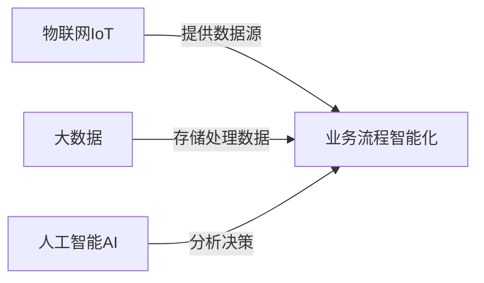
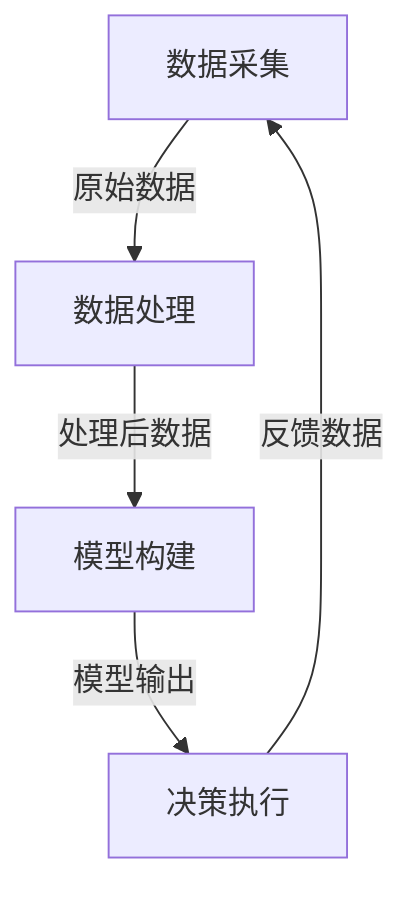

# "利用物联网(IoT)实现业务流程的智能化"

## 1.背景介绍

随着物联网(IoT)技术的不断发展和普及,越来越多的企业开始将其应用于业务流程中,以提高效率、降低成本并获得竞争优势。物联网通过将各种设备、传感器和系统连接到互联网上,使得数据可以被实时收集、传输和分析,从而实现对业务流程的智能化管理和优化。

在传统的业务流程中,许多环节依赖于人工操作和判断,容易出现低效、错误和延迟等问题。而利用物联网技术,企业可以自动化采集各种数据,并基于这些数据进行智能决策,从而优化流程,提高准确性和响应速度。

## 2.核心概念与联系

实现业务流程智能化涉及多个核心概念,包括物联网(IoT)、大数据、人工智能(AI)等,它们之间存在紧密联系。

### 2.1 物联网(IoT)

物联网是指通过各种信息传感设备,将所有能够被独立寻址的物体连接到互联网,进行信息交换和通信,实现智能化识别、定位、跟踪、监控和管理的一种网络。物联网为业务流程智能化提供了数据源和基础设施。

### 2.2 大数据

物联网设备产生的海量数据需要大数据技术进行存储、处理和分析。大数据可以从海量数据中发现隐藏的模式和洞见,为业务流程优化提供决策支持。

### 2.3 人工智能(AI)

人工智能技术,如机器学习、深度学习等,可以基于物联网采集的数据,建立预测模型,实现智能决策和自动化操作,从而优化业务流程。

### 2.4 核心联系

这三者相互依赖、相辅相成:物联网提供数据源,大数据处理海量数据,人工智能对数据进行分析和决策,共同推动业务流程的智能化。



## 3.核心算法原理具体操作步骤

实现业务流程智能化的核心算法原理包括数据采集、数据处理、模型构建、决策执行等步骤。

### 3.1 数据采集

利用各种物联网传感器和设备,实时采集相关业务数据,如生产数据、环境数据、设备状态数据等。常用的数据采集方式包括:

- RFID(射频识别技术)
- 传感器网络
- 视频监控
- 条码/二维码扫描

### 3.2 数据处理

对采集的海量数据进行清洗、整合、存储和预处理,为后续分析做准备。常用的大数据处理技术包括:

- Hadoop/Spark等分布式计算框架
- NoSQL数据库(如HBase、Cassandra)
- 实时数据流处理(如Apache Kafka、Apache Storm)

### 3.3 模型构建

基于处理后的数据,利用机器学习、深度学习等人工智能算法,构建预测模型、优化模型等,用于业务决策。常用算法包括:

- 监督学习算法(如决策树、逻辑回归等)
- 无监督学习算法(如聚类、降维等)
- 深度学习算法(如卷积神经网络、递归神经网络等)

### 3.4 决策执行

将模型的输出结果应用于实际业务场景,实现自动化决策和操作,优化业务流程。这可能涉及:

- 规则引擎(执行预定义的业务规则)
- 过程自动化(如工作流引擎)
- 机器人过程自动化(如RPA)

整个过程是一个闭环,决策执行的结果将反馈到数据采集环节,为下一轮优化提供数据支持。



## 4.数学模型和公式详细讲解举例说明  

在业务流程智能化中,数学模型和公式扮演着重要角色,用于描述问题、构建预测模型、优化决策等。以下是一些常见的数学模型和公式:

### 4.1 线性回归

线性回归是一种常用的监督学习算法,用于预测连续型目标变量。假设有 $n$ 个观测值 $(x_i, y_i)$,其中 $x_i = (x_{i1}, x_{i2}, ..., x_{ip})$ 是 $p$ 个自变量, $y_i$ 是因变量。线性回归模型可表示为:

$$y_i = \beta_0 + \beta_1 x_{i1} + \beta_2 x_{i2} + ... + \beta_p x_{ip} + \epsilon_i$$

其中 $\beta_0, \beta_1, ..., \beta_p$ 是待估计的回归系数, $\epsilon_i$ 是随机误差项。通过最小二乘法估计回归系数,可以得到最佳拟合直线,用于预测新的观测值。

### 4.2 逻辑回归

逻辑回归是一种常用的分类算法,用于预测二元或多元分类问题。假设有 $n$ 个观测值 $(x_i, y_i)$,其中 $x_i$ 是自变量向量, $y_i$ 是二元类别变量(0或1)。逻辑回归模型可表示为:

$$\log\left(\frac{p(y_i=1|x_i)}{1-p(y_i=1|x_i)}\right) = \beta_0 + \beta_1 x_{i1} + \beta_2 x_{i2} + ... + \beta_p x_{ip}$$

其中 $p(y_i=1|x_i)$ 表示观测值 $x_i$ 属于类别1的概率。通过最大似然估计求解回归系数 $\beta$,可以得到概率模型,用于新观测值的分类预测。

### 4.3 时间序列分析

时间序列分析常用于预测未来趋势,如需求预测、异常检测等。假设有一个时间序列 $\{y_t\}$,其中 $t=1,2,...,T$ 表示时间点。一种常用的时间序列模型是自回归移动平均模型(ARMA):

$$y_t = c + \phi_1 y_{t-1} + \phi_2 y_{t-2} + ... + \phi_p y_{t-p} + \theta_1 \epsilon_{t-1} + \theta_2 \epsilon_{t-2} + ... + \theta_q \epsilon_{t-q} + \epsilon_t$$

其中 $c$ 是常数项, $\phi_1, ..., \phi_p$ 是自回归系数, $\theta_1, ..., \theta_q$ 是移动平均系数, $\epsilon_t$ 是白噪声残差项。通过估计这些系数,可以对时间序列进行建模和预测。

上述只是数学模型的一个简单示例,在实际应用中,还有许多其他模型可供选择,如决策树、支持向量机、神经网络等,需要根据具体问题和数据特征进行选择和调优。

## 5.项目实践:代码实例和详细解释说明

为了更好地理解如何利用物联网实现业务流程智能化,我们以一个具体的案例进行说明。假设有一家制造企业,希望优化生产流程,提高效率和产品质量。我们将使用Python语言和相关库进行开发。

### 5.1 数据采集

首先,我们需要从生产车间的各种传感器采集相关数据,如温度、湿度、设备状态等。这里我们使用模拟数据进行演示。

```python
import random

# 模拟生成传感器数据
def generate_sensor_data(num_sensors):
    data = []
    for i in range(num_sensors):
        temperature = random.uniform(20, 30)
        humidity = random.uniform(40, 60)
        machine_status = random.randint(0, 1)
        data.append((temperature, humidity, machine_status))
    return data

# 获取10个传感器的模拟数据
sensor_data = generate_sensor_data(10)
print(sensor_data)
```

上述代码模拟生成了10个传感器的数据,每个传感器包含温度、湿度和机器状态三个值。

### 5.2 数据处理

接下来,我们需要对采集的数据进行清洗和预处理,以便后续建模。这里我们使用Pandas库进行数据操作。

```python
import pandas as pd

# 创建DataFrame
columns = ['temperature', 'humidity', 'machine_status']
df = pd.DataFrame(sensor_data, columns=columns)

# 处理缺失值
df = df.dropna()

# 对数据进行标准化
from sklearn.preprocessing import StandardScaler
scaler = StandardScaler()
df[['temperature', 'humidity']] = scaler.fit_transform(df[['temperature', 'humidity']])

print(df.head())
```

上述代码首先将传感器数据转换为Pandas DataFrame,然后删除缺失值,并对温度和湿度数据进行标准化处理。

### 5.3 模型构建

现在,我们可以基于处理后的数据构建机器学习模型,用于预测机器状态。这里我们使用逻辑回归模型进行二元分类。

```python
from sklearn.linear_model import LogisticRegression
from sklearn.model_selection import train_test_split

# 划分训练集和测试集
X = df[['temperature', 'humidity']]
y = df['machine_status']
X_train, X_test, y_train, y_test = train_test_split(X, y, test_size=0.2, random_state=42)

# 训练逻辑回归模型
model = LogisticRegression()
model.fit(X_train, y_train)

# 评估模型
from sklearn.metrics import accuracy_score
y_pred = model.predict(X_test)
accuracy = accuracy_score(y_test, y_pred)
print(f'Accuracy: {accuracy}')
```

上述代码将数据划分为训练集和测试集,然后使用scikit-learn库训练逻辑回归模型。最后,我们评估模型在测试集上的准确率。

### 5.4 决策执行

获得预测模型后,我们可以将其应用于实际的业务场景,实现自动化决策和操作。例如,当模型预测某台机器可能出现故障时,我们可以自动触发维修流程。

```python
# 模拟实时获取传感器数据
new_data = generate_sensor_data(1)[0]

# 使用模型进行预测
temperature, humidity, _ = new_data
prediction = model.predict([[temperature, humidity]])

# 根据预测结果执行操作
if prediction[0] == 0:
    print('Machine is running normally.')
else:
    print('Potential machine failure detected. Initiating maintenance process.')
```

上述代码模拟实时获取新的传感器数据,使用训练好的模型进行预测,并根据预测结果执行相应的操作(正常运行或启动维修流程)。

通过这个示例,我们可以看到如何利用Python语言和相关库,从数据采集、处理、建模到决策执行,实现业务流程的智能化。在实际应用中,您可以根据具体需求进行调整和扩展。

## 6.实际应用场景

利用物联网实现业务流程智能化在各个行业都有广泛的应用前景,以下是一些典型场景:

### 6.1 制造业

- 预测性维护:通过监测设备状态,预测潜在故障,提前进行维护,减少停机时间。
- 质量控制:利用视觉检测等技术,实时监控产品质量,发现缺陷并调整生产参数。
- 供应链优化:跟踪原材料流向,优化库存管理和物流路线。

### 6.2 农业

- 精准农业:根据土壤、天气等数据,调整灌溉、施肥策略,提高产量和质量。
- 畜牧监控:通过传感器监测牲畜健康状况,及时发现异常并采取措施。
- 温室环境控制:自动调节温室温度、湿度、光照等,为作物创造理想环境。

### 6.3 医疗健康

- 远程医疗:利用可穿戴设备收集患者生理数据,实现远程监控和诊断。
- 智能护理:通过传感器监测老年人或残疾人的活动,提供及时的护理服务。
- 疾病预防:分析人群健康数据,发现潜在风险,制定预防措施。

### 6.4 能源

- 智能电网:利用物联网技术实时监测电力需求,优化电力调度和分配。