# 制造行业数字化、人工智能、大数据技术转型

## 1.背景介绍

在当今快速发展的数字时代,制造业正面临着前所未有的机遇和挑战。全球化、技术进步和消费者需求的不断变化,推动着制造业向数字化、智能化和数据驱动的方向转型。传统的制造模式已经无法满足现代制造业的需求,企业必须紧跟技术发展趋势,采用新兴技术来提高效率、降低成本并提供更好的产品和服务。

在这一背景下,数字化、人工智能和大数据技术应运而生,成为制造业转型升级的关键驱动力。这些先进技术不仅能够优化制造流程,还可以为企业带来全新的商业模式和增长机会。然而,技术转型绝非一蹴而就,需要制造企业进行全面的战略规划、组织变革和人才培养,方能真正实现数字化转型,抓住数字经济时代的红利。

## 2.核心概念与联系

### 2.1 数字化(Digitalization)

数字化是指将物理世界的信息转化为数字形式,以便于存储、处理和传输。在制造业中,数字化体现在诸如数字化设计(CAD)、数字化制造(CAM)、产品生命周期管理(PLM)等领域。通过数字化,制造企业可以提高设计和生产效率,缩短产品上市时间,降低成本。

### 2.2 人工智能(Artificial Intelligence)

人工智能是一门研究如何使机器模拟人类智能行为的科学,包括机器学习、计算机视觉、自然语言处理等技术。在制造业中,人工智能可以应用于预测性维护、质量控制、需求预测等场景,提高生产效率和产品质量。

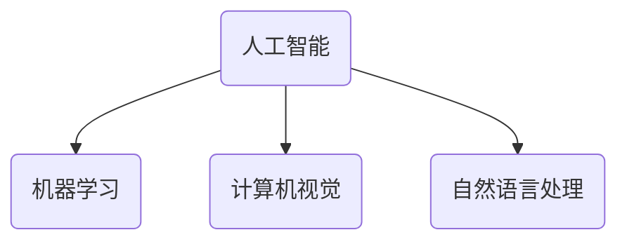

### 2.3 大数据(Big Data)

大数据指的是海量的、多样化的、价值密度低但潜在价值巨大的数据资产。制造业中产生了大量的数据,包括来自设备、传感器、控制系统等的数据。通过对这些数据进行采集、存储、处理和分析,企业可以获得有价值的见解,优化决策并提高运营效率。

### 2.4 关系与融合

数字化、人工智能和大数据技术在制造业中是相互关联、相辅相成的。数字化为人工智能和大数据分析提供了数字化的基础数据;人工智能算法可以对海量数据进行智能分析,提取有价值的见解;而大数据分析的结果又可以反馈到生产流程,实现闭环优化。三者的融合将推动制造业向智能化、自动化和可视化的方向发展。

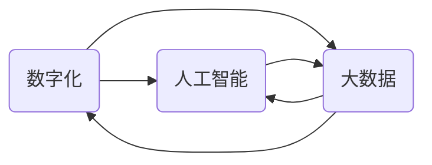

## 3.核心算法原理具体操作步骤

### 3.1 机器学习算法

机器学习是人工智能的一个重要分支,它赋予计算机在没有明确程序的情况下,通过学习数据获取经验并做出智能决策的能力。在制造业中,常用的机器学习算法包括:

#### 3.1.1 监督学习

监督学习是机器学习中最常见的一种范式,它通过学习带有标签的训练数据,建立映射关系,从而对新的数据进行预测或分类。在制造业中,监督学习可以应用于以下场景:

1. **缺陷检测**: 利用图像数据训练分类模型,对产品表面缺陷进行检测和分类。
2. **预测性维护**: 基于历史运行数据训练回归模型,预测设备的剩余使用寿命,从而安排维护计划。
3. **产品质量预测**: 使用生产参数和质量数据训练分类模型,预测产品的合格与否。

监督学习算法流程:

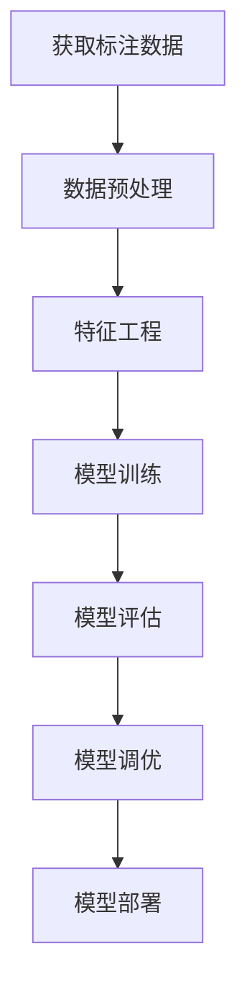

#### 3.1.2 无监督学习

无监督学习是在没有标签数据的情况下,从原始数据中发现内在模式和规律的过程。在制造业中,无监督学习可以应用于以下场景:

1. **异常检测**: 利用聚类算法发现异常数据点,用于识别异常情况。
2. **产品分类**: 基于产品特征对产品进行自动分组,为个性化生产提供支持。
3. **客户细分**: 通过聚类算法对客户进行细分,为营销策略制定提供依据。

无监督学习算法流程:

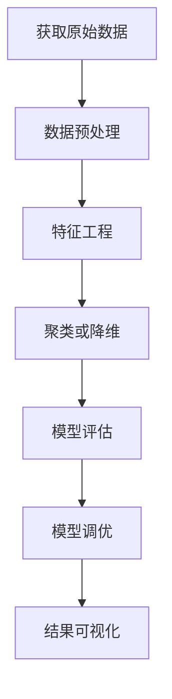

#### 3.1.3 强化学习

强化学习是一种基于奖惩机制的学习方式,智能体通过与环境交互,获取奖励信号,从而学习到最优策略。在制造业中,强化学习可以应用于以下场景:

1. **智能调度**: 对生产计划和资源调度进行优化,以最小化延迟和成本。
2. **机器人控制**: 训练机器人执行特定任务,如装配、焊接等。
3. **工艺参数优化**: 自动调整工艺参数,以提高产品质量和生产效率。

强化学习算法流程:

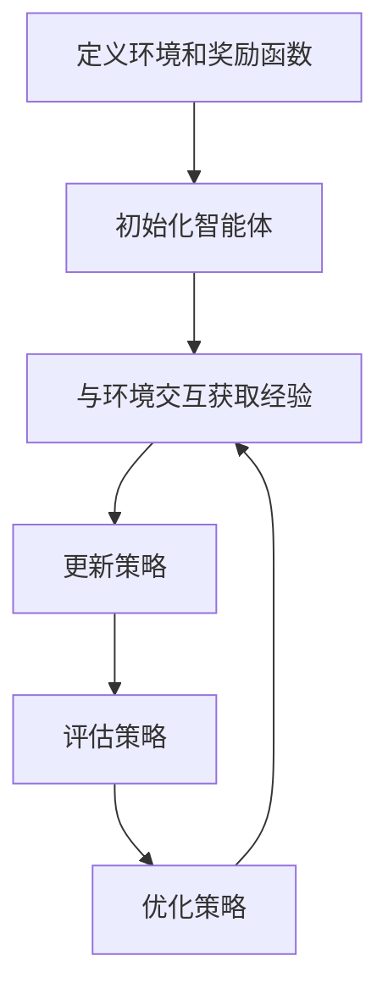

### 3.2 计算机视觉算法

计算机视觉是人工智能的另一个重要分支,它赋予计算机从图像或视频中获取信息、识别和理解场景的能力。在制造业中,常用的计算机视觉算法包括:

#### 3.2.1 目标检测

目标检测算法可以在图像或视频中定位并识别感兴趣的目标对象,如产品、零件、缺陷等。常用的目标检测算法包括基于深度学习的YOLO、Faster R-CNN等。

目标检测算法流程:

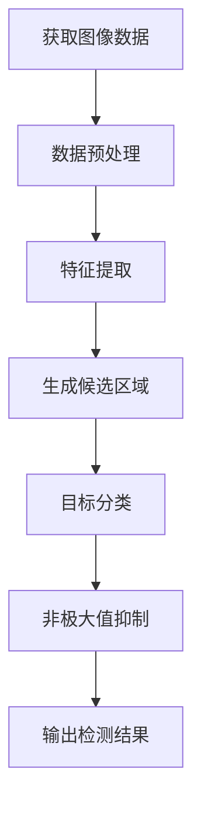

#### 3.2.2 实例分割

实例分割算法不仅能够检测目标对象,还能精确分割出每个目标对象的像素级别的掩码。在制造业中,实例分割可以用于精确定位和识别零件、缺陷等目标。常用的实例分割算法包括Mask R-CNN、YOLACT等。

实例分割算法流程:

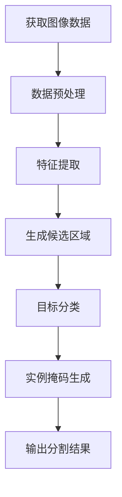

#### 3.2.3 光学字符识别

光学字符识别(OCR)算法可以从图像或视频中提取并识别文本信息。在制造业中,OCR可以应用于自动读取产品标签、条形码、序列号等信息。常用的OCR算法包括基于深度学习的CRNN、EAST等。

OCR算法流程:

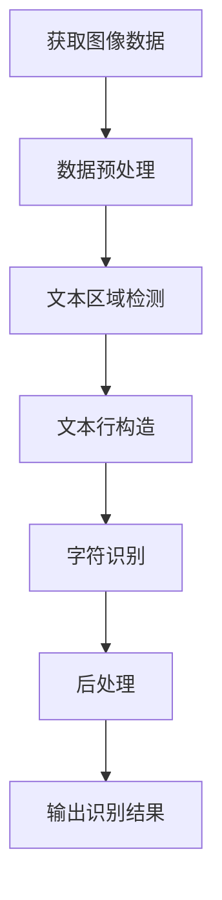

### 3.3 自然语言处理算法

自然语言处理(NLP)是人工智能的另一个重要分支,它赋予计算机理解和处理人类语言的能力。在制造业中,NLP可以应用于以下场景:

#### 3.3.1 文本分类

文本分类算法可以根据文本内容,将其归类到预定义的类别中。在制造业中,文本分类可以用于自动分类客户反馈、工单、故障报告等文本数据。常用的文本分类算法包括朴素贝叶斯、支持向量机、深度学习模型等。

文本分类算法流程:

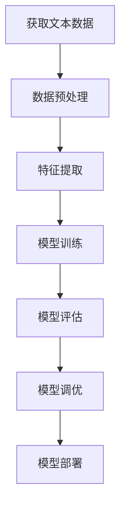

#### 3.3.2 命名实体识别

命名实体识别(NER)算法可以从文本中识别出实体名称,如人名、地名、组织机构名等。在制造业中,NER可以用于从工单、故障报告等文本中提取关键信息,如零件名称、设备编号等。常用的NER算法包括基于规则的方法、统计学习方法和深度学习方法。

NER算法流程:

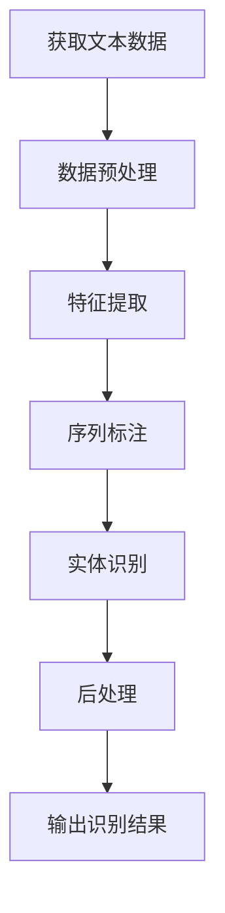

#### 3.3.3 关系抽取

关系抽取算法可以从文本中识别出实体之间的语义关系。在制造业中,关系抽取可以用于从工单、故障报告等文本中提取故障原因、影响范围等信息。常用的关系抽取算法包括基于规则的方法、统计学习方法和深度学习方法。

关系抽取算法流程:

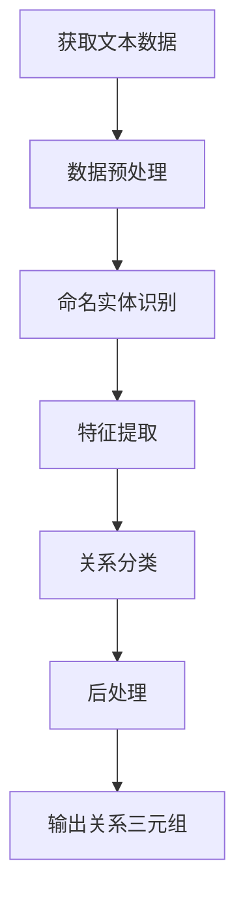

## 4.数学模型和公式详细讲解举例说明

在制造业的数字化、人工智能和大数据技术中,数学模型和公式扮演着至关重要的角色。它们为算法提供了理论基础,并指导着算法的设计和优化。以下是一些常见的数学模型和公式:

### 4.1 线性回归模型

线性回归是一种常用的监督学习算法,它试图找到一个最佳拟合的线性方程,将自变量映射到因变量。在制造业中,线性回归可以用于建模和预测,如预测产品质量、能耗等。

线性回归模型的数学表达式为:

$$y = \theta_0 + \theta_1x_1 + \theta_2x_2 + ... + \theta_nx_n$$

其中,y是因变量,x是自变量,$\theta$是待估计的系数。

通过最小二乘法,可以求解出最优的$\theta$值:

$$\min_\theta \sum_{i=1}^m (y^{(i)} - \hat{y}^{(i)})^2$$

其中,m是样本数量,$\hat{y}^{(i)}$是对第i个样本的预测值。

### 4.2 逻辑回归模型

逻辑回归是一种常用的分类算法,它可以将输入映射到0到1之间的概率值,用于二分类问题。在制造业中,逻辑回归可以用于缺陷检测、产品合格与否的预测等。

逻辑回归模型的数学表达式为:

$$h_\theta(x) = \frac{1}{1 + e^{-\theta^Tx}}$$

其中,$h_\theta(x)$表示x属于正类的概率,$\theta$是待估计的系数向量。

通过最大似然估计,可以求解出最优的$\theta$值:

$$\max_\theta \prod_{i=1}^m (h_\theta(x^{(i)}))^{y^{(i)}}(1 - h_\theta(x^{(i)}))^{1-y^{(i)}}$$

其中,m是样本数量,$y^{(i)}$是第i个样本的真实标签(0或1)。

### 4.3 支持向量机模型

支持向量机(SVM)是一种常用