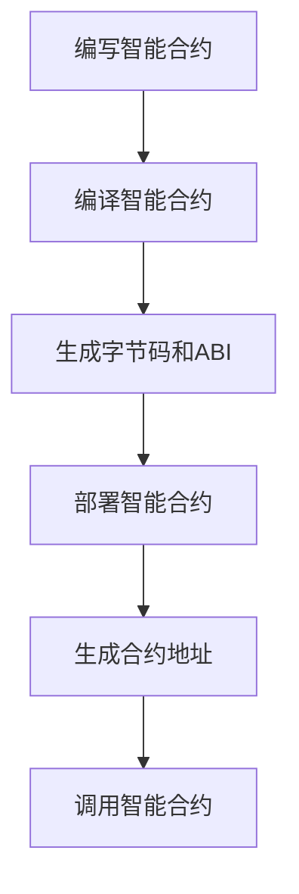

# 区块链上智能合约的部署与应用研究

## 1.背景介绍

区块链技术自2008年比特币白皮书发布以来，迅速发展并在多个领域得到了广泛应用。作为区块链技术的重要组成部分，智能合约在去中心化应用（DApps）中扮演了关键角色。智能合约是一种运行在区块链上的自执行代码，能够在满足特定条件时自动执行预定义的操作。本文将深入探讨区块链上智能合约的部署与应用，旨在为读者提供全面的技术指导和实用的解决方案。

## 2.核心概念与联系

### 2.1 区块链

区块链是一种分布式账本技术，通过加密算法和共识机制确保数据的安全性和一致性。区块链的核心特性包括去中心化、不可篡改和透明性。

### 2.2 智能合约

智能合约是一种在区块链上自动执行的代码，能够在满足特定条件时自动执行预定义的操作。智能合约的执行是不可逆的，且所有操作记录在区块链上，确保了透明性和安全性。

### 2.3 智能合约与区块链的联系

智能合约依赖于区块链的去中心化和不可篡改特性，确保其执行的安全性和透明性。区块链为智能合约提供了一个可信的执行环境，而智能合约则扩展了区块链的应用场景。

## 3.核心算法原理具体操作步骤

### 3.1 智能合约的编写

智能合约通常使用专门的编程语言编写，如以太坊的Solidity。编写智能合约时，需要定义合约的状态变量、函数和事件。

### 3.2 智能合约的编译

编写好的智能合约需要经过编译，生成字节码和应用二进制接口（ABI）。字节码用于在区块链上部署合约，而ABI用于与合约进行交互。

### 3.3 智能合约的部署

将编译好的智能合约字节码部署到区块链上，通常需要支付一定的Gas费用。部署成功后，合约会生成一个唯一的地址，供用户和其他合约进行交互。

### 3.4 智能合约的调用

智能合约部署后，可以通过其地址和ABI与之进行交互。调用合约的函数时，需要提供必要的参数，并支付相应的Gas费用。



## 4.数学模型和公式详细讲解举例说明

### 4.1 智能合约的状态转换模型

智能合约的执行可以看作是一个状态转换过程。假设智能合约的状态集合为 $S$，输入集合为 $I$，状态转换函数为 $T$，则状态转换过程可以表示为：

$$
S_{t+1} = T(S_t, I_t)
$$

其中，$S_t$ 表示合约在时间 $t$ 的状态，$I_t$ 表示在时间 $t$ 的输入。

### 4.2 以太坊Gas费用计算

在以太坊中，智能合约的执行需要支付Gas费用。Gas费用的计算公式为：

$$
\text{Gas Fee} = \text{Gas Used} \times \text{Gas Price}
$$

其中，$\text{Gas Used}$ 表示合约执行所消耗的Gas数量，$\text{Gas Price}$ 表示每单位Gas的价格。

### 4.3 示例：简单的投票合约

假设我们要编写一个简单的投票合约，合约的状态包括候选人列表和投票结果。合约的状态转换函数可以表示为：

$$
S_{t+1} = \text{Vote}(S_t, \text{candidate})
$$

其中，$\text{Vote}$ 函数接收当前状态 $S_t$ 和投票的候选人 $\text{candidate}$，并更新投票结果。

## 5.项目实践：代码实例和详细解释说明

### 5.1 编写智能合约

以下是一个简单的投票合约示例，使用Solidity编写：

```solidity
pragma solidity ^0.8.0;

contract Voting {
    struct Candidate {
        string name;
        uint voteCount;
    }

    mapping(address => bool) public voters;
    Candidate[] public candidates;

    constructor(string[] memory candidateNames) {
        for (uint i = 0; i < candidateNames.length; i++) {
            candidates.push(Candidate({
                name: candidateNames[i],
                voteCount: 0
            }));
        }
    }

    function vote(uint candidateIndex) public {
        require(!voters[msg.sender], "You have already voted.");
        require(candidateIndex < candidates.length, "Invalid candidate index.");

        voters[msg.sender] = true;
        candidates[candidateIndex].voteCount += 1;
    }

    function getCandidate(uint index) public view returns (string memory name, uint voteCount) {
        require(index < candidates.length, "Invalid candidate index.");
        Candidate storage candidate = candidates[index];
        return (candidate.name, candidate.voteCount);
    }
}
```

### 5.2 编译智能合约

使用Solidity编译器（solc）编译上述合约，生成字节码和ABI。

### 5.3 部署智能合约

使用Web3.js或Truffle框架将编译好的合约部署到以太坊网络上。以下是使用Web3.js部署合约的示例代码：

```javascript
const Web3 = require('web3');
const fs = require('fs');

const web3 = new Web3('https://mainnet.infura.io/v3/YOUR_INFURA_PROJECT_ID');
const account = web3.eth.accounts.privateKeyToAccount('YOUR_PRIVATE_KEY');
web3.eth.accounts.wallet.add(account);

const bytecode = fs.readFileSync('Voting_sol_Voting.bin').toString();
const abi = JSON.parse(fs.readFileSync('Voting_sol_Voting.abi').toString());

const deploy = async () => {
    const contract = new web3.eth.Contract(abi);
    const deployTx = contract.deploy({
        data: bytecode,
        arguments: [['Alice', 'Bob', 'Charlie']]
