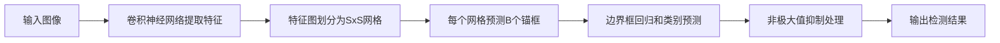

# 医学影像分析中的YOLOv2:从理论到实践

## 1. 背景介绍

### 1.1 医学影像分析的重要性

医学影像分析在现代医疗诊断和治疗中扮演着至关重要的角色。随着医学成像技术的不断发展,如X射线、CT、MRI和超声等,医学影像数据的数量和复杂性也在不断增加。高效、准确地分析这些医学影像对于疾病的早期诊断、治疗方案的制定以及患者预后的评估都有着重要意义。

### 1.2 深度学习在医学影像分析中的应用

近年来,深度学习技术,尤其是卷积神经网络(CNN)在计算机视觉领域取得了巨大成功。CNN强大的特征提取和表示能力使其在图像分类、目标检测、语义分割等任务上表现出色。受此启发,越来越多的研究者开始将深度学习应用于医学影像分析,并取得了显著进展。深度学习可以自动从医学影像中学习到高层次的特征表示,从而提高疾病诊断和预测的准确性,减轻医生的工作负担。

### 1.3 目标检测算法YOLO简介

YOLO(You Only Look Once)是一种高效的实时目标检测算法,由Joseph Redmon等人于2015年提出。与传统的两阶段目标检测算法(如R-CNN系列)不同,YOLO采用单阶段的端到端检测框架,可以实现实时的目标检测。YOLO将整张图像划分为S×S个网格,每个网格预测B个边界框以及这些边界框所属的类别概率。通过一次性计算,YOLO可以同时预测目标的位置和类别,大大提高了检测速度。

### 1.4 YOLOv2的改进

YOLOv2是YOLO算法的改进版本,由Joseph Redmon和Ali Farhadi在2016年提出。相比于原始的YOLO,YOLOv2在保持速度优势的同时,在精度上取得了显著提升。YOLOv2引入了一系列改进措施,如Batch Normalization、高分辨率分类器、锚框(Anchor Boxes)、维度聚类、直接位置预测等,使得算法的性能得到全面提升。

本文将重点介绍如何将YOLOv2应用于医学影像分析,详细阐述其核心原理、网络结构、训练策略以及在实际医学应用中的效果。通过理论与实践的结合,帮助读者深入理解YOLOv2算法,掌握其在医学影像分析中的应用方法,为相关研究提供参考和指导。

## 2. 核心概念与联系

### 2.1 卷积神经网络(CNN)

卷积神经网络是一种专门用于处理网格拓扑结构数据(如图像)的深度学习模型。CNN通过卷积层和池化层交替堆叠,可以自动学习图像中的层次化特征。卷积层通过卷积操作提取局部特征,池化层对特征图进行下采样,减小数据维度。经过多次卷积和池化,CNN可以学习到图像的高层语义特征,用于后续的分类或检测任务。CNN强大的特征提取能力是目标检测算法的基础。

### 2.2 目标检测

目标检测是计算机视觉中的一项基本任务,旨在从图像中定位和识别感兴趣的目标物体。目标检测算法通常由两个主要部分组成:候选区域生成和区域分类。传统的目标检测算法如R-CNN系列采用两阶段检测框架,先通过选择性搜索等方法生成候选区域,再对候选区域进行分类和回归。而YOLO等单阶段检测算法则直接在整张图像上进行预测,无需生成候选区域,速度更快。

### 2.3 锚框(Anchor Boxes)

锚框是目标检测中常用的一种技术,用于处理目标尺度和宽高比的多样性。锚框是一组预定义的矩形框,通常具有不同的尺度和宽高比。在训练和推理过程中,算法以锚框为基础进行边界框的预测和调整。通过设置合适的锚框,可以更好地适应不同形状和大小的目标。YOLOv2使用K-means聚类算法自动学习数据集中的最佳锚框尺度和宽高比,提高了检测精度。

### 2.4 边界框回归

边界框回归是目标检测中的一个关键步骤,用于微调预测的边界框,使其更准确地包围目标。在YOLO中,边界框的位置和大小通过预测相对于网格单元的偏移量和缩放因子来确定。YOLOv2对边界框回归进行了改进,引入了直接位置预测,即直接预测边界框的中心坐标和宽高,而不是相对值,提高了定位精度。

### 2.5 非极大值抑制(NMS)

非极大值抑制是目标检测后处理中常用的一种方法,用于去除冗余的检测结果。由于算法可能对同一目标产生多个重叠的检测框,NMS通过计算检测框之间的交并比(IoU),保留置信度最高的检测框,抑制其他重叠的检测框,从而得到最终的检测结果。NMS可以有效地提高检测精度,减少假阳性检测。

下图展示了YOLOv2目标检测的核心概念和流程:

通过理解这些核心概念以及它们之间的联系,可以更好地掌握YOLOv2算法的原理和实现细节,为将其应用于医学影像分析打下坚实的基础。

## 3. 核心算法原理具体操作步骤

YOLOv2的核心算法可以分为以下几个关键步骤:

### 3.1 特征提取网络

YOLOv2使用Darknet-19作为特征提取网络,它是一个由19个卷积层和5个最大池化层组成的卷积神经网络。Darknet-19采用了一系列的3x3和1x1卷积核,可以在保持计算效率的同时提取多尺度特征。网络的输入为416x416的RGB图像,经过特征提取后得到一个13x13x1024的特征图。

### 3.2 特征图划分与锚框预测

将特征图划分为13x13的网格,每个网格负责预测其所在区域的目标。对于每个网格,YOLOv2预测B个锚框(默认B=5)以及每个锚框的置信度和类别概率。锚框的尺度和宽高比通过K-means聚类算法自动学习得到,以更好地适应数据集中的目标形状。

### 3.3 边界框回归

对于每个预测的锚框,YOLOv2通过回归的方式调整其位置和大小,使其更准确地包围目标。具体地,YOLOv2预测4个值:$t_x$,$t_y$,$t_w$,$t_h$,分别表示边界框中心坐标和宽高的调整量。最终的边界框位置和大小通过以下公式计算:

$$
b_x = \sigma(t_x) + c_x
$$
$$
b_y = \sigma(t_y) + c_y
$$
$$
b_w = p_w e^{t_w}
$$
$$
b_h = p_h e^{t_h}
$$

其中,$c_x$和$c_y$是网格的左上角坐标,$p_w$和$p_h$是锚框的宽和高,$\sigma$是sigmoid函数,用于将$t_x$和$t_y$的取值范围限制在[0,1]内。

### 3.4 类别预测与置信度计算

对于每个预测的锚框,YOLOv2还会预测其所属的类别概率以及置信度。类别概率通过一个softmax层计算,表示该锚框属于每个类别的概率。置信度表示锚框中存在目标的概率,通过一个sigmoid函数计算。最终的检测分数为类别概率与置信度的乘积。

### 3.5 损失函数设计

YOLOv2的损失函数由三部分组成:位置损失、置信度损失和类别损失。位置损失采用均方误差(MSE)计算预测边界框与真实边界框之间的差异。置信度损失采用二元交叉熵,惩罚错误的置信度预测。类别损失采用多元交叉熵,惩罚错误的类别预测。总的损失函数为三个部分损失的加权和。

### 3.6 后处理与非极大值抑制

在推理阶段,YOLOv2对每个网格预测的多个锚框进行解码,得到其位置、置信度和类别概率。然后,通过设定置信度阈值,筛选出置信度较高的检测结果。最后,使用非极大值抑制(NMS)算法去除重叠的检测框,得到最终的检测结果。

通过上述步骤,YOLOv2可以实现实时、高效、准确的目标检测。将其应用于医学影像分析,可以自动定位和识别医学图像中的病变区域,辅助医生进行诊断和治疗决策。

## 4. 数学模型和公式详细讲解举例说明

在YOLOv2的算法中,涉及到一些关键的数学模型和公式,下面将对其进行详细的讲解和举例说明。

### 4.1 边界框回归的位置预测公式

在YOLOv2中,边界框的位置和大小通过预测相对于网格单元的偏移量和缩放因子来确定。具体地,对于每个网格的每个锚框,YOLOv2预测4个值:$t_x$,$t_y$,$t_w$,$t_h$。最终的边界框位置和大小通过以下公式计算:

$$
b_x = \sigma(t_x) + c_x
$$
$$
b_y = \sigma(t_y) + c_y
$$
$$
b_w = p_w e^{t_w}
$$
$$
b_h = p_h e^{t_h}
$$

其中:
- $b_x$,$b_y$是预测边界框的中心坐标
- $b_w$,$b_h$是预测边界框的宽和高
- $c_x$,$c_y$是网格的左上角坐标
- $p_w$,$p_h$是锚框的宽和高
- $\sigma$是sigmoid函数,用于将$t_x$和$t_y$的取值范围限制在[0,1]内

举例说明:
假设我们将图像划分为7x7的网格,对于第(2,3)个网格,其左上角坐标为$(2,3)$。如果该网格的一个锚框预测值为$t_x=0.3$,$t_y=0.4$,$t_w=0.1$,$t_h=0.2$,锚框的宽高为$p_w=30$,$p_h=40$,则最终预测的边界框位置和大小为:

$$
b_x = \sigma(0.3) + 2 = 0.574 + 2 = 2.574
$$
$$
b_y = \sigma(0.4) + 3 = 0.599 + 3 = 3.599
$$
$$
b_w = 30 \cdot e^{0.1} = 30 \cdot 1.105 = 33.15
$$
$$
b_h = 40 \cdot e^{0.2} = 40 \cdot 1.221 = 48.84
$$

因此,该锚框预测的边界框中心坐标为$(2.574,3.599)$,宽高为$(33.15,48.84)$。

### 4.2 置信度与类别概率的计算

对于每个预测的锚框,YOLOv2还会预测其所属的类别概率以及置信度。类别概率通过一个softmax层计算,表示该锚框属于每个类别的概率。置信度表示锚框中存在目标的概率,通过一个sigmoid函数计算。

假设对于一个锚框,YOLOv2预测的类别概率向量为$\mathbf{p}=[0.2,0.3,0.1,0.4]$,置信度为$\hat{c}=0.8$,则该锚框属于每个类别的概率为:

$$
p_i = \frac{e^{p_i}}{\sum_j e^{p_j}}, \quad i=1,2,3,4
$$

计算结果为:$\mathbf{p}=[0.18,0