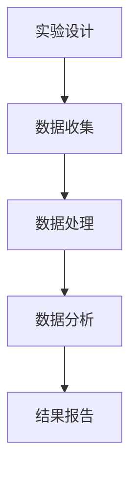

# 可复现性研究与实验管理原理与代码实战案例讲解

## 1.背景介绍

在现代科学研究和工程实践中，可复现性是一个至关重要的概念。它不仅是科学研究的基石，也是工程项目成功的关键。可复现性意味着其他研究人员或工程师能够在相同条件下重复实验并获得相同的结果。这对于验证研究成果、提高研究质量以及推动科学进步具有重要意义。

然而，随着数据量的增加和实验复杂性的提升，确保实验的可复现性变得越来越具有挑战性。本文将深入探讨可复现性研究与实验管理的原理，并通过具体的代码实例和实际应用场景，帮助读者理解和掌握这一重要领域的核心概念和技术。

## 2.核心概念与联系

### 2.1 可复现性

可复现性是指在相同条件下重复实验并获得相同结果的能力。它是科学研究的基本要求，确保了研究结果的可靠性和可信度。

### 2.2 实验管理

实验管理涉及实验设计、数据收集、数据分析和结果报告的全过程。良好的实验管理可以提高实验的效率和准确性，确保实验的可复现性。

### 2.3 数据管理

数据管理是实验管理的重要组成部分，包括数据的收集、存储、处理和共享。良好的数据管理可以确保数据的完整性和可用性，为实验的可复现性提供保障。

### 2.4 版本控制

版本控制是管理代码和数据变化的重要工具。通过版本控制，可以记录实验的每一个步骤和变化，确保实验的可追溯性和可复现性。

### 2.5 自动化

自动化是提高实验效率和可复现性的关键。通过自动化工具，可以减少人为错误，提高实验的准确性和一致性。

## 3.核心算法原理具体操作步骤

### 3.1 实验设计

实验设计是实验管理的第一步。一个良好的实验设计应包括明确的实验目标、详细的实验步骤和合理的实验条件。

### 3.2 数据收集

数据收集是实验管理的关键步骤。应确保数据的准确性和完整性，并记录数据收集的每一个细节。

### 3.3 数据处理

数据处理是实验管理的重要环节。应使用合适的数据处理方法和工具，确保数据处理的准确性和一致性。

### 3.4 数据分析

数据分析是实验管理的核心步骤。应使用合适的数据分析方法和工具，确保数据分析的准确性和可靠性。

### 3.5 结果报告

结果报告是实验管理的最后一步。应确保结果报告的准确性和完整性，并提供详细的实验步骤和数据分析过程。

以下是一个实验管理流程的Mermaid流程图：



## 4.数学模型和公式详细讲解举例说明

### 4.1 线性回归模型

线性回归模型是最常用的数学模型之一，用于描述两个变量之间的线性关系。其数学表达式为：

$$
y = \beta_0 + \beta_1 x + \epsilon
$$

其中，$y$ 是因变量，$x$ 是自变量，$\beta_0$ 和 $\beta_1$ 是回归系数，$\epsilon$ 是误差项。

### 4.2 逻辑回归模型

逻辑回归模型用于描述二分类问题，其数学表达式为：

$$
P(y=1|x) = \frac{1}{1 + e^{-(\beta_0 + \beta_1 x)}}
$$

其中，$P(y=1|x)$ 是事件发生的概率，$x$ 是自变量，$\beta_0$ 和 $\beta_1$ 是回归系数。

### 4.3 K均值聚类算法

K均值聚类算法用于将数据分为K个簇，其数学表达式为：

$$
J = \sum_{i=1}^{K} \sum_{j=1}^{n_i} ||x_j^{(i)} - \mu_i||^2
$$

其中，$J$ 是目标函数，$K$ 是簇的数量，$n_i$ 是第i个簇中的数据点数量，$x_j^{(i)}$ 是第i个簇中的第j个数据点，$\mu_i$ 是第i个簇的中心。

## 5.项目实践：代码实例和详细解释说明

### 5.1 线性回归模型的实现

以下是一个使用Python实现线性回归模型的示例代码：

```python
import numpy as np
import matplotlib.pyplot as plt
from sklearn.linear_model import LinearRegression

# 生成数据
np.random.seed(0)
X = 2 * np.random.rand(100, 1)
y = 4 + 3 * X + np.random.randn(100, 1)

# 创建线性回归模型
lin_reg = LinearRegression()
lin_reg.fit(X, y)

# 预测
X_new = np.array([[0], [2]])
y_predict = lin_reg.predict(X_new)

# 绘图
plt.plot(X_new, y_predict, "r-", linewidth=2, label="Predictions")
plt.plot(X, y, "b.", label="Data")
plt.xlabel("$x_1$", fontsize=18)
plt.ylabel("$y$", rotation=0, fontsize=18)
plt.legend(loc="upper left", fontsize=14)
plt.show()
```

### 5.2 逻辑回归模型的实现

以下是一个使用Python实现逻辑回归模型的示例代码：

```python
import numpy as np
import matplotlib.pyplot as plt
from sklearn.linear_model import LogisticRegression

# 生成数据
np.random.seed(0)
X = 2 * np.random.rand(100, 1)
y = (4 + 3 * X + np.random.randn(100, 1) > 6).astype(int).ravel()

# 创建逻辑回归模型
log_reg = LogisticRegression()
log_reg.fit(X, y)

# 预测
X_new = np.linspace(0, 2, 1000).reshape(-1, 1)
y_proba = log_reg.predict_proba(X_new)

# 绘图
plt.plot(X_new, y_proba[:, 1], "g-", linewidth=2, label