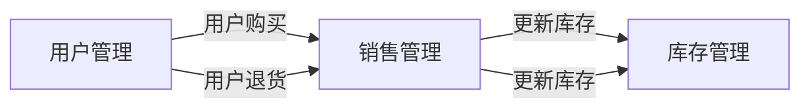

## 1.背景介绍

在当今的数字化时代，图书销售管理系统在图书销售行业中扮演着重要的角色。这种系统不仅可以有效地跟踪和管理图书库存，还可以处理销售、购买、退货等各种交易。本文将详细介绍图书销售管理系统的设计和实现过程。

## 2.核心概念与联系

图书销售管理系统的核心概念包括库存管理、销售管理和用户管理。库存管理负责跟踪和更新图书库存。销售管理处理所有的销售事务，包括购买、退货等。用户管理则负责处理用户的注册、登录、权限分配等事务。

这些核心概念之间存在密切的联系。例如，当一个用户购买一本书时，销售管理部分会处理这个交易，同时库存管理部分需要更新库存信息。

## 3.核心算法原理具体操作步骤

这个系统的核心算法包括库存更新算法、销售处理算法和用户权限验证算法。

### 3.1 库存更新算法

每当有销售或退货发生时，系统需要通过库存更新算法来更新库存信息。这个算法的操作步骤如下：

1. 获取销售或退货的图书信息，包括图书ID和数量。
2. 在数据库中查找对应的图书记录。
3. 根据销售或退货的数量更新图书记录的库存数量。

### 3.2 销售处理算法

销售处理算法负责处理用户的购买和退货请求。这个算法的操作步骤如下：

1. 获取用户的请求，包括请求类型（购买或退货）、图书ID和数量。
2. 验证用户的权限。只有注册用户才能进行购买或退货操作。
3. 如果请求类型为购买，检查库存是否充足。如果库存不足，返回错误信息。
4. 如果请求类型为退货，检查用户是否有足够的购买记录。如果没有