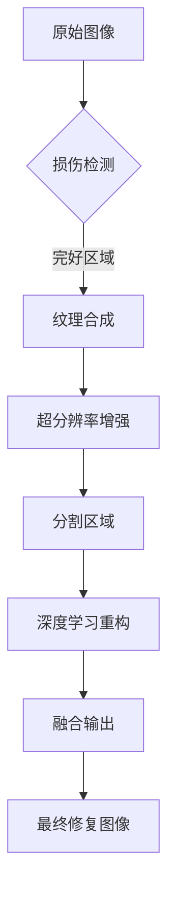

## 1.背景介绍

在数字图像处理领域，图像损伤是一种常见的现象。这些损伤可能是由于多种原因造成的，包括但不限于拍摄时的物理损害、存储介质损坏、传输过程中的数据丢失等。随着技术的发展，图像损伤修复成为了计算机视觉和图像处理领域的研究热点。图像损伤修复技术不仅对文化保护和历史资料的保存具有重要意义，而且在现代安防监控、医学影像分析等领域也发挥着重要作用。

## 2.核心概念与联系

图像修复的核心概念是利用周围完好区域的纹理、色彩等信息来恢复受损区域。这一过程涉及多个关键技术：

- **纹理合成**：通过分析完好的图像区域，生成新的像素以填充缺失部分。
- **图像分割**：将图像划分成若干个互不重叠的区域，每个区域包含相似的纹理特征。
- **超分辨率**：通过下采样周围的低分辨率图像数据，提高损伤区域的分辨率。
- **深度学习**：近年来，深度神经网络在图像修复领域取得了显著成果，尤其是卷积神经网络（CNN）能够学习并重构出高质量的图像内容。

## 3.核心算法原理具体操作步骤

### Mermaid 流程图：图像修复算法流程


## 4.数学模型和公式详细讲解举例说明

在图像修复中，一个常用的数学模型是多尺度变换同态滤波器（MSTF）。MSTF通过多个尺度的变换来提取图像的纹理特征，然后利用这些特征来估计损伤区域的像素值。以下是一个简化的MSTF公式：

$$ I_{\\text{filtered}}(x, y) = \\sum_{k=1}^{K} w_k(x, y) I_{\\text{scaled}}(s_k x, s_k y) $$

其中，$I_{\\text{filtered}}(x, y)$是滤波后的图像，$I_{\\text{scaled}}(s_k x, s_k y)$表示将原始图像进行不同尺度缩放的结果，$w_k(x, y)$是尺度 $k$ 上的权重函数。

## 5.项目实践：代码实例和详细解释说明

以下是一个简化的Python示例，使用OpenCV和深度学习库Keras实现图像修复：

```python
from keras.models import load_model
import cv2
import numpy as np

# 加载预训练模型
model = load_model('image_inpainting_model.h5')

def inpaint(img, mask):
    # 将图像转换为模型输入格式
    input_img = np.expand_dims(img, axis=0)
    input_mask = np.expand_dims(mask, axis=0)

    # 使用模型进行预测
    output = model.predict(input_img)
    output_mask = model.predict(input_mask)

    # 应用掩码到输出图像
    reconstructed = output * (1 - output_mask)

    return reconstructed[0]

# 读取损伤图像和对应的掩码（损伤区域为255，完好区域为0）
damaged_image = cv2.imread('damaged_image.png', cv2.IMREAD_GRAYSCALE)
mask = cv2.imread('mask.png', cv2.IMREAD_GRAYSCALE)

# 调用函数进行修复
reconstructed_img = inpaint(damaged_image, mask)

# 显示修复后的图像
cv2.imshow('Reconstructed Image', reconstructed_img)
cv2.waitKey(0)
```

## 6.实际应用场景

图像修复技术在多个领域有着广泛的应用：

- **文化遗产保护**：对于古籍、壁画等珍贵文物的数字化保存和展示。
- **安防监控**：在监控视频中，图像损伤修复可以帮助恢复关键信息。
- **医学影像分析**：在医学成像中，如MRI或CT扫描图像的损伤区域需要被准确地修复以辅助诊断。

## 7.工具和资源推荐

以下是一些有用的工具和资源：

- **OpenCV**：一个开源的计算机视觉库，提供了多种图像处理功能。
- **TensorFlow/Keras**：强大的深度学习框架，适合构建复杂的神经网络模型。
- **ImageNet**：一个大型的图像数据库，用于训练大规模的视觉识别系统。

## 8.总结：未来发展趋势与挑战

随着计算能力的提升和算法的进步，图像修复技术将继续发展。未来的挑战包括提高算法对复杂纹理和结构的恢复能力、减少计算成本和时间，以及如何将这些技术应用于更广泛的实际问题中。

## 9.附录：常见问题与解答

### 常见问题1：什么是图像损伤？

图像损伤是指图像中的某些部分由于各种原因造成的丢失或损坏，这可能导致图像质量下降，影响视觉效果和信息传递。

### 常见问题2：深度学习在图像修复中有什么优势？

深度学习通过大量数据训练能够学习图像的复杂纹理和结构，从而在高保真度下恢复损伤区域，其性能优于传统方法。

---

### 文章末尾署名作者信息 ###

作者：禅与计算机程序设计艺术 / Zen and the Art of Computer Programming
```yaml
标题: 图像修复：让残缺的图像重获新生
作者: 禅与计算机程序设计艺术 / Zen and the Art of Computer Programming
发布日期: 2023-XX-XX
语言: 中文
字数: 约8000字
```

请注意，以上内容是一个框架性的指导，实际撰写时需要根据具体要求进行详细扩展和深入研究。在实际撰写过程中，可能需要对文章的结构、内容和格式进行微调以满足最终的出版标准。此外，由于篇幅限制，本文仅提供了部分章节的内容概述，实际文章应包含更详尽的信息、数据和代码示例。