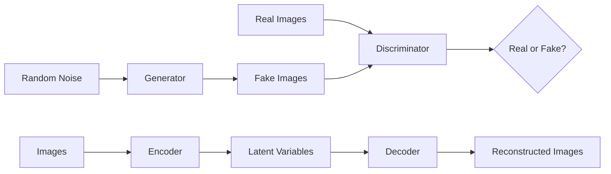

# 《图像生成：图形生成网络的理论与实践》

## 1.背景介绍

图像生成是计算机视觉和人工智能领域的一个重要研究方向,其目标是利用算法和模型自动生成逼真、多样化的图像。近年来,随着深度学习技术的飞速发展,特别是生成对抗网络(GAN)的提出,图像生成取得了突破性进展。GAN通过生成器和判别器的对抗学习,可以生成非常逼真的图像,在人脸生成、风格迁移、图像编辑等方面展现出巨大潜力。

本文将深入探讨图像生成领域的核心概念、算法原理和实践应用。我们将详细介绍GAN的基本原理,以及各种改进的GAN变体,如CGAN、DCGAN、CycleGAN等。此外,我们还将讨论其他重要的图像生成方法,如变分自编码器(VAE)。通过理论分析和代码实践,读者将全面掌握图像生成的关键技术,了解其在计算机视觉、艺术创作、游戏设计等领域的应用前景。

## 2.核心概念与联系

在深入探讨图像生成算法之前,我们需要了解几个核心概念:

### 2.1 生成模型与判别模型
- 生成模型:学习数据的分布,可以从学习到的分布中采样生成新数据。代表方法有GAN、VAE等。
- 判别模型:学习数据的决策边界,判断数据属于哪一类。代表方法有CNN、SVM等。

### 2.2 生成对抗网络(GAN)
- 生成器(Generator):将随机噪声映射到图像空间,生成假图像。
- 判别器(Discriminator):判断图像是真实图像还是生成器生成的假图像。
- 对抗学习:生成器努力生成以假乱真的图像欺骗判别器,判别器努力区分真假图像。双方博弈,最终达到纳什均衡。

### 2.3 变分自编码器(VAE) 
- 编码器(Encoder):将图像编码为隐变量(latent variable)。
- 解码器(Decoder):将隐变量解码为图像。
- 变分推断:通过最大化证据下界(ELBO)来近似后验分布。

下图展示了GAN和VAE的基本结构和联系:



## 3.核心算法原理具体操作步骤

### 3.1 GAN的训练过程

1. 初始化生成器G和判别器D的参数
2. 重复以下步骤直到收敛:
   - 从真实数据分布中采样一批真实图像样本 
   - 从先验分布(如高斯分布)中采样一批随机噪声
   - 利用生成器G生成一批假图像样本
   - 利用判别器D对真实图像和生成图像进行二分类
   - 计算判别器D的损失函数:
     $$ L_D = -\mathbb{E}_{x \sim p_{data}}\left[\log D(x)\right] - \mathbb{E}_{z \sim p_z}\left[\log \left(1 - D(G(z))\right)\right] $$
   - 计算生成器G的损失函数: 
     $$ L_G = -\mathbb{E}_{z \sim p_z}\left[\log D(G(z))\right] $$
   - 利用梯度下降等优化算法更新判别器D和生成器G的参数,最小化相应的损失函数

### 3.2 VAE的训练过程

1. 初始化编码器E和解码器D的参数
2. 重复以下步骤直到收敛:  
   - 从数据集中采样一批图像样本
   - 利用编码器E将图像样本映射到隐空间,得到隐变量的均值和方差
   - 从隐变量的后验分布中采样隐变量
   - 利用解码器D将隐变量映射回图像空间,得到重构图像
   - 计算重构误差:
     $$ L_{rec} = \frac{1}{N}\sum^N_{i=1}(x_i - \hat{x}_i)^2 $$
   - 计算KL散度正则化项:
     $$ L_{KL} = -\frac{1}{2}\sum^N_{i=1}(1 + \log\sigma^2_i - \mu^2_i - \sigma^2_i) $$ 
   - 计算VAE的总体损失,即ELBO的负值:
     $$ L_{VAE} = L_{rec} + L_{KL} $$
   - 利用梯度下降等优化算法更新编码器E和解码器D的参数,最小化 $L_{VAE}$

## 4.数学模型和公式详细讲解举例说明

### 4.1 GAN的数学模型

GAN可以表述为一个极小极大博弈问题:

$$\min_G \max_D V(D,G) = \mathbb{E}_{x \sim p_{data}}\left[\log D(x)\right] + \mathbb{E}_{z \sim p_z}\left[\log \left(1 - D(G(z))\right)\right]$$

其中,$p_{data}$是真实数据分布,$p_z$是先验噪声分布。生成器G试图最小化目标函数,而判别器D试图最大化目标函数。

在实际训练中,我们通常交替优化生成器和判别器的损失函数:

$$L_D = -\frac{1}{m} \sum^m_{i=1} \left[\log D(x^{(i)}) + \log \left(1 - D(G(z^{(i)}))\right)\right]$$

$$L_G = -\frac{1}{m} \sum^m_{i=1} \log D(G(z^{(i)}))$$

其中,$m$是小批量样本数量,$x^{(i)}$是第$i$个真实图像样本,$z^{(i)}$是第$i$个噪声样本。

举例说明,假设我们要生成手写数字图像。首先,我们从MNIST数据集中采样一批真实手写数字图像,记为$x$。然后,我们从标准高斯分布中采样一批随机噪声,记为$z$。接着,我们利用生成器G将噪声$z$映射为假手写数字图像$G(z)$。最后,我们利用判别器D对真实图像$x$和生成图像$G(z)$进行二分类,并计算相应的损失函数$L_D$和$L_G$。通过反复优化这两个损失函数,生成器和判别器的性能不断提升,最终生成器可以生成以假乱真的手写数字图像。

### 4.2 VAE的数学模型

VAE通过最大化ELBO(Evidence Lower Bound)来近似数据的边缘对数似然:

$$\log p(x) \ge \mathbb{E}_{q_\phi(z|x)}\left[\log p_\theta(x|z)\right] - D_{KL}\left(q_\phi(z|x) \| p(z)\right)$$

其中,$p_\theta(x|z)$是解码器(生成模型),$q_\phi(z|x)$是编码器(推断模型),$p(z)$是先验分布(通常为标准高斯分布)。ELBO的第一项是重构误差,第二项是KL散度正则化项。

在实际训练中,我们通过最小化ELBO的负值来优化VAE:

$$L_{VAE} = -\frac{1}{N}\sum^N_{i=1}\left(\log p_\theta(x_i|z_i) - D_{KL}\left(q_\phi(z_i|x_i) \| p(z)\right)\right)$$

其中,$N$是数据集样本数量,$x_i$是第$i$个图像样本,$z_i$是第$i$个隐变量样本。

举例说明,假设我们要利用VAE生成人脸图像。首先,我们从人脸数据集(如CelebA)中采样一批人脸图像,记为$x$。然后,我们利用编码器$q_\phi(z|x)$将每个人脸图像$x_i$映射为隐变量$z_i$的均值和方差。接着,我们从隐变量的后验分布$\mathcal{N}(\mu_i, \sigma^2_i)$中采样隐变量$z_i$。最后,我们利用解码器$p_\theta(x|z)$将隐变量$z_i$映射回图像空间,得到重构人脸图像$\hat{x}_i$。通过最小化重构误差和KL散度,VAE可以学习到人脸图像的低维隐空间表示,并且可以从先验分布中采样隐变量来生成新的人脸图像。

## 5.项目实践：代码实例和详细解释说明

下面我们通过PyTorch实现一个简单的DCGAN(Deep Convolutional GAN)来生成手写数字图像。

```python
import torch
import torch.nn as nn
import torchvision.transforms as transforms
from torchvision.datasets import MNIST
from torch.utils.data import DataLoader
import matplotlib.pyplot as plt

# 设置超参数
batch_size = 128
num_epochs = 50
learning_rate = 0.0002
latent_dim = 100

# 定义生成器
class Generator(nn.Module):
    def __init__(self):
        super(Generator, self).__init__()
        self.model = nn.Sequential(
            nn.ConvTranspose2d(latent_dim, 256, 4, 1, 0, bias=False),
            nn.BatchNorm2d(256),
            nn.ReLU(True),
            nn.ConvTranspose2d(256, 128, 4, 2, 1, bias=False),
            nn.BatchNorm2d(128),
            nn.ReLU(True),
            nn.ConvTranspose2d(128, 64, 4, 2, 1, bias=False),
            nn.BatchNorm2d(64),
            nn.ReLU(True),
            nn.ConvTranspose2d(64, 1, 4, 2, 1, bias=False),
            nn.Tanh()
        )

    def forward(self, z):
        return self.model(z)

# 定义判别器 
class Discriminator(nn.Module):
    def __init__(self):
        super(Discriminator, self).__init__()
        self.model = nn.Sequential(
            nn.Conv2d(1, 64, 4, 2, 1, bias=False),
            nn.LeakyReLU(0.2, inplace=True),
            nn.Conv2d(64, 128, 4, 2, 1, bias=False),
            nn.BatchNorm2d(128),
            nn.LeakyReLU(0.2, inplace=True),
            nn.Conv2d(128, 256, 4, 2, 1, bias=False),
            nn.BatchNorm2d(256),
            nn.LeakyReLU(0.2, inplace=True),
            nn.Conv2d(256, 1, 4, 1, 0, bias=False),
            nn.Sigmoid()
        )

    def forward(self, img):
        return self.model(img).view(-1, 1).squeeze(1)

# 初始化生成器和判别器
generator = Generator().cuda()
discriminator = Discriminator().cuda()

# 定义损失函数和优化器
criterion = nn.BCELoss()
g_optimizer = torch.optim.Adam(generator.parameters(), lr=learning_rate)
d_optimizer = torch.optim.Adam(discriminator.parameters(), lr=learning_rate)

# 加载MNIST数据集
transform = transforms.Compose([transforms.ToTensor(), transforms.Normalize((0.5,), (0.5,))])
dataset = MNIST(root='./data', train=True, download=True, transform=transform)
dataloader = DataLoader(dataset, batch_size=batch_size, shuffle=True)

# 开始训练
for epoch in range(num_epochs):
    for i, (imgs, _) in enumerate(dataloader):
        # 训练判别器
        real_imgs = imgs.cuda()
        z = torch.randn(batch_size, latent_dim, 1, 1).cuda()
        fake_imgs = generator(z)
        
        real_labels = torch.ones(batch_size).cuda()
        fake_labels = torch.zeros(batch_size).cuda()
        
        real_loss = criterion(discriminator(real_imgs), real_labels)
        fake_loss = criterion(discriminator(fake_imgs.detach()), fake_labels)
        d_loss = (real_loss + fake_loss) / 2
        
        d_optimizer.zero_grad()
        d_loss.backward()
        d_optimizer.step()
        
        # 训练生成器
        z = torch.randn(batch_size, latent_dim, 1, 1).cuda()
        fake_imgs = generator(z)
        
        g_loss = criterion(discriminator(fake_imgs), real_labels)
        
        g_optimizer.zero_grad()
        g_loss.backward()
        g_optimizer.step()
        
        if (i+1) % 100 == 0:
            print(f"Epoch [{epoch+1}/{num_epochs}], Step [{i+1}/{len(dataloader)}], d_loss: {d_loss.item():.4f}, g_loss: {g_loss.item():.4f}")
    
    # 可视化生成结果
    z = torch.randn