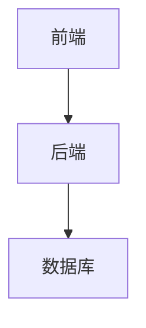

# 在线图书销售系统详细设计与具体代码实现

## 1.背景介绍

在当今数字时代,在线购物已经成为人们生活中不可或缺的一部分。随着电子商务的蓬勃发展,在线图书销售系统已经成为了一个重要的应用领域。这种系统不仅为读者提供了购买图书的便利渠道,同时也为出版商和书商创造了新的销售模式和商业机遇。

在线图书销售系统需要处理大量的数据和复杂的业务逻辑,包括图书信息管理、订单处理、支付系统集成、库存管理、物流跟踪等多个模块。因此,设计和实现一个高效、可扩展、安全的在线图书销售系统是一项具有挑战性的任务。

### 1.1 系统架构概览

在线图书销售系统通常采用分层架构,包括表现层(前端)、业务逻辑层(后端)和数据访问层。前端负责与用户交互,展示图书信息和处理用户操作;后端负责处理业务逻辑,如订单管理、支付处理等;数据访问层则负责与数据库进行交互,存储和检索数据。



### 1.2 技术选型

在线图书销售系统可以使用多种技术栈进行开发,常见的选择包括:

- 前端: React、Angular、Vue等框架
- 后端: Java(Spring Boot)、Python(Django)、Node.js等
- 数据库: MySQL、PostgreSQL、MongoDB等
- 缓存: Redis
- 消息队列: RabbitMQ、Kafka
- 搜索引擎: Elasticsearch

本文将重点介绍使用Java Spring Boot框架开发后端系统的详细设计和实现。

## 2.核心概念与联系

在线图书销售系统涉及到多个核心概念,包括:

### 2.1 图书(Book)

图书是整个系统的核心实体,包含了图书的基本信息,如书名、作者、出版社、ISBN号、价格等。每本图书都有一个唯一的ID,用于识别和管理。

### 2.2 购物车(ShoppingCart)

购物车是用户临时存储所选择图书的地方。用户可以将感兴趣的图书加入购物车,并在结账时一次性购买。购物车中的图书数量和总价格都需要实时计算和显示。

### 2.3 订单(Order)

订单是用户购买图书的凭证,包含了购买的图书清单、总价格、收货地址等信息。每个订单都有一个唯一的ID,以及对应的订单状态(已下单、已付款、已发货等)。

### 2.4 支付(Payment)

支付模块负责处理用户的付款,集成了第三方支付平台(如PayPal、微信支付等)。支付成功后,订单状态会更新为已付款。

### 2.5 库存(Inventory)

库存模块管理图书的库存数量。每次有订单下单时,相应图书的库存数量会减少;如果库存不足,则无法下单。

这些核心概念之间存在着紧密的联系,它们共同构成了在线图书销售系统的业务逻辑。下面是它们之间的关系图:


## 3.核心算法原理具体操作步骤

在线图书销售系统的核心算法主要包括:

### 3.1 购物车算法

购物车算法需要实现以下功能:

1. 添加图书到购物车
2. 从购物车中移除图书
3. 修改购物车中图书数量
4. 计算购物车总价格

购物车算法的具体操作步骤如下:

1. 获取用户ID,根据用户ID查找对应的购物车对象
2. 遍历购物车中的图书项,查找是否存在要添加的图书
   - 如果存在,增加图书数量
   - 如果不存在,创建新的图书项,添加到购物车
3. 移除图书项时,直接从购物车中删除该项
4. 修改图书数量时,更新对应图书项的数量
5. 计算总价格时,遍历购物车中所有图书项,累加每个项的单价*数量

### 3.2 订单算法

订单算法需要实现以下功能:

1. 创建新订单
2. 更新订单状态
3. 取消订单

订单算法的具体操作步骤如下:

1. 从购物车中获取图书清单和总价格
2. 创建新的订单对象,包含图书清单、总价格、默认订单状态(已下单)
3. 将订单信息存储到数据库
4. 如果支付成功,更新订单状态为已付款
5. 如果发货,更新订单状态为已发货
6. 取消订单时,需要恢复相应图书的库存数量

### 3.3 库存算法

库存算法需要实现以下功能:

1. 获取图书库存数量
2. 更新图书库存数量
3. 处理库存不足情况

库存算法的具体操作步骤如下:

1. 在创建订单前,检查订单中每本图书的库存数量
2. 如果所有图书库存充足,创建订单,并减少相应图书的库存数量
3. 如果有图书库存不足,拒绝创建订单,给出提示信息
4. 当订单取消时,需要增加相应图书的库存数量

## 4.数学模型和公式详细讲解举例说明

在线图书销售系统中,我们需要使用一些数学模型和公式来计算和优化系统性能。

### 4.1 图书推荐算法

为了提高用户体验和销售额,我们可以使用协同过滤算法为用户推荐感兴趣的图书。常见的协同过滤算法包括基于用户的协同过滤和基于物品的协同过滤。

#### 4.1.1 基于用户的协同过滤

基于用户的协同过滤算法的核心思想是:给定一个用户,找到与他兴趣相似的其他用户,然后根据这些用户的喜好为目标用户推荐物品。

相似度计算公式:

$$
sim(u,v)=\frac{\sum\limits_{i\in I_{uv}}(r_{ui}-\overline{r_u})(r_{vi}-\overline{r_v})}{\sqrt{\sum\limits_{i\in I_{uv}}(r_{ui}-\overline{r_u})^2}\sqrt{\sum\limits_{i\in I_{uv}}(r_{vi}-\overline{r_v})^2}}
$$

其中:
- $sim(u,v)$ 表示用户 $u$ 和用户 $v$ 的相似度
- $I_{uv}$ 表示用户 $u$ 和用户 $v$ 都评过分的物品集合
- $r_{ui}$ 表示用户 $u$ 对物品 $i$ 的评分
- $\overline{r_u}$ 表示用户 $u$ 的平均评分

根据用户相似度,我们可以预测目标用户对物品的兴趣程度:

$$
p_{ui}=\overline{r_u}+\frac{\sum\limits_{v\in S^k_u(i)}sim(u,v)(r_{vi}-\overline{r_v})}{\sum\limits_{v\in S^k_u(i)}|sim(u,v)|}
$$

其中:
- $p_{ui}$ 表示预测用户 $u$ 对物品 $i$ 的兴趣程度
- $S^k_u(i)$ 表示对物品 $i$ 评过分的前 $k$ 个与用户 $u$ 最相似的用户集合

根据预测的兴趣程度,我们可以为目标用户推荐感兴趣的图书。

#### 4.1.2 基于物品的协同过滤

基于物品的协同过滤算法的核心思想是:给定一个物品,找到与它相似的其他物品,然后根据目标用户对这些相似物品的喜好程度为其推荐物品。

物品相似度计算公式:

$$
sim(i,j)=\frac{\sum\limits_{u\in U_{ij}}(r_{ui}-\overline{r_i})(r_{uj}-\overline{r_j})}{\sqrt{\sum\limits_{u\in U_{ij}}(r_{ui}-\overline{r_i})^2}\sqrt{\sum\limits_{u\in U_{ij}}(r_{uj}-\overline{r_j})^2}}
$$

其中:
- $sim(i,j)$ 表示物品 $i$ 和物品 $j$ 的相似度
- $U_{ij}$ 表示对物品 $i$ 和物品 $j$ 都评过分的用户集合
- $r_{ui}$ 表示用户 $u$ 对物品 $i$ 的评分
- $\overline{r_i}$ 表示物品 $i$ 的平均评分

根据物品相似度,我们可以预测目标用户对物品的兴趣程度:

$$
p_{ui}=\overline{r_u}+\frac{\sum\limits_{j\in S^k_i(u)}sim(i,j)(r_{uj}-\overline{r_j})}{\sum\limits_{j\in S^k_i(u)}|sim(i,j)|}
$$

其中:
- $p_{ui}$ 表示预测用户 $u$ 对物品 $i$ 的兴趣程度
- $S^k_i(u)$ 表示用户 $u$ 评过分的前 $k$ 个与物品 $i$ 最相似的物品集合

根据预测的兴趣程度,我们可以为目标用户推荐感兴趣的图书。

### 4.2 库存优化模型

为了优化库存管理,减少库存成本,我们可以建立一个数学模型来确定最佳库存水平。

假设:
- 每本图书的订购成本为 $c$
- 每本图书的库存成本为 $h$
- 每本图书的缺货成本为 $p$
- 图书的需求量服从概率分布 $f(x)$

我们的目标是最小化总成本 $TC$:

$$
TC=cE(Q)+hE(I)+pE(B)
$$

其中:
- $E(Q)$ 表示订购量的期望值
- $E(I)$ 表示库存量的期望值
- $E(B)$ 表示缺货量的期望值

根据经典的经济订货模型(Economic Order Quantity, EOQ),最优订货量 $Q^*$ 可以通过以下公式计算:

$$
Q^*=\sqrt{\frac{2cD}{h}}
$$

其中 $D$ 表示年度需求量。

通过确定最优订货量,我们可以最小化总成本,实现库存优化。

## 5.项目实践:代码实例和详细解释说明

在本节中,我们将提供一些核心模块的代码实例,并对其进行详细解释。

### 5.1 图书模块

`Book`类定义了图书的基本属性和方法:

```java
public class Book {
    private Long id;
    private String title;
    private String author;
    private String publisher;
    private String isbn;
    private Double price;
    private Integer inventory;
    
    // getters and setters
    
    // other methods
}
```

`BookRepository`接口定义了对图书信息进行增删改查的方法:

```java
public interface BookRepository {
    Book findById(Long id);
    List<Book> findAll();
    void save(Book book);
    void update(Book book);
    void delete(Long id);
}
```

`BookService`类实现了业务逻辑,如获取图书列表、更新库存等:

```java
@Service
public class BookService {
    
    @Autowired
    private BookRepository bookRepository;
    
    public List<Book> getAllBooks() {
        return bookRepository.findAll();
    }
    
    public Book getBookById(Long id) {
        return bookRepository.findById(id);
    }
    
    public void updateInventory(Long bookId, Integer quantity) {
        Book book = bookRepository.findById(bookId);
        book.setInventory(book.getInventory() - quantity);
        bookRepository.update(book);
    }
}
```

### 5.2 购物车模块

`ShoppingCart`类表示用户的购物车:

```java
public class ShoppingCart {
    private Long userId;
    private List<CartItem> items;
    private Double totalPrice;
    
    // getters and setters
    
    public void addItem(Book book, Integer quantity) {
        // implementation
    }
    
    public void removeItem(Book book) {
        // implementation
    }
    
    public void updateItemQuantity(Book book, Integer quantity) {
        // implementation
    }
    
    public void calculateTotalPrice() {
        // implementation
    }
}
```

`CartItem`类表示购物车中的一个条目:

```java
public class CartItem {
    private Book book;
    private Integer quantity;
    
    // getters and setters
}
```

`ShoppingCartService`类实现了购物车的业务逻辑:

```java
@Service