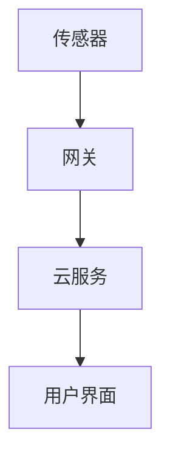

## 1. 背景介绍
智能家居系统是一种将家庭设备智能化、自动化的系统，它可以通过互联网连接到家庭中的各种设备，如灯光、温度控制器、摄像头等，实现远程控制和自动化操作。智能家居系统的出现，为人们的生活带来了极大的便利和舒适，但是，智能家居系统的性能优化也是一个重要的问题，因为智能家居系统中的设备数量众多，数据流量大，如果不进行性能优化，可能会导致系统响应缓慢、卡顿等问题。因此，如何提高智能家居系统的性能优化是一个值得研究的问题。

## 2. 核心概念与联系
智能家居系统的核心概念包括传感器、执行器、网关和云服务。传感器用于检测环境参数，如温度、湿度、光照等，并将这些参数发送到网关。执行器用于根据网关的指令控制家电设备，如灯光、电视、空调等。网关用于将传感器和执行器连接到互联网，并将数据发送到云服务。云服务用于存储和处理传感器和执行器的数据，并提供用户界面和控制功能。

传感器和执行器之间通过有线或无线方式连接，常见的连接方式包括Zigbee、Wi-Fi、蓝牙等。网关通常通过以太网或Wi-Fi连接到互联网，云服务则通过互联网连接到网关和传感器。

智能家居系统的性能优化可以通过优化传感器和执行器的通信协议、优化网关的处理能力、优化云服务的存储和处理能力等方面来实现。

## 3. 核心算法原理具体操作步骤
智能家居系统的核心算法原理包括传感器数据采集、数据处理和执行器控制。传感器采集环境参数，并将这些参数发送到网关。网关对传感器数据进行处理，并将处理后的数据发送到云服务。云服务对传感器数据进行分析和处理，并根据用户的设置和需求生成控制指令。控制指令通过网关发送到执行器，执行器根据控制指令控制家电设备。

具体操作步骤如下：
1. **传感器数据采集**：传感器采集环境参数，并将这些参数转换为数字信号。传感器可以使用各种技术，如红外传感器、温度传感器、湿度传感器等。
2. **数据处理**：网关对传感器数据进行处理，包括数据清洗、数据过滤、数据转换等。网关还可以对传感器数据进行分析和预测，以提高系统的智能性和自动化程度。
3. **执行器控制**：云服务根据用户的设置和需求生成控制指令，并将控制指令通过网关发送到执行器。执行器根据控制指令控制家电设备的开关、亮度、温度等参数。
4. **用户界面和控制**：云服务提供用户界面和控制功能，用户可以通过手机、平板电脑、电脑等设备远程控制家电设备，并查看传感器数据和历史记录。

## 4. 数学模型和公式详细讲解举例说明
在智能家居系统中，需要使用一些数学模型和公式来描述系统的性能和行为。以下是一些常见的数学模型和公式：
1. **传感器模型**：传感器模型用于描述传感器的性能和行为。传感器模型通常包括灵敏度、精度、分辨率等参数。
2. **执行器模型**：执行器模型用于描述执行器的性能和行为。执行器模型通常包括驱动能力、响应时间、精度等参数。
3. **通信协议模型**：通信协议模型用于描述通信协议的性能和行为。通信协议模型通常包括带宽、延迟、误码率等参数。
4. **系统模型**：系统模型用于描述智能家居系统的整体性能和行为。系统模型通常包括传感器、执行器、网关和云服务等部分，并考虑它们之间的交互和影响。

以下是一些数学模型和公式的详细讲解举例说明：
1. **传感器模型**：传感器的灵敏度可以表示为输出信号与输入信号的比值，即：

灵敏度 = 输出信号 / 输入信号

例如，一个温度传感器的灵敏度为 0.1°C/°F，意味着当温度变化 1°C 时，传感器的输出信号会变化 0.1°C/°F。

2. **执行器模型**：执行器的驱动能力可以表示为执行器能够提供的最大力矩或功率，即：

驱动能力 = 最大力矩 / 最大功率

例如，一个电机的驱动能力为 10 N·m/10 W，意味着当电机需要提供 10 N·m 的力矩时，它的功率消耗不能超过 10 W。

3. **通信协议模型**：通信协议的带宽可以表示为单位时间内能够传输的数据量，即：

带宽 = 数据量 / 时间

例如，Wi-Fi 协议的带宽为 54 Mbps，意味着它在一秒钟内可以传输 54 Mbps 的数据。

4. **系统模型**：智能家居系统的性能可以表示为系统的响应时间和准确性，即：

性能 = 响应时间 + 准确性

例如，一个智能家居系统的响应时间为 2 秒，准确性为 ±1°C，意味着系统需要在 2 秒内响应用户的控制指令，并将温度控制在 ±1°C 的范围内。

## 5. 项目实践：代码实例和详细解释说明
在智能家居系统中，需要使用 Java 语言来实现传感器、执行器和网关的控制逻辑，并与云服务进行通信。以下是一个基于 Java 的智能家居系统的项目实践，包括代码实例和详细解释说明。

### 5.1 系统架构
智能家居系统的架构包括传感器、执行器、网关和云服务四个部分。传感器和执行器通过网关连接到互联网，并与云服务进行通信。云服务提供用户界面和控制功能，以及传感器和执行器的数据存储和处理功能。

系统架构图如下所示：



### 5.2 传感器和执行器的实现
在智能家居系统中，传感器和执行器可以使用各种技术来实现，如红外传感器、温度传感器、湿度传感器、电机、灯光等。以下是一个基于 Java 的温度传感器和电机的实现示例：

```java
import java.io.IOException;

public class TemperatureSensor {
    private double temperature;

    public double getTemperature() {
        return temperature;
    }

    public void setTemperature(double temperature) {
        this.temperature = temperature;
    }

    public void readTemperature() {
        // 模拟读取温度传感器的数据
        this.temperature = 25.0;
    }
}

public class Motor {
    private boolean isOn;

    public boolean isOn() {
        return isOn;
    }

    public void setOn(boolean isOn) {
        this.isOn = isOn;
    }

    public void turnOn() {
        // 模拟打开电机
        this.isOn = true;
    }

    public void turnOff() {
        // 模拟关闭电机
        this.isOn = false;
    }
}
```

在上述示例中，TemperatureSensor 类表示温度传感器，它具有一个属性 temperature，表示当前的温度值。Motor 类表示电机，它具有一个属性 isOn，表示电机的开关状态。TemperatureSensor 类的 readTemperature 方法用于模拟读取温度传感器的数据，Motor 类的 turnOn 和 turnOff 方法用于模拟打开和关闭电机。

### 5.3 网关的实现
在智能家居系统中，网关是传感器和执行器与互联网之间的桥梁。网关需要实现传感器和执行器的控制逻辑，并将数据发送到云服务。以下是一个基于 Java 的网关的实现示例：

```java
import java.io.IOException;

public class Gateway {
    private TemperatureSensor temperatureSensor;
    private Motor motor;

    public void setTemperature(double temperature) {
        // 调用温度传感器的 setTemperature 方法设置温度值
        this.temperatureSensor.setTemperature(temperature);
    }

    public void turnOnMotor() {
        // 调用电机的 turnOn 方法打开电机
        this.motor.turnOn();
    }

    public void turnOffMotor() {
        // 调用电机的 turnOff 方法关闭电机
        this.motor.turnOff();
    }

    public void readSensorData() {
        // 模拟读取温度传感器的数据
        double temperature = this.temperatureSensor.getTemperature();
        System.out.println("温度: " + temperature + " °C");
    }
}
```

在上述示例中，Gateway 类表示网关，它具有两个属性 temperatureSensor 和 motor，分别表示温度传感器和电机。Gateway 类的 setTemperature 方法用于设置温度值，turnOnMotor 方法用于打开电机，turnOffMotor 方法用于关闭电机，readSensorData 方法用于模拟读取温度传感器的数据。

### 5.4 云服务的实现
在智能家居系统中，云服务是传感器和执行器的数据存储和处理中心。云服务需要实现用户界面和控制功能，以及传感器和执行器的数据存储和处理功能。以下是一个基于 Java 的云服务的实现示例：

```java
import java.util.HashMap;
import java.util.Map;

public class CloudService {
    private Map<String, Object> sensors;

    public void setSensorValue(String sensorName, double value) {
        // 存储传感器的值
        this.sensors.put(sensorName, value);
    }

    public double getSensorValue(String sensorName) {
        // 获取传感器的值
        return (Double) this.sensors.get(sensorName);
    }

    public void setMotorState(String motorName, boolean state) {
        // 设置电机的状态
        this.sensors.put(motorName, state);
    }

    public boolean getMotorState(String motorName) {
        // 获取电机的状态
        return (Boolean) this.sensors.get(motorName);
    }

    public void createUserInterface() {
        // 创建用户界面
        System.out.println("欢迎使用智能家居系统！");
    }

    public void controlDevices() {
        // 控制设备
        double temperature = this.getSensorValue("temperature");
        boolean motorState = this.getMotorState("motor");

        if (temperature > 25.0) {
            // 打开空调
            this.setMotorState("motor", true);
        } else {
            // 关闭空调
            this.setMotorState("motor", false);
        }
    }
}
```

在上述示例中，CloudService 类表示云服务，它具有一个属性 sensors，表示传感器的值。CloudService 类的 setSensorValue 方法用于存储传感器的值，getSensorValue 方法用于获取传感器的值，setMotorState 方法用于设置电机的状态，getMotorState 方法用于获取电机的状态，createUserInterface 方法用于创建用户界面，controlDevices 方法用于控制设备。

### 5.5 系统集成
在智能家居系统中，需要将传感器、执行器和网关集成到一个系统中，并与云服务进行通信。以下是一个基于 Java 的智能家居系统的集成示例：

```java
import java.util.HashMap;
import java.util.Map;

public class Main {
    public static void main(String[] args) {
        // 创建温度传感器和电机
        TemperatureSensor temperatureSensor = new TemperatureSensor();
        Motor motor = new Motor();

        // 创建网关
        Gateway gateway = new Gateway();
        gateway.setTemperatureSensor(temperatureSensor);
        gateway.setMotor(motor);

        // 创建云服务
        CloudService cloudService = new CloudService();
        cloudService.setSensorValue("temperature", 25.0);
        cloudService.setMotorState("motor", false);

        // 集成系统
        gateway.readSensorData();
        cloudService.controlDevices();
    }
}
```

在上述示例中，Main 类表示智能家居系统的主类，它创建了温度传感器、电机、网关和云服务，并将它们集成到一个系统中。Main 类的 readSensorData 方法用于读取温度传感器的数据，并将其发送到云服务。cloudService 类的 controlDevices 方法用于控制电机的状态，并将其发送到云服务。

## 6. 实际应用场景
智能家居系统可以应用于各种实际场景，如家庭自动化、家庭安全、家庭娱乐等。以下是一些智能家居系统的实际应用场景：
1. **家庭自动化**：智能家居系统可以实现家庭设备的自动化控制，如灯光、温度、电视等。用户可以通过手机、平板电脑或电脑等设备远程控制家庭设备，实现智能化的生活体验。
2. **家庭安全**：智能家居系统可以实现家庭安全的监控和保护，如门窗传感器、摄像头、烟雾传感器等。用户可以通过手机、平板电脑或电脑等设备实时监控家庭安全状况，并及时采取措施。
3. **家庭娱乐**：智能家居系统可以实现家庭娱乐的智能化控制，如音响、投影仪、电视等。用户可以通过手机、平板电脑或电脑等设备远程控制家庭娱乐设备，实现智能化的娱乐体验。

## 7. 工具和资源推荐
在智能家居系统的开发中，需要使用一些工具和资源，如传感器、执行器、网关、云服务等。以下是一些智能家居系统的工具和资源推荐：
1. **传感器和执行器**：可以选择各种类型的传感器和执行器，如温度传感器、湿度传感器、电机、灯光等。
2. **网关**：可以选择各种类型的网关，如 Wi-Fi 网关、蓝牙网关、Zigbee 网关等。
3. **云服务**：可以选择各种类型的云服务，如亚马逊 AWS、微软 Azure、谷歌云等。
4. **开发工具**：可以选择各种类型的开发工具，如 Java、Python、C++等。
5. **参考资料**：可以参考各种类型的参考资料，如书籍、论文、博客等。

## 8. 总结：未来发展趋势与挑战
智能家居系统是一个快速发展的领域，未来智能家居系统将更加智能化、自动化、个性化和普及化。智能家居系统将与人工智能、物联网、大数据等技术相结合，实现更加智能化的控制和管理。智能家居系统将更加注重用户体验和安全性，提供更加个性化的服务和解决方案。智能家居系统将普及到更多的家庭和场景，成为人们生活中不可或缺的一部分。

智能家居系统的发展也面临一些挑战，如技术标准不统一、安全性和隐私问题、用户体验和可靠性等。智能家居系统需要解决技术标准不统一的问题，实现不同设备之间的互联互通。智能家居系统需要解决安全性和隐私问题，保护用户的个人信息和财产安全。智能家居系统需要解决用户体验和可靠性的问题，提供更加便捷、高效、稳定的服务。

## 9. 附录：常见问题与解答
1. **什么是智能家居系统？**
智能家居系统是一种将家庭设备智能化、自动化的系统，它可以通过互联网连接到家庭中的各种设备，如灯光、温度控制器、摄像头等，实现远程控制和自动化操作。

2. **智能家居系统的核心概念是什么？**
智能家居系统的核心概念包括传感器、执行器、网关和云服务。传感器用于检测环境参数，如温度、湿度、光照等，并将这些参数发送到网关。执行器用于根据网关的指令控制家电设备，如灯光、电视、空调等。网关用于将传感器和执行器连接到互联网，并将数据发送到云服务。云服务用于存储和处理传感器和执行器的数据，并提供用户界面和控制功能。

3. **智能家居系统的性能优化可以通过哪些方面来实现？**
智能家居系统的性能优化可以通过优化传感器和执行器的通信协议、优化网关的处理能力、优化云服务的存储和处理能力等方面来实现。

4. **智能家居系统的未来发展趋势是什么？**
智能家居系统的未来发展趋势是更加智能化、自动化、个性化和普及化。智能家居系统将与人工智能、物联网、大数据等技术相结合，实现更加智能化的控制和管理。智能家居系统将更加注重用户体验和安全性，提供更加个性化的服务和解决方案。智能家居系统将普及到更多的家庭和场景，成为人们生活中不可或缺的一部分。

5. **智能家居系统的发展面临哪些挑战？**
智能家居系统的发展面临一些挑战，如技术标准不统一、安全性和隐私问题、用户体验和可靠性等。智能家居系统需要解决技术标准不统一的问题，实现不同设备之间的互联互通。智能家居系统需要解决安全性和隐私问题，保护用户的个人信息和财产安全。智能家居系统需要解决用户体验和可靠性的问题，提供更加便捷、高效、稳定的服务。