# 基于Unity3D的射击游戏

## 1.背景介绍

### 1.1 游戏开发概述

游戏开发是一个涉及多个学科的复杂过程,包括程序设计、美术设计、音效设计、剧情设计等多个环节。随着计算机硬件性能的不断提升和游戏引擎技术的日益成熟,游戏开发已经成为一个蓬勃发展的产业。

### 1.2 Unity3D游戏引擎介绍

Unity3D是一款跨平台的综合型游戏开发工具,支持多种编程语言,可以发布游戏到多个平台。它拥有强大的图形渲染能力、物理引擎、音频系统等模块,并提供了大量开发工具和资源,极大地提高了游戏开发的效率。

### 1.3 射击游戏类型概述 

射击游戏是一种非常经典和流行的游戏类型,玩家需要控制角色射击目标,通过消灭敌人、完成任务等方式获得分数。射击游戏的娱乐性和可玩性一直受到广大玩家的青睐。

## 2.核心概念与联系

### 2.1 游戏对象

在Unity3D中,游戏世界中的所有元素都是游戏对象(GameObject),包括可见的3D模型、光源、摄像机等。每个游戏对象都可以附加各种组件(Component),用于实现不同的功能。

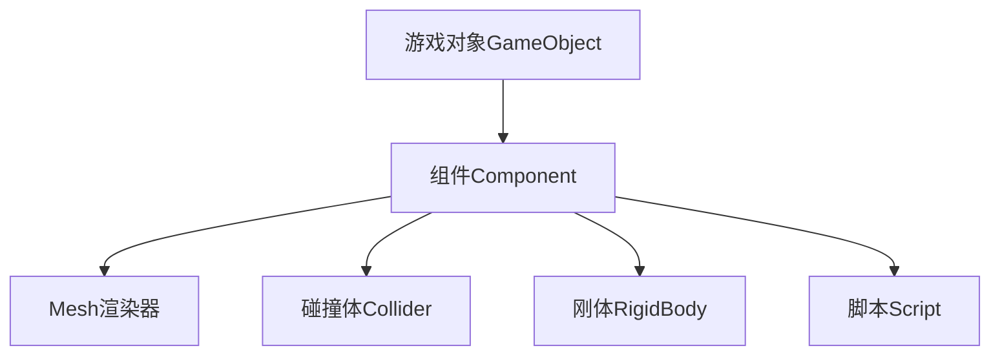

### 2.2 坐标系统

Unity使用右手坐标系统,其中X轴表示左右方向,Y轴表示上下方向,Z轴表示前后方向。游戏对象的位置、旋转和缩放都是基于这个坐标系统进行变换的。

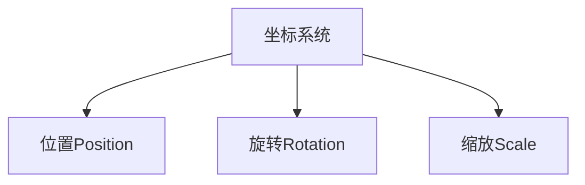

### 2.3 输入系统

Unity提供了输入系统(Input System)用于获取玩家的输入,如按键、鼠标、手柄等。在射击游戏中,通常需要获取玩家的移动、射击等操作输入。

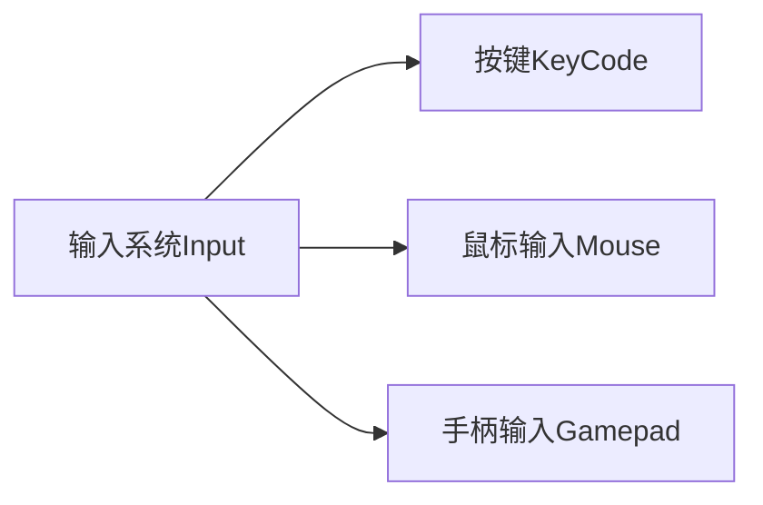

### 2.4 物理系统

Unity内置了强大的物理引擎,用于模拟真实世界中的物理现象,如碰撞、重力、摩擦力等。在射击游戏中,物理系统常用于模拟子弹飞行、爆炸效果等。

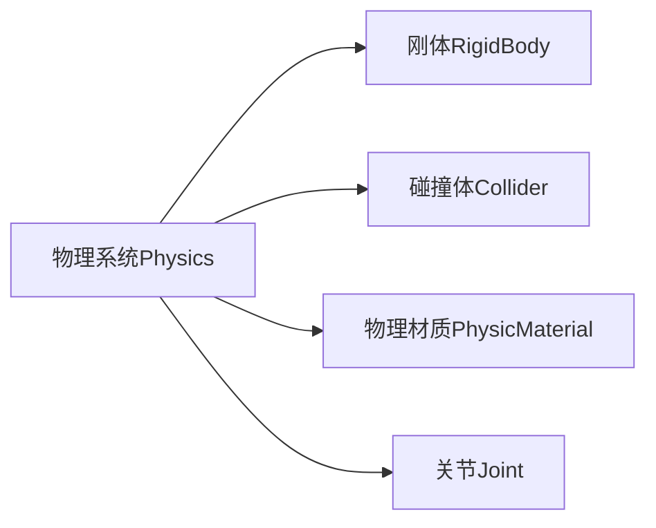

### 2.5 UI系统

Unity提供了完善的UI系统,用于创建游戏界面、菜单、HUD(Head Up Display)等用户界面元素。在射击游戏中,UI系统常用于显示玩家的分数、生命值、弹药等信息。

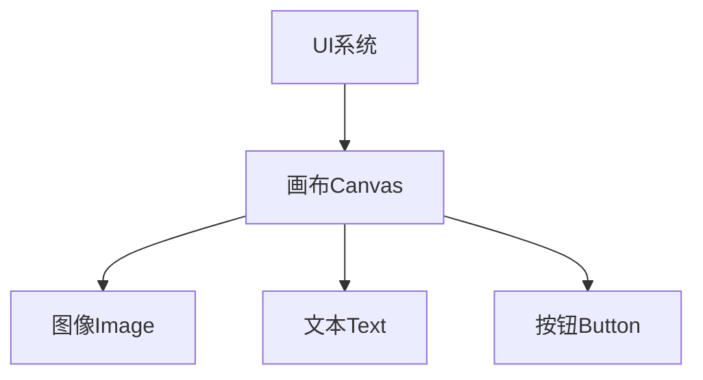

### 2.6 动画系统

Unity的动画系统支持创建和播放各种动画,如人物动作、特效动画等。在射击游戏中,常用于实现人物行走、射击、死亡等动画效果。

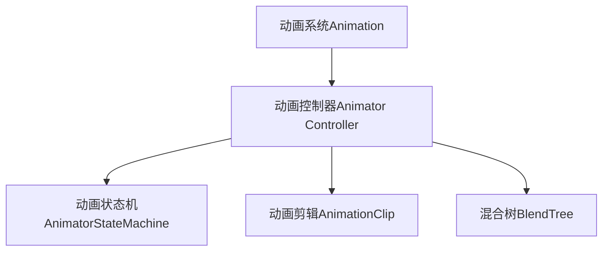

## 3.核心算法原理具体操作步骤

### 3.1 射击算法

射击算法是射击游戏的核心算法之一,用于计算子弹的飞行轨迹和命中检测。常见的射击算法有射线投射(Raycast)和投射物体(Projectile)两种方式。

#### 3.1.1 射线投射算法

射线投射算法使用一条无形的射线从枪口发射,检测射线与目标的碰撞。如果发生碰撞,则认为命中目标。这种算法简单高效,但无法模拟子弹的实际飞行轨迹和物理效果。

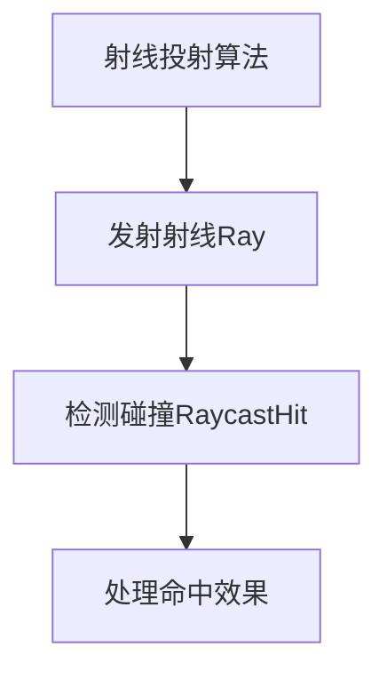

#### 3.1.2 投射物体算法

投射物体算法在枪口实例化一个具有物理属性的子弹对象,并对其施加一个初速度。子弹对象在物理引擎的作用下,会沿着抛物线轨迹飞行,并与场景中的其他物体发生碰撞和物理交互。这种算法更加逼真,但计算量较大。

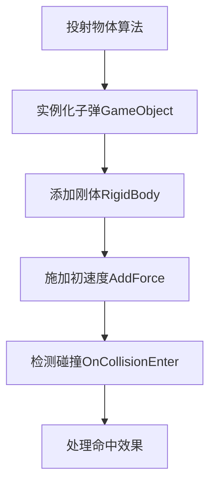

### 3.2 寻路算法

在射击游戏中,常常需要控制敌人或NPC(Non-Player Character)自主寻找路径,移动到目标位置。常见的寻路算法有A*算法、导航网格(Navigation Mesh)等。

#### 3.2.1 A*算法

A*算法是一种广泛应用的路径搜索算法,它利用启发式函数估计从当前节点到目标节点的代价,从而有效地缩小搜索空间,快速找到最优路径。

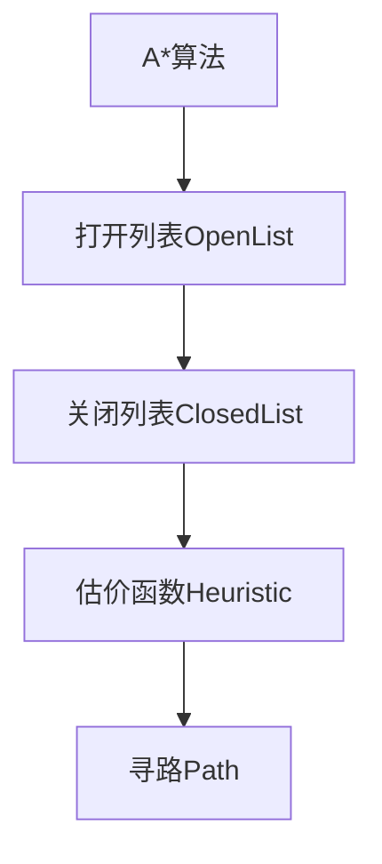

#### 3.2.2 导航网格算法

导航网格算法基于预先计算的导航网格数据,快速找到从起点到终点的最短路径。Unity内置了导航系统(Navigation System),可以自动生成导航网格数据,并提供API进行路径查询和移动。

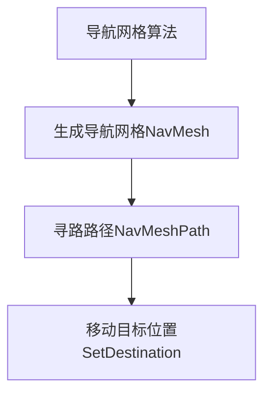

### 3.3 动画混合算法

在射击游戏中,常常需要根据不同的状态(行走、射击、死亡等)播放对应的动画。动画混合算法可以在多个动画之间进行无缝过渡,实现自然流畅的动画效果。

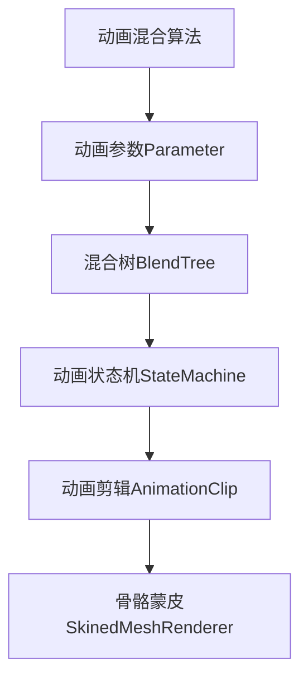

动画混合算法通常使用动画控制器(Animator Controller)来管理和控制动画状态的切换和混合。动画控制器中包含一个动画状态机,用于定义不同状态下播放的动画剪辑。动画参数(如移动速度、是否射击等)会影响动画状态机的状态转换。

在混合树中,可以设置不同动画剪辑之间的混合权重,实现平滑过渡。最终的动画数据会被应用到骨骼蒙皮网格渲染器(SkinnedMeshRenderer)上,驱动角色模型的骨骼变形,产生动画效果。

### 3.4 粒子效果算法

粒子效果是游戏中常见的特效,如火焰、烟雾、爆炸等。Unity提供了粒子系统(Particle System)用于创建和模拟粒子效果。粒子效果算法主要包括粒子发射、更新和渲染三个阶段。

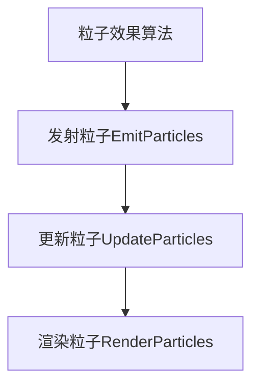

1. **发射粒子(EmitParticles)**:根据发射器的设置,在每一帧中创建新的粒子,包括粒子的初始位置、速度、大小、颜色等属性。

2. **更新粒子(UpdateParticles)**:对已经存在的粒子进行位置、速度、大小、颜色等属性的更新,模拟粒子的运动和变化。

3. **渲染粒子(RenderParticles)**:将更新后的粒子数据发送到GPU,进行顶点变换、光照计算和像素着色,最终在屏幕上渲染出粒子效果。

通过调节粒子系统的各种参数,如发射率、速度、加速度、旋转、颜色渐变等,可以模拟出丰富多样的粒子特效。

## 4.数学模型和公式详细讲解举例说明

### 4.1 射线投射算法数学模型

射线投射算法的数学模型可以用参数方程来表示:

$$
\begin{align}
x &= x_0 + t\cdot d_x \\
y &= y_0 + t\cdot d_y \\
z &= z_0 + t\cdot d_z
\end{align}
$$

其中$(x_0, y_0, z_0)$是射线的起点坐标,$(d_x, d_y, d_z)$是射线的方向向量,$t$是射线的参数。通过不断增加$t$的值,可以获得射线上不同位置的点坐标$(x, y, z)$。

在Unity中,可以使用`Physics.Raycast`函数进行射线投射,并获取命中信息:

```csharp
RaycastHit hit;
if (Physics.Raycast(rayOrigin, rayDirection, out hit, maxDistance))
{
    // 处理命中效果
    Debug.Log("Hit: " + hit.point);
}
```

### 4.2 投射物体算法数学模型

投射物体算法需要考虑重力、空气阻力等物理因素,其运动轨迹遵循抛物线方程:

$$
\begin{align}
x &= x_0 + v_x \cdot t \\
y &= y_0 + v_y \cdot t + \frac{1}{2}g \cdot t^2 \\
z &= z_0 + v_z \cdot t
\end{align}
$$

其中$(x_0, y_0, z_0)$是子弹的初始位置,$(v_x, v_y, v_z)$是子弹的初速度,$g$是重力加速度,通常取$-9.8 m/s^2$。

在Unity中,可以使用`GameObject`实例化一个子弹对象,添加`Rigidbody`组件,并使用`AddForce`函数施加初速度:

```csharp
GameObject bullet = Instantiate(bulletPrefab, gunTip.position, gunTip.rotation);
Rigidbody rb = bullet.GetComponent<Rigidbody>();
rb.AddForce(gunTip.forward * bulletSpeed, ForceMode.Impulse);
```

### 4.3 A*算法数学模型

A*算法的核心思想是使用一个估价函数$f(n)$来评估从当前节点$n$到目标节点的代价,并优先搜索代价最小的节点。估价函数$f(n)$由两部分组成:

$$
f(n) = g(n) + h(n)
$$

其中$g(n)$是从起点到当前节点$n$的实际代价,而$h(n)$是从当前节点$n$到目标节点的估计代价(启发式函数)。

常用的启发式函数有曼哈顿距离和欧几里得距离:

- **曼哈顿距离**:
  $$
  h(n) = |x_n - x_g| + |y_n - y_g|
  $$

- **欧几里得距离**:
  $$
  h(n) = \sqrt{(x_n - x_g)^2 + (y_n - y_g)^2}
  $$

其中$(x_n, y_n)$是当前节点的坐标,$(x_g, y_g)$是目标节点的坐标。

在Unity中,可以使用A*寻路插件(如A*PathFinding Project)实现A*算法。

### 4.4 动画混合算法数学模型

动画混合算法使用加权和的方式将多个动画剪辑混合成一个最终的动画数据。对于骨骼变换矩阵$M$,其混合公式如下:

$$
M = \