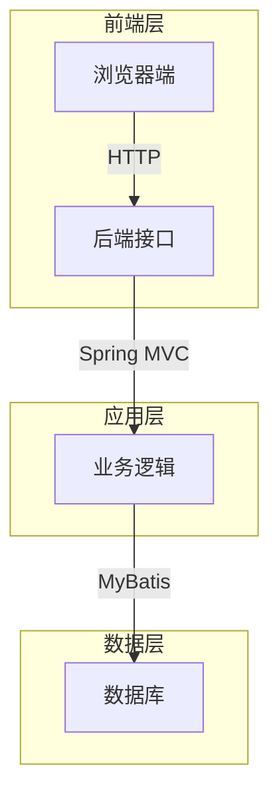
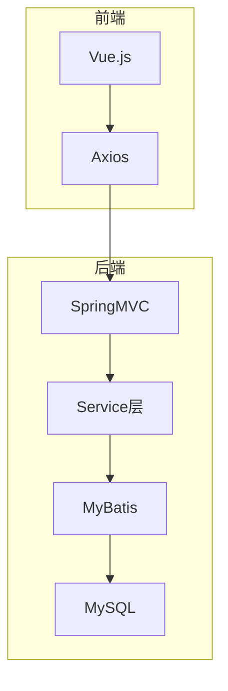

以下是基于您的要求，为标题《基于SSM的前后端分离毕业设计管理系统》所撰写的技术博客文章正文内容：

# 基于SSM的前后端分离毕业设计管理系统

## 1.背景介绍

### 1.1 毕业设计的重要性

毕业设计是高等院校本科教育的重要环节,是对学生专业理论知识和实践能力的综合考核。通过毕业设计,学生可以将所学的专业知识综合运用,锻炼分析问题和解决问题的能力,培养独立工作的意识和创新精神。

### 1.2 传统毕业设计管理存在的问题

传统的毕业设计管理模式存在诸多问题:

- 流程繁琐,效率低下
- 信息孤岛,数据难以共享
- 缺乏实时监控和反馈机制
- 师生交流不便

### 1.3 前后端分离架构的优势

为解决上述问题,本系统采用前后端分离的架构模式:

- 前端专注于用户交互,后端专注于数据处理
- 降低了前后端的耦合度
- 前端可适配多种终端设备
- 提高系统可扩展性和可维护性

## 2.核心概念与联系

### 2.1 SSM框架

SSM指Spring+SpringMVC+MyBatis,是JavaEE领域广泛使用的轻量级开源框架集:

- Spring: 核心容器,管理对象生命周期
- SpringMVC: 展现层框架,接收请求并响应
- MyBatis: 持久层框架,操作数据库

### 2.2 前后端分离

前后端分离是将用户界面(UI)与服务端应用分开的架构模式:

- 前端: 浏览器端,负责UI渲染和事件处理
- 后端: 服务端,负责业务逻辑和数据处理
- 通过HTTP/RESTful API进行前后端通信

### 2.3 系统架构

本系统采用经典的三层架构:



## 3.核心算法原理具体操作步骤

### 3.1 SpringMVC请求处理流程

SpringMVC的核心组件是前端控制器DispatcherServlet,它负责协调各组件完成请求处理:

1. 用户发送请求到前端控制器
2. 前端控制器调用HandlerMapping,查找处理器
3. HandlerMapping返回处理器对象Handler和拦截器给前端控制器
4. 前端控制器调用拦截器的preHandle方法
5. 前端控制器调用处理器Handler处理请求
6. Handler执行完成返回ModelAndView给前端控制器
7. 前端控制器调用拦截器的postHandle方法
8. 前端控制器调用视图解析器,渲染视图
9. 前端控制器响应用户

### 3.2 MyBatis查询流程

MyBatis通过映射文件将SQL与Java对象关联,简化了JDBC操作:

1. 加载配置文件,构建SqlSessionFactory
2. 通过SqlSessionFactory创建SqlSession
3. 通过SqlSession执行映射文件中的SQL语句
4. 处理查询结果集,返回Java对象或列表

## 4.数学模型和公式详细讲解举例说明  

在毕业设计管理系统中,我们可以使用数学模型来优化资源分配和评分算法。

### 4.1 资源分配模型

设有$n$个学生,$m$个导师,每个导师$j$的可指导学生数为$c_j$。令$x_{ij}$表示学生$i$是否被分配给导师$j$,则资源分配问题可以表示为:

$$
\max \sum_{i=1}^n\sum_{j=1}^m r_{ij}x_{ij}
$$
$$
\text{s.t.} \quad \sum_{j=1}^m x_{ij}=1, \quad i=1,2,...,n
$$
$$
\sum_{i=1}^n x_{ij} \leq c_j, \quad j=1,2,...,m
$$
$$
x_{ij} \in \{0,1\}, \quad i=1,2,...,n; \quad j=1,2,...,m
$$

其中,$r_{ij}$表示学生$i$与导师$j$的匹配度。目标是最大化总匹配度,约束条件是每个学生只能分配给一个导师,每个导师的指导数不超过上限。

### 4.2 评分算法

对于某个毕业设计作品,假设有$k$个评分维度,每个维度的满分为$s_i(i=1,2,...,k)$。令$x_i$表示该作品在第$i$个维度的得分,则最终得分$y$可以计算为:

$$
y = \sum_{i=1}^k w_i x_i
$$

其中,$w_i$是第$i$个维度的权重,满足$\sum_{i=1}^k w_i=1$。通过调整权重$w_i$,可以体现不同维度的重要程度。

## 5.项目实践：代码实例和详细解释说明

### 5.1 系统架构



前端采用Vue.js框架,使用Axios库与后端进行通信。后端使用SpringMVC接收请求,Service层处理业务逻辑,MyBatis操作MySQL数据库。

### 5.2 实体类

```java
// 学生实体类
public class Student {
    private int id;
    private String name;
    // 省略getter/setter
}

// 导师实体类 
public class Tutor {
    private int id;
    private String name;
    private int capacity; // 可指导学生数上限
    // 省略getter/setter
}
```

### 5.3 Mapper接口

```java
// 学生Mapper接口
public interface StudentMapper {
    List<Student> getAllStudents();
    Student getStudentById(int id);
    int addStudent(Student student);
    // 省略其他方法
}

// 导师Mapper接口
public interface TutorMapper {
    List<Tutor> getAllTutors();
    Tutor getTutorById(int id);
    int addTutor(Tutor tutor);
    // 省略其他方法
}
```

### 5.4 Service实现

```java
// 学生Service实现
@Service
public class StudentServiceImpl implements StudentService {
    @Autowired
    private StudentMapper studentMapper;
    
    @Override
    public List<Student> getAllStudents() {
        return studentMapper.getAllStudents();
    }
    
    // 省略其他方法实现
}

// 导师Service实现
@Service
public class TutorServiceImpl implements TutorService {
    @Autowired
    private TutorMapper tutorMapper;
    
    @Override 
    public List<Tutor> getAllTutors() {
        return tutorMapper.getAllTutors();
    }
    
    // 省略其他方法实现
}
```

### 5.5 Controller

```java
@RestController
@RequestMapping("/api")
public class StudentController {
    @Autowired
    private StudentService studentService;
    
    @GetMapping("/students")
    public List<Student> getAllStudents() {
        return studentService.getAllStudents();
    }
    
    // 省略其他方法
}

@RestController
@RequestMapping("/api")
public class TutorController {
    @Autowired
    private TutorService tutorService;
    
    @GetMapping("/tutors")
    public List<Tutor> getAllTutors() {
        return tutorService.getAllTutors();
    }
    
    // 省略其他方法  
}
```

前端通过Axios库向`/api/students`和`/api/tutors`发送GET请求,获取学生和导师列表数据。

## 6.实际应用场景

本系统可广泛应用于高校的毕业设计管理工作:

- 学生可在线选题,提交设计文档
- 导师可分配课题,评阅设计作品
- 管理员可监控整个流程,统计数据
- 系统自动分配学生与导师,提高效率
- 支持多平台访问,方便师生交流

除高校场景外,该系统也可推广到其他需要项目管理的领域,如软件公司的项目管理、科研机构的课题管理等。

## 7.工具和资源推荐

### 7.1 开发工具

- IDE: IntelliJ IDEA / Eclipse
- 构建工具: Maven
- 版本控制: Git
- 数据库: MySQL

### 7.2 框架和库

- Spring
- SpringMVC
- MyBatis
- Vue.js
- Axios
- Element UI

### 7.3 学习资源

- 官方文档
- 教程网站(w3cschool、菜鸟教程等)
- 开源项目示例代码
- 技术博客和论坛

## 8.总结：未来发展趋势与挑战

### 8.1 发展趋势

- 微服务架构:将单体应用拆分为多个微服务,提高灵活性和可伸缩性
- 容器化部署:使用Docker等容器技术,实现应用环境一致性
- 人工智能:引入AI技术,如自然语言处理、推荐系统等,增强系统智能化
- 大数据分析:挖掘历史数据,为决策提供数据支持

### 8.2 挑战

- 系统复杂度增加,开发和维护成本提高
- 数据安全和隐私保护问题更加突出
- 需要持续学习新技术,紧跟行业发展趋势
- 人工智能技术的不确定性和潜在风险

## 9.附录：常见问题与解答

1. **前后端分离的优缺点?**

优点:
- 前后端分离,职责清晰
- 前端渲染压力减轻
- 可适配多种终端
- 有利于项目分工协作

缺点:  
- 增加了前后端通信成本
- 可能存在跨域问题
- 对开发人员要求更高

2. **MyBatis的工作原理?**

MyBatis通过映射文件将SQL语句与Java对象关联。在运行时,MyBatis会根据配置文件创建SqlSessionFactory,再由SqlSessionFactory创建SqlSession,最后执行映射文件中的SQL语句。

3. **如何提高系统的可扩展性?**

- 遵循设计模式和最佳实践
- 模块化设计,低耦合高内聚
- 使用中间件和分布式架构
- 编写可维护和可测试的代码

4. **如何保证数据安全?**

- 加密敏感数据传输和存储
- 严格控制数据访问权限
- 定期备份和恢复数据
- 制定完善的安全策略和规范

5. **如何优化系统性能?**

- 使用缓存技术,如Redis
- 采用异步处理和消息队列
- 优化数据库查询和索引
- 负载均衡和集群部署
- 监控并持续优化性能瓶颈

作者: 禅与计算机程序设计艺术 / Zen and the Art of Computer Programming