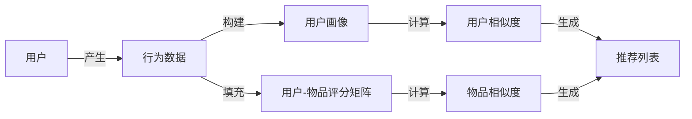

# 基于ssm的好物推荐系统-协同过滤

## 1.背景介绍
### 1.1 推荐系统概述
随着互联网技术的飞速发展,电子商务、社交网络、视频网站等各类互联网应用不断涌现。面对海量的信息和商品,用户很难快速找到自己感兴趣的内容。推荐系统应运而生,其目的就是联系用户和信息,从海量信息中发掘用户可能感兴趣的内容,为用户提供个性化的推荐服务。

### 1.2 协同过滤推荐
协同过滤(Collaborative Filtering)是应用最广泛的推荐算法之一。它通过分析用户的历史行为数据,发现用户的喜好,并根据用户的相似性或者物品的相似性,给用户推荐可能感兴趣的内容。协同过滤分为两类:基于用户(User-based)的协同过滤和基于物品(Item-based)的协同过滤。

### 1.3 SSM框架
SSM是Spring MVC、Spring和MyBatis的缩写,是目前主流的Java Web开发框架。Spring MVC负责MVC分层,Spring实现IOC和AOP,MyBatis是一个半自动化的ORM框架。SSM框架提供了一个轻量级的、高度解耦的Web开发架构,大大简化了Java Web开发的难度。

## 2.核心概念与联系
### 2.1 用户画像
用户画像是指根据用户的历史行为、偏好等信息,对用户的特征进行刻画,构建用户模型。用户画像是推荐系统的基础,通过分析用户画像可以了解用户的兴趣爱好,实现精准推荐。

### 2.2 用户相似度 
用户相似度衡量了两个用户之间的相似程度。在协同过滤算法中,我们认为兴趣相投的用户具有相似的行为模式。用户相似度的计算一般基于用户对物品的评分或者交互行为。常见的相似度计算方法有欧氏距离、皮尔逊相关系数等。

### 2.3 物品相似度
物品相似度衡量了两个物品之间的相似程度。物品相似度可以基于物品的内容特征(如关键词、类别等)计算,也可以利用协同过滤的思想,通过分析用户的行为来计算物品的相似性。

### 2.4 用户-物品评分矩阵
用户-物品评分矩阵是推荐系统的核心数据结构。矩阵的行表示用户,列表示物品,矩阵元素表示用户对物品的评分或者交互行为。由于现实中用户只会对少数物品产生行为,因此评分矩阵通常非常稀疏。

### 2.5 核心概念之间的关系


## 3.核心算法原理具体操作步骤
### 3.1 基于用户的协同过滤
1. 构建用户-物品评分矩阵
2. 计算用户之间的相似度
3. 根据用户相似度,找到与目标用户最相似的K个用户(最近邻)
4. 对最近邻用户喜欢的、目标用户未交互过的物品,计算推荐得分
5. 将得分最高的N个物品推荐给目标用户

### 3.2 基于物品的协同过滤 
1. 构建用户-物品评分矩阵
2. 计算物品之间的相似度
3. 根据用户的历史行为,找到用户喜欢的物品
4. 对每个用户喜欢的物品,找到与之最相似的K个物品
5. 对相似物品的得分进行加权求和,得到推荐得分
6. 将得分最高的N个物品推荐给用户

### 3.3 基于模型的协同过滤
1. 收集用户行为数据,构建用户-物品评分矩阵
2. 利用机器学习算法(如矩阵分解),训练用户和物品的隐语义模型
3. 利用用户和物品的隐向量,预测用户对未评分物品的兴趣度
4. 将预测兴趣度最高的N个物品推荐给用户

## 4.数学模型和公式详细讲解举例说明
### 4.1 皮尔逊相关系数
皮尔逊相关系数用于衡量两组数据的线性相关性,取值范围为[-1,1]。值越接近1,表示正相关性越强;越接近-1,负相关性越强;接近0,相关性越弱。
设$X$和$Y$是两个用户对n个物品的评分向量,$\bar{X}$和$\bar{Y}$分别是$X$和$Y$的均值,皮尔逊相关系数$r$的计算公式为:

$$r=\frac{\sum_{i=1}^n (X_i-\bar{X})(Y_i-\bar{Y})}{\sqrt{\sum_{i=1}^n (X_i-\bar{X})^2}\sqrt{\sum_{i=1}^n (Y_i-\bar{Y})^2}}$$

例如,用户A对物品的评分向量为$X=(3,4,2,5)$,用户B的评分向量为$Y=(4,5,1,4)$,则两个用户的皮尔逊相关系数为:

$$\bar{X}=\frac{3+4+2+5}{4}=3.5$$
$$\bar{Y}=\frac{4+5+1+4}{4}=3.5$$
$$r=\frac{(3-3.5)(4-3.5)+(4-3.5)(5-3.5)+(2-3.5)(1-3.5)+(5-3.5)(4-3.5)}{\sqrt{(-0.5)^2+0.5^2+(-1.5)^2+1.5^2}\sqrt{0.5^2+1.5^2+(-2.5)^2+0.5^2}}=0.327$$

可见用户A和B的皮尔逊相关系数为0.327,相关性较弱。

### 4.2 基于物品的协同过滤推荐得分计算
设$S_{ij}$是物品$i$和物品$j$的相似度,$r_{ui}$是用户$u$对物品$i$的评分,用户$u$对物品$j$的推荐得分$p_{uj}$为:

$$p_{uj}=\frac{\sum_{i\in I_u} S_{ij}r_{ui}}{\sum_{i\in I_u} S_{ij}}$$

其中,$I_u$为用户喜欢的物品集合。该公式的物理意义是,物品$j$的推荐得分等于用户喜欢的所有物品的评分与相似度的加权平均。

例如,用户喜欢物品A(评分4)和物品B(评分5),物品C与A的相似度为0.6,与B的相似度为0.4,则用户对物品C的推荐得分为:

$$p_{uC}=\frac{0.6\times 4+0.4\times 5}{0.6+0.4}=4.4$$

### 4.3 矩阵分解
矩阵分解是一类常用的隐语义模型,可以将用户-物品评分矩阵分解为用户隐向量矩阵和物品隐向量矩阵的乘积。设$R$为$m\times n$的评分矩阵,$P$为$m\times k$的用户隐向量矩阵,$Q$为$n\times k$的物品隐向量矩阵,则矩阵分解的目标是:

$$\min_{P,Q} \sum_{u,i\in R}(r_{ui} - p_u^Tq_i)^2 + \lambda (||P||_F^2+||Q||_F^2)$$

其中,$p_u$为用户$u$的隐向量,$q_i$为物品$i$的隐向量,$\lambda$为正则化系数。求解该优化问题可以得到用户和物品的隐向量,然后利用向量点积预测用户对物品的评分:

$$\hat{r}_{ui}=p_u^Tq_i$$

## 5.项目实践：代码实例和详细解释说明
下面给出基于SSM框架实现的协同过滤推荐系统的核心代码:

```java
// 用户相似度计算
public class UserSimilarity {
    
    // 皮尔逊相关系数计算
    public double pearson(List<Double> xList, List<Double> yList){
        int n = xList.size();
        double Ex = xList.stream().mapToDouble(x->x).sum();
        double Ey = yList.stream().mapToDouble(y->y).sum();
        double Ex2 = xList.stream().mapToDouble(x->x*x).sum();
        double Ey2 = yList.stream().mapToDouble(y->y*y).sum();
        double Exy = IntStream.range(0,n).mapToDouble(i->xList.get(i)*yList.get(i)).sum();
        double numerator = Exy - Ex*Ey/n;
        double denominator = Math.sqrt((Ex2-Ex*Ex/n)*(Ey2-Ey*Ey/n));
        if(denominator==0) return 0;
        return numerator/denominator;
    }
    
    // 余弦相似度
    public double cosineSimilarity(List<Double> xList, List<Double> yList){
        double numerator = IntStream.range(0,xList.size())
                .mapToDouble(i->xList.get(i)*yList.get(i)).sum();
        double denominator = Math.sqrt(xList.stream().mapToDouble(x->x*x).sum()) *
                Math.sqrt(yList.stream().mapToDouble(y->y*y).sum());
        if(denominator==0) return 0;
        return numerator/denominator;
    }
}
```

```java
// 物品相似度计算
public class ItemSimilarity {
    
    private UserSimilarity userSimilarity = new UserSimilarity();
    
    // 基于皮尔逊相关系数的物品相似度
    public double itemSimilarity(List<UserRating> xRatings, List<UserRating> yRatings){
        List<Double> xList = new ArrayList<>();
        List<Double> yList = new ArrayList<>();
        for(UserRating xRating: xRatings){
            for(UserRating yRating: yRatings){
                if(xRating.getUserId().equals(yRating.getUserId())){
                    xList.add(xRating.getRating());
                    yList.add(yRating.getRating());
                }
            }
        }
        return userSimilarity.pearson(xList,yList);
    }
}
```

```java
// 用户-物品评分矩阵
@Data
public class RatingMatrix {
    // 用户数
    private int userCount;
    // 物品数  
    private int itemCount;
    // 评分矩阵
    private double[][] matrix;

    public RatingMatrix(int userCount, int itemCount) {
        this.userCount = userCount;
        this.itemCount = itemCount;
        this.matrix = new double[userCount][itemCount];
    }
    
    // 设置指定用户对指定物品的评分
    public void setRating(int userIndex, int itemIndex, double rating){
        matrix[userIndex][itemIndex] = rating;
    }
    
    // 获取指定用户对指定物品的评分
    public double getRating(int userIndex, int itemIndex){
        return matrix[userIndex][itemIndex];
    }
}
```

```java
// 基于用户的协同过滤推荐
@Service
public class UserCFRecommender {

    @Autowired
    private UserSimilarity userSimilarity;
    @Autowired
    private RatingMatrix ratingMatrix;
    
    // 计算用户相似度矩阵
    public double[][] userSimilarityMatrix(){
        int n = ratingMatrix.getUserCount();
        double[][] similarityMatrix = new double[n][n];
        for(int i=0; i<n; i++){
            for(int j=0; j<n; j++){
                List<Double> xList = new ArrayList<>();
                List<Double> yList = new ArrayList<>();
                for(int k=0; k<ratingMatrix.getItemCount(); k++){
                    double xRating = ratingMatrix.getRating(i,k);
                    double yRating = ratingMatrix.getRating(j,k);
                    if(xRating>0 && yRating>0){
                        xList.add(xRating);
                        yList.add(yRating);
                    }
                }
                similarityMatrix[i][j] = userSimilarity.pearson(xList,yList);
            }
        }
        return similarityMatrix;
    }
    
    // 为指定用户生成推荐列表
    public List<ItemDto> recommend(int userIndex, int n){
        double[][] simMatrix = userSimilarityMatrix();
        List<ItemDto> recommendItems = new ArrayList<>();
        for(int itemIndex=0; itemIndex<ratingMatrix.getItemCount(); itemIndex++){
            if(ratingMatrix.getRating(userIndex,itemIndex)==0){
                double predictRating = 0;
                double simSum = 0;
                for(int otherUserIndex=0; otherUserIndex<ratingMatrix.getUserCount(); otherUserIndex++){
                    if(rating