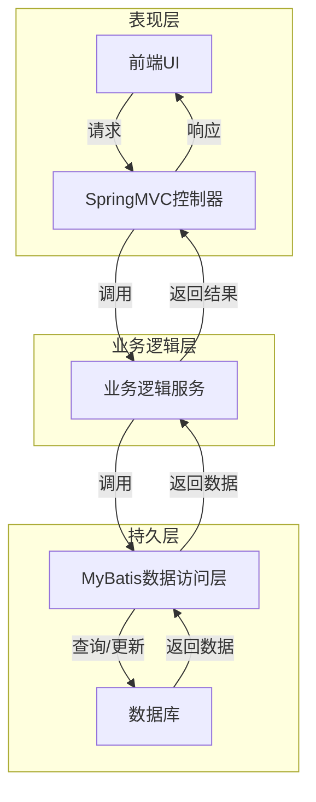

# 基于SSM的新闻发布系统

## 1. 背景介绍

### 1.1 新闻发布系统的重要性

在当今信息时代,新闻媒体扮演着传播信息、引导舆论的重要角色。新闻发布系统作为新闻媒体的核心系统,对于及时、准确地发布新闻信息至关重要。一个高效、可靠的新闻发布系统不仅能够确保新闻的及时性和准确性,还能够提高新闻媒体的工作效率,优化新闻编辑和发布流程。

### 1.2 传统新闻发布系统的不足

传统的新闻发布系统通常采用单体架构,系统各个模块耦合严重,扩展性和可维护性较差。此外,传统系统通常缺乏自动化测试和持续集成/持续部署(CI/CD)能力,导致系统升级和维护成本较高。

### 1.3 SSM架构的优势

SSM(Spring+SpringMVC+MyBatis)是一种流行的JavaEE企业级开发架构,具有以下优势:

1. **分层设计**: 采用经典的三层架构(表现层、业务逻辑层和持久层),有利于代码的解耦和可维护性。
2. **轻量级**: 相比传统的JavaEE架构(如EJB),SSM架构更加轻量级,开发和部署更加简单。
3. **高效开发**: 利用Spring的IoC和AOP特性,可以大幅提高开发效率。
4. **优秀的ORM框架**: MyBatis作为一款优秀的ORM(对象关系映射)框架,可以有效简化数据持久层的开发。
5. **灵活的前端支持**: SpringMVC提供了强大的Web层支持,可以方便地集成各种前端技术。

基于以上优势,本文将介绍如何利用SSM架构开发一个高效、可扩展的新闻发布系统。

## 2. 核心概念与联系

### 2.1 系统架构概览

基于SSM的新闻发布系统采用经典的三层架构设计,包括表现层(SpringMVC)、业务逻辑层(Spring)和持久层(MyBatis)。系统的核心功能模块包括:

1. **用户管理模块**: 管理系统用户(编辑、管理员等),包括用户注册、登录、权限管理等功能。
2. **新闻管理模块**: 管理新闻内容,包括新闻撰写、审核、发布等功能。
3. **资源管理模块**: 管理新闻相关资源,如图片、视频等。
4. **评论管理模块**: 管理新闻评论,包括评论审核、回复等功能。
5. **统计分析模块**: 提供新闻浏览量、评论量等统计分析功能。

系统架构概览如下Mermaid流程图所示:

### 2.2 核心技术栈

1. **Spring**: 提供IoC容器和AOP支持,用于管理系统中的各个组件及其依赖关系。
2. **SpringMVC**: 作为表现层框架,处理HTTP请求和响应,并将请求分发给相应的控制器。
3. **MyBatis**: 作为持久层框架,提供对象关系映射(ORM)功能,简化数据库操作。
4. **MySQL**: 作为系统的关系型数据库,存储系统数据。
5. **Redis**: 作为系统的缓存组件,提高系统性能。
6. **Elasticsearch**: 作为系统的搜索引擎,提供高效的全文搜索功能。
7. **Logback**: 作为系统的日志组件,记录系统运行日志。
8. **Maven**: 作为项目构建和依赖管理工具。

## 3. 核心算法原理具体操作步骤

### 3.1 用户认证与授权

#### 3.1.1 用户注册

1. 前端UI接收用户输入的注册信息(用户名、密码等)。
2. 前端UI通过AJAX调用后端的`/user/register`接口,将注册信息以JSON格式发送给后端。
3. 后端控制器`UserController`接收请求,调用`UserService`的`registerUser`方法进行业务逻辑处理。
4. `UserService`的`registerUser`方法首先检查用户名是否已存在,如果不存在则进行密码加密和其他必要的数据处理。
5. `UserService`调用`UserDao`的`insertUser`方法,将新用户信息插入数据库。
6. 后端控制器返回注册结果(成功或失败)给前端UI。

#### 3.1.2 用户登录

1. 前端UI接收用户输入的登录信息(用户名和密码)。
2. 前端UI通过AJAX调用后端的`/user/login`接口,将登录信息以JSON格式发送给后端。
3. 后端控制器`UserController`接收请求,调用`UserService`的`loginUser`方法进行业务逻辑处理。
4. `UserService`的`loginUser`方法首先从数据库中查询用户信息,并验证密码是否正确。
5. 如果验证通过,`UserService`生成一个JWT(JSON Web Token),作为该用户会话的标识。
6. 后端控制器将JWT返回给前端UI。
7. 前端UI将JWT存储在浏览器的本地存储(localStorage或sessionStorage)中,后续的请求都需要在HTTP头部携带该JWT。

#### 3.1.3 用户授权

1. 前端UI在发送请求时,将JWT添加到HTTP头部的`Authorization`字段中。
2. 后端控制器通过拦截器或过滤器获取请求中的JWT。
3. 后端控制器验证JWT的合法性,如果JWT合法则从JWT的载荷(Payload)中获取用户信息。
4. 后端控制器根据用户信息和请求的URL,判断用户是否有权限访问该资源。
5. 如果用户有权限,则继续处理请求;否则返回403 Forbidden错误。

### 3.2 新闻管理

#### 3.2.1 新闻撰写

1. 前端UI提供富文本编辑器,供编辑人员撰写新闻内容。
2. 编辑人员完成新闻撰写后,点击"提交审核"按钮。
3. 前端UI通过AJAX调用后端的`/news/submit`接口,将新闻内容以JSON格式发送给后端。
4. 后端控制器`NewsController`接收请求,调用`NewsService`的`submitNews`方法进行业务逻辑处理。
5. `NewsService`的`submitNews`方法将新闻内容存储到数据库中,并将新闻状态设置为"待审核"。
6. 后端控制器返回提交结果给前端UI。

#### 3.2.2 新闻审核

1. 管理员登录系统后,可以查看所有"待审核"状态的新闻列表。
2. 管理员选择一条新闻,查看新闻详情。
3. 管理员可以选择"通过审核"或"拒绝审核"。
4. 如果选择"通过审核",前端UI通过AJAX调用后端的`/news/approve`接口,将新闻ID发送给后端。
5. 后端控制器`NewsController`接收请求,调用`NewsService`的`approveNews`方法进行业务逻辑处理。
6. `NewsService`的`approveNews`方法将新闻状态更新为"已发布"。
7. 如果选择"拒绝审核",前端UI通过AJAX调用后端的`/news/reject`接口,将新闻ID发送给后端。
8. 后端控制器`NewsController`接收请求,调用`NewsService`的`rejectNews`方法进行业务逻辑处理。
9. `NewsService`的`rejectNews`方法将新闻状态更新为"已拒绝",并可以添加拒绝原因。

#### 3.2.3 新闻发布

1. 前端UI提供"新闻列表"页面,展示所有"已发布"状态的新闻。
2. 用户可以点击新闻标题,查看新闻详情。
3. 新闻详情页面展示新闻内容、发布时间、作者等信息。
4. 用户可以在新闻详情页面进行评论。

### 3.3 评论管理

#### 3.3.1 评论提交

1. 用户在新闻详情页面输入评论内容,点击"提交评论"按钮。
2. 前端UI通过AJAX调用后端的`/comment/submit`接口,将评论内容和新闻ID以JSON格式发送给后端。
3. 后端控制器`CommentController`接收请求,调用`CommentService`的`submitComment`方法进行业务逻辑处理。
4. `CommentService`的`submitComment`方法将评论内容和相关信息(如用户ID、新闻ID等)存储到数据库中。
5. 后端控制器返回提交结果给前端UI。

#### 3.3.2 评论审核

1. 管理员登录系统后,可以查看所有"待审核"状态的评论列表。
2. 管理员选择一条评论,查看评论详情。
3. 管理员可以选择"通过审核"或"拒绝审核"。
4. 如果选择"通过审核",前端UI通过AJAX调用后端的`/comment/approve`接口,将评论ID发送给后端。
5. 后端控制器`CommentController`接收请求,调用`CommentService`的`approveComment`方法进行业务逻辑处理。
6. `CommentService`的`approveComment`方法将评论状态更新为"已发布"。
7. 如果选择"拒绝审核",前端UI通过AJAX调用后端的`/comment/reject`接口,将评论ID发送给后端。
8. 后端控制器`CommentController`接收请求,调用`CommentService`的`rejectComment`方法进行业务逻辑处理。
9. `CommentService`的`rejectComment`方法将评论状态更新为"已拒绝",并可以添加拒绝原因。

#### 3.3.3 评论展示

1. 在新闻详情页面,前端UI通过AJAX调用后端的`/comment/list`接口,将新闻ID发送给后端。
2. 后端控制器`CommentController`接收请求,调用`CommentService`的`listComments`方法进行业务逻辑处理。
3. `CommentService`的`listComments`方法从数据库中查询该新闻的所有"已发布"状态的评论。
4. 后端控制器将评论列表返回给前端UI。
5. 前端UI在新闻详情页面渲染评论列表。

### 3.4 全文搜索

为了提高新闻搜索的效率,系统集成了Elasticsearch作为全文搜索引擎。

#### 3.4.1 索引创建

1. 当有新闻被发布时,`NewsService`的`approveNews`方法不仅会更新新闻状态,还会调用`SearchService`的`indexNews`方法。
2. `SearchService`的`indexNews`方法将新闻信息转换为Elasticsearch所需的JSON格式数据。
3. `SearchService`调用Elasticsearch客户端的`index`方法,将新闻数据索引到Elasticsearch中。

#### 3.4.2 搜索查询

1. 前端UI提供搜索框,用户可以输入关键词进行新闻搜索。
2. 前端UI通过AJAX调用后端的`/search`接口,将搜索关键词以JSON格式发送给后端。
3. 后端控制器`SearchController`接收请求,调用`SearchService`的`search`方法进行业务逻辑处理。
4. `SearchService`的`search`方法构建Elasticsearch的查询请求,并调用Elasticsearch客户端的`search`方法执行搜索。
5. Elasticsearch返回搜索结果给`SearchService`。
6. `SearchService`对搜索结果进行处理(如分页、高亮等),并返回给后端控制器。
7. 后端控制器将搜索结果返回给前端UI。
8. 前端UI渲染搜索结果列表。

## 4. 数学模型和公式详细讲解举例说明

在新闻发布系统中,我们可以使用一些数学模型和公式来优化系统的性能和用户体验。以下是一些常见的模型和公式:

### 4.1 TF-IDF算法

TF-IDF(Term Frequency-Inverse Document Frequency)算法是一种常用