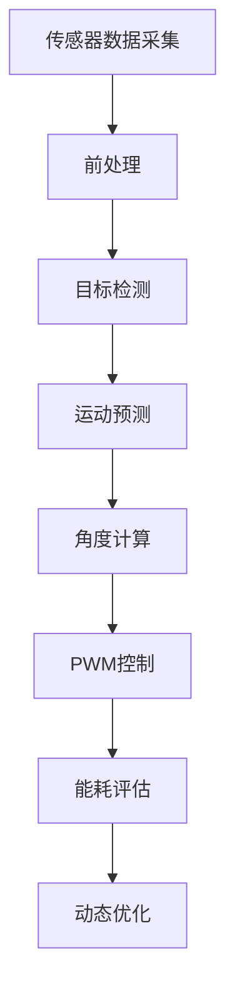

# 基于STM32的智能追光太阳能路灯控制系统设计与开发

## 1. 背景介绍

### 1.1 传统路灯系统的缺陷

传统的路灯系统通常采用固定照明方式,无法根据实际需求动态调整照明范围和亮度,存在一定的能源浪费问题。此外,传统路灯大多依赖于电网供电,在偏远地区或电力基础设施不完善的地方,供电可靠性较差。

### 1.2 太阳能路灯的优势

太阳能路灯利用可再生的太阳能作为动力源,不仅环保节能,而且可以在偏远地区独立运行,不受电网限制。通过配备蓄电池,可以实现全天候照明。但传统太阳能路灯也存在一些不足,如照明范围固定、无法根据环境变化智能调节等。

### 1.3 智能追光太阳能路灯的概念

智能追光太阳能路灯在传统太阳能路灯的基础上,引入了智能控制和追光技术,可以根据环境变化(如目标物体的移动)动态调整照明方向和范围,提高照明效率和用户体验。同时,通过优化控制算法和硬件设计,可以进一步降低能耗,延长电池使用寿命。

## 2. 核心概念与联系

### 2.1 STM32微控制器

STM32是意法半导体(ST)公司推出的一款基于ARM Cortex-M内核的32位微控制器系列,具有高性能、低功耗、丰富的外设资源等优点。在智能追光太阳能路灯控制系统中,STM32作为核心控制单元,负责执行各种算法、协调各个模块的工作。

### 2.2 传感器技术

智能追光路灯需要利用各种传感器来获取环境信息,如运动传感器(PIR)、光线传感器等。这些传感器数据将被STM32读取并分析,从而判断是否需要调整照明方向和亮度。

### 2.3 伺服电机控制

为了实现照明灯具的追光功能,需要在两个轴向上安装伺服电机,通过STM32发出PWM控制信号,驱动伺服电机转动,从而调整灯具的指向方向。

### 2.4 电源管理

智能追光太阳能路灯需要高效利用太阳能电池板获取的电能,并通过蓄电池存储剩余电量。STM32需要合理分配电源,在满足照明需求的同时,尽可能节省能耗,延长电池使用寿命。

### 2.5 算法设计

智能追光的核心是控制算法的设计,需要基于传感器数据,运用图像处理、模式识别等技术,准确判断目标物体的位置和运动轨迹,并计算出最佳的照明角度,同时综合考虑能耗因素,进行动态优化。

## 3. 核心算法原理具体操作步骤 

智能追光太阳能路灯的核心算法可以分为以下几个步骤:



### 3.1 传感器数据采集

使用运动传感器(PIR)和光线传感器等,采集环境中的运动和光线变化信息,并通过ADC将模拟量转换为数字量,传输给STM32进行处理。

### 3.2 前处理

对采集的传感器数据进行滤波、去噪等前处理,提高数据质量,为后续的目标检测和跟踪算法奠定基础。

### 3.3 目标检测

通过对处理后的传感器数据进行分析,检测是否存在运动目标物体,如行人、车辆等。可以使用背景建模、运动矢量等计算机视觉算法来实现目标检测。

### 3.4 运动预测

对检测到的目标物体进行运动轨迹分析和预测,估计其在未来的运动方向和速度,为照明角度的计算提供依据。可以使用卡尔曼滤波、粒子滤波等算法进行运动预测。

### 3.5 角度计算

根据目标物体的当前位置和预测的运动轨迹,计算出最佳的照明角度,使灯光可以精准地跟随和照射到目标物体。需要综合考虑灯具的机械结构和运动范围等约束条件。

### 3.6 PWM控制

将计算出的最佳照明角度,转换为对应的PWM控制信号,并通过STM32的定时器输出,驱动安装在两个轴向上的伺服电机转动,从而调整灯具的指向方向,实现追光效果。

### 3.7 能耗评估

在调整照明角度的同时,需要实时评估系统的能耗情况,包括电机运转的功耗、控制电路的功耗等,并与当前的电池电量进行匹配,防止过度放电导致系统故障。

### 3.8 动态优化

根据能耗评估的结果,对控制算法的参数(如灵敏度阈值、平滑程度等)进行动态调整,在满足照明需求的前提下,尽可能降低系统功耗,延长电池使用寿命。这是一个反馈闭环的过程,需要不断优化。

## 4. 数学模型和公式详细讲解举例说明

在智能追光太阳能路灯的控制算法中,涉及到多个数学模型和公式,下面对其中的几个关键模型进行详细讲解。

### 4.1 卡尔曼滤波

卡尔曼滤波是一种常用的运动目标跟踪算法,可以有效消除测量噪声,对目标的运动状态进行精确估计。其核心是通过预测和更新两个阶段,递推计算系统的状态,并最小化估计误差的均方。

在智能追光系统中,可以将目标物体的位置、速度等作为状态变量,建立如下状态空间模型:

$$
\begin{aligned}
\mathbf{x}_{k} &=\mathbf{F}_{k} \mathbf{x}_{k-1}+\mathbf{B}_{k} \mathbf{u}_{k}+\mathbf{w}_{k} \\
\mathbf{z}_{k} &=\mathbf{H}_{k} \mathbf{x}_{k}+\mathbf{v}_{k}
\end{aligned}
$$

其中:
- $\mathbf{x}_{k}$ 为 $k$ 时刻的状态变量向量
- $\mathbf{F}_{k}$ 为状态转移矩阵
- $\mathbf{B}_{k}$ 为控制输入矩阵
- $\mathbf{u}_{k}$ 为控制向量
- $\mathbf{w}_{k}$ 为过程噪声
- $\mathbf{z}_{k}$ 为观测值
- $\mathbf{H}_{k}$ 为观测矩阵
- $\mathbf{v}_{k}$ 为观测噪声

卡尔曼滤波算法通过预测和更新两个步骤,不断修正状态变量的估计值,从而获得目标的精确运动轨迹。

### 4.2 最小二乘法

在计算最佳照明角度时,需要建立目标物体位置和灯具角度之间的数学关系模型。由于存在一定的测量误差,可以使用最小二乘法来拟合这一模型,使残差平方和最小。

设有 $n$ 个观测数据点 $(x_i, y_i)$,我们希望找到一条直线 $y = ax + b$ 最佳拟合这些数据点。通过构建代价函数:

$$
J(a, b)=\sum_{i=1}^{n}\left(y_{i}-a x_{i}-b\right)^{2}
$$

对 $a$ 和 $b$ 分别求偏导数并令其等于零,可以得到Normal方程:

$$
\begin{aligned}
\sum_{i=1}^{n}\left(y_{i}-a x_{i}-b\right) x_{i} &=0 \\
\sum_{i=1}^{n}\left(y_{i}-a x_{i}-b\right) &=0
\end{aligned}
$$

解这个方程组即可获得最小二乘解 $a^*$ 和 $b^*$,从而确定最佳拟合直线。

在智能追光系统中,可以将目标物体的位置坐标作为自变量 $x$,将对应的最佳照明角度作为因变量 $y$,通过采集大量的数据对,利用最小二乘法拟合出它们之间的函数关系,为后续的角度计算提供依据。

### 4.3 PID控制

为了精确控制伺服电机的转动角度,可以采用经典的PID控制算法,根据当前角度与目标角度之间的偏差,计算出增量控制量,并对PWM占空比进行微调,从而实现对电机的精确控制。

PID控制器的数学模型如下:

$$
u(t)=K_p e(t)+K_i\int_{0}^{t}e(\tau)d\tau+K_d\frac{de(t)}{dt}
$$

其中:
- $u(t)$ 为控制器输出
- $e(t)$ 为偏差,即目标值与实际值之差
- $K_p$ 为比例系数
- $K_i$ 为积分系数
- $K_d$ 为微分系数

通过调节这三个参数,可以改变控制器的动态性能,使系统具有良好的稳定性、快速响应性和抗干扰能力。

在智能追光系统中,可以将目标照明角度作为设定值,实时获取伺服电机的当前角度作为反馈值,通过PID控制器计算出增量控制量,并叠加到PWM占空比中,从而精确驱动电机转动到理想角度。

## 5. 项目实践:代码实例和详细解释说明

为了更好地理解智能追光太阳能路灯控制系统的实现,下面给出一个基于STM32F103C8T6的简化代码示例,并对关键部分进行详细说明。

```c
#include "stm32f10x.h"
#include "pir_sensor.h"
#include "light_sensor.h"
#include "servo_motor.h"
#include "battery.h"

// 状态变量
float target_x, target_y; // 目标位置
float target_vx, target_vy; // 目标速度
float light_level; // 环境光线强度
float battery_level; // 电池电量

// Kalman滤波器参数
float Q = 0.001; // 过程噪声方差
float R = 0.01; // 观测噪声方差
float P = 1.0; // 估计误差协方差
float K; // 卡尔曼增益

// PID控制器参数
float Kp = 1.0, Ki = 0.5, Kd = 0.2; // PID参数
float target_angle, current_angle; // 目标角度和当前角度
float err_sum = 0.0, last_err = 0.0; // 积分和微分项

void setup() {
  // 初始化外设
  init_pir_sensor();
  init_light_sensor();
  init_servo_motors();
  init_battery_monitor();
}

void loop() {
  // 1. 读取传感器数据
  bool motion_detected = read_pir_sensor();
  light_level = read_light_sensor();
  battery_level = read_battery_level();

  // 2. 目标检测和跟踪
  if (motion_detected) {
    // 2.1 卡尔曼滤波估计目标状态
    float z[2] = {target_x, target_y}; // 观测值
    kalman_filter(&target_x, &target_vx, z[0], Q, R, &P, &K);
    kalman_filter(&target_y, &target_vy, z[1], Q, R, &P, &K);

    // 2.2 计算最佳照明角度
    float opt_angle = calc_optimal_angle(target_x, target_y);

    // 2.3 PID控制伺服电机
    float err = opt_angle - current_angle;
    float p_term = Kp * err;
    err_sum += err;
    float i_term = Ki * err_sum;
    float d_term = Kd * (err - last_err);
    last_err = err;
    float output = p_term + i_term + d_term;
    set_servo_angle(output);

    // 2.4 能耗评估和动态优化
    float power_consumption = estimate_power(light_level, output);
    if (power_consumption > battery_level * 0.8) {
      // 降低灵敏度以节省能耗
      Q *= 1.1;
      R