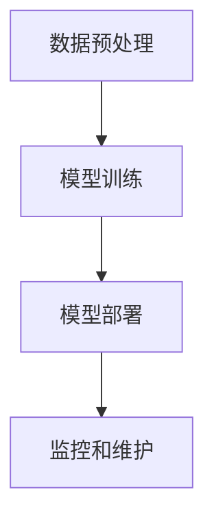

# 基于云服务的AI代理工作流部署策略

## 1.背景介绍

在当今数字化转型的浪潮中，人工智能（AI）技术的应用已经渗透到各行各业。AI代理作为一种智能化的解决方案，能够在自动化任务、数据分析、客户服务等方面发挥重要作用。然而，如何高效地部署和管理AI代理工作流成为了一个关键问题。云服务的出现为这一问题提供了新的解决方案。本文将深入探讨基于云服务的AI代理工作流部署策略，帮助读者理解其核心概念、算法原理、实际应用以及未来发展趋势。

## 2.核心概念与联系

### 2.1 云服务

云服务是指通过互联网提供的各种计算资源和服务，包括计算能力、存储、数据库、网络等。常见的云服务提供商有Amazon Web Services (AWS)、Microsoft Azure、Google Cloud Platform (GCP)等。

### 2.2 AI代理

AI代理是一种能够自主执行任务的智能系统，通常基于机器学习、深度学习等技术。AI代理可以用于自动化任务、数据分析、自然语言处理等领域。

### 2.3 工作流

工作流是指一系列有序的任务或步骤，用于完成特定的业务流程。在AI代理的部署中，工作流通常包括数据预处理、模型训练、模型部署、监控和维护等步骤。

### 2.4 云服务与AI代理工作流的联系

云服务提供了高效、灵活的计算资源，使得AI代理的部署和管理更加便捷。通过云服务，用户可以动态调整计算资源，快速部署和更新AI模型，并实现高效的监控和维护。

## 3.核心算法原理具体操作步骤

### 3.1 数据预处理

数据预处理是AI代理工作流的第一步，主要包括数据清洗、数据转换和特征工程等步骤。数据预处理的质量直接影响模型的性能。

### 3.2 模型训练

模型训练是AI代理工作流的核心步骤。通过选择合适的算法和参数，利用预处理后的数据进行模型训练。常见的算法有线性回归、决策树、神经网络等。

### 3.3 模型部署

模型部署是将训练好的模型应用到实际环境中，使其能够处理实时数据并生成预测结果。云服务提供了多种部署方式，如容器化部署、无服务器部署等。

### 3.4 监控和维护

监控和维护是确保AI代理稳定运行的重要步骤。通过监控模型的性能指标，及时发现和解决问题，保证模型的准确性和可靠性。

以下是AI代理工作流的Mermaid流程图：



## 4.数学模型和公式详细讲解举例说明

### 4.1 线性回归

线性回归是一种常见的监督学习算法，用于预测连续值。其数学模型如下：

$$
y = \beta_0 + \beta_1 x_1 + \beta_2 x_2 + \cdots + \beta_n x_n + \epsilon
$$

其中，$y$ 是预测值，$x_i$ 是特征，$\beta_i$ 是回归系数，$\epsilon$ 是误差项。

### 4.2 神经网络

神经网络是一种模拟人脑结构的算法，广泛用于图像识别、自然语言处理等领域。其基本单元是神经元，数学模型如下：

$$
a_j = f\left(\sum_{i=1}^{n} w_{ij} x_i + b_j\right)
$$

其中，$a_j$ 是神经元的输出，$x_i$ 是输入，$w_{ij}$ 是权重，$b_j$ 是偏置，$f$ 是激活函数。

### 4.3 示例说明

假设我们要预测房价，使用线性回归模型。特征包括房屋面积、房间数等。模型训练后的回归系数如下：

$$
\beta_0 = 50000, \beta_1 = 200, \beta_2 = 30000
$$

则预测公式为：

$$
y = 50000 + 200 \cdot \text{面积} + 30000 \cdot \text{房间数}
$$

## 5.项目实践：代码实例和详细解释说明

### 5.1 数据预处理

```python
import pandas as pd
from sklearn.model_selection import train_test_split

# 读取数据
data = pd.read_csv('housing.csv')

# 数据清洗
data = data.dropna()

# 特征工程
data['price_per_sqft'] = data['price'] / data['sqft']

# 数据分割
X = data[['sqft', 'rooms']]
y = data['price']
X_train, X_test, y_train, y_test = train_test_split(X, y, test_size=0.2, random_state=42)
```

### 5.2 模型训练

```python
from sklearn.linear_model import LinearRegression

# 模型训练
model = LinearRegression()
model.fit(X_train, y_train)

# 模型评估
score = model.score(X_test, y_test)
print(f'Model R^2 Score: {score}')
```

### 5.3 模型部署

```python
import joblib

#