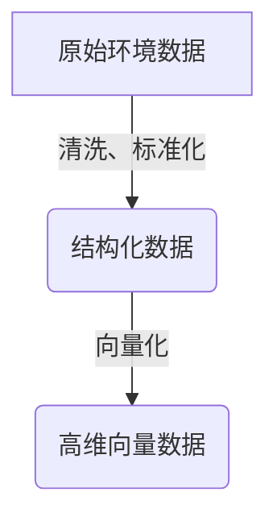
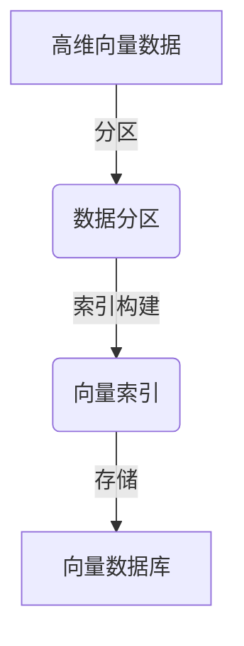
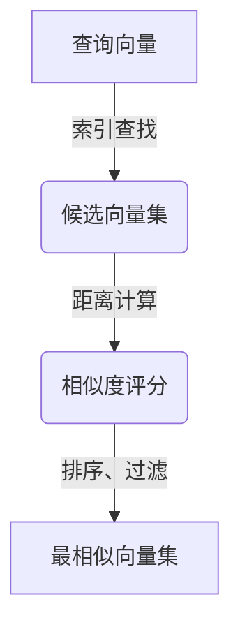
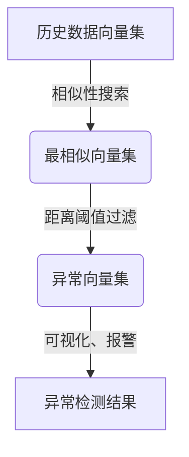
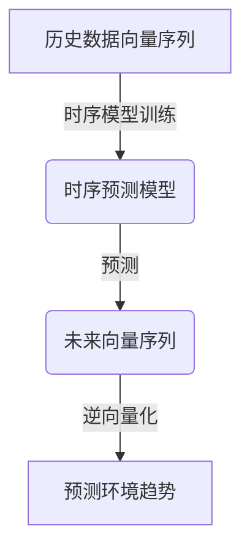

# 基于向量数据库的生态环境监测系统

## 1. 背景介绍

### 1.1 生态环境监测的重要性

随着工业化和城市化进程的不断加快,环境污染和生态破坏问题日益严重,已经成为威胁人类可持续发展的重大挑战。生态环境监测系统是保护生态环境、实现可持续发展的重要手段。通过对大气、水、土壤等环境要素的实时监测,可以及时发现环境问题,采取有效的治理措施,减轻或避免生态环境受到进一步破坏。

### 1.2 传统生态环境监测系统的局限性

传统的生态环境监测系统主要依赖于人工采样和实验室分析,存在着成本高、效率低、时效性差等诸多缺陷。此外,传统系统难以处理海量异构数据,缺乏对复杂环境因素的综合分析能力,无法全面反映生态系统的动态变化。

### 1.3 向量数据库在生态环境监测中的应用前景

近年来,随着物联网、大数据等新兴技术的发展,基于向量数据库的生态环境监测系统应运而生。向量数据库能够高效存储和检索海量环境数据,支持复杂的相似性查询,为生态环境监测提供了新的技术路径。该系统可以实现全方位、实时的环境数据采集和分析,为科学决策和精准治理提供有力支撑。

## 2. 核心概念与联系

### 2.1 向量数据库

向量数据库(Vector Database)是一种新型的数据库系统,专门用于存储和检索向量数据。它将高维向量作为基本数据单元,支持高效的相似性搜索和分析。向量数据库广泛应用于自然语言处理、计算机视觉、推荐系统等领域。

### 2.2 生态环境大数据

生态环境大数据是指来自各种环境监测设备(如传感器、遥感卫星等)采集的海量异构数据,包括大气、水、土壤、生物等多个维度的信息。这些数据具有体量大、种类多、更新快等特点,对于传统数据库系统来说,存储和处理存在巨大挑战。

### 2.3 相似性搜索

相似性搜索(Similarity Search)是指在海量数据中快速找到与给定查询对象最相似的数据对象。在生态环境监测中,相似性搜索可用于发现异常模式、识别污染源、预测环境变化趋势等。向量数据库通过高维索引和近似最近邻算法,实现了高效的相似性搜索能力。

### 2.4 核心联系

基于向量数据库的生态环境监测系统将生态环境大数据转换为高维向量,存储于向量数据库中。通过相似性搜索等算法,可以发现异常模式、分析环境变化趋势,为环境治理和决策提供科学依据。该系统将大数据、人工智能等前沿技术与生态环境监测有机结合,是实现智能化、精准化环境管理的重要技术手段。

## 3. 核心算法原理具体操作步骤

### 3.1 数据预处理



1. **数据清洗**:剔除原始数据中的噪声、异常值和缺失值,保证数据质量。
2. **数据标准化**:将不同量纲、量级的数据转换为统一的量纲和量级,便于后续处理。
3. **向量化**:将结构化数据转换为高维向量表示,作为向量数据库的输入。常用的向量化方法包括Word2Vec、Doc2Vec、图像嵌入等。

### 3.2 向量数据库构建



1. **数据分区**:将高维向量数据划分为多个数据分区,以提高并行处理能力。
2. **索引构建**:为每个数据分区构建高维索引,加速相似性查询。常用的索引算法包括hierarchical navigable small world(HNSW)、ScaNN等。
3. **数据存储**:将索引化的向量数据持久化存储到向量数据库中,以便后续查询和分析。

### 3.3 相似性搜索



1. **索引查找**:利用预构建的索引,快速找到与查询向量最相似的一组候选向量。
2. **距离计算**:计算查询向量与候选向量之间的距离(如欧氏距离、余弦相似度等),作为相似度评分。
3. **排序和过滤**:根据相似度评分对候选向量集进行排序,并设置阈值过滤掉不相似的向量。

### 3.4 异常检测



1. **相似性搜索**:以新采集的环境数据向量作为查询,在历史数据向量集中搜索最相似的向量集。
2. **距离阈值过滤**:设置合理的距离阈值,将与历史数据差异较大的向量划分为异常向量集。
3. **可视化和报警**:对异常向量集进行可视化展示,并根据异常程度发出报警,提示相关人员采取措施。

### 3.5 趋势预测



1. **时序模型训练**:利用历史数据向量序列,训练时序预测模型,如LSTM、Transformer等。
2. **向量序列预测**:使用训练好的模型,预测未来一段时间内的环境数据向量序列。
3. **逆向量化**:将预测的向量序列逆向转换为原始环境数据,得到未来环境变化趋势。

## 4. 数学模型和公式详细讲解举例说明

### 4.1 向量相似度计算

在向量数据库中,相似度计算是核心操作之一。常用的相似度度量包括欧氏距离、余弦相似度等。

#### 4.1.1 欧氏距离

欧氏距离(Euclidean Distance)是最常见的距离度量,定义为两个向量在欧几里得空间中的直线距离。对于 $n$ 维向量 $\vec{a}=(a_1,a_2,...,a_n)$ 和 $\vec{b}=(b_1,b_2,...,b_n)$,它们的欧氏距离为:

$$
d(\vec{a},\vec{b})=\sqrt{\sum_{i=1}^{n}(a_i-b_i)^2}
$$

欧氏距离值越小,两个向量越相似。

#### 4.1.2 余弦相似度

余弦相似度(Cosine Similarity)测量两个向量的方向相似性,常用于文本、图像等领域。对于向量 $\vec{a}$ 和 $\vec{b}$,它们的余弦相似度为:

$$
\text{sim}(\vec{a},\vec{b})=\frac{\vec{a}\cdot\vec{b}}{||\vec{a}||||\vec{b}||}=\frac{\sum_{i=1}^{n}a_ib_i}{\sqrt{\sum_{i=1}^{n}a_i^2}\sqrt{\sum_{i=1}^{n}b_i^2}}
$$

余弦相似度的取值范围为 $[-1,1]$,值越接近 1,两个向量越相似。

### 4.2 近似最近邻搜索

对于高维向量数据,精确的最近邻搜索计算代价很高。近似最近邻搜索(Approximate Nearest Neighbor Search, ANNS)算法通过牺牲一定的精度,大幅提高了搜索效率。

#### 4.2.1 HNSW 算法

Hierarchical Navigable Small World (HNSW)是一种流行的 ANNS 算法,它构建了一个分层的导航小世界图,加速了最近邻搜索。在 HNSW 中,每个向量被表示为一个层次化的导航对象,具有多个不同层级的邻居。搜索时,从最顶层开始,沿着最近邻居方向逐层深入,直到找到足够近的近邻向量。

HNSW 算法的核心思想是通过分层索引结构,将高维空间划分为多个重叠的导航小世界,从而降低搜索复杂度。对于 $n$ 个 $d$ 维向量,HNSW 的构建时间复杂度为 $O(n\log n)$,搜索时间复杂度为 $O(d\log n)$,明显优于暴力搜索的 $O(nd)$。

### 4.3 时序预测模型

时序预测模型是基于历史数据序列,对未来数据进行预测的模型。在生态环境监测中,常用的时序预测模型包括 LSTM、Transformer 等。

#### 4.3.1 LSTM 模型

Long Short-Term Memory (LSTM)是一种常用的循环神经网络,擅长捕捉序列数据中的长期依赖关系。LSTM 通过门控机制和记忆单元,有效解决了传统递归神经网络的梯度消失和爆炸问题。

对于时间步长为 $t$ 的序列数据 $\{x_1,x_2,...,x_t\}$,LSTM 模型的计算过程如下:

1. 忘记门: $f_t=\sigma(W_f\cdot[h_{t-1},x_t]+b_f)$
2. 输入门: $i_t=\sigma(W_i\cdot[h_{t-1},x_t]+b_i)$
3. 记忆单元候选值: $\tilde{C}_t=\tanh(W_C\cdot[h_{t-1},x_t]+b_C)$
4. 记忆单元: $C_t=f_t\odot C_{t-1}+i_t\odot\tilde{C}_t$
5. 输出门: $o_t=\sigma(W_o\cdot[h_{t-1},x_t]+b_o)$
6. 隐藏状态: $h_t=o_t\odot\tanh(C_t)$

其中 $\sigma$ 为sigmoid函数, $\odot$ 为元素wise乘积, $W$ 和 $b$ 为模型参数。LSTM 通过门控机制和记忆单元,能够有效捕捉长期依赖关系,被广泛应用于时序预测任务。

## 5. 项目实践:代码实例和详细解释说明

本节将通过一个基于 Python 和 Milvus 的实践案例,展示如何构建一个基于向量数据库的生态环境监测系统。

### 5.1 环境准备

```python
# 安装依赖库
!pip install milvus pymilvus pandas scikit-learn

# 导入相关库
import pandas as pd
from sklearn.preprocessing import StandardScaler
from milvus import Milvus, MetricType, IndexType
```

### 5.2 数据预处理

```python
# 加载环境数据
data = pd.read_csv('env_data.csv')

# 数据清洗和标准化
data = data.dropna() # 删除缺失值
data = data[~data.isin([np.nan, np.inf, -np.inf]).any(1)] # 删除异常值

scaler = StandardScaler()
data_scaled = scaler.fit_transform(data)

# 向量化
from sklearn.decomposition import PCA
pca = PCA(n_components=128)
data_vectors = pca.fit_transform(data_scaled)
```

### 5.3 向量数据库构建

```python
# 连接 Milvus 向量数据库
milvus = Milvus()
milvus.connect(uri='tcp://localhost:19530')

# 创建向量集合
collection_name = 'env_data'
milvus.create_collection(collection_name, fields={'vector': IndexType.IVF_FLAT, 'metric_type': MetricType.L2})

# 插入向量数据
ids = [str(i) for i in range(len(data_vectors))]
milvus.insert(collection_name=collection_name, records=data_vectors, ids=ids)

# 创建索引
milvus.