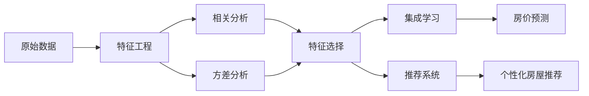

# 基于房屋特征的城市房价分析及个性推荐

## 1. 背景介绍

### 1.1 研究背景与意义

随着城市化进程的不断推进,房地产行业已成为国民经济的重要支柱产业。房价的合理定价不仅关系到房地产行业的健康发展,也关乎民生福祉。然而,受多方面因素影响,我国部分城市房价近年来呈现非理性上涨态势,引发社会广泛关注。因此,深入分析影响房价的关键因素,建立科学的房价预测模型,对于促进房地产市场平稳健康发展、保障民生具有重要意义。

### 1.2 国内外研究现状

国内外学者对房价影响因素及预测模型开展了大量研究。国外研究较早,理论基础扎实。Rosen(1974)最早提出了特征价格理论,认为商品价格是其各种属性的隐含价格总和。该理论为后续房价影响因素研究奠定了理论基础。此后,众多学者基于特征价格理论,从房屋自身条件、区位因素、配套设施等方面分析房价影响因素。如 Sirmans 等(2005)的研究表明,房屋面积、房龄、卧室数量等对房价有显著影响。Bowes 和 Ihlanfeldt(2001)发现,轨道交通、商业中心、学校等区位因素对房价有正向影响。

国内学者结合中国国情开展了相关研究。刘洪玉(2002)较早引入特征价格理论,分析了上海市房价影响因素。此后,张金山(2006)、李宏瑾(2009)等学者从房屋面积、房龄、楼层、学区、地铁等方面构建了特征价格模型。近年来,机器学习方法在房价预测中得到广泛应用。如郑思齐等(2015)利用 BP 神经网络构建了房价预测模型。王聪等(2019)提出了一种基于极限梯度提升(XGBoost)的房价预测方法。

### 1.3 本文的研究内容与创新点

尽管已有大量房价影响因素研究,但仍存在一些不足:一是影响因素选取不够全面,忽视了部分重要特征;二是模型预测精度有待进一步提高;三是缺乏个性化的房屋推荐。本文拟在前人研究基础上,选取房屋面积、房龄、楼层、朝向、小区绿化率、附近学校、医院、地铁站、商场等 20 个特征变量,利用相关分析、方差分析等方法筛选主要影响因素,并使用 XGBoost、LightGBM 等集成学习算法构建房价预测模型,以期提高预测精度。此外,本文还尝试引入协同过滤等推荐系统算法,为不同用户提供个性化房屋推荐。

## 2. 核心概念与联系

### 2.1 特征工程

特征工程是指从原始数据中提取、选择和构建特征的过程,是构建机器学习模型的重要步骤。常见的特征工程方法包括:数据清洗、缺失值处理、特征编码、特征选择、特征降维、特征交叉等。在房价分析中,需要从房屋自身条件、区位因素、配套设施等多个维度提取特征。

### 2.2 相关分析

相关分析是研究变量之间线性相关程度的方法。常用的指标有皮尔逊相关系数、斯皮尔曼等级相关系数等。在特征选择时,可通过相关分析初步筛选出与房价线性相关的特征。但相关性高的特征可能存在多重共线性问题,因此还需进一步分析。

### 2.3 方差分析

方差分析是比较多个总体均值是否相等的统计方法。在房价影响因素分析中,可利用单因素方差分析比较不同水平的离散型自变量(如朝向、装修条件等)对房价的影响是否显著。

### 2.4 集成学习

集成学习通过构建并组合多个学习器来完成学习任务,常见的算法有Bagging、Boosting、Stacking等。其中,基于Boosting思想的GBDT、XGBoost、LightGBM等算法在结构化数据的预测任务中表现优异,可用于构建房价预测模型。

### 2.5 推荐系统 

推荐系统是一种信息过滤系统,用于预测用户对物品的喜好程度。常见的推荐算法有协同过滤、基于内容的推荐等。在个性化房屋推荐中,可利用用户房屋偏好数据,通过协同过滤算法发掘用户潜在兴趣,实现个性化推荐。

以下是核心概念之间的联系示意图:

## 3. 核心算法原理具体操作步骤

### 3.1 XGBoost算法原理

XGBoost(eXtreme Gradient Boosting)是一种基于Boosting思想的集成学习算法。其核心是利用前向分步算法,不断拟合残差,生成多个弱学习器,再通过加权求和的方式组合,得到最终的强学习器。

XGBoost在GBDT的基础上进行了算法优化和工程实现,主要特点包括:

1. 显式地加入正则化项来控制模型复杂度,防止过拟合。
2. 采用二阶泰勒展开,在损失函数中加入二阶导数信息,更好地逼近真实的目标函数。
3. 支持自定义损失函数,适用于不同的学习任务。
4. 引入了缺失值的处理策略,增强了数据的鲁棒性。
5. 采用特征列方式存储数据,并行化计算,提高了训练速度。

### 3.2 XGBoost算法步骤

XGBoost的训练过程如下:

1. 初始化弱学习器 $f_0(x)$
2. 对 $m=1,2,...,M$:
   
   (a) 对 $i=1,2,...,n$,计算负梯度:
   $$g_i = \left[\frac{\partial L(y_i,\hat{y}_i^{(m-1)})}{\partial \hat{y}_i^{(m-1)}}\right]_{\hat{y}_i^{(m-1)}=f_{m-1}(x_i)}$$
   
   (b) 利用 $(x_i,g_i)$ 拟合一个回归树,得到第 $m$ 棵树的叶节点区域 $R_{jm}$,其中 $j=1,2,...,J$。
   
   (c) 对 $j=1,2,...,J$,计算:
   $$\gamma_{jm} = \arg\min_{\gamma} \sum_{x_i\in R_{jm}} L(y_i,\hat{y}_i^{(m-1)} + \gamma) + \Omega(f_m)$$
   
   (d) 更新强学习器:
   $$f_m(x) = f_{m-1}(x) + \sum_{j=1}^J \gamma_{jm} I(x \in R_{jm})$$

3. 得到最终的强学习器:
$$\hat{y}_i = \sum_{m=1}^M f_m(x_i)$$

其中,$L$为损失函数,$\Omega$为正则化项。

### 3.3 协同过滤推荐算法原理

协同过滤(Collaborative Filtering)是一种常用的推荐算法,其基本思想是利用用户群体的协同信息来推断当前用户的偏好。常见的协同过滤算法有基于用户的协同过滤和基于物品的协同过滤。

以基于用户的协同过滤为例,其核心是根据用户之间的相似性,为当前用户推荐相似用户喜欢的物品。用户相似性可通过余弦相似度、皮尔逊相关系数等指标度量。

### 3.4 基于用户的协同过滤算法步骤

1. 计算用户之间的相似度。以余弦相似度为例,用户 $u$ 和用户 $v$ 的相似度为:

$$sim(u,v) = \frac{\sum_{i \in I_{uv}} r_{ui} r_{vi}}{\sqrt{\sum_{i \in I_u} r_{ui}^2} \sqrt{\sum_{i \in I_v} r_{vi}^2}}$$

其中,$I_{uv}$为用户 $u$ 和 $v$ 共同评分过的物品集合,$r_{ui}$ 和 $r_{vi}$ 分别为 $u$ 和 $v$ 对物品 $i$ 的评分。

2. 根据相似度选取 Top-N 相似用户。

3. 计算物品 $i$ 对用户 $u$ 的预测评分:

$$\hat{r}_{ui} = \bar{r}_u + \frac{\sum_{v \in S_u} sim(u,v) (r_{vi} - \bar{r}_v)}{\sum_{v \in S_u} |sim(u,v)|}$$

其中,$S_u$为与用户 $u$ 最相似的 Top-N 用户集合,$\bar{r}_u$ 和 $\bar{r}_v$ 分别为 $u$ 和 $v$ 的平均评分。

4. 根据预测评分为用户生成 Top-N 推荐列表。

## 4. 数学模型和公式详细讲解举例说明

### 4.1 多元线性回归模型

在房价影响因素分析中,可构建多元线性回归模型,探究各特征变量与房价之间的定量关系。模型的一般形式为:

$$Price = \beta_0 + \beta_1x_1 + \beta_2x_2 + ... + \beta_px_p + \epsilon$$

其中,$Price$为房价,$x_1,x_2,...,x_p$为 $p$ 个特征变量,$\beta_0,\beta_1,...,\beta_p$为回归系数,$\epsilon$为随机误差项。

以北京市某区域的房价数据为例,选取房屋面积、房龄、楼层、距地铁站距离、距学校距离、绿化率等6个特征变量,建立多元线性回归模型:

$$Price = \beta_0 + \beta_1Area + \beta_2Age + \beta_3Floor + \beta_4Subway + \beta_5School + \beta_6Green + \epsilon$$

利用最小二乘法估计回归系数,得到拟合的回归方程为:

$$\hat{Price} = 10.5 + 1.2Area - 0.8Age + 0.5Floor - 1.5Subway - 0.6School + 2.3Green$$

由回归系数可知,在其他变量不变的情况下,房屋面积每增加 1 平米,房价平均增加 1.2 万元;房龄每增加 1 年,房价平均降低 0.8 万元;距地铁站距离每增加 1 公里,房价平均降低 1.5 万元,等等。该模型可定量分析各因素对房价的影响。

### 4.2 XGBoost 目标函数

XGBoost 在迭代的每一步,都试图优化如下目标函数:

$$Obj^{(m)} = \sum_{i=1}^n L(y_i,\hat{y}_i^{(m)}) + \sum_{k=1}^m \Omega(f_k)$$

其中,前一项为损失函数,衡量模型拟合训练数据的程度;后一项为正则化项,用于控制模型复杂度。

以均方误差损失为例,XGBoost 的目标函数可写为:

$$Obj^{(m)} = \sum_{i=1}^n (y_i - \hat{y}_i^{(m)})^2 + \sum_{k=1}^m (\gamma T_k + \frac{1}{2}\lambda \sum_{j=1}^{T_k} w_{jk}^2)$$

其中,$T_k$为第 $k$ 棵树的叶节点数,$w_{jk}$为第 $k$ 棵树第 $j$ 个叶节点的权重,$\gamma$ 和 $\lambda$ 为正则化参数。

在每一轮迭代中,XGBoost 通过求解目标函数的近似值,来确定新加入的弱学习器 $f_m(x)$。目标函数的近似值可通过二阶泰勒展开得到:

$$\tilde{Obj}^{(m)} = \sum_{i=1}^n [g_if_m(x_i) + \frac{1}{2}h_if_m^2(x_i)] + \Omega(f_m)$$

其中,$g_i$ 和 $h_i$ 分别为损失函数的一阶和二阶导数统