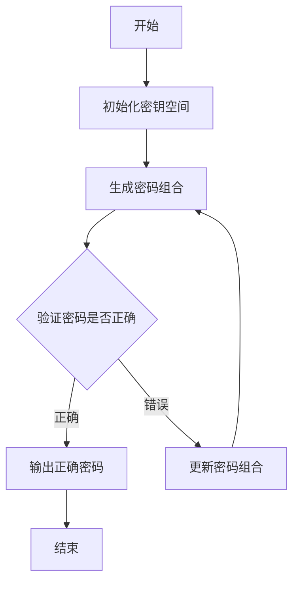

# 基于暴力破解攻击的网络安全模拟系统设计与实现

## 1.背景介绍

### 1.1 网络安全的重要性

在当今互联网时代,网络安全问题日益突出。随着信息技术的不断发展和网络应用的广泛普及,网络安全威胁也变得越来越严峻。网络攻击手段层出不穷,给个人隐私、企业机密、国家机密等造成了严重威胁。因此,加强网络安全防护,提高网络系统的安全性能至关重要。

### 1.2 暴力破解攻击概述  

暴力破解攻击是一种通过枚举所有可能的密码组合来破解密码的攻击方式。攻击者利用计算机的强大计算能力,尝试所有可能的密码组合,直到找到正确的密码。这种攻击方式虽然简单粗暴,但由于其高效性和可行性,仍然是常见的网络攻击手段之一。

### 1.3 网络安全模拟系统的作用

为了有效防范暴力破解攻击,需要对网络系统进行全面的安全测试和评估。网络安全模拟系统可以模拟各种网络攻击场景,包括暴力破解攻击,从而帮助发现系统中的安全漏洞,并采取相应的防护措施。通过模拟实战,可以提高网络管理员和安全人员的防御意识和应对能力。

## 2.核心概念与联系

### 2.1 密码学基础

密码学是网络安全的理论基础,包括对称加密、非对称加密、哈希函数、数字签名等概念。暴力破解攻击主要针对密码系统,因此需要了解密码学的相关原理。

### 2.2 密码强度

密码强度是衡量密码安全性的重要指标。密码强度越高,被暴力破解的难度就越大。影响密码强度的因素包括密码长度、字符组成复杂度等。

### 2.3 密钥空间

密钥空间是指所有可能的密钥组合的集合。暴力破解攻击的本质就是穷尽密钥空间,直到找到正确的密钥。密钥空间越大,暴力破解的难度就越高。

### 2.4 计算能力

计算能力是执行暴力破解攻击的关键因素。随着计算机硬件的不断发展,攻击者的计算能力也在不断提高,使得暴力破解攻击变得更加高效。

## 3.核心算法原理具体操作步骤

暴力破解攻击的核心算法是枚举所有可能的密码组合,并对每个组合进行验证,直到找到正确的密码。具体操作步骤如下:



1. **初始化密钥空间**:根据密码的长度、字符组成等信息,计算出所有可能的密码组合数量,确定密钥空间的大小。

2. **生成密码组合**:从密钥空间中生成一个密码组合,作为待验证的密码。

3. **验证密码是否正确**:使用生成的密码组合尝试登录或解密目标系统。如果成功,则该密码组合就是正确的密码;否则,继续尝试下一个组合。

4. **更新密码组合**:如果当前密码组合不正确,则从密钥空间中生成下一个待验证的密码组合。

5. **输出正确密码**:如果找到正确的密码,则输出该密码,攻击成功。

6. **结束**:如果穷尽了整个密钥空间仍未找到正确密码,则攻击失败,结束算法。

该算法的时间复杂度取决于密钥空间的大小。对于较小的密钥空间,暴力破解攻击可以在较短时间内完成;但对于足够大的密钥空间,暴力破解攻击将变得极其困难,甚至在实际时间内无法完成。

## 4.数学模型和公式详细讲解举例说明

### 4.1 密钥空间计算

密钥空间的大小决定了暴力破解攻击的难度。对于长度为 $n$ 的密码,如果字符集合包含 $m$ 种不同字符,则密钥空间的大小为:

$$
S = m^n
$$

例如,如果密码长度为 8 位,字符集包含 26 个大写字母、26 个小写字母和 10 个数字,则密钥空间的大小为:

$$
S = (26 + 26 + 10)^8 \approx 2.18 \times 10^{14}
$$

这意味着攻击者需要尝试大约 $2.18 \times 10^{14}$ 次才能穷尽整个密钥空间。

### 4.2 攻击时间估计

假设攻击者的计算能力为 $r$ 次密码尝试/秒,则暴力破解攻击所需的时间 $t$ 可以估计为:

$$
t = \frac{S}{r}
$$

继续上面的例子,如果攻击者的计算能力为 $10^9$ 次/秒,则攻击所需时间为:

$$
t = \frac{2.18 \times 10^{14}}{10^9} \approx 6.9 \text{ 年}
$$

可以看出,对于足够复杂的密码,暴力破解攻击将变得极其困难和低效。

### 4.3 密码强度评估

密码强度可以用信息熵来衡量,信息熵 $H$ 的计算公式为:

$$
H = -\sum_{i=1}^{m} p_i \log_2 p_i
$$

其中 $p_i$ 表示第 $i$ 种字符在密码中出现的概率。信息熵越高,密码的随机性越强,被暴力破解的难度也就越大。

例如,对于一个由 8 个随机字符(大小写字母和数字)组成的密码,假设每种字符出现的概率相等,则信息熵为:

$$
H = -\sum_{i=1}^{62} \frac{1}{62} \log_2 \frac{1}{62} = 6 \text{ bits/char}
$$

因此,该密码的总信息熵为 $8 \times 6 = 48$ bits,相当于一个 48 位的真随机数,被暴力破解的难度非常高。

通过计算信息熵,可以评估密码的强度,为选择合适的密码策略提供依据。

## 5.项目实践:代码实例和详细解释说明

为了模拟暴力破解攻击,我们可以编写一个简单的 Python 程序。该程序将尝试破解一个给定的密码,并统计所需的时间和尝试次数。

```python
import time
import string

# 目标密码
target_password = "MySecurePassword"

# 字符集合
characters = string.ascii_letters + string.digits

# 密钥空间大小
key_space_size = len(characters) ** len(target_password)

# 开始时间
start_time = time.time()

# 尝试次数
attempts = 0

# 暴力破解
while True:
    # 生成密码组合
    password = ''.join(random.choice(characters) for _ in range(len(target_password)))
    attempts += 1

    # 验证密码
    if password == target_password:
        break

# 结束时间
end_time = time.time()

# 输出结果
print(f"目标密码: {target_password}")
print(f"密钥空间大小: {key_space_size}")
print(f"尝试次数: {attempts}")
print(f"所需时间: {end_time - start_time:.2f} 秒")
```

该程序的工作流程如下:

1. 首先定义目标密码 `target_password` 和字符集合 `characters`。
2. 计算密钥空间的大小 `key_space_size`。
3. 记录开始时间 `start_time`。
4. 进入循环,不断生成密码组合 `password`。
5. 验证生成的密码是否与目标密码相同。如果相同,则跳出循环。
6. 记录结束时间 `end_time`。
7. 输出目标密码、密钥空间大小、尝试次数和所需时间。

运行该程序,我们可以观察到暴力破解攻击的过程。对于较简单的密码,程序可以在较短时间内找到正确的密码。但是,对于更复杂的密码,程序可能需要花费大量时间才能完成攻击。

通过修改目标密码和字符集合,我们可以模拟不同的攻击场景,评估密码的强度,并优化密码策略。

## 6.实际应用场景

暴力破解攻击在现实中有广泛的应用场景,包括但不限于:

### 6.1 密码审计

企业和组织可以使用暴力破解攻击来评估其系统中使用的密码的强度。通过模拟攻击,可以发现弱密码,并要求用户更改为更安全的密码。

### 6.2 渗透测试

渗透测试是评估网络系统安全性的重要手段。渗透测试人员可以使用暴力破解攻击来尝试破解目标系统的密码,从而发现安全漏洞。

### 6.3 数字取证

在数字取证过程中,调查人员可能需要破解加密文件或设备的密码,以获取关键证据。暴力破解攻击是一种常用的密码破解方法。

### 6.4 密码恢复

用户有时会忘记密码,无法访问自己的账户或文件。在这种情况下,暴力破解攻击可以用于恢复密码,前提是密码足够简单。

### 6.5 加密分析

密码学研究人员可以使用暴力破解攻击来分析加密算法的强度,评估加密系统的安全性,并提出改进建议。

## 7.工具和资源推荐

### 7.1 密码破解工具

- Hashcat: 一款高性能的密码恢复工具,支持多种算法和攻击类型。
- John the Ripper: 一款广为人知的密码破解工具,具有丰富的功能和插件。
- Cain & Abel: 一款集成了多种网络攻击功能的工具,包括密码破解。

### 7.2 渗透测试工具

- Metasploit: 一款著名的渗透测试框架,包含多种攻击模块和漏洞利用。
- Nmap: 一款强大的网络探测和安全扫描工具,可用于发现目标系统的开放端口和服务。
- Wireshark: 一款网络数据包捕获和分析工具,可用于监控网络流量。

### 7.3 密码管理工具

- KeePass: 一款开源的密码管理工具,可以安全地存储和管理各种密码。
- LastPass: 一款基于云的密码管理服务,支持多平台同步。
- 1Password: 一款简单易用的密码管理工具,具有丰富的功能和扩展。

### 7.4 在线资源

- OWASP: 开放式Web应用程序安全项目,提供了丰富的网络安全资源和最佳实践。
- NIST: 美国国家标准与技术研究院,发布了多项网络安全标准和指南。
- Cybrary: 一个在线学习平台,提供了大量网络安全相关的课程和培训。

## 8.总结:未来发展趋势与挑战

### 8.1 量子计算的影响

量子计算的发展可能会对密码学产生深远影响。量子计算机的强大计算能力可能会使现有的加密算法失效,从而使暴力破解攻击变得更加容易。因此,需要开发新的量子密码学算法,以抵御量子计算机的威胁。

### 8.2 人工智能在网络安全中的应用

人工智能技术在网络安全领域有着广阔的应用前景。例如,机器学习可以用于检测和预防网络攻击,智能代理可以自主响应和缓解安全威胁。未来,人工智能可能会成为网络安全的重要助手。

### 8.3 物联网安全

随着物联网设备的快速普及,物联网安全也成为一个新的挑战。由于许多物联网设备计算能力有限、安全防护薄弱,它们可能成为暴力破解攻击的目标。因此,需要加强物联网设备的安全性,并制定相应的安全标准和规范。

### 