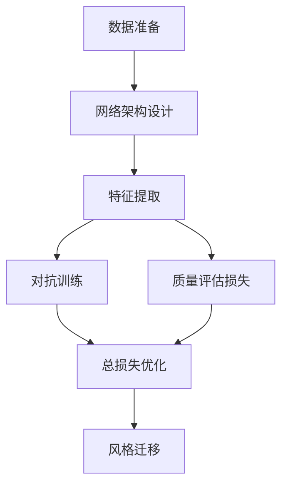

# 基于生成对抗网络和质量评估的图像风格迁移方法

## 1.背景介绍

### 1.1 图像风格迁移概述

图像风格迁移是一种将一种风格迁移到另一种图像上的技术。它可以将一幅图像的风格(如画作的笔触、色彩等)应用到另一幅图像上,从而创造出具有独特视觉效果的新图像。这种技术在数字艺术、图像编辑、摄影后期处理等领域有广泛应用。

传统的图像风格迁移方法通常依赖于手工特征提取和复杂的优化过程,计算效率低下且结果质量参差不齐。而近年来,基于深度学习的方法(尤其是生成对抗网络GAN)为图像风格迁移提供了新的解决方案,显著提高了迁移质量和效率。

### 1.2 生成对抗网络在图像风格迁移中的作用

生成对抗网络(Generative Adversarial Networks, GAN)是一种由生成网络和判别网络组成的无监督深度学习模型。生成网络的目标是生成逼真的数据(如图像),而判别网络则判断生成的数据是真实的还是伪造的。两个网络相互对抗,最终达到生成网络生成的数据无法被判别网络识别的状态。

在图像风格迁移中,生成对抗网络可以高效地学习内容图像和风格图像的特征,并将风格迁移到内容图像上,生成具有期望风格的新图像。与传统方法相比,GAN方法具有以下优势:

1. 端到端训练,避免了复杂的优化过程
2. 生成质量更高、视觉效果更自然
3. 迁移速度快,适合实时应用

### 1.3 质量评估在图像风格迁移中的作用

虽然GAN可以生成高质量的风格迁移图像,但有时生成结果可能存在模糊、失真等问题。因此,需要对生成图像的质量进行评估,从而指导模型的优化和改进。常用的图像质量评估指标包括:

1. 峰值信噪比(PSNR)
2. 结构相似性(SSIM)
3. 无参考图像质量评估(NRIQA)

通过将这些质量评估指标融入到GAN的损失函数中,可以使生成网络在生成逼真图像的同时,也注重图像的清晰度和细节保真度。

综上所述,基于生成对抗网络和质量评估的图像风格迁移方法,可以高效地生成具有期望风格且质量优秀的图像,是当前图像风格迁移领域的前沿技术。

## 2.核心概念与联系

### 2.1 生成对抗网络(GAN)

生成对抗网络由两个网络组成:生成器(Generator)和判别器(Discriminator)。

**生成器(Generator)**: 生成器的目标是从随机噪声中生成逼真的数据(如图像),使得判别器无法将其与真实数据区分开。

**判别器(Discriminator)**: 判别器的目标是区分生成器生成的数据和真实数据,并提供反馈给生成器进行优化。

生成器和判别器相互对抗,形成一个minimax博弈,目标函数如下:

$$\min_G \max_D V(D,G) = \mathbb{E}_{x\sim p_{data}(x)}[\log D(x)] + \mathbb{E}_{z\sim p_z(z)}[\log(1-D(G(z)))]$$

其中:
- $p_{data}(x)$是真实数据的概率分布
- $p_z(z)$是随机噪声的概率分布
- $G(z)$表示生成器从噪声$z$生成的数据
- $D(x)$表示判别器对数据$x$为真实数据的概率评分

在训练过程中,生成器不断尝试生成更逼真的数据来欺骗判别器,而判别器也在努力区分真实数据和生成数据。通过这种对抗训练,最终生成器可以生成高质量的数据。

### 2.2 图像风格迁移

图像风格迁移的目标是将一种风格(如画作的笔触、色彩等)应用到另一幅图像(内容图像)上,生成具有期望风格的新图像。

具体来说,给定一个内容图像$c$和一个风格图像$s$,我们希望生成一个新图像$g$,使得$g$保留了$c$的内容,同时获得了$s$的风格特征。这可以通过以下损失函数来实现:

$$\mathcal{L}(g, c, s) = \alpha \mathcal{L}_{content}(g, c) + \beta \mathcal{L}_{style}(g, s)$$

其中:
- $\mathcal{L}_{content}$是内容损失,用于保持生成图像$g$的内容与原内容图像$c$相似
- $\mathcal{L}_{style}$是风格损失,用于使生成图像$g$获得期望风格$s$的风格特征
- $\alpha$和$\beta$是权重系数,用于平衡内容损失和风格损失

传统的图像风格迁移方法通常使用手工特征和优化算法来最小化上述损失函数。而基于GAN的方法则是使用生成网络直接生成风格迁移图像,避免了复杂的优化过程。

### 2.3 质量评估

虽然GAN可以生成高质量的风格迁移图像,但有时生成结果可能存在模糊、失真等问题。因此,需要对生成图像的质量进行评估,从而指导模型的优化和改进。常用的图像质量评估指标包括:

1. **峰值信噪比(PSNR)**: PSNR是一种常用的评估图像失真程度的指标。它基于像素值的均方误差来衡量图像质量,值越大表示失真越小,图像质量越好。

2. **结构相似性(SSIM)**: SSIM是一种基于人眼视觉感知的图像质量评估指标。它考虑了图像的亮度、对比度和结构相似性,值越接近1表示两幅图像越相似,质量越好。

3. **无参考图像质量评估(NRIQA)**: NRIQA是一种不需要参考图像的图像质量评估方法。它通过学习图像的统计特征和失真模式,直接评估图像的主观质量。常用的NRIQA模型包括BRISQUE、NIQE等。

通过将这些质量评估指标融入到GAN的损失函数中,可以使生成网络在生成逼真图像的同时,也注重图像的清晰度和细节保真度,从而提高生成图像的整体质量。

## 3.核心算法原理具体操作步骤

基于生成对抗网络和质量评估的图像风格迁移方法通常包括以下几个主要步骤:

1. **数据准备**: 准备内容图像和风格图像数据集。内容图像是需要进行风格迁移的图像,而风格图像则提供了期望的风格特征。

2. **网络架构设计**: 设计生成网络和判别网络的架构。常用的生成网络架构包括U-Net、ResNet等,而判别网络则通常采用卷积神经网络。

3. **特征提取**: 使用预训练的卷积神经网络(如VGG)提取内容图像和风格图像的特征。内容特征通常来自较浅层,用于保留图像的语义内容;而风格特征则来自较深层,用于捕获图像的纹理、颜色等风格信息。

4. **对抗训练**: 将提取的内容特征和风格特征输入生成网络,生成初始的风格迁移图像。然后,将生成图像与真实图像输入判别网络,计算对抗损失。生成网络的目标是最小化对抗损失,使判别网络无法区分生成图像和真实图像。

5. **质量评估损失**: 计算生成图像与内容图像之间的内容损失,以及生成图像与风格图像之间的风格损失。同时,还可以计算生成图像的质量评估损失(如PSNR、SSIM等)。

6. **总损失优化**: 将对抗损失、内容损失、风格损失和质量评估损失组合成总损失函数,并使用优化算法(如Adam)对生成网络进行端到端的训练,最小化总损失。

7. **风格迁移**: 在测试阶段,将需要进行风格迁移的内容图像输入到训练好的生成网络中,即可生成具有期望风格的新图像。

以上步骤可以用以下Mermaid流程图概括:



需要注意的是,上述流程可能会根据具体的模型架构和损失函数设计而有所调整。此外,还可以引入其他技术(如注意力机制、多尺度处理等)来进一步提高风格迁移的质量和效率。

## 4.数学模型和公式详细讲解举例说明

在基于生成对抗网络和质量评估的图像风格迁移方法中,涉及到多个数学模型和公式,下面将详细讲解并给出示例说明。

### 4.1 生成对抗网络(GAN)损失函数

生成对抗网络的目标是训练一个生成器$G$,使其能够生成逼真的数据,以欺骗判别器$D$。同时,也要训练一个判别器$D$,使其能够很好地区分真实数据和生成数据。这可以通过以下minimax博弈的目标函数来实现:

$$\min_G \max_D V(D,G) = \mathbb{E}_{x\sim p_{data}(x)}[\log D(x)] + \mathbb{E}_{z\sim p_z(z)}[\log(1-D(G(z)))]$$

其中:
- $p_{data}(x)$是真实数据的概率分布
- $p_z(z)$是随机噪声的概率分布
- $G(z)$表示生成器从噪声$z$生成的数据
- $D(x)$表示判别器对数据$x$为真实数据的概率评分

判别器$D$的目标是最大化上式,使得对真实数据的评分$\log D(x)$最大化,对生成数据的评分$\log(1-D(G(z)))$最小化。而生成器$G$的目标是最小化上式,使得生成数据$G(z)$能够欺骗判别器,使$\log(1-D(G(z)))$最大化。

通过交替优化判别器$D$和生成器$G$,最终可以达到生成器生成的数据无法被判别器识别的状态,即生成器能够生成逼真的数据。

**示例**:
假设我们有一个生成器$G$和判别器$D$,分别由多层神经网络构成。给定一批真实图像数据$x$和一批随机噪声$z$,我们可以计算GAN损失函数如下:

```python
# 计算判别器对真实数据的评分
D_real = D(x)
# 计算判别器对生成数据的评分
G_sample = G(z)
D_fake = D(G_sample)

# 计算GAN损失函数
D_loss = -torch.mean(torch.log(D_real) + torch.log(1 - D_fake))
G_loss = -torch.mean(torch.log(D_fake))
```

其中,`D_loss`是判别器的损失函数,需要最小化;`G_loss`是生成器的损失函数,也需要最小化。通过反向传播和优化算法(如Adam),我们可以交替更新判别器和生成器的参数,最小化相应的损失函数。

### 4.2 内容损失和风格损失

在图像风格迁移中,我们需要将一种风格迁移到另一幅图像上,同时保留原图像的内容。这可以通过最小化内容损失和风格损失来实现:

$$\mathcal{L}(g, c, s) = \alpha \mathcal{L}_{content}(g, c) + \beta \mathcal{L}_{style}(g, s)$$

其中:
- $g$是生成的风格迁移图像
- $c$是原始内容图像
- $s$是期望风格图像
- $\mathcal{L}_{content}$是内容损失,用于保持生成图像$g$的内容与原内容图像$c$相似
- $\mathcal{L}_{style}$是风格损失,用于使生成图像$g$获得期望风格$s$的风格特征