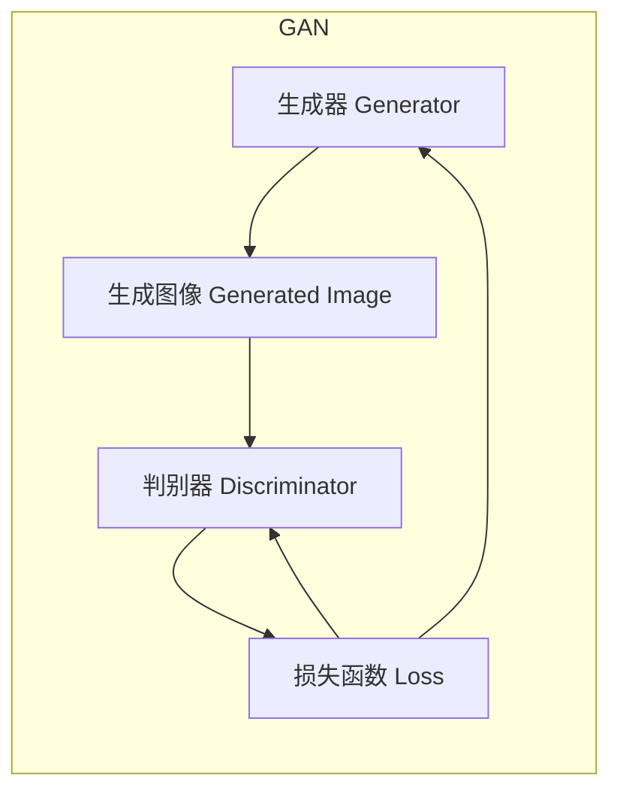
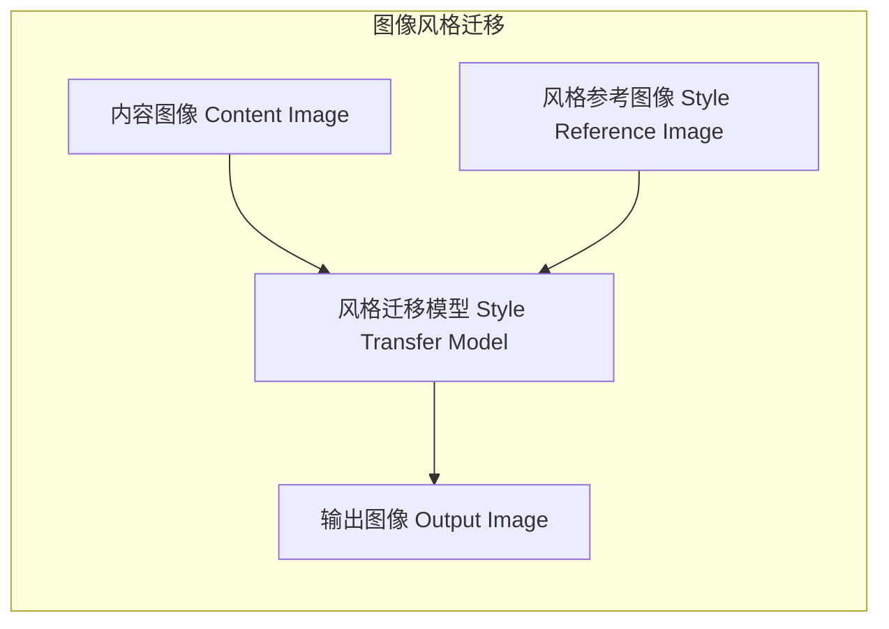
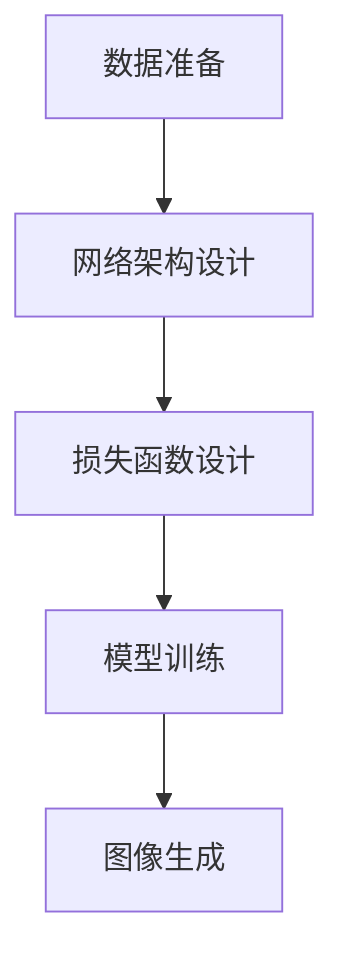
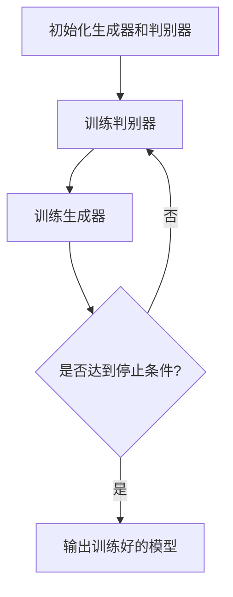

# 基于生成对抗网络的图像风格迁移效果评价体系研究

## 1. 背景介绍

### 1.1 图像风格迁移概述

图像风格迁移是一种将一种图像风格迁移到另一种图像上的技术。它可以将一幅内容图像与一幅风格参考图像相结合,生成一幅新的图像,该图像不仅保留了内容图像的内容,还融合了风格参考图像的风格特征。这种技术在多个领域都有广泛应用,例如艺术创作、图像增强、图像编辑等。

### 1.2 生成对抗网络在图像风格迁移中的应用

传统的图像风格迁移算法通常基于手工特征提取和优化,计算效率较低。随着深度学习技术的发展,生成对抗网络(Generative Adversarial Networks,GAN)展现出了强大的图像生成能力,被广泛应用于图像风格迁移任务中。GAN由生成器(Generator)和判别器(Discriminator)两个神经网络组成,通过对抗训练的方式,生成器可以学习到生成逼真图像的能力。

### 1.3 图像风格迁移效果评价的重要性

随着GAN在图像风格迁移领域的广泛应用,如何评价生成图像的质量成为一个亟待解决的问题。合理的评价体系不仅可以帮助研究人员优化模型,还能为最终用户提供参考,指导他们选择合适的风格迁移算法。然而,目前缺乏一个通用的、系统的图像风格迁移效果评价体系,这就是本文研究的主要动机。

## 2. 核心概念与联系

### 2.1 生成对抗网络(GAN)

生成对抗网络是一种由生成器和判别器组成的深度学习架构。生成器的目标是生成逼真的图像,而判别器的目标是区分生成图像和真实图像。通过不断地对抗训练,生成器和判别器相互促进,最终使生成器能够生成高质量的图像。



### 2.2 图像风格迁移

图像风格迁移是指将一种图像风格迁移到另一种图像上的过程。它通常包括以下三个部分:

1. 内容图像(Content Image):需要保留内容的图像。
2. 风格参考图像(Style Reference Image):提供风格特征的图像。
3. 输出图像(Output Image):融合了内容图像内容和风格参考图像风格的新图像。



### 2.3 图像风格迁移效果评价

图像风格迁移效果评价是指对生成图像的质量进行评估,包括以下几个方面:

1. 内容保真度:生成图像是否保留了内容图像的主要内容。
2. 风格迁移效果:生成图像是否成功融合了风格参考图像的风格特征。
3. 图像质量:生成图像的清晰度、对比度、颜色等客观质量指标。
4. 主观感受:生成图像给人的主观视觉体验。

## 3. 核心算法原理具体操作步骤

### 3.1 基于GAN的图像风格迁移算法

基于GAN的图像风格迁移算法通常包括以下几个步骤:

1. **数据准备**:准备内容图像和风格参考图像数据集。
2. **网络架构设计**:设计生成器和判别器的网络架构。
3. **损失函数设计**:设计合适的损失函数,包括对抗损失、内容损失和风格损失等。
4. **模型训练**:使用对抗训练策略,交替训练生成器和判别器。
5. **图像生成**:使用训练好的生成器,输入内容图像和风格参考图像,生成风格迁移后的图像。



### 3.2 损失函数设计

损失函数的设计是图像风格迁移算法的核心部分,通常包括以下几个部分:

1. **对抗损失(Adversarial Loss)**:使生成图像能够"欺骗"判别器,让判别器无法区分生成图像和真实图像。
2. **内容损失(Content Loss)**:保证生成图像的内容与内容图像相似。
3. **风格损失(Style Loss)**:使生成图像的风格特征与风格参考图像相似。

总体损失函数可以表示为:

$$\mathcal{L}_{total} = \lambda_1 \mathcal{L}_{adv} + \lambda_2 \mathcal{L}_{content} + \lambda_3 \mathcal{L}_{style}$$

其中,$\lambda_1,\lambda_2,\lambda_3$是权重系数,用于平衡不同损失项的重要性。

### 3.3 训练策略

训练过程中,生成器和判别器通过对抗训练相互促进:

1. **训练判别器**:固定生成器的参数,使用真实图像和生成器生成的图像训练判别器,目标是最大化判别器的判别能力。
2. **训练生成器**:固定判别器的参数,使用内容图像和风格参考图像训练生成器,目标是最小化总体损失函数,生成质量更高的图像。



## 4. 数学模型和公式详细讲解举例说明

### 4.1 内容损失

内容损失用于保证生成图像的内容与内容图像相似,通常使用预训练的神经网络提取图像的特征,并计算生成图像特征与内容图像特征之间的均方差:

$$\mathcal{L}_{content}(G) = \frac{1}{N}\sum_{i=1}^{N}(F^l(G(c,s))-F^l(c))^2$$

其中,$G$是生成器网络,$c$是内容图像,$s$是风格参考图像,$F^l$是预训练网络的第$l$层特征提取函数,$N$是特征图的元素个数。

### 4.2 风格损失

风格损失用于使生成图像的风格特征与风格参考图像相似,通常使用格拉姆矩阵(Gram Matrix)来表示风格特征:

$$G^l_{ij}=\sum_{k}F^l_{ik}F^l_{jk}$$

其中,$F^l$是预训练网络的第$l$层特征图,$i,j$是特征图的宽高索引,$k$是特征图的通道索引。

风格损失定义为生成图像和风格参考图像的格拉姆矩阵之间的均方差:

$$\mathcal{L}_{style}(G)=\sum_{l=1}^{L}\frac{1}{N_l^2M_l^2}\sum_{i,j}(G^l_{ij}(G(c,s))-A^l_{ij}(s))^2$$

其中,$L$是用于计算风格损失的层数,$N_l,M_l$分别是第$l$层特征图的宽高,$A^l_{ij}(s)$是风格参考图像在第$l$层的格拉姆矩阵。

通过最小化内容损失和风格损失,可以使生成图像同时保留内容图像的内容和风格参考图像的风格特征。

### 4.3 对抗损失

对抗损失是GAN中的核心损失函数,用于促使生成器生成逼真的图像,同时增强判别器的判别能力。常用的对抗损失包括最小二乘损失、Wasserstein损失、Hinge损失等。以最小二乘损失为例:

$$\mathcal{L}_{adv}(G,D)=\mathbb{E}_{x\sim P_{data}(x)}[(D(x)-1)^2]+\mathbb{E}_{z\sim P_{z}(z)}[D(G(z))^2]$$

其中,$D$是判别器,$G$是生成器,$x$是真实图像,$z$是噪声输入,$P_{data}(x)$是真实图像的分布,$P_z(z)$是噪声的分布。

通过最小化对抗损失,生成器可以学习生成更加逼真的图像,判别器也可以提高区分真实图像和生成图像的能力。

## 5. 项目实践:代码实例和详细解释说明

以下是一个基于PyTorch实现的图像风格迁移项目示例,包括核心模型代码和训练代码:

### 5.1 模型代码

```python
import torch
import torch.nn as nn

# 生成器
class Generator(nn.Module):
    def __init__(self, in_channels, out_channels):
        super(Generator, self).__init__()
        # 编码器
        self.encoder = nn.Sequential(
            nn.Conv2d(in_channels, 64, 3, stride=2, padding=1),
            nn.ReLU(),
            nn.Conv2d(64, 128, 3, stride=2, padding=1),
            nn.ReLU(),
        )
        # 残差块
        self.res_blocks = nn.Sequential(
            ResidualBlock(128),
            ResidualBlock(128),
            ResidualBlock(128),
            ResidualBlock(128),
            ResidualBlock(128),
        )
        # 解码器
        self.decoder = nn.Sequential(
            nn.ConvTranspose2d(128, 64, 3, stride=2, padding=1, output_padding=1),
            nn.ReLU(),
            nn.ConvTranspose2d(64, out_channels, 3, stride=2, padding=1, output_padding=1),
            nn.Tanh(),
        )

    def forward(self, x):
        x = self.encoder(x)
        x = self.res_blocks(x)
        x = self.decoder(x)
        return x

# 判别器
class Discriminator(nn.Module):
    def __init__(self, in_channels):
        super(Discriminator, self).__init__()
        self.model = nn.Sequential(
            nn.Conv2d(in_channels, 64, 4, stride=2, padding=1),
            nn.LeakyReLU(0.2),
            nn.Conv2d(64, 128, 4, stride=2, padding=1),
            nn.BatchNorm2d(128),
            nn.LeakyReLU(0.2),
            nn.Conv2d(128, 256, 4, stride=2, padding=1),
            nn.BatchNorm2d(256),
            nn.LeakyReLU(0.2),
            nn.Conv2d(256, 512, 4, padding=1),
            nn.BatchNorm2d(512),
            nn.LeakyReLU(0.2),
            nn.Conv2d(512, 1, 4, padding=1),
        )

    def forward(self, x):
        x = self.model(x)
        return x

# 残差块
class ResidualBlock(nn.Module):
    def __init__(self, channels):
        super(ResidualBlock, self).__init__()
        self.conv1 = nn.Conv2d(channels, channels, 3, padding=1)
        self.bn1 = nn.BatchNorm2d(channels)
        self.relu = nn.ReLU()
        self.conv2 = nn.Conv2d(channels, channels, 3, padding=1)
        self.bn2 = nn.BatchNorm2d(channels)

    def forward(self, x):
        residual = x
        x = self.relu(self.bn1(self.conv1(x)))
        x = self.bn2(self.conv2(x))
        x += residual
        return x
```

这段代码定义了生成器、判别器和残差块的网络架构。生成器采用编码器-残差块-解码器的结构,判别器采用卷积-批归一化-LeakyReLU的结构,残差块用于增强生成器的表达能力。

### 5.2 训练代码

```python
import torch
import torch.nn as nn
import torchvision.transforms as transforms
from torchvision.utils import save_image
from PIL import Image

# 超参数
device = torch.device("cuda" if torch.cuda.is_available() else "cpu")
batch_size = 8
image_size = 256
lr = 0.0002
beta1 = 0.5
beta2 = 0.999
epochs = 200
content_weight = 1
style_weight = 1e6
lambda_adv = 0.001

# 加载数据
transform = transforms.Compose([
    transforms.Resize(image_size),
    transforms.ToTensor(),
    transforms.Normalize((0.5, 0.5, 0.5), (0.5, 0.5,