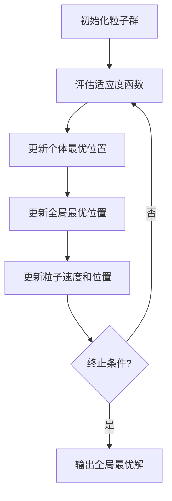

# 基于粒子群算法的神经网络权重优化

## 1. 背景介绍

随着深度学习技术的不断发展和广泛应用,神经网络在计算机视觉、自然语言处理、语音识别等领域取得了巨大的成功。然而,训练一个高性能的神经网络模型并非易事,权重的初始化和优化对于模型的收敛性和泛化能力至关重要。传统的梯度下降优化算法虽然简单有效,但容易陷入局部最优解,且对超参数的选择较为敏感。因此,研究人员一直在探索更加高效、鲁棒的优化算法,以提高神经网络的性能表现。

粒子群优化算法(Particle Swarm Optimization, PSO)是一种基于群体智能的启发式优化算法,它模拟了鸟群或鱼群在寻找食物时的群体行为。由于其简单、高效、易于实现的特点,PSO算法已被广泛应用于函数优化、神经网络训练、模式识别等领域。本文将重点介绍如何将PSO算法应用于神经网络权重的优化,以期获得更好的模型性能。

## 2. 核心概念与联系

### 2.1 神经网络权重优化

在神经网络中,权重矩阵决定了网络各层之间的连接强度,直接影响着模型的预测能力。传统的反向传播算法通过计算损失函数对权重的梯度,并沿着梯度的反方向更新权重,从而最小化损失函数。然而,这种基于梯度的优化方法存在一些缺陷,例如容易陷入局部最优解、收敛速度慢等。

为了克服这些问题,研究人员提出了各种启发式优化算法,如遗传算法、蚁群优化算法和粒子群优化算法等。这些算法通过模拟自然界中的进化过程或群体行为,能够更有效地探索解空间,避免陷入局部最优解。

### 2.2 粒子群优化算法

粒子群优化算法(PSO)是一种基于群体智能的启发式优化算法,它模拟了鸟群或鱼群在寻找食物时的群体行为。在PSO算法中,每个潜在解被称为"粒子",粒子在解空间中进行飞行搜索。每个粒子都有一个适应度值,用于评估当前位置的优劣。粒子根据自身的历史最优位置和群体的全局最优位置来调整飞行方向和速度,从而不断更新自身的位置,最终收敛到全局最优解附近。

PSO算法的优点在于简单、易于实现、计算效率高、收敛速度快等。它不需要计算梯度信息,可以有效避免陷入局部最优解。此外,PSO算法还具有良好的并行性,适合在大规模并行计算环境中实现。

## 3. 核心算法原理具体操作步骤

PSO算法的核心思想是通过模拟鸟群或鱼群的群体行为,在解空间中进行全局搜索,从而找到最优解。算法的具体操作步骤如下:

1. **初始化粒子群**

   首先,需要初始化一个包含N个粒子的粒子群。每个粒子代表一个潜在的解,包括位置向量$\vec{x_i}$和速度向量$\vec{v_i}$,其中$i=1,2,...,N$。粒子的位置向量对应于优化问题的解,而速度向量决定了粒子在解空间中的飞行方向和步长。通常,粒子的初始位置和速度是在解空间的范围内随机生成的。

2. **评估适应度函数**

   对于每个粒子,需要计算其适应度函数值$f(\vec{x_i})$,用于评估当前位置的优劣。在神经网络权重优化问题中,适应度函数通常是模型在验证集上的损失函数或评估指标,如交叉熵损失、准确率等。

3. **更新个体最优位置**

   对于每个粒子,将当前位置$\vec{x_i}$与其历史最优位置$\vec{p_i}$进行比较。如果当前位置的适应度函数值优于历史最优位置,则将$\vec{p_i}$更新为$\vec{x_i}$。

4. **更新全局最优位置**

   在整个粒子群中,找到具有最佳适应度函数值的粒子,将其位置记为全局最优位置$\vec{g}$。

5. **更新粒子速度和位置**

   根据每个粒子的当前速度$\vec{v_i}$、个体最优位置$\vec{p_i}$和全局最优位置$\vec{g}$,更新粒子的速度和位置,具体更新公式如下:

   $$\vec{v_i}(t+1) = \omega \vec{v_i}(t) + c_1 r_1 (\vec{p_i}(t) - \vec{x_i}(t)) + c_2 r_2 (\vec{g}(t) - \vec{x_i}(t))$$
   $$\vec{x_i}(t+1) = \vec{x_i}(t) + \vec{v_i}(t+1)$$

   其中,$\omega$是惯性权重,用于控制粒子继承当前速度的程度;$c_1$和$c_2$是加速常数,用于控制粒子向个体最优位置和全局最优位置靠拢的程度;$r_1$和$r_2$是两个服从均匀分布$U(0,1)$的随机数,用于增加算法的随机性。

6. **终止条件判断**

   重复执行步骤3-5,直到达到最大迭代次数或满足其他终止条件。最终,全局最优位置$\vec{g}$即为优化问题的最优解。

在应用PSO算法优化神经网络权重时,需要将神经网络的权重矩阵展开为一维向量,作为粒子的位置向量。每个粒子代表一组权重参数,通过不断更新粒子的位置,即可优化神经网络的权重。

PSO算法的流程图如下所示:



## 4. 数学模型和公式详细讲解举例说明

在PSO算法中,粒子的位置和速度更新公式是核心部分,决定了算法的收敛性和优化能力。下面将详细讲解这两个公式的数学原理和意义。

### 4.1 速度更新公式

粒子的速度更新公式为:

$$\vec{v_i}(t+1) = \omega \vec{v_i}(t) + c_1 r_1 (\vec{p_i}(t) - \vec{x_i}(t)) + c_2 r_2 (\vec{g}(t) - \vec{x_i}(t))$$

其中:

- $\vec{v_i}(t)$表示第$i$个粒子在第$t$次迭代时的速度向量。
- $\omega$是惯性权重,用于控制粒子继承当前速度的程度。通常$\omega$的取值范围为$[0.8,1.2]$,较大的$\omega$值有利于全局搜索,较小的$\omega$值有利于局部搜索。
- $c_1$和$c_2$是加速常数,分别控制粒子向个体最优位置和全局最优位置靠拢的程度。通常$c_1$和$c_2$的取值范围为$[1.5,2.5]$。
- $r_1$和$r_2$是两个服从均匀分布$U(0,1)$的随机数,用于增加算法的随机性,避免陷入局部最优解。
- $\vec{p_i}(t)$是第$i$个粒子在第$t$次迭代时的个体最优位置。
- $\vec{g}(t)$是整个粒子群在第$t$次迭代时的全局最优位置。

速度更新公式的三项分别代表了以下三种影响因素:

1. **惯性项**:$\omega \vec{v_i}(t)$表示粒子继承当前速度的惯性,使粒子能够在解空间中进行全局搜索。
2. **认知项**:$c_1 r_1 (\vec{p_i}(t) - \vec{x_i}(t))$表示粒子向自身历史最优位置靠拢的认知行为,使粒子能够利用自身的优良经验。
3. **社会项**:$c_2 r_2 (\vec{g}(t) - \vec{x_i}(t))$表示粒子向群体全局最优位置靠拢的社会行为,使粒子能够学习群体的优良经验。

通过合理设置惯性权重$\omega$和加速常数$c_1$、$c_2$,可以平衡粒子的全局搜索能力和局部搜索能力,从而提高算法的收敛性和优化性能。

### 4.2 位置更新公式

粒子的位置更新公式为:

$$\vec{x_i}(t+1) = \vec{x_i}(t) + \vec{v_i}(t+1)$$

该公式表示,粒子在下一次迭代时的位置等于当前位置加上更新后的速度。通过不断更新粒子的位置,粒子可以在解空间中进行飞行搜索,最终收敛到全局最优解附近。

需要注意的是,在实际应用中,通常需要对粒子的位置和速度进行边界限制,以防止粒子飞出解空间的范围。

### 4.3 举例说明

假设我们需要优化一个二维函数$f(x,y) = (x-2)^2 + (y+3)^2$,目标是找到函数的全局最小值。

初始化一个包含10个粒子的粒子群,粒子的初始位置和速度在$[-10,10]$的范围内随机生成。设置惯性权重$\omega=0.9$,加速常数$c_1=c_2=2$。

在第$t$次迭代时,假设第$i$个粒子的位置为$\vec{x_i}(t) = (x_i(t), y_i(t))$,速度为$\vec{v_i}(t) = (v_{x_i}(t), v_{y_i}(t))$,个体最优位置为$\vec{p_i}(t) = (p_{x_i}(t), p_{y_i}(t))$,全局最优位置为$\vec{g}(t) = (g_x(t), g_y(t))$。

则第$i$个粒子在第$t+1$次迭代时的速度和位置更新如下:

$$\begin{aligned}
v_{x_i}(t+1) &= 0.9 v_{x_i}(t) + 2 r_1 (p_{x_i}(t) - x_i(t)) + 2 r_2 (g_x(t) - x_i(t)) \\
v_{y_i}(t+1) &= 0.9 v_{y_i}(t) + 2 r_1 (p_{y_i}(t) - y_i(t)) + 2 r_2 (g_y(t) - y_i(t)) \\
x_i(t+1) &= x_i(t) + v_{x_i}(t+1) \\
y_i(t+1) &= y_i(t) + v_{y_i}(t+1)
\end{aligned}$$

其中,$r_1$和$r_2$是两个服从均匀分布$U(0,1)$的随机数。

通过不断更新粒子的速度和位置,粒子群最终会收敛到函数的全局最小值$(2,-3)$附近。

## 5. 项目实践: 代码实例和详细解释说明

为了更好地理解PSO算法在神经网络权重优化中的应用,我们将提供一个基于PyTorch框架的代码实例,对MNIST手写数字识别任务进行实验。

### 5.1 导入所需库

```python
import torch
import torch.nn as nn
import torch.optim as optim
from torchvision import datasets, transforms
```

### 5.2 定义神经网络模型

```python
class Net(nn.Module):
    def __init__(self):
        super(Net, self).__init__()
        self.fc1 = nn.Linear(28 * 28, 512)
        self.fc2 = nn.Linear(512, 256)
        self.fc3 = nn.Linear(256, 10)

    def forward(self, x):
        x = x.view(-1, 28 * 28)
        x = torch.relu(self.fc1(x))
        x = torch