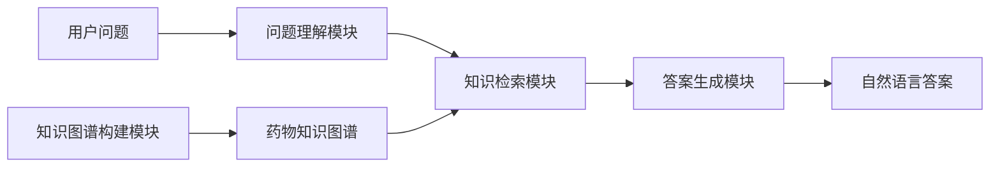

# 基于药物知识图谱的自动问答系统

## 1. 背景介绍

### 1.1 医疗健康领域的挑战

随着人口老龄化和医疗保健成本的不断上升,医疗健康领域面临着巨大的挑战。患者和普通民众对于专业医疗知识的需求与日俱增,而医疗资源的短缺和分布不均造成了供需矛盾。同时,医疗数据和知识的海量增长也给传统的信息检索和知识管理带来了新的挑战。

### 1.2 知识图谱在医疗领域的应用

知识图谱作为一种结构化的知识表示和管理方式,具有很好的扩展性和可解释性,在医疗健康领域展现出了巨大的应用潜力。通过构建涵盖药物、疾病、症状、检查等多个实体类型及其关系的知识图谱,可以更好地组织和管理分散的医疗知识,为智能问答、个性化推荐等应用提供基础支撑。

### 1.3 自动问答系统的重要性

自动问答系统作为一种基于自然语言处理和知识库的智能系统,能够为用户提供准确、及时的知识服务。在医疗健康领域,自动问答系统可以帮助患者和普通民众快速获取所需的医疗知识,缓解医疗资源的压力,提高医疗服务的可及性和效率。

## 2. 核心概念与联系

### 2.1 知识图谱

知识图谱(Knowledge Graph)是一种结构化的知识表示形式,它将现实世界中的实体(Entity)、概念(Concept)、事件(Event)等以及它们之间的关系(Relation)以图的形式进行组织和存储。知识图谱通常由三元组(Triple)构成,每个三元组包含一个主体(Subject)、一个谓词(Predicate)和一个宾语(Object),用于描述实体之间的关系。

在医疗健康领域,知识图谱可以涵盖药物、疾病、症状、检查、治疗等多个实体类型,以及它们之间的关系,如"药物X适用于治疗疾病Y"、"症状Z是疾病Y的表现"等。通过构建这样的知识图谱,可以更好地组织和管理分散的医疗知识,为智能问答、个性化推荐等应用提供基础支撑。

### 2.2 自动问答系统

自动问答系统(Question Answering System)是一种基于自然语言处理和知识库的智能系统,能够理解用户提出的自然语言问题,从知识库中检索相关信息,并生成自然语言形式的答案。自动问答系统通常包括以下几个核心模块:

1. **问题理解模块(Question Understanding)**:将用户输入的自然语言问题转换为系统可以理解的形式,如查询语句或逻辑表达式。
2. **知识检索模块(Knowledge Retrieval)**:根据问题的语义,从知识库中检索相关的信息。
3. **答案生成模块(Answer Generation)**:基于检索到的知识,生成自然语言形式的答案。
4. **知识库(Knowledge Base)**:存储结构化的知识,通常采用知识图谱或其他形式的知识表示方式。

在基于药物知识图谱的自动问答系统中,知识库就是构建的药物知识图谱,系统可以利用图数据库技术高效地检索和推理知识图谱中的信息,为用户提供准确的答案。

### 2.3 核心概念的联系

知识图谱和自动问答系统是密切相关的两个概念。知识图谱作为一种结构化的知识表示形式,为自动问答系统提供了知识基础。自动问答系统则利用知识图谱中的知识,通过自然语言处理和推理技术,实现了人机交互式的知识服务。

在基于药物知识图谱的自动问答系统中,药物知识图谱是系统的核心知识库,它将药物、疾病、症状等实体及其关系以结构化的形式存储。自动问答系统则通过问题理解、知识检索和答案生成等模块,利用知识图谱中的知识为用户提供准确的答案。这种结合知识图谱和自动问答技术的系统,可以为医疗健康领域提供高效、智能的知识服务。

## 3. 核心算法原理具体操作步骤

基于药物知识图谱的自动问答系统的核心算法原理主要包括以下几个方面:

### 3.1 知识图谱构建

构建高质量的药物知识图谱是系统的基础。知识图谱构建的主要步骤包括:

1. **数据采集**:从各种医疗数据源(如医学文献、药品说明书、临床指南等)中采集相关数据。
2. **实体识别与关系抽取**:利用命名实体识别(Named Entity Recognition, NER)和关系抽取(Relation Extraction, RE)技术,从原始数据中识别出药物、疾病、症状等实体,以及它们之间的关系。
3. **实体链接与去重**:将识别出的实体链接到知识库中已有的实体,并进行实体去重。
4. **知识融合与存储**:将抽取的实体和关系融合到知识图谱中,并存储在图数据库中。

在这个过程中,常用的算法包括基于规则的方法、基于统计机器学习的方法(如条件随机场、深度学习等)以及混合方法。

### 3.2 问题理解

问题理解模块的主要任务是将用户输入的自然语言问题转换为系统可以理解的形式,如查询语句或逻辑表达式。常用的算法包括:

1. **问句分类**:将问句分类到预定义的问题类型(如"药物适应症"、"药物不良反应"等)中,通常采用基于机器学习的分类算法。
2. **命名实体识别**:从问句中识别出药物、疾病等实体,常用的算法包括基于规则的方法和基于统计机器学习的方法。
3. **语义解析**:将问句转换为查询语句或逻辑表达式,常用的算法包括基于规则的语义解析和基于序列到序列模型的神经网络语义解析。

### 3.3 知识检索

知识检索模块的主要任务是根据问题的语义,从知识图谱中检索相关的信息。常用的算法包括:

1. **基于图模式匹配的检索**:根据问题的语义,构建相应的图模式,在知识图谱中进行子图匹配,检索出符合模式的实体和关系。
2. **基于embedding的相似度计算**:将实体和关系映射到低维向量空间(embedding),通过计算向量之间的相似度来检索相关知识。
3. **基于规则的推理**:根据预定义的推理规则,在知识图谱上进行推理,推导出隐式的知识。

### 3.4 答案生成

答案生成模块的主要任务是基于检索到的知识,生成自然语言形式的答案。常用的算法包括:

1. **基于模板的答案生成**:根据问题类型和检索到的知识,填充预定义的答案模板,生成自然语言答案。
2. **基于序列到序列模型的答案生成**:将问题和检索到的知识作为输入,通过序列到序列模型(如Transformer等)直接生成自然语言答案。
3. **基于知识融合的答案生成**:从检索到的多个知识片段中,融合相关信息,生成连贯的自然语言答案。

## 4. 数学模型和公式详细讲解举例说明

在基于药物知识图谱的自动问答系统中,数学模型和公式主要应用于以下几个方面:

### 4.1 知识图谱嵌入

知识图谱嵌入(Knowledge Graph Embedding)是将实体和关系映射到低维连续向量空间的技术,它可以捕捉实体和关系之间的语义信息,并支持基于向量相似度的知识检索和推理。常用的知识图谱嵌入模型包括TransE、DistMult、ComplEx等。

以TransE模型为例,它将每个三元组(h, r, t)映射到一个向量空间,使得 $\vec{h} + \vec{r} \approx \vec{t}$,其中$\vec{h}$、$\vec{r}$、$\vec{t}$分别表示主体实体、关系和宾语实体的向量表示。TransE模型的目标是最小化以下损失函数:

$$J = \sum_{(h,r,t) \in S} \sum_{(h',r',t') \in S'} [\gamma + d(\vec{h} + \vec{r}, \vec{t}) - d(\vec{h'} + \vec{r'}, \vec{t'})]_+$$

其中,$S$表示训练集中的正例三元组,$S'$表示负例三元组,$\gamma$是一个超参数,用于增加正例和负例之间的边距,$d$是距离函数(通常采用$L_1$或$L_2$范数),$[\cdot]_+$表示正值函数。

通过优化上述损失函数,TransE模型可以学习出实体和关系的向量表示,这些向量表示可以用于知识检索、链接预测等任务。

### 4.2 神经网络模型

在问题理解和答案生成模块中,常常采用基于神经网络的模型,如序列到序列模型(Seq2Seq)、注意力机制(Attention Mechanism)等。

以基于Transformer的Seq2Seq模型为例,它可以用于语义解析和答案生成任务。Transformer模型的核心是多头自注意力机制(Multi-Head Attention),它可以捕捉输入序列中不同位置之间的依赖关系。对于一个长度为$n$的输入序列$X = (x_1, x_2, \dots, x_n)$,自注意力机制计算的是一个新的序列$Z = (z_1, z_2, \dots, z_n)$,其中每个$z_i$是输入序列中所有位置的加权和:

$$z_i = \sum_{j=1}^n \alpha_{ij}(x_j W^V)$$

其中,$W^V$是一个可学习的权重矩阵,用于映射输入向量,$\alpha_{ij}$是注意力权重,表示$x_i$对$x_j$的注意力程度,它通过以下公式计算:

$$\alpha_{ij} = \frac{exp(e_{ij})}{\sum_{k=1}^n exp(e_{ik})}, \quad e_{ij} = \frac{(x_iW^Q)(x_jW^K)^T}{\sqrt{d_k}}$$

其中,$W^Q$和$W^K$也是可学习的权重矩阵,$d_k$是缩放因子,用于防止点积过大导致梯度消失。

通过堆叠多个编码器和解码器层,并引入残差连接和层归一化等技术,Transformer模型可以有效地建模长距离依赖关系,并在机器翻译、语义解析等任务中取得了优异的表现。

### 4.3 其他模型

除了上述模型外,基于药物知识图谱的自动问答系统还可能涉及其他数学模型和公式,如:

- 基于规则的语义解析模型,通过定义一系列语法和语义规则来分析问句结构和意义。
- 基于图模式匹配的知识检索模型,通过子图同构性检测算法在知识图谱中匹配查询模式。
- 基于知识融合的答案生成模型,通过整合多个知识片段,生成连贯的自然语言答案。

这些模型和公式的具体形式和应用细节,需要根据系统的具体实现方式进行深入研究和设计。

## 5. 项目实践:代码实例和详细解释说明

在本节中,我们将提供一个基于药物知识图谱的自动问答系统的实现示例,并对关键代码进行详细解释。

### 5.1 系统架构

我们的系统采用了经典的管道式架构,包括以下几个主要模块:

1. 知识图谱构建模块
2. 问题理解模块
3. 知识检索模块
4. 答案生成模块

### 5.2 知识图谱构建

我们使用Python库py2neo连接Neo4j图数据库,并通过Cypher查询语言操作知识图谱。以下是一个示