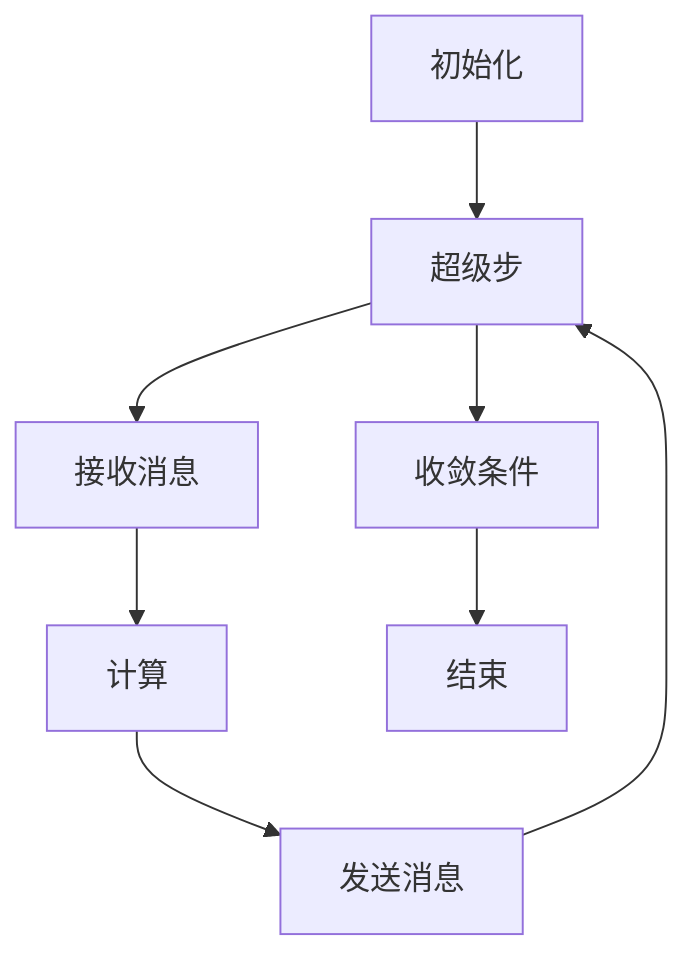

# 基因组学研究:Pregel处理生物信息数据

## 1.背景介绍

基因组学研究是现代生物学和医学的重要领域，通过对基因组数据的分析，科学家们可以揭示生物体的遗传信息，理解疾病的机制，并开发新的治疗方法。然而，基因组数据的规模和复杂性使得传统的数据处理方法难以应对。Pregel作为一种大规模图处理框架，提供了一种高效的并行计算方法，能够处理海量的基因组数据。

## 2.核心概念与联系

### 2.1 基因组学

基因组学是研究生物体基因组的结构、功能、进化和映射的科学。基因组是一个生物体的全部遗传物质，包括所有的基因和非编码序列。基因组学研究的目标是理解基因的功能和相互作用，以及它们在生物体中的表达和调控。

### 2.2 Pregel框架

Pregel是由Google提出的一种大规模图处理框架，专为处理大规模图数据而设计。Pregel采用“顶点-消息”模型，通过迭代计算来处理图数据。每个顶点在每一轮迭代中接收消息、进行计算并发送消息给相邻顶点，直到计算收敛。

### 2.3 基因组数据与图模型

基因组数据可以表示为图模型，其中节点代表基因或其他遗传元素，边代表它们之间的关系（如相互作用、调控关系等）。这种图模型可以通过Pregel框架进行高效处理，从而揭示基因组数据中的复杂关系和模式。

## 3.核心算法原理具体操作步骤

### 3.1 Pregel计算模型

Pregel的计算模型包括以下几个步骤：

1. **初始化**：将图数据加载到Pregel系统中，每个顶点初始化其状态。
2. **超级步**：Pregel的计算过程由多个超级步组成。在每个超级步中，顶点接收来自上一超级步的消息，进行计算，并发送消息给相邻顶点。
3. **收敛条件**：当所有顶点都不再发送消息时，计算过程结束。

### 3.2 Pregel算法示例

以下是一个简单的Pregel算法示例，用于计算图中每个顶点的最短路径：

1. **初始化**：将源顶点的距离设为0，其他顶点的距离设为无穷大。
2. **超级步**：
   - 每个顶点接收来自相邻顶点的距离消息。
   - 更新自身的距离为接收到的最小距离加上边的权重。
   - 将更新后的距离发送给相邻顶点。
3. **收敛条件**：当所有顶点的距离不再更新时，计算过程结束。

### 3.3 Pregel在基因组学中的应用

在基因组学研究中，Pregel可以用于以下任务：

1. **基因相互作用网络分析**：通过Pregel处理基因相互作用网络，识别关键基因和调控路径。
2. **基因组比对**：使用Pregel进行大规模基因组比对，发现基因组中的相似序列和变异。
3. **基因表达数据分析**：通过Pregel处理基因表达数据，揭示基因表达模式和调控机制。

## 4.数学模型和公式详细讲解举例说明

### 4.1 图模型

基因组数据可以表示为图 $G = (V, E)$，其中 $V$ 是顶点集合，代表基因或其他遗传元素，$E$ 是边集合，代表它们之间的关系。每个顶点 $v \in V$ 具有一个状态 $s(v)$，每条边 $e \in E$ 具有一个权重 $w(e)$。

### 4.2 最短路径算法

在最短路径算法中，每个顶点 $v$ 维护一个距离值 $d(v)$，表示从源顶点到 $v$ 的最短距离。算法的初始化和更新过程如下：

1. **初始化**：
   $$
   d(v) = 
   \begin{cases} 
   0 & \text{if } v = \text{source} \\
   \infty & \text{otherwise}
   \end{cases}
   $$

2. **更新**：
   在每个超级步中，顶点 $v$ 接收来自相邻顶点 $u$ 的距离消息 $d(u) + w(u, v)$，并更新自身的距离：
   $$
   d(v) = \min(d(v), d(u) + w(u, v))
   $$

### 4.3 基因相互作用网络分析

在基因相互作用网络中，每个顶点 $v$ 代表一个基因，边 $e$ 代表基因之间的相互作用。通过Pregel框架，可以计算每个基因的中心性度量，如度中心性、接近中心性和介数中心性，从而识别关键基因。

### 4.4 Mermaid流程图

以下是Pregel计算模型的Mermaid流程图：



## 5.项目实践：代码实例和详细解释说明

### 5.1 环境设置

首先，确保你已经安装了一个支持Pregel的图处理框架，如Apache Giraph或Google Pregel。

### 5.2 代码实例

以下是一个使用Apache Giraph实现最短路径算法的示例代码：

```java
import org.apache.giraph.graph.BasicComputation;
import org.apache.giraph.graph.Vertex;
import org.apache.hadoop.io.DoubleWritable;
import org.apache.hadoop.io.LongWritable;
import org.apache.hadoop.io.NullWritable;

public class ShortestPathComputation extends BasicComputation<
    LongWritable, DoubleWritable, NullWritable, DoubleWritable> {

    @Override
    public void compute(Vertex<LongWritable, DoubleWritable, NullWritable> vertex,
                        Iterable<DoubleWritable> messages) {
        if (getSuperstep() == 0) {
            vertex.setValue(new DoubleWritable(Double.MAX_VALUE));
        }

        double minDist = vertex.getValue().get();
        for (DoubleWritable message : messages) {
            minDist = Math.min(minDist, message.get());
        }

        if (minDist < vertex.getValue().get()) {
            vertex.setValue(new DoubleWritable(minDist));
            for (Edge<LongWritable, NullWritable> edge : vertex.getEdges()) {
                sendMessage(edge.getTargetVertexId(), new DoubleWritable(minDist + 1));
            }
        }

        vertex.voteToHalt();
    }
}
```

### 5.3 详细解释

1. **初始化**：在第一个超级步中，将所有顶点的距离值初始化为无穷大。
2. **接收消息**：在每个超级步中，顶点接收来自相邻顶点的距离消息。
3. **计算**：更新顶点的距离值为接收到的最小距离。
4. **发送消息**：将更新后的距离值发送给相邻顶点。
5. **收敛条件**：当所有顶点的距离值不再更新时，计算过程结束。

## 6.实际应用场景

### 6.1 基因相互作用网络分析

通过Pregel处理基因相互作用网络，可以识别关键基因和调控路径，从而揭示基因的功能和相互作用。例如，研究人员可以使用Pregel计算基因网络中的中心性度量，识别在疾病中起关键作用的基因。

### 6.2 基因组比对

基因组比对是基因组学研究中的重要任务，通过比对不同个体或物种的基因组，研究人员可以发现基因组中的相似序列和变异。Pregel可以用于大规模基因组比对，提供高效的并行计算能力。

### 6.3 基因表达数据分析

基因表达数据分析是研究基因在不同条件下的表达模式和调控机制的重要方法。通过Pregel处理基因表达数据，研究人员可以揭示基因表达的复杂模式和调控关系。

## 7.工具和资源推荐

### 7.1 Apache Giraph

Apache Giraph是一个开源的Pregel实现，提供了高效的图处理能力。Giraph基于Hadoop构建，支持大规模分布式计算。

### 7.2 Google Pregel

Google Pregel是Pregel框架的原始实现，专为处理大规模图数据而设计。虽然Pregel本身不是开源的，但其思想和模型在许多开源项目中得到了应用。

### 7.3 GraphX

GraphX是Apache Spark的图处理库，提供了类似Pregel的API。GraphX支持大规模图数据的处理和分析，适用于基因组学研究中的各种任务。

## 8.总结：未来发展趋势与挑战

### 8.1 未来发展趋势

随着基因组学研究的不断深入和基因组数据的快速增长，基因组数据处理技术将面临更大的挑战。Pregel作为一种高效的图处理框架，在基因组学研究中具有广泛的应用前景。未来，Pregel框架可能会进一步优化和扩展，以支持更复杂的基因组数据分析任务。

### 8.2 挑战

尽管Pregel在处理大规模图数据方面具有显著优势，但在基因组学研究中仍面临一些挑战：

1. **数据规模**：基因组数据的规模和复杂性不断增加，要求Pregel框架具备更高的计算能力和扩展性。
2. **算法复杂性**：基因组学研究中的许多算法具有较高的复杂性，需要对Pregel框架进行优化和扩展，以支持这些复杂算法。
3. **数据质量**：基因组数据的质量和完整性对分析结果有重要影响，需要开发有效的数据清洗和预处理方法。

## 9.附录：常见问题与解答

### 9.1 Pregel与MapReduce的区别是什么？

Pregel和MapReduce都是大规模数据处理框架，但它们的计算模型不同。Pregel采用“顶点-消息”模型，适用于图数据的迭代计算；而MapReduce采用“映射-归约”模型，适用于批处理任务。

### 9.2 Pregel可以处理哪些类型的图数据？

Pregel可以处理各种类型的图数据，包括无向图、有向图、加权图和非加权图。它适用于社交网络分析、基因组学研究、网络安全等领域。

### 9.3 如何优化Pregel算法的性能？

优化Pregel算法的性能可以从以下几个方面入手：

1. **数据分区**：合理的数据分区可以减少通信开销，提高计算效率。
2. **消息压缩**：通过消息压缩技术，可以减少消息传输的带宽占用。
3. **增量计算**：对于动态变化的图数据，可以采用增量计算方法，只对变化部分进行计算。

### 9.4 Pregel在基因组学研究中的应用有哪些？

Pregel在基因组学研究中的应用包括基因相互作用网络分析、基因组比对和基因表达数据分析等。通过Pregel框架，可以高效处理和分析大规模基因组数据，揭示基因的功能和相互作用。

---

作者：禅与计算机程序设计艺术 / Zen and the Art of Computer Programming