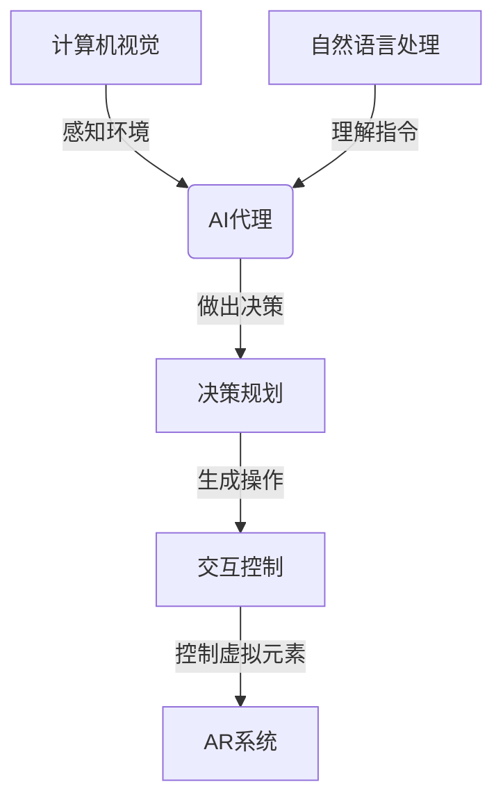

# 增强现实(AR)中AI代理的工作流程设计

## 1.背景介绍

### 1.1 增强现实(AR)的概念

增强现实(Augmented Reality, AR)是一种将虚拟信息与现实世界相融合的技术。它通过计算机视觉、图像处理和图形渲染等技术,将虚拟的二维或三维对象叠加到现实世界的视图中,为用户提供一种全新的沉浸式体验。

### 1.2 AR的应用领域

增强现实技术在多个领域都有广泛的应用前景,包括但不限于:

- 游戏娱乐
- 教育培训
- 旅游导航
- 零售购物
- 医疗保健
- 工业制造

### 1.3 AI代理在AR中的作用

人工智能(AI)代理在增强现实系统中扮演着至关重要的角色。它们负责感知环境,理解场景,做出决策并执行相应的操作,从而增强用户的现实体验。AI代理需要具备以下核心能力:

- 计算机视觉
- 自然语言处理
- 决策规划
- 交互控制

## 2.核心概念与联系

### 2.1 计算机视觉

计算机视觉是AI代理理解现实世界的基础,它包括以下关键技术:

- 图像分割
- 目标检测
- 目标跟踪
- 3D重建
- 视觉SLAM

### 2.2 自然语言处理

自然语言处理(NLP)使AI代理能够理解和生成人类语言,实现人机交互。NLP技术包括:

- 语音识别
- 语义理解
- 对话管理
- 自然语言生成

### 2.3 决策规划

决策规划模块根据感知数据和上下文信息,制定出合理的行为策略。常用的决策规划算法有:

- 强化学习
- 马尔可夫决策过程
- 启发式搜索算法

### 2.4 交互控制

交互控制模块负责将决策规划的结果转化为具体的操作,控制AR系统中的虚拟元素。它需要考虑:

- 图形渲染
- 动画生成
- 物理模拟

上述四个模块紧密协作,构成了AR中AI代理的核心功能。

## 3.核心算法原理具体操作步骤

### 3.1 计算机视觉算法

#### 3.1.1 图像分割

图像分割是将图像划分为多个独立区域的过程,是计算机视觉的基础任务。常用算法包括:

1. **阈值分割**: 根据像素灰度值将图像二值化。
2. **边缘检测**: 检测图像中物体的边缘,如Canny算法。
3. **区域生长**: 从种子点出发,将相似像素合并为区域。
4. **聚类算法**: 如K-Means,将像素根据特征聚类。
5. **图割算法**: 将图像建模为加权无向图,切分图得到分割结果。
6. **深度学习**: 使用卷积神经网络(CNN)等模型进行端到端分割。

#### 3.1.2 目标检测

目标检测是在图像或视频中定位感兴趣目标的位置,并给出目标类别。主要算法有:

1. **基于滑动窗口**: 在图像上滑动窗口,对每个窗口进行目标分类。
2. **基于区域候选**: 先生成区域候选框,再对每个候选框进行目标分类。
3. **单shot检测器**: 一次性预测出所有目标的位置和类别,如YOLO,SSD。
4. **基于Transformer**: 使用Transformer编码器-解码器架构进行目标检测,如DETR。

#### 3.1.3 目标跟踪

目标跟踪是在连续视频帧中跟踪感兴趣目标的运动轨迹。常见算法包括:

1. **点跟踪**: 基于目标的特征点进行跟踪,如KLT,SIFT等。
2. **核跟踪**: 根据目标的表观模型(如直方图)进行跟踪。
3. **discriminative相关滤波**: 将跟踪问题建模为在线训练的分类器。
4. **深度学习**: 使用CNN、RNN等网络结构进行端到端跟踪。

#### 3.1.4 3D重建

3D重建是从2D图像或视频中恢复出3D场景的形状和结构。主要方法有:

1. **基于形状**: 利用形状约束(如光滑性、对称性等)来重建3D模型。
2. **基于运动**: 从不同视角观察到的运动中恢复出3D结构,如刚体运动等。
3. **基于体素**: 将3D空间划分为体素,对每个体素进行占有率估计。 
4. **基于深度学习**: 使用编码器-解码器网络从单张或多张RGB图像预测深度和3D模型。

#### 3.1.5 视觉SLAM

同步定位与映射(SLAM)是让智能体自主定位并建立环境地图的过程。视觉SLAM利用相机作为主要传感器,主要分为以下两种方法:

1. **特征点法**: 检测和跟踪图像中的特征点,并利用多视角几何原理估计相机运动和3D点云。
2. **直接法**: 直接优化每个像素的光度误差,无需提取特征点,如直接稠密法(DSO)。

### 3.2 自然语言处理算法

#### 3.2.1 语音识别

语音识别将语音信号转录为文本,是自然语言处理的第一步。主要方法有:

1. **隐马尔可夫模型(HMM)**: 将语音建模为隐状态的马尔可夫链。
2. **高斯混合模型(GMM)**: 使用高斯混合模型表示声学模型。
3. **深度神经网络**: 使用递归神经网络(RNN)、卷积神经网络(CNN)等模型直接对声学特征建模。

#### 3.2.2 语义理解

语义理解从文本中提取结构化的语义表示,是对话系统的关键。主要方法包括:

1. **基于规则**: 使用语法分析和语义规则进行理解。
2. **统计机器翻译**: 将语义理解看作是将自然语言"翻译"为语义表示的过程。
3. **序列到序列模型**: 使用编码器-解码器架构(如LSTM+Attention)将自然语言映射到语义表示。
4. **预训练语言模型微调**: 在大规模语料上预训练语言模型(如BERT),再针对特定任务进行微调。

#### 3.2.3 对话管理

对话管理模块维护对话状态,决定系统的响应策略。主要方法有:

1. **基于规则**: 根据手工设计的规则进行对话控制。
2. **基于机器学习**: 使用强化学习、马尔可夫决策过程等方法学习对话策略。
3. **端到端神经模型**: 使用序列到序列模型直接生成响应。
4. **基于知识库**: 结合外部知识库提供更丰富的响应。

#### 3.2.4 自然语言生成

自然语言生成将语义表示转化为自然语言输出。主要方法包括:

1. **模板化方法**: 根据预定义的模板生成句子。
2. **统计机器翻译**: 将语义表示"翻译"为自然语言。
3. **序列到序列模型**: 使用编码器-解码器架构生成自然语言。
4. **生成式预训练模型**: 使用GPT等生成式预训练语言模型进行文本生成。

### 3.3 决策规划算法

#### 3.3.1 强化学习

强化学习通过与环境的交互来学习最优策略,是决策规划的主要方法。常用算法有:

1. **Q-Learning**: 通过更新Q值函数来学习状态-行为价值。
2. **策略梯度**: 直接对策略参数进行梯度上升优化。
3. **Actor-Critic**: 结合价值函数估计和策略梯度的方法。
4. **深度强化学习**: 使用深度神经网络来近似Q函数或策略。

#### 3.3.2 马尔可夫决策过程

马尔可夫决策过程(MDP)为强化学习提供了理论框架,描述了决策过程的状态转移和奖赏模型。求解MDP的算法包括:

1. **价值迭代**: 通过迭代计算最优价值函数,如值迭代、策略迭代等。
2. **线性规划**: 将MDP问题建模为线性规划,使用LP算法求解。
3. **蒙特卡罗树搜索**: 通过构建搜索树,在线规划最优策略。

#### 3.3.3 启发式搜索算法

启发式搜索算法在状态空间中搜索最优路径,常用于规划和调度问题。主要算法有:

1. **A*算法**: 使用启发式函数估计剩余代价,在状态空间中搜索最优路径。
2. **GBFS**: 贪婪最优优先搜索,只考虑目标函数而不考虑已走路径代价。
3. **IDA***: 迭代加深A*算法,通过逐步加深搜索深度来节省内存。
4. **LRTA***: 学习实时A*算法,通过学习更新启发式函数来提高效率。

### 3.4 交互控制算法

#### 3.4.1 图形渲染

图形渲染是将3D场景投影到2D图像平面的过程,常用算法包括:

1. **光栅化**: 将3D几何体转化为像素级的2D图像,如Z-Buffer算法。
2. **光线追踪**: 模拟光线在3D场景中的传播过程,生成逼真的图像。
3. **实时渲染**: 针对交互式应用的高效渲染算法,如延迟渲染等。
4. **体渲染**: 针对体数据(如体素、点云等)的体渲染算法。

#### 3.4.2 动画生成

动画生成控制虚拟物体的运动,主要算法包括:

1. **关键帧动画**: 设置关键帧,算法自动插值生成平滑动画。
2. **运动捕捉**: 通过捕捉真实人体运动数据生成动画。
3. **物理模拟**: 根据物理定律模拟物体运动,如刚体动力学、柔体动力学等。
4. **基于深度学习**: 使用神经网络直接生成动画序列。

#### 3.4.3 物理模拟

物理模拟为虚拟场景提供真实的物理行为,主要算法有:

1. **刚体动力学**: 模拟刚体之间的碰撞、约束等现象。
2. **柔体动力学**: 模拟柔性物体的形变、运动等现象。
3. **流体动力学**: 模拟液体、烟雾等流体现象。
4. **位置相关动力学**: 通过投影约束求解,计算高质量的刚柔体动力学。

## 4.数学模型和公式详细讲解举例说明

### 4.1 计算机视觉数学模型

#### 4.1.1 图像处理基础

**灰度变换**

输入灰度图像 $I$, 输出经过变换后的图像 $I'$:

$$I'(x,y) = T(I(x,y))$$

其中 $T$ 为灰度变换函数,如对数变换、伽马变换等。

**空间滤波**

使用卷积核 $H$ 对图像 $I$ 进行滤波:

$$I'(x,y) = H(x,y) * I(x,y) = \sum_{i=-a}^{a}\sum_{j=-b}^{b}H(i,j)I(x-i,y-j)$$

其中 $*$ 表示卷积操作,常用于图像平滑、锐化等。

**频域滤波**

对图像 $I$ 进行傅里叶变换得到 $F(u,v)$,在频域进行滤波:

$$G(u,v) = H(u,v)F(u,v)$$

其中 $H(u,v)$ 为频率域滤波器,如高通滤波、低通滤波等。

#### 4.1.2 单应性与多视图几何

**单应性矩阵**

单应性矩