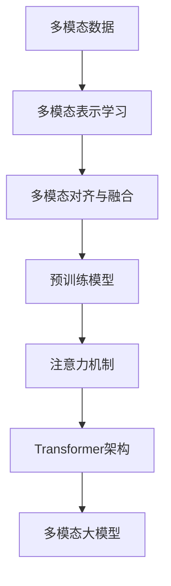

# 多模态大模型：技术原理与实战 GPT的创新点总结

## 1. 背景介绍
### 1.1 大模型的发展历程
#### 1.1.1 单模态大模型的兴起
#### 1.1.2 多模态大模型的出现
#### 1.1.3 GPT系列模型的演进

### 1.2 多模态大模型的意义
#### 1.2.1 突破单模态的局限性
#### 1.2.2 实现跨模态信息的融合
#### 1.2.3 拓展人工智能的应用场景

## 2. 核心概念与联系
### 2.1 多模态学习
#### 2.1.1 多模态数据的定义
#### 2.1.2 多模态表示学习
#### 2.1.3 多模态对齐与融合

### 2.2 预训练模型
#### 2.2.1 无监督预训练
#### 2.2.2 跨模态预训练
#### 2.2.3 自监督学习

### 2.3 注意力机制
#### 2.3.1 自注意力机制
#### 2.3.2 交叉注意力机制
#### 2.3.3 多头注意力机制

### 2.4 Transformer架构
#### 2.4.1 编码器-解码器结构
#### 2.4.2 位置编码
#### 2.4.3 残差连接与层归一化



## 3. 核心算法原理具体操作步骤
### 3.1 多模态预训练
#### 3.1.1 掩码语言建模
#### 3.1.2 图像-文本匹配
#### 3.1.3 视觉-语言对齐

### 3.2 多模态融合
#### 3.2.1 早期融合
#### 3.2.2 晚期融合
#### 3.2.3 交互式融合

### 3.3 任务适应
#### 3.3.1 微调
#### 3.3.2 提示学习
#### 3.3.3 零样本学习

## 4. 数学模型和公式详细讲解举例说明
### 4.1 注意力机制的数学表示
#### 4.1.1 缩放点积注意力
$Attention(Q,K,V) = softmax(\frac{QK^T}{\sqrt{d_k}})V$
#### 4.1.2 多头注意力
$MultiHead(Q,K,V) = Concat(head_1, ..., head_h)W^O$
其中$head_i = Attention(QW_i^Q, KW_i^K, VW_i^V)$

### 4.2 Transformer的数学表示
#### 4.2.1 编码器
$z_0 = Embedding(x) + PositionalEncoding(x)$
$z_l = LayerNorm(z_{l-1} + MultiHead(z_{l-1}, z_{l-1}, z_{l-1}))$
$z_l = LayerNorm(z_l + FeedForward(z_l))$
#### 4.2.2 解码器  
$y_0 = Embedding(y) + PositionalEncoding(y)$
$y_l = LayerNorm(y_{l-1} + MultiHead(y_{l-1}, y_{l-1}, y_{l-1}))$
$y_l = LayerNorm(y_l + MultiHead(y_l, z_L, z_L))$
$y_l = LayerNorm(y_l + FeedForward(y_l))$

### 4.3 对比学习的数学表示
#### 4.3.1 InfoNCE损失函数
$\mathcal{L}_{InfoNCE} = -\mathbb{E}_{(x,y)\sim D}[log\frac{exp(f(x)^Tg(y)/\tau)}{\sum_{y'\in Y}exp(f(x)^Tg(y')/\tau)}]$

## 5. 项目实践：代码实例和详细解释说明
### 5.1 使用Hugging Face的Transformers库
#### 5.1.1 加载预训练模型
```python
from transformers import AutoModel, AutoTokenizer

model_name = "openai/clip-vit-base-patch32"
model = AutoModel.from_pretrained(model_name)
tokenizer = AutoTokenizer.from_pretrained(model_name)
```
#### 5.1.2 图像-文本匹配任务
```python
from PIL import Image

image = Image.open("image.jpg")
text = "A dog playing with a ball"

image_features = model.vision_model(images=image)[0] 
text_features = model.text_model(**tokenizer(text, return_tensors="pt"))[0]

similarity = torch.nn.functional.cosine_similarity(image_features, text_features)
```

### 5.2 使用PyTorch构建Transformer模型
#### 5.2.1 定义Transformer编码器层
```python
import torch
import torch.nn as nn

class TransformerEncoderLayer(nn.Module):
    def __init__(self, d_model, nhead, dim_feedforward, dropout=0.1):
        super().__init__()
        self.self_attn = nn.MultiheadAttention(d_model, nhead, dropout=dropout)
        self.linear1 = nn.Linear(d_model, dim_feedforward)
        self.linear2 = nn.Linear(dim_feedforward, d_model)
        self.norm1 = nn.LayerNorm(d_model)
        self.norm2 = nn.LayerNorm(d_model)
        self.dropout = nn.Dropout(dropout)
        
    def forward(self, src, src_mask=None, src_key_padding_mask=None):
        src2 = self.self_attn(src, src, src, attn_mask=src_mask,
                              key_padding_mask=src_key_padding_mask)[0]
        src = src + self.dropout(src2)
        src = self.norm1(src)
        src2 = self.linear2(self.dropout(torch.relu(self.linear1(src))))
        src = src + self.dropout(src2)
        src = self.norm2(src)
        return src
```

#### 5.2.2 定义Transformer模型
```python
class Transformer(nn.Module):
    def __init__(self, num_encoder_layers, num_decoder_layers, d_model, nhead, 
                 dim_feedforward, dropout=0.1):
        super().__init__()
        self.encoder = nn.TransformerEncoder(
            TransformerEncoderLayer(d_model, nhead, dim_feedforward, dropout), 
            num_encoder_layers)
        self.decoder = nn.TransformerDecoder(
            TransformerDecoderLayer(d_model, nhead, dim_feedforward, dropout),
            num_decoder_layers)
        
    def forward(self, src, tgt, src_mask=None, tgt_mask=None, 
                src_key_padding_mask=None, tgt_key_padding_mask=None):
        memory = self.encoder(src, mask=src_mask, src_key_padding_mask=src_key_padding_mask)
        output = self.decoder(tgt, memory, tgt_mask=tgt_mask, memory_mask=None,
                              tgt_key_padding_mask=tgt_key_padding_mask,
                              memory_key_padding_mask=src_key_padding_mask)
        return output
```

## 6. 实际应用场景
### 6.1 图像描述生成
#### 6.1.1 图像理解
#### 6.1.2 自然语言生成

### 6.2 视觉问答
#### 6.2.1 图像-问题匹配
#### 6.2.2 答案生成

### 6.3 多模态对话系统
#### 6.3.1 图像-文本对话
#### 6.3.2 语音-视觉对话

### 6.4 多模态搜索与推荐
#### 6.4.1 跨模态检索
#### 6.4.2 个性化推荐

## 7. 工具和资源推荐
### 7.1 开源框架与库
#### 7.1.1 Hugging Face Transformers
#### 7.1.2 OpenAI CLIP
#### 7.1.3 Facebook MMF

### 7.2 预训练模型
#### 7.2.1 CLIP
#### 7.2.2 DALL-E
#### 7.2.3 Florence

### 7.3 数据集
#### 7.3.1 COCO
#### 7.3.2 Flickr30K
#### 7.3.3 Visual Genome

## 8. 总结：未来发展趋势与挑战
### 8.1 多模态大模型的发展趋势
#### 8.1.1 模型规模的扩大
#### 8.1.2 模态的丰富与扩展
#### 8.1.3 零样本与少样本学习

### 8.2 面临的挑战
#### 8.2.1 数据的质量与规模
#### 8.2.2 模态间的对齐与融合
#### 8.2.3 模型的可解释性与可控性

### 8.3 未来的研究方向
#### 8.3.1 多模态知识图谱
#### 8.3.2 多模态推理与决策
#### 8.3.3 多模态交互与对话

## 9. 附录：常见问题与解答
### 9.1 多模态大模型与单模态模型的区别是什么？
多模态大模型能够处理和融合来自不同模态的信息，如文本、图像、音频等，而单模态模型只能处理单一模态的数据。多模态大模型通过跨模态的预训练和融合，能够实现更全面、更准确的信息理解和生成。

### 9.2 GPT系列模型的创新点有哪些？
GPT系列模型的主要创新点包括：使用Transformer架构实现大规模语言模型的预训练；引入掩码语言建模和下一句预测等预训练任务；通过微调实现多种自然语言处理任务的快速适配；模型规模不断扩大，性能持续提升。

### 9.3 多模态大模型在实际应用中有哪些挑战？
多模态大模型在实际应用中面临的挑战包括：构建高质量、大规模的多模态数据集；实现不同模态间的有效对齐与融合；提高模型的可解释性与可控性；降低模型的计算资源需求，提高推理速度；确保模型的公平性、隐私性和安全性。

作者：禅与计算机程序设计艺术 / Zen and the Art of Computer Programming