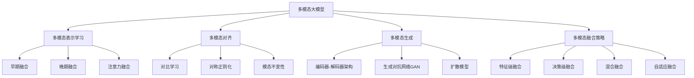

# 多模态大模型：技术原理与实战 多模态大模型在情绪识别领域的应用

## 1.背景介绍

在当今信息时代,人工智能技术发展迅猛,尤其是自然语言处理(NLP)和计算机视觉(CV)领域取得了长足进步。然而,大多数现有模型都是专注于单一模态数据,如文本或图像,而忽视了不同模态之间的相互关系和联系。人类认知和交互往往是多模态的,涉及视觉、听觉、语言等多种感官输入。因此,构建能够理解和处理多模态数据的人工智能模型,对于提高人机交互体验和认知智能水平至关重要。

多模态大模型(Multimodal Large Model)正是为解决这一挑战而诞生的新兴技术范式。它旨在整合不同模态的信息,捕捉多种感官数据之间的内在联系,从而实现更加智能和人性化的人工智能系统。情绪识别是多模态大模型的一个典型应用场景,通过融合语音、面部表情、文本等多源异构数据,可以更准确地识别和理解人类的情绪状态,为情感计算、人机交互等领域提供有力支持。

### 多模态大模型的发展历程

- 早期阶段(2010年前):主要关注单一模态数据处理,如文本处理、图像识别等,多模态融合研究处于起步阶段。
- 深度学习时期(2010-2018年):受益于深度神经网络的兴起,多模态融合模型取得突破,如视觉问答(VQA)、图文生成等任务取得进展。
- 大模型时期(2018年至今):随着大规模预训练语言模型(如BERT、GPT等)的出现,多模态大模型开始兴起,如CLIP、ALIGN等,展现出强大的跨模态理解和生成能力。

## 2.核心概念与联系

### 2.1 多模态表示学习

多模态表示学习旨在从不同模态的原始数据中学习出一组共享的语义表示,捕捉模态间的内在联系。常见方法包括:

1. **早期融合**:直接将不同模态的原始数据拼接,送入神经网络进行端到端的多任务学习。
2. **晚期融合**:先分别对每种模态进行编码,再将编码后的特征进行融合。
3. **注意力融合**:使用自注意力机制动态地捕捉不同模态间的相关性。

### 2.2 多模态对齐

多模态对齐旨在学习不同模态数据之间的语义对应关系,常用于多模态检索、多模态生成等任务。主要方法包括:

1. **对比学习**:最小化同一对象不同模态表示之间的距离,最大化不同对象表示之间的距离。
2. **对称正则化**:在学习过程中,交替作为查询和检索目标,增强模态间的对称性。
3. **模态不变性**:通过数据增强等方式,增强模型对模态变换的鲁棒性。

### 2.3 多模态生成

多模态生成任务旨在基于一种或多种模态的输入,生成另一种模态的数据,如文本生成图像、图像生成视频等。主要方法包括:

1. **编码器-解码器架构**:编码器捕获输入模态的语义,解码器生成目标模态数据。
2. **生成对抗网络(GAN)**:生成器生成目标数据,判别器判断真伪,两者对抗训练。
3. **扩散模型**:基于扩散过程,逐步从噪声中"反扩散"生成目标数据。

### 2.4 多模态融合策略

多模态融合策略决定了如何有效地整合不同模态的信息,是多模态模型的核心。常见策略包括:

1. **特征级融合**:在特征提取阶段对不同模态的特征进行融合。
2. **决策级融合**:分别对每种模态进行决策,再将决策结果进行融合。
3. **混合融合**:结合特征级和决策级融合的优点。
4. **自适应融合**:根据输入数据动态调整不同模态的权重。

## 3.核心算法原理具体操作步骤

### 3.1 CLIP: 跨模态对齐预训练

CLIP(Contrastive Language-Image Pre-training)是一种基于对比学习的跨模态对齐预训练模型,用于学习文本和图像之间的语义对应关系。其核心思想是最小化相关文本-图像对的表示距离,最大化无关对的距离。

1. **数据构建**:从网络上收集大量文本-图像对作为训练数据。
2. **图像编码器**:采用视觉transformer(ViT)对图像进行编码,得到图像特征表示。
3. **文本编码器**:采用自然语言transformer对文本进行编码,得到文本特征表示。
4. **对比损失**:计算相关文本-图像对的特征表示之间的余弦相似度,与无关对的相似度进行对比,优化对比损失函数。

$$
\mathcal{L}_{i,j} = -\log\frac{e^{sim(i,j)/\tau}}{\sum_{k=1}^{N}e^{sim(i,k)/\tau}}
$$

其中$sim(i,j)$为文本$i$和图像$j$的特征表示余弦相似度,$\tau$为温度超参数。

5. **双塔架构**:在推理时,可将文本或图像编码后,在共享空间中检索最相关的另一模态数据。

CLIP展现出强大的零样本能力和泛化性,在多个下游任务上取得了优异表现。

### 3.2 Flamingo: 多模态融合生成

Flamingo是一个多模态融合生成模型,能够基于文本、图像等输入生成新的图像、视频、音频和文本。它采用了统一的序列到序列架构,将不同模态的数据都编码为序列形式,送入编码器-解码器进行端到端训练。

1. **模态tokenizer**:将不同模态的原始数据(如图像、音频等)进行tokenize,转换为序列表示。
2. **模态编码器**:对每种模态的序列进行编码,得到相应的特征表示。
3. **交叉注意力融合**:将不同模态的特征表示通过交叉注意力机制进行融合。
4. **解码器**:基于融合后的特征表示,生成目标模态的序列输出。
5. **自回归损失**:采用自回归损失函数进行训练,优化生成序列与真实序列的相似度。

$$
\mathcal{L} = -\sum_{t=1}^{T}\log P(y_t|y_{<t}, x)
$$

其中$y_t$为目标序列的第$t$个token,$x$为输入模态序列。

Flamingo在多个多模态生成任务上表现出色,如文本生成图像、图像生成视频等,展现了强大的多模态理解和生成能力。

## 4.数学模型和公式详细讲解举例说明

### 4.1 Transformer注意力机制

Transformer是多模态大模型中常用的核心组件,其注意力机制能够捕捉不同元素之间的长程依赖关系,是实现模态融合的关键。给定查询$Q$、键$K$和值$V$,注意力计算公式为:

$$
\begin{aligned}
\text{Attention}(Q, K, V) &= \text{softmax}(\frac{QK^T}{\sqrt{d_k}})V \\
\text{head}_i &= \text{Attention}(QW_i^Q, KW_i^K, VW_i^V) \\
\text{MultiHead}(Q, K, V) &= \text{Concat}(\text{head}_1, \dots, \text{head}_h)W^O
\end{aligned}
$$

其中$d_k$为缩放因子,用于避免点积过大导致的梯度饱和。MultiHead Attention通过并行计算多个注意力头,能够关注不同的子空间特征。

在多模态任务中,注意力机制可用于:

- **自注意力**:捕捉单一模态内元素间的依赖关系。
- **交叉注意力**:捕捉不同模态元素间的相关性,实现模态融合。
- **门控注意力**:动态调节不同模态的权重贡献。

### 4.2 对比学习目标函数

对比学习是多模态对齐的核心技术,其目标是最小化相关样本对的距离,最大化无关样本对的距离。常用的对比损失函数是NT-Xent Loss:

$$
\ell_{i,j} = -\log\frac{\exp(\text{sim}(z_i, z_j)/\tau)}{\sum_{k=1}^{N}\exp(\text{sim}(z_i, z_k)/\tau)}
$$

其中$z_i$和$z_j$为相关样本对的表示,$\tau$为温度超参数,控制分布的平坦程度。$\text{sim}(\cdot,\cdot)$为相似度函数,如余弦相似度:

$$
\text{sim}(u, v) = \frac{u^Tv}{\|u\|\|v\|}
$$

对比损失函数可以应用于多对多的对比场景,如文本-图像对齐、视频-音频对齐等。

### 4.3 生成对抗网络(GAN)

GAN是多模态生成任务中常用的框架,由生成器$G$和判别器$D$组成,两者通过对抗训练达到Nash均衡:

$$
\begin{aligned}
\min_G\max_D V(D,G) &= \mathbb{E}_{x\sim p_\text{data}(x)}[\log D(x)] \\
&+ \mathbb{E}_{z\sim p_z(z)}[\log(1-D(G(z)))]
\end{aligned}
$$

其中$p_\text{data}$为真实数据分布,$p_z$为噪声先验分布。判别器$D$旨在区分生成样本与真实样本,生成器$G$则努力生成以"欺骗"判别器的高质量样本。

在条件生成任务中,GAN可扩展为条件GAN(cGAN),将条件信息$c$输入生成器:

$$
G(z,c) \sim p_\text{data}(x|c)
$$

例如在文本生成图像任务中,$c$可以是文本描述,用于控制生成图像的语义内容。

### 4.4 扩散模型

扩散模型是一种新兴的生成模型,通过学习从噪声分布到数据分布的逆向过程,实现高保真的数据生成。其基本思想是:

1. **正向扩散过程**:将数据$x_0$添加高斯噪声,逐步"扩散"到纯噪声分布$x_T \sim \mathcal{N}(0, I)$。
2. **逆向采样过程**:从$x_T$出发,通过训练获得的模型$p_\theta(x_{t-1}|x_t)$逐步"反扩散",生成清晰的数据样本$\hat{x}_0$。

扩散模型可以表述为以下过程:

$$
\begin{aligned}
q(x_t|x_{t-1}) &= \mathcal{N}(x_t; \sqrt{1-\beta_t}x_{t-1}, \beta_tI) \\
p_\theta(x_{t-1}|x_t) &= \mathcal{N}(x_{t-1}; \mu_\theta(x_t, t), \Sigma_\theta(x_t, t))
\end{aligned}
$$

其中$\beta_t$控制每一步的噪声量,$\mu_\theta$和$\Sigma_\theta$为神经网络预测的均值和方差。

扩散模型可应用于多模态生成任务,如文本生成图像、音频生成视频等,展现出优异的生成质量和多样性。

## 5.项目实践：代码实例和详细解释说明

以下是一个使用PyTorch实现的简单多模态情感分析模型示例,融合