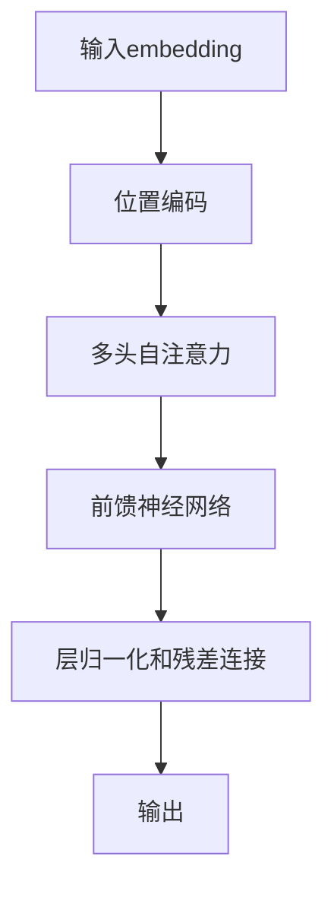
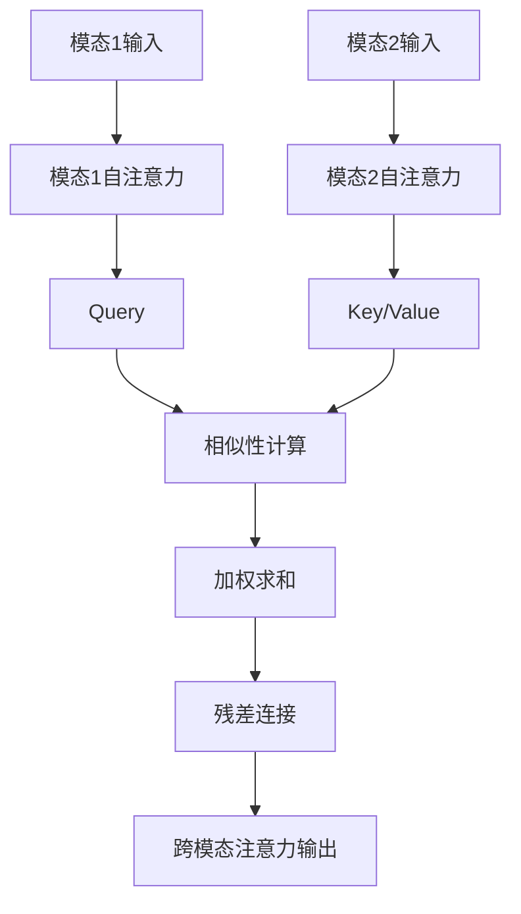

# 多模态大模型：技术原理与实战 多模态大模型的部署

## 1.背景介绍

### 1.1 人工智能的发展历程

人工智能(Artificial Intelligence, AI)是当代科技发展的重要领域,旨在使机器能够模仿人类的认知功能,如学习、推理、感知和行为能力。自20世纪50年代AI概念被正式提出以来,经历了多个发展阶段。

- 早期阶段(1950s-1960s):专家系统、博弈论等理论研究为主。
- 知识暴发阶段(1980s-1990s):知识表示、机器学习等技术取得突破。
- 深度学习时代(2010s-今):benefited by大数据、算力提升,深度学习成为AI主流范式。

### 1.2 大模型的兴起

近年来,AI模型规模快速增长,催生了"大模型"(Large Model)的概念。大模型通过海量数据训练,在自然语言处理、计算机视觉等领域展现出卓越性能。代表性模型有GPT-3、DALL-E、PaLM等。

然而,大模型也存在局限性:

- 单一模态,无法融合多种信息形式
- 训练成本高昂,存在安全隐患
- 缺乏可解释性和可控性

### 1.3 多模态大模型的兴起

为解决上述挑战,多模态大模型(Multimodal Large Model)应运而生。它能同时处理文本、图像、视频、音频等多种模态数据,展现出强大的认知和推理能力。

多模态大模型具有广阔的应用前景,如智能助手、内容创作、机器翻译等,被视为AI发展的新趋势。本文将重点介绍多模态大模型的技术原理和实战部署方案。

## 2.核心概念与联系

### 2.1 多模态学习

多模态学习(Multimodal Learning)是指从不同模态(文本、图像、语音等)的数据中获取信息,并将这些信息融合以完成特定任务的过程。

多模态学习的关键是模态融合(Modality Fusion),即如何有效地将来自不同模态的特征进行融合。常见的融合策略有:

- 早期融合(Early Fusion):在特征提取阶段对原始数据进行融合
- 晚期融合(Late Fusion):在决策阶段对不同模态的特征进行融合
- 核心融合(Kernel Fusion):在核心层次对不同模态进行融合

### 2.2 预训练与微调

预训练(Pre-training)是指在大规模无标注数据上对模型进行初始训练,获取通用的模式表示能力。而微调(Fine-tuning)则是在特定任务的标注数据上,对预训练模型进行进一步调整和优化。

预训练-微调范式广泛应用于自然语言处理和计算机视觉领域,有助于提升模型性能,降低对标注数据的依赖。在多模态大模型中,预训练和微调同样扮演着关键角色。

### 2.3 注意力机制

注意力机制(Attention Mechanism)是深度学习中的一种关键技术,能够自适应地分配不同输入特征的权重,从而聚焦于对任务更加重要的部分。

在多模态大模型中,注意力机制被广泛应用于不同模态之间的交互,实现有效的信息融合。常见的注意力机制包括:

- 自注意力(Self-Attention):捕捉单一序列内部的长程依赖关系
- 跨注意力(Cross-Attention):建立不同模态序列之间的关联
- 多头注意力(Multi-Head Attention):并行学习多个注意力表示

### 2.4 多任务学习

多任务学习(Multi-Task Learning)是指在同一模型中同时学习多个相关任务,以提高模型的泛化能力和数据利用效率。

在多模态大模型中,多任务学习可以促进不同模态之间的知识迁移,增强模型对各种模态的理解能力。常见的多任务学习策略包括硬参数共享、软参数共享等。

### 2.5 概念关联

上述核心概念相互关联,共同支撑了多模态大模型的技术实现:

- 多模态学习提供了融合不同模态数据的理论基础
- 预训练-微调范式有助于在大规模数据上训练通用表示,再转移到特定任务
- 注意力机制实现了有效的模态间交互和信息融合
- 多任务学习进一步增强了模型的泛化和迁移能力

这些概念的有机结合,使多模态大模型能够展现出强大的认知和推理能力。

## 3.核心算法原理具体操作步骤

### 3.1 Transformer 模型

Transformer 是多模态大模型的核心架构,它基于自注意力机制,能够高效地建模长期依赖关系。Transformer 的基本运作流程如下:

1. 输入embedding:将输入序列(文本/图像等)映射为embeddings
2. 位置编码:为embeddings添加位置信息
3. 多头自注意力:计算embeddings间的自注意力权重
4. 前馈神经网络:对注意力输出进行非线性变换
5. 层归一化和残差连接:增强模型稳定性
6. 输出:根据任务对最终输出进行处理(分类/生成等)

### 3.2 跨模态注意力

为实现不同模态间的交互,多模态大模型引入了跨模态注意力(Cross-Attention)机制。其基本思路是:

1. 对每个模态的输入计算自注意力
2. 将一个模态的输出作为Query,另一模态的输出作为Key/Value
3. 计算Query与Key的相似性,作为Value的权重
4. 加权求和Value,得到跨模态注意力输出
5. 将注意力输出与原始输入进行残差连接

通过跨模态注意力,模型能够自适应地融合不同模态的信息,提高表示能力。

### 3.3 预训练目标

多模态大模型通常采用自监督的方式进行预训练,常见的预训练目标包括:

1. 掩码语言模型(Masked Language Modeling,MLM):预测被遮掩的文本token
2. 图像文本对应(Image-Text Matching,ITM):判断图像与文本描述是否匹配
3. 视觉问答(Visual Question Answering,VQA):根据图像回答相关问题
4. 图像文本对应(Image Captioning):根据图像生成文本描述

通过预训练,模型能够学习到丰富的视觉语义知识,为后续的微调任务奠定基础。

### 3.4 微调策略

在完成预训练后,多模态大模型需要针对特定任务进行微调。常见的微调策略包括:

1. 全模型微调:对整个模型的参数进行微调
2. 前馈层微调:仅微调前馈网络层的参数
3. 预训练提示(Prompt Tuning):固定大部分参数,只调整预训练提示词
4. 模态选择性微调:分别对不同模态的参数进行微调

根据任务的特点和资源约束,可选择合适的微调策略以获得最佳性能。

## 4.数学模型和公式详细讲解举例说明

### 4.1 自注意力机制

自注意力是 Transformer 模型的核心,它能够捕捉输入序列内部的长程依赖关系。给定一个长度为 $n$ 的输入序列 $X = (x_1, x_2, \dots, x_n)$,其自注意力计算过程如下:

1. 线性投影:将输入 $X$ 分别映射到 Query(Q)、Key(K)和 Value(V)空间:

$$
\begin{aligned}
Q &= XW_Q \\
K &= XW_K \\
V &= XW_V
\end{aligned}
$$

其中 $W_Q$、$W_K$、$W_V$ 为可学习的投影矩阵。

2. 相似性计算:计算 Query 与所有 Key 的相似性得分(注意力权重):

$$
\text{Attention}(Q, K, V) = \text{softmax}\left(\frac{QK^T}{\sqrt{d_k}}\right)V
$$

其中 $d_k$ 为 Key 的维度,用于缩放点积值。

3. 加权求和:将注意力权重与 Value 加权求和,得到注意力输出:

$$
\text{Output} = \text{Attention}(Q, K, V) = \sum_{i=1}^n \alpha_i v_i
$$

其中 $\alpha_i$ 为第 $i$ 个位置的注意力权重,满足 $\sum_{i=1}^n \alpha_i = 1$。

自注意力机制能够自适应地分配不同位置的权重,聚焦于对当前任务更加重要的部分,从而提高模型的表示能力。

### 4.2 跨模态注意力

跨模态注意力是实现不同模态间交互的关键机制。假设我们有两个模态的输入序列 $X^1 = (x_1^1, x_2^1, \dots, x_n^1)$ 和 $X^2 = (x_1^2, x_2^2, \dots, x_m^2)$,其跨模态注意力计算过程如下:

1. 计算各模态的自注意力:

$$
\begin{aligned}
Q^1, K^1, V^1 &= \text{Attention}(X^1, X^1, X^1) \\
Q^2, K^2, V^2 &= \text{Attention}(X^2, X^2, X^2)
\end{aligned}
$$

2. 计算跨模态注意力:

$$
\text{CrossAttention}(Q^1, K^2, V^2) = \text{softmax}\left(\frac{Q^1(K^2)^T}{\sqrt{d_k}}\right)V^2
$$

其中,模态 1 的 Query 与模态 2 的 Key/Value 进行注意力计算。

3. 残差连接:

$$
\text{Output}^1 = Q^1 + \text{CrossAttention}(Q^1, K^2, V^2)
$$

通过残差连接,模型可以融合自注意力和跨模态注意力的信息。

跨模态注意力使模型能够自适应地融合不同模态的特征,提高了对复杂场景的理解能力。

### 4.3 预训练目标:掩码语言模型

掩码语言模型(MLM)是自然语言处理中常用的预训练目标,它要求模型预测被遮掩的文本token。给定一个长度为 $n$ 的文本序列 $X = (x_1, x_2, \dots, x_n)$,其中某些token被随机遮掩为特殊符号 [MASK],MLM 的目标是最大化被遮掩token的条件概率:

$$
\mathcal{L}_\text{MLM} = -\mathbb{E}_{X}\left[\sum_{i=1}^n \mathbb{1}(x_i = \text{[MASK]}) \log P(x_i | X_{\backslash i})\right]
$$

其中 $X_{\backslash i}$ 表示除去第 $i$ 个位置的序列,模型需要根据上下文预测被遮掩的token。

通过MLM预训练,模型能够学习到丰富的语义和上下文信息,为后续的自然语言任务奠定基础。

### 4.4 预训练目标:图像文本对应

图像文本对应(ITM)是多模态预训练中常用的目标,它要求模型判断给定的图像和文本描述是否匹配。

具体地,给定一个图像 $I$ 和一个文本描述 $T$,ITM 的目标是最大化它们的相似性得分:

$$
\mathcal{L}_\text{ITM} = -\mathbb{E}_{I, T}\left[\log \frac{e^{s(I, T)}}{\sum_{T'} e^{s(I, T')}}\right]
$$

其中 $s(I, T)$ 表示图像和文本的相似性得分,可以通过注意力机制或其他方式计算得到。分母项对所有可能的文本描述 $T'$ 进行归一化。