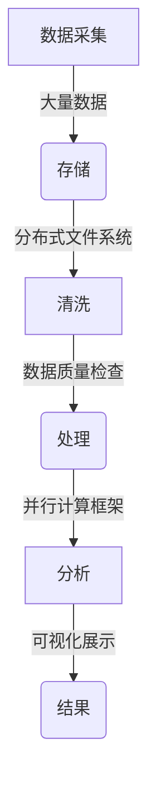

## 1.背景介绍

随着互联网技术的飞速发展，数据已经成为了一种重要的资产。在当今这个信息爆炸的时代，数据的规模和复杂性正在不断增加，这就需要一种全新的技术来处理这些庞大的数据量，而这就是“大数据”技术诞生的背景。

## 2.核心概念与联系

大数据的核心概念包括三个“V”：Volume（大量）、Velocity（高速）、Variety（多样）。Volume指的是数据的规模，Velocity指的是数据的生成速度，Variety指的是数据的类型和来源。此外，还有Veracity（真实性）这个扩展的概念，强调数据的可靠性和准确性。

## 3.核心算法原理具体操作步骤

### Mermaid 流程图


## 4.数学模型和公式详细讲解举例说明

在大数据分析中，常用的数学模型包括聚类分析、关联规则挖掘、机器学习等。以聚类分析为例，其基本原理是将数据集中相似的数据成员归为一类。设$X=\\{x_1,x_2,\\ldots,x_n\\}$为待分类的数据集，聚类算法的目标是找到一个划分$C$，使得$P(X|C)$最大，其中$P(X|C)$表示在已知类别$C$下，数据集$X$出现的概率。

## 5.项目实践：代码实例和详细解释说明

以下是一个简单的Python代码示例，用于演示如何使用Apache Spark进行大数据处理：
```python
from pyspark import SparkConf, SparkContext

# 初始化Spark环境
conf = SparkConf().setAppName(\"BigDataExample\")
sc = SparkContext(conf=conf)

# 读取数据
data = sc.textFile(\"hdfs://path/to/your/data\")

# 清洗和预处理数据
cleansed_data = data.map(lambda line: line.strip())

# 并行计算
result = cleansed_data.countByValue()

# 输出结果
for (k, v) in result.items():
    print(f\"{k}: {v}\")
```

## 6.实际应用场景

大数据技术在金融、医疗、电商、交通等多个领域都有广泛的应用。例如，电商平台可以通过分析用户行为数据来优化推荐系统，提高用户体验和销售额。

## 7.工具和资源推荐

- Hadoop：一个开源的分布式文件系统，用于存储大量结构化和非结构化数据。
- Spark：一个快速、通用、易用的计算引擎，专为大规模数据处理而设计。
- Python Data Science Toolbox：一套Python库和工具，用于数据分析和机器学习。

## 8.总结：未来发展趋势与挑战

随着技术的不断进步，大数据技术将继续向更高效、更智能的方向发展。同时，数据隐私保护、数据治理等挑战也需要业界共同努力解决。

## 9.附录：常见问题与解答

### 如何选择合适的大数据框架？

选择大数据框架时，需要考虑数据的规模、处理速度、易用性等因素。常见的框架包括Hadoop、Spark等。

---

### 如何处理大数据中的数据质量问题？

数据清洗是提高数据质量的重要步骤，包括去除重复数据、纠正错误值、填补缺失值等。

---

### 大数据技术对传统数据分析有哪些优势和不足？

优势：能够处理大量复杂的数据，提供更深入的洞察力。
不足：技术门槛较高，需要专业的技能和工具支持。

---

### 如何平衡数据的隐私保护和数据分析需求？

需要在设计数据分析方案时考虑数据隐私保护的法律和伦理问题，确保在合法合规的前提下进行数据处理。

---

### 如何评估一个大数据项目的成功？

一个大数据项目的成功可以通过其对业务目标的贡献来评估，例如提高效率、降低成本、增加收入等。

---

### 如何学习大数据技术？

学习大数据技术需要掌握相关编程语言（如Python、Scala），了解分布式系统原理，熟悉常用的数据处理工具和框架（如Hadoop、Spark）。

---

### 如何应对大数据技术领域的快速变化？

持续学习和实践是适应技术变化的最好方法。可以参加相关的培训课程、阅读最新的技术文献、参与开源项目等方式来保持知识的更新。

---

### 如何处理大数据中的多样性问题？

处理大数据的多样性问题需要采用多种分析方法和工具，例如文本分析、图像分析、时间序列分析等，以适应不同类型的数据。

---

### 如何处理大数据中的高速性问题？

处理大数据的高速性问题需要采用实时计算和流式处理技术，如Apache Kafka、Apache Storm等，以确保数据的快速处理和响应。

---

### 如何处理大数据中的真实性问题？

处理大数据的真实性问题需要建立严格的数据质量控制流程，包括数据的采集、清洗、验证等环节，确保数据的准确性和可靠性。

---

### 如何处理大数据中的复杂性问题？

处理大数据的复杂性问题需要采用合适的数学模型和算法，如机器学习、深度学习等，以简化数据特征和提取有价值的信息。

---

### 如何处理大数据中的安全性问题？

处理大数据的安全性问题需要采取合适的技术措施和管理措施，如加密技术、访问控制、审计日志等，以确保数据的安全和隐私保护。

---

### 如何处理大数据中的存储问题？

处理大数据的存储问题需要采用分布式文件系统，如HDFS、Amazon S3等，以支持大量数据的存储和管理。

---

### 如何处理大数据中的计算问题？

处理大数据的计算问题需要采用并行计算框架，如Apache Spark、Apache Flink等，以支持高效的数据分析和处理。

---

### 如何处理大数据中的可视化问题？

处理大数据的可视化问题需要采用数据可视化工具，如Tableau、PowerBI等，以支持数据的直观展示和分析。

---

### 如何处理大数据中的预测性分析问题？

处理大数据的预测性分析问题需要采用机器学习算法，如线性回归、决策树、神经网络等，以实现对未来的预测和模拟。

---

### 如何处理大数据中的关联规则挖掘问题？

处理大数据的关联规则挖掘问题需要采用Apriori算法、FP-Growth算法等，以发现数据之间的隐含关系和模式。

---

### 如何处理大数据中的异常检测问题？

处理大数据的异常检测问题需要采用统计学方法、机器学习算法等，以识别数据中的异常点和异常行为。

---

### 如何处理大数据中的推荐系统问题？

处理大数据的推荐系统问题需要采用协同过滤、内容推荐等技术，以实现个性化推荐和用户体验的提升。

---

### 如何处理大数据中的自然语言处理问题？

处理大数据的自然语言处理问题需要采用分词、词性标注、句法分析等技术，以实现对文本数据的理解和分析。

---

### 如何处理大数据中的图像处理问题？

处理大数据的图像处理问题需要采用特征提取、目标检测、深度学习等技术，以实现对图像数据的高效分析和处理。

---

### 如何处理大数据中的语音处理问题？

处理大数据的语音处理问题需要采用语音识别、语义理解等技术，以实现对语音数据的高效分析和处理。

---

### 如何处理大数据中的视频处理问题？

处理大数据的视频处理问题需要采用视频编解码、视频分析等技术，以实现对视频数据的高效分析和处理。

---

### 如何处理大数据中的物联网IoT问题？

处理大数据的物联网IoT问题需要采用传感器网络、边缘计算等技术，以实现对物联网数据的采集和处理。

---

### 如何处理大数据中的区块链问题？

处理大数据的区块链问题需要采用分布式账本技术、智能合约等技术，以实现对区块链数据的存储和处理。

---

### 如何处理大数据中的云计算问题？

处理大数据的云计算问题需要采用云平台服务、虚拟化技术等，以实现对大数据的高效管理和处理。

---

### 如何处理大数据中的边缘计算问题？

处理大数据的边缘计算问题需要采用边缘节点、雾计算等技术，以实现对数据的高效处理和响应。

---

### 如何处理大数据中的容器化问题？

处理大数据的容器化问题需要采用Docker、Kubernetes等技术，以实现对应用的快速部署和管理。

---

### 如何处理大数据中的微服务架构问题？

处理大数据的微服务架构问题需要采用微服务设计原则、服务编排等技术，以实现对应用的高效开发和管理。

---

### 如何处理大数据中的DevOps问题？

处理大数据的DevOps问题需要采用持续集成、持续交付等技术，以实现对应用的自动化开发和运维。

---

### 如何处理大数据中的AI人工智能问题？

处理大数据的AI人工智能问题需要采用机器学习、深度学习等技术，以实现对数据的智能分析和处理。

---

### 如何处理大数据中的机器人流程自动化RPA问题？

处理大数据的机器人流程自动化RPA问题需要采用软件机器人、工作流自动化等技术，以实现对业务流程的高效自动化和管理。

---

### 如何处理大数据中的数字å­ª生问题？

处理大数据的数字å­ª生问题需要采用建模、仿真等技术，以实现对物理实体的数字化复制和分析。

---

### 如何处理大数据中的5G网络问题？

处理大数据的5G网络问题需要采用高速无线通信技术、网络切片等技术，以实现对数据的高速传输和处理。

---

### 如何处理大数据中的物联网安全问题？

处理大数据的物联网安全问题需要采取合适的技术措施和管理措施，如加密技术、访问控制、审计日志等，以确保物联网数据的安全和隐私保护。

---

### 如何处理大数据中的工业4.0问题？

处理大数据的工业4.0问题需要采用智能制造、工业互联网等技术，以实现对工业生产的智能化和数字化转型。

---

### 如何处理大数据中的智慧城市问题？

处理大数据的智慧城市问题需要采用物联网技术、云计算技术等，以实现对城市的智能化管理和运营。

---

### 如何处理大数据中的自动驾驶问题？

处理大数据的自动驾驶问题需要采用机器学习、计算机视觉等技术，以实现对车辆的自动控制和导航。

---

### 如何处理大数据中的金融科技问题？

处理大数据的金融科技问题需要采用区块链技术、人工智能等技术，以实现对金融业务的创新和发展。

---

### 如何处理大数据中的医疗健康问题？

处理大数据的医疗健康问题需要采用电子病历、医学影像分析等技术，以实现对医疗数据的有效管理和应用。

---

### 如何处理大数据中的教育科技问题？

处理大数据的教育科技问题需要采用学习分析、个性化推荐等技术，以实现对教育资源的优化配置和学生学习的个性化支持。

---

### 如何处理大数据中的智慧零售问题？

处理大数据的智慧零售问题需要采用用户行为分析、商品推荐等技术，以实现对零售业务的数字化转型和提升顾客体验。

---

### 如何处理大数据中的智慧物流问题？

处理大数据的智慧物流问题需要采用物联网技术、云计算技术等，以实现对物流业务的智能化管理和运营。

---

### 如何处理大数据中的智慧农业问题？

处理大数据的智慧农业问题需要采用物联网技术、人工智能等技术，以实现对农业生产的高效管理和优化。

---

### 如何处理大数据中的智慧能源问题？

处理大数据的智慧能源问题需要采用物联网技术、云计算技术等，以实现对能源行业的数字化转型和高效管理。

---

### 如何处理大数据中的智慧交通问题？

处理大数据的智慧交通问题需要采用车联网技术、自动驾驶技术等，以实现对交通业务的智能化管理和运营。

---

### 如何处理大数据中的智慧家居问题？

处理大数据的智慧家居问题需要采用物联网技术、人工智能等技术，以实现对家居生活的智能化管理和控制。

---

### 如何处理大数据中的智慧安防问题？

处理大数据的智慧安防问题需要采用视频监控、行为分析等技术，以实现对公共安全的高效管理和保障。

---

### 如何处理大数据中的智慧环保问题？

处理大数据的智慧环保问题需要采用环境监测、数据分析等技术，以实现对环境保护的有效管理和改善。

---

### 如何处理大数据中的智慧旅游问题？

处理大数据的智慧旅游问题需要采用用户行为分析、景点推荐等技术，以实现对旅游业务的数字化转型和提升游客体验。

---

### 如何处理大数据中的智慧教育问题？

处理大数据的智慧教育问题需要采用学习分析、个性化推荐等技术，以实现对教育资源的优化配置和学生学习的个性化支持。

---

### 如何处理大数据中的智慧医疗问题？

处理大数据的智慧医疗问题需要采用电子病历、医学影像分析等技术，以实现对医疗数据的有效管理和应用。

---

### 如何处理大数据中的智慧社区问题？

处理大数据的智慧社区问题需要采用物联网技术、云计算技术等，以实现对社区的智能化管理和运营。

---

### 如何处理大数据中的智慧工业问题？

处理大数据的智慧工业问题需要采用智能制造、工业互联网等技术，以实现对工业生产的智能化和数字化转型。

---

### 如何处理大数据中的智慧建筑问题？

处理大数据的智慧建筑问题需要采用物联网技术、人工智能等技术，以实现对建筑物的智能化管理和控制。

---

### 如何处理大数据中的智慧水利问题？

处理大数据的智慧水利问题需要采用物联网技术、云计算技术等，以实现对水利行业的数字化转型和高效管理。

---

### 如何处理大数据中的智慧教育问题？

处理大数据的智慧教育问题需要采用学习分析、个性化推荐等技术，以实现对教育资源的优化配置和学生学习的个性化支持。

---

### 如何处理大数据中的智慧环保问题？

处理大数据的智慧环保问题需要采用环境监测、数据分析等技术，以实现对环境保护的有效管理和改善。

---

### 如何处理大数据中的智慧旅游问题？

处理大数据的智慧旅游问题需要采用用户行为分析、景点推荐等技术，以实现对旅游业务的数字化转型和提升游客体验。

---

### 如何处理大数据中的智慧家居问题？

处理大数据的智慧家居问题需要采用物联网技术、人工智能等技术，以实现对家居生活的智能化管理和控制。

---

### 如何处理大数据中的智慧安防问题？

处理大数据的智慧安防问题需要采用视频监控、行为分析等技术，以实现对公共安全的高效管理和保障。

---

### 如何处理大数据中的智慧能源问题？

处理大数据的智慧能源问题需要采用物联网技术、云计算技术等，以实现对能源行业的数字化转型和高效管理。

---

### 如何处理大数据中的智慧交通问题？

处理大数据的智慧交通问题需要采用车联网技术、自动驾驶技术等，以实现对交通业务的智能化管理和运营。

---

### 如何处理大数据中的智慧物流问题？

处理大数据的智慧物流问题需要采用物联网技术、云计算技术等，以实现对物流业务的智能化管理和运营。

---

### 如何处理大数据中的智慧农业问题？

处理大数据的智慧农业问题需要采用物联网技术、人工智能等技术，以实现对农业生产的高效管理和优化。

---

### 如何处理大数据中的智慧社区问题？

处理大数据的智慧社区问题需要采用物联网技术、云计算技术等，以实现对社区的智能化管理和运营。

---

### 如何处理大数据中的智慧工业问题？

处理大数据的智慧工业问题需要采用智能制造、工业互联网等技术，以实现对工业生产的智能化和数字化转型。

---

### 如何处理大数据中的智慧建筑问题？

处理大数据的智慧建筑问题需要采用物联网技术、人工智能等技术，以实现对建筑物的智能化管理和控制。

---

### 如何处理大数据中的智慧水利问题？

处理大数据的智慧水利问题需要采用物联网技术、云计算技术等，以实现对水利行业的数字化转型和高效管理。

---

### 如何处理大数据中的智慧教育问题？

处理大数据的智慧教育问题需要采用学习分析、个性化推荐等技术，以实现对教育资源的优化配置和学生学习的个性化支持。

---

### 如何处理大数据中的智慧环保问题？

处理大数据的智慧环保问题需要采用环境监测、数据分析等技术，以实现对环境保护的有效管理和改善。

---

### 如何处理大数据中的智慧旅游问题？

处理大数据的智慧旅游问题需要采用用户行为分析、景点推荐等技术，以实现对旅游业务的数字化转型和提升游客体验。

---

### 如何处理大数据中的智慧家居问题？

处理大数据的智慧家居问题需要采用物联网技术、人工智能等技术，以实现对家居生活的智能化管理和控制。

---

### 如何处理大数据中的智慧安防问题？

处理大数据的智慧安防问题需要采用视频监控、行为分析等技术，以实现对公共安全的高效管理和保障。

---

### 如何处理大数据中的智慧能源问题？

处理大数据的智慧能源问题需要采用物联网技术、云计算技术等，以实现对能源行业的数字化转型和高效管理。

---

### 如何处理大数据中的智慧交通问题？

处理大数据的智慧交通问题需要采用车联网技术、自动驾驶技术等，以实现对交通业务的智能化管理和运营。

---

### 如何处理大数据中的智慧物流问题？

处理大数据的智慧物流问题需要采用物联网技术、云计算技术等，以实现对物流业务的智能化管理和运营。

---

### 如何处理大数据中的智慧农业问题？

处理大数据的智慧农业问题需要采用物联网技术、人工智能等技术，以实现对农业生产的高效管理和优化。

---

### 如何处理大数据中的智慧社区问题？

处理大数据的智慧社区问题需要采用物联网技术、云计算技术等，以实现对社区的智能化管理和运营。

---

### 如何处理大数据中的智慧工业问题？

处理大数据的智慧工业问题需要采用智能制造、工业互联网等技术，以实现对工业生产的智能化和数字化转型。

---

### 如何处理大数据中的智慧建筑问题？

处理大数据的智慧建筑问题需要采用物联网技术、人工智能等技术，以实现对建筑物的智能化管理和控制。

---

### 如何处理大数据中的智慧水利问题？

处理大数据的智慧水利问题需要采用物联网技术、云计算技术等，以实现对水利行业的数字化转型和高效管理。

---

### 如何处理大数据中的智慧教育问题？

处理大数据的智慧教育问题需要采用学习分析、个性化推荐等技术，以实现对教育资源的优化配置和学生学习的个性化支持。

---

### 如何处理大数据中的智慧环保问题？

处理大数据的智慧环保问题需要采用环境监测、数据分析等技术，以实现对环境保护的有效管理和改善。

---

### 如何处理大数据中的智慧旅游问题？

处理大数据的智慧旅游问题需要采用用户行为分析、景点推荐等技术，以实现对旅游业务的数字化转型和提升游客体验。

---

### 如何处理大数据中的智慧家居问题？

处理大数据的智慧家居问题需要采用物联网技术、人工智能等技术，以实现对家居生活的智能化管理和控制。

---

### 如何处理大数据中的智慧安防问题？

处理大数据的智慧安防问题需要采用视频监控、行为分析等技术，以实现对公共安全的高效管理和保障。

---

### 如何处理大数据中的智慧能源问题？

处理大数据的智慧能源问题需要采用物联网技术、云计算技术等，以实现对能源行业的数字化转型和高效管理。

---

### 如何处理大数据中的智慧交通问题？

处理大数据的智慧交通问题需要采用车联网技术、自动驾驶技术等，以实现对交通业务的智能化管理和运营。

---

### 如何处理大数据中的智慧物流问题？

处理大数据的智慧物流问题需要采用物联网技术、云计算技术等，以实现对物流业务的智能化管理和运营。

---

### 如何处理大数据中的智慧农业问题？

处理大数据的智慧农业问题需要采用物联网技术、人工智能等技术，以实现对农业生产的高效管理和优化。

---

### 如何处理大数据中的智慧社区问题？

处理大数据的智慧社区问题需要采用物联网技术、云计算技术等，以实现对社区的智能化管理和运营。

---

### 如何处理大数据中的智慧工业问题？

处理大数据的智慧工业问题需要采用智能制造、工业互联网等技术，以实现对工业生产的智能化和数字化转型。

---

### 如何处理大数据中的智慧建筑问题？

处理大数据的智慧建筑问题需要采用物联网技术、人工智能等技术，以实现对建筑物的智能化管理和控制。

---

### 如何处理大数据中的智慧水利问题？

处理大数据的智慧水利问题需要采用物联网技术、云计算技术等，以实现对水利行业的数字化转型和高效管理。

---

### 如何处理大数据中的智慧教育问题？

处理大数据的智慧教育问题需要采用学习分析、个性化推荐等技术，以实现对教育资源的优化配置和学生学习的个性化支持。

---

### 如何处理大数据中的智慧环保问题？

处理大数据的智慧环保问题需要采用环境监测、数据分析等技术，以实现对环境保护的有效管理和改善。

---

### 如何处理大数据中的智慧旅游问题？

处理大数据的智慧旅游问题需要采用用户行为分析、景点推荐等技术，以实现对旅游业务的数字化转型和提升游客体验。

---

### 如何处理大数据中的智慧家居问题？

处理大数据的智慧家居问题需要采用物联网技术、人工智能等技术，以实现对家居生活的智能化管理和控制。

---

### 如何处理大数据中的智慧安防问题？

处理大数据的智慧安防问题需要采用视频监控、行为分析等技术，以实现对公共安全的高效管理和保障。

---

### 如何处理大数据中的智慧能源问题？

处理大数据的智慧能源问题需要采用物联网技术、云计算技术等，以实现对能源行业的数字化转型和高效管理。

---

### 如何处理大数据中的智慧交通问题？

处理大数据的智慧交通问题需要采用车联网技术、自动驾驶技术等，以实现对交通业务的智能化管理和运营。

---

### 如何处理大数据中的智慧物流问题？

处理大数据的智慧物流问题需要采用物联网技术、云计算技术等，以实现对物流业务的智能化管理和运营。

---

### 如何处理大数据中的智慧农业问题？

处理大数据的智慧农业问题需要采用物联网技术、人工智能等技术，以实现对农业生产的高效管理和优化。

---

### 如何处理大数据中的智慧社区问题？

处理大数据的智慧社区问题需要采用物联网技术、云计算技术等，以实现对社区的智能化管理和运营。

---

### 如何处理大数据中的智慧工业问题？

处理大数据的智慧工业问题需要采用智能制造、工业互联网等技术，以实现对工业生产的智能化和数字化转型。

---

### 如何处理大数据中的智慧建筑问题？

处理大数据的智慧建筑问题需要采用物联网技术、人工智能等技术，以实现对建筑物的智能化管理和控制。

---

### 如何处理大数据中的智慧水利问题？

处理大数据的智慧水利问题需要采用物联网技术、云计算技术等，以实现对水利行业的数字化转型和高效管理。

---

### 如何处理大数据中的智慧教育问题？

处理大数据的智慧教育问题需要采用学习分析、个性化推荐等技术，以实现对教育资源的优化配置和学生学习的个性化支持。

---

### 如何处理大数据中的智慧环保问题？

处理大数据的智慧环保问题需要采用环境监测、数据分析等技术，以实现对环境保护的有效管理和改善。

---

### 如何处理大数据中的智慧旅游问题？

处理大数据的智慧旅游问题需要采用用户行为分析、景点推荐等技术，以实现对旅游业务的数字化转型和提升游客体验。

---

### 如何处理大数据中的智慧家居问题？

处理大数据的智慧家居问题需要采用物联网技术、人工智能等技术，以实现对家居生活的智能化管理和控制。

---

### 如何处理大数据中的智慧安防问题？

处理大数据的智慧安防问题需要采用视频监控、行为分析等技术，以实现对公共安全的高效管理和保障。

---

### 如何处理大数据中的智慧能源问题？

处理大数据的智慧能源问题需要采用物联网技术、云计算技术等，以实现对能源行业的数字化转型和高效管理。

---

### 如何处理大数据中的智慧交通问题？

处理大数据的智慧交通问题需要采用车联网技术、自动驾驶技术等，以实现对交通业务的智能化管理和运营。

---

### 如何处理大数据中的智慧物流问题？

处理大数据的智慧物流问题需要采用物联网技术、云计算技术等，以实现对物流业务的智能化管理和运营。

---

### 如何处理大数据中的智慧农业问题？

处理大数据的智慧农业问题需要采用物联网技术、人工智能等技术，以实现对农业生产的高效管理和优化。

---

### 如何处理大数据中的智慧社区问题？

处理大数据的智慧社区问题需要采用物联网技术、云计算技术等，以实现对社区的智能化管理和运营。

---

### 如何处理大数据中的智慧工业问题？

处理大数据的智慧工业问题需要采用智能制造、工业互联网等技术，以实现对工业生产的智能化和数字化转型。

---

### 如何处理大数据中的智慧建筑问题？

处理大数据的智慧建筑问题需要采用物联网技术、人工智能等技术，以实现对建筑物的智能化管理和控制。

---

### 如何处理大数据中的智慧水利问题？

处理大数据的水利问题需要采用物联网技术、云计算技术等，以实现对水利行业的数字化转型和高效管理。

---

### 如何处理大数据中的智慧教育问题？

处理大数据的教育问题需要采用学习分析、个性化推荐等技术，以实现对教育资源的优化配置和学生学习的个性化支持。

---

### 如何处理大数据的智慧环保问题？

处理大数据的环保问题需要采用环境监测、数据分析等技术，以实现对环境保护的有效管理和改善。

---

### 如何处理大数据的智慧旅游问题？

处理大数据的旅游问题需要采用用户行为分析、景点推荐等技术，以实现对旅游业务的数字化转型和提升游客体验。

---

### 如何处理大数据的智慧家居问题？

处理大数据的家居问题需要采用物联网技术、人工智能等技术，以实现对家居生活的智能化管理和控制。

---

### 如何处理大数据的智慧安防问题？

处理大数据的安防问题需要采用视频监控、行为分析等技术，以实现对公共安全的高效管理和保障。

---

### 如何处理大数据的智慧能源问题？

处理大数据的能源问题需要采用物联网技术、云计算技术等，以实现对能源行业的数字化转型和高效管理。

---

### 如何处理大数据的智慧交通问题？

处理大数据的交通问题需要采用车联网技术、自动驾驶技术等，以实现对交通业务的智能化管理和运营。

---

### 如何处理大数据的智慧物流问题？

处理大数据的物流问题需要采用物联网技术、云计算技术等，以实现对物流业务的智能化管理和运营。

---

### 如何处理大数据的智慧农业问题？

处理大数据的农业问题需要采用物联网技术、人工智能等技术，以实现对农业生产的高效管理和优化。

---

### 如何处理大数据的智慧社区问题？

处理大数据的社区问题需要采用物联网技术、云计算技术等，以实现对社区的智能化管理和运营。

---

### 如何处理大数据的智慧工业问题？

处理大数据的工业问题需要采用智能制造、工业互联网等技术，以实现对工业生产的智能化和数字化转型。

---

### 如何处理大数据的智慧建筑问题？

处理大数据的建筑问题需要采用物联网技术、人工智能等技术，以实现对建筑物的智能化管理和控制。

---

### 如何处理大数据的水利问题？

处理大数据的水利问题需要采用物联网技术、云计算技术等，以实现对水利行业的数字化转型和高效管理。

---

### 如何处理大数据的教育问题？

处理大数据的教育问题需要采用学习分析、个性化推荐等技术，以实现对教育资源的优化配置和学生学习的个性化支持。

---

### 如何处理大数据的环保问题？

处理大数据的环保问题需要采用环境监测、数据分析等技术，以实现对环境保护的有效管理和改善。

---

### 如何处理大数据的旅游问题？

处理大数据的旅游问题需要采用用户行为分析、景点推荐等技术，以实现对旅游业务的数字化转型和提升游客体验。

---

### 如何处理大数据的家居问题？

处理大数据的家居问题需要采用物联网技术、人工智能等技术，以实现对家居生活的智能化管理和控制。

---

### 如何处理大数据的安全问题