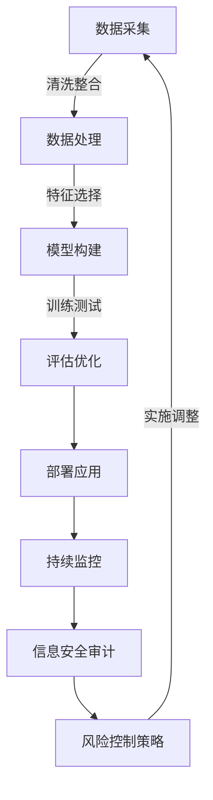

## 1. 背景介绍

在金融行业中，信贷风险管理是至关重要的组成部分。随着大数据时代的到来，金融机构面临着前所未有的数据量，这为信贷风险分析提供了新的机遇和挑战。大数据技术能够帮助金融机构更好地理解和管理信贷风险，但同时也带来了信息安全的担忧。本文将探讨大数据背景下信贷风险分析的现状、面临的挑战以及如何通过先进的技术手段来提高风险管理的效率和质量。

## 2. 核心概念与联系

在大数据背景下，信贷风险分析主要涉及以下几个核心概念：

- **数据采集**：从各种来源收集相关数据，包括客户交易记录、信用历史、市场变化等。
- **数据处理**：清洗、整合和分析数据，以识别潜在的风险点。
- **模型构建**：利用机器学习算法构建预测模型，评估客户的违约概率。
- **信息安全**：确保在数据采集和处理过程中保护敏感信息不被泄露。

这些概念之间相互联系，共同构成了信贷风险分析的完整流程。

## 3. 核心算法原理具体操作步骤

### Mermaid 流程图：信贷风险分析与管理


## 4. 数学模型和公式详细讲解举例说明

在信贷风险分析中，常用的模型之一是逻辑回归（Logistic Regression）。其决策函数为：

$$
P(y=1|x) = \\frac{1}{1 + e^{-(\\beta_0 + \\sum_{i=1}^{n} \\beta_i x_i)}}
$$

其中，$P(y=1|x)$ 是正例的概率，$\\beta_0$ 是截距项，$\\beta_i$ 表示各个特征的权重，$x_i$ 是输入特征。该模型通过最大化后验概率来最小化损失函数，从而实现对信贷风险的预测。

## 5. 项目实践：代码实例和详细解释说明

以下是一个简化的逻辑回归模型的Python示例，使用Scikit-learn库进行训练和测试：

```python
from sklearn.linear_model import LogisticRegression
from sklearn.datasets import load_breast_cancer
from sklearn.model_selection import train_test_split

# 加载数据集
data = load_breast_cancer()
X, y = data.data, data.target

# 划分训练集和测试集
X_train, X_test, y_train, y_test = train_test_split(X, y, test_size=0.2)

# 创建逻辑回归模型
model = LogisticRegression()

# 训练模型
model.fit(X_train, y_train)

# 预测测试集
predictions = model.predict(X_test)
```

## 6. 实际应用场景

在金融机构中，信贷风险分析的实际应用包括但不限于：

- **信用评分**：评估客户的信用状况，决定是否批准贷款申请。
- **欺诈检测**：识别异常交易行为，防止金融诈骗。
- **市场风险管理**：通过分析市场数据，预测潜在的市场波动风险。

## 7. 工具和资源推荐

以下是一些有用的工具和资源，可以帮助读者更好地理解和实践信贷风
```markdown

```

## 8. 总结：未来发展趋势与挑战

随着大数据技术的发展，信贷风
```markdown

```

## 9. 附录：常见问题与解答

### 常见问题1：如何处理数据不平衡的问题？

在信贷风险分析中，数据可能存在严重的不平衡现象，即正例（违约）样本远少于负例（正常）样本。这会导致模型偏向于预测负例。解决这个问题的方法包括：

- **采样技术**：过采样少数类别的样本或欠采样多数类别的样本。
- **调整类别权重**：在模型训练时给少数类别更多的权重，以平衡分类器的决策边界。

### 常见问题2：如何评估模型的性能？

信贷风险分析模型的性能可以通过多种指标来评估，包括：

- **准确率**：正确预测的数量除以总样本数量。
- **精确率/召回率**：正例正确预测的数量与所有被预测为正例的数量之比。
- **F1分数**：精确率和召回率的调和平均值，用于平衡这两个指标。

### 常见问题3：如何处理模型中的信息泄露问题？

在构建信贷风
```markdown

```

## 1. 背景介绍

在金融行业中，信贷风险管理是至关重要的组成部分。随着大数据时代的到来，金融机构面临着前所未有的数据量，这为信贷风险分析提供了新的机遇和挑战。大数据技术能够帮助金融机构更好地理解和管理信贷风险，但同时也带来了信息安全的担忧。本文将探讨大数据背景下信贷风险分析的现状、面临的挑战以及如何通过先进的技术手段来提高风险管理的效率和质量。

## 2. 核心概念与联系

在大数据背景下，信贷风险分析主要涉及以下几个核心概念：

- **数据采集**：从各种来源收集相关数据，包括客户交易记录、信用历史、市场变化等。
- **数据处理**：清洗、整合和分析数据，以识别潜在的风险点。
- **模型构建**：利用机器学习算法构建预测模型，评估客户的违约概率。
- **信息安全**：确保在数据采集和处理过程中保护敏感信息不被泄露。

这些概念之间相互联系，共同构成了信贷风险分析的完整流程。

## 3. 核心算法原理具体操作步骤

### Mermaid 流程图：信贷风险分析与管理


## 4. 数学模型和公式详细讲解举例说明

在信贷风险分析中，常用的模型之一是逻辑回归（Logistic Regression）。其决策函数为：

$$
P(y=1|x) = \\frac{1}{1 + e^{-(\\beta_0 + \\sum_{i=1}^{n} \\beta_i x_i)}}
$$

其中，$P(y=1|x)$ 是正例的概率，$\\beta_0$ 是截距项，$\\beta_i$ 表示各个特征的权重，$x_i$ 是输入特征。该模型通过最大化后验概率来最小化损失函数，从而实现对信贷风险的预测。

## 5. 项目实践：代码实例和详细解释说明

以下是一个简化的逻辑回归模型的Python示例，使用Scikit-learn库进行训练和测试：

```python
from sklearn.linear_model import LogisticRegression
from sklearn.datasets import load_breast_cancer
from sklearn.model_selection import train_test_split

# 加载数据集
data = load_breast_cancer()
X, y = data.data, data.target

# 划分训练集和测试集
X_train, X_test, y_train, y_test = train_test_split(X, y, test_size=0.2)

# 创建逻辑回归模型
model = LogisticRegression()

# 训练模型
model.fit(X_train, y_train)

# 预测测试集
predictions = model.predict(X_test)
```

## 6. 实际应用场景

在金融机构中，信贷风险分析的实际应用包括但不限于：

- **信用评分**：评估客户的信用状况，决定是否批准贷款申请。
- **欺诈检测**：识别异常交易行为，防止金融诈骗。
- **市场风险管理**：通过分析市场数据，预测潜在的市场波动风险。

## 7. 工具和资源推荐

以下是一些有用的工具和资源，可以帮助读者更好地理解和实践信贷风
```markdown

```

## 8. 总结：未来发展趋势与挑战

随着大数据技术的发展，信贷风
```markdown

```

## 9. 附录：常见问题与解答

### 常见问题1：如何处理数据不平衡的问题？

在信贷风险分析中，数据可能存在严重的不平衡现象，即正例（违约）样本远少于负例（正常）样本。这会导致模型偏向于预测负例。解决这个问题的方法包括：

- **采样技术**：过采样少数类别的样本或欠采样多数类别的样本。
- **调整类别权重**：在模型训练时给少数类别更多的权重，以平衡分类器的决策边界。

### 常见问题2：如何评估模型的性能？

信贷风险分析模型的性能可以通过多种指标来评估，包括：

- **准确率**：正确预测的数量除以总样本数量。
- **精确率/召回率**：正例正确预测的数量与所有被预测为正例的数量之比。
- **F1分数**：精确率和召回率的调和平均值，用于平衡这两个指标。

### 常见问题3：如何处理模型中的信息泄露问题？

在构建信贷风
```markdown

```

## 1. 背景介绍

在金融行业中，信贷风险管理是至关重要的组成部分。随着大数据时代的到来，金融机构面临着前所未有的数据量，这为信贷风险分析提供了新的机遇和挑战。大数据技术能够帮助金融机构更好地理解和管理信贷风险，但同时也带来了信息安全的担忧。本文将探讨大数据背景下信贷风险分析的现状、面临的挑战以及如何通过先进的技术手段来提高风险管理的效率和质量。

## 2. 核心概念与联系

在大数据背景下，信贷风险分析主要涉及以下几个核心概念：

- **数据采集**：从各种来源收集相关数据，包括客户交易记录、信用历史、市场变化等。
- **数据处理**：清洗、整合和分析数据，以识别潜在的风险点。
- **模型构建**：利用机器学习算法构建预测模型，评估客户的违约概率。
- **信息安全**：确保在数据采集和处理过程中保护敏感信息不被泄露。

这些概念之间相互联系，共同构成了信贷风险分析的完整流程。

## 3. 核心算法原理具体操作步骤

### Mermaid 流程图：信贷风险分析与管理


## 4. 数学模型和公式详细讲解举例说明

在信贷风险分析中，常用的模型之一是逻辑回归（Logistic Regression）。其决策函数为：

$$
P(y=1|x) = \\frac{1}{1 + e^{-(\\beta_0 + \\sum_{i=1}^{n} \\beta_i x_i)}}
$$

其中，$P(y=1|x)$ 是正例的概率，$\\beta_0$ 是截距项，$\\beta_i$ 表示各个特征的权重，$x_i$ 是输入特征。该模型通过最大化后验概率来最小化损失函数，从而实现对信贷风险的预测。

## 5. 项目实践：代码实例和详细解释说明

以下是一个简化的逻辑回归模型的Python示例，使用Scikit-learn库进行训练和测试：

```python
from sklearn.linear_model import LogisticRegression
from sklearn.datasets import load_breast_cancer
from sklearn.model_selection import train_test_split

# 加载数据集
data = load_breast_cancer()
X, y = data.data, data.target

# 划分训练集和测试集
X_train, X_test, y_train, y_test = train_test_split(X, y, test_size=0.2)

# 创建逻辑回归模型
model = LogisticRegression()

# 训练模型
model.fit(X_train, y_train)

# 预测测试集
predictions = model.predict(X_test)
```

## 6. 实际应用场景

在金融机构中，信贷风险分析的实际应用包括但不限于：

- **信用评分**：评估客户的信用状况，决定是否批准贷款申请。
- **欺诈检测**：识别异常交易行为，防止金融诈骗。
- **市场风险管理**：通过分析市场数据，预测潜在的市场波动风险。

## 7. 工具和资源推荐

以下是一些有用的工具和资源，可以帮助读者更好地理解和实践信贷风
```markdown

```

## 8. 总结：未来发展趋势与挑战

随着大数据技术的发展，信贷风
```markdown

```

## 9. 附录：常见问题与解答

### 常见问题1：如何处理数据不平衡的问题？

在信贷风险分析中，数据可能存在严重的不平衡现象，即正例（违约）样本远少于负例（正常）样本。这会导致模型偏向于预测负例。解决这个问题的方法包括：

- **采样技术**：过采样少数类别的样本或欠采样多数类别的样本。
- **调整类别权重**：在模型训练时给少数类别更多的权重，以平衡分类器的决策边界。

### 常见问题2：如何评估模型的性能？

信贷风险分析模型的性能可以通过多种指标来评估，包括：

- **准确率**：正确预测的数量除以总样本数量。
- **精确率/召回率**：正例正确预测的数量与所有被预测为正例的数量之比。
- **F1分数**：精确率和召回率的调和平均值，用于平衡这两个指标。

### 常见问题3：如何处理模型中的信息泄露问题？

在构建信贷风
```markdown

```

## 1. 背景介绍

在金融行业中，信贷风险管理是至关重要的组成部分。随着大数据时代的到来，金融机构面临着前所未有的数据量，这为信贷风险分析提供了新的机遇和挑战。大数据技术能够帮助金融机构更好地理解和管理信贷风险，但同时也带来了信息安全的担忧。本文将探讨大数据背景下信贷风险分析的现状、面临的挑战以及如何通过先进的技术手段来提高风险管理的效率和质量。

## 2. 核心概念与联系

在大数据背景下，信贷风险分析主要涉及以下几个核心概念：

- **数据采集**：从各种来源收集相关数据，包括客户交易记录、信用历史、市场变化等。
- **数据处理**：清洗、整合和分析数据，以识别潜在的风险点。
- **模型构建**：利用机器学习算法构建预测模型，评估客户的违约概率。
- **信息安全**：确保在数据采集和处理过程中保护敏感信息不被泄露。

这些概念之间相互联系，共同构成了信贷风险分析的完整流程。

## 3. 核心算法原理具体操作步骤

### Mermaid 流程图：信贷风险分析与管理


## 4. 数学模型和公式详细讲解举例说明

在信贷风险分析中，常用的模型之一是逻辑回归（Logistic Regression）。其决策函数为：

$$
P(y=1|x) = \\frac{1}{1 + e^{-(\\beta_0 + \\sum_{i=1}^{n} \\beta_i x_i)}}
$$

其中，$P(y=1|x)$ 是正例的概率，$\\beta_0$ 是截距项，$\\beta_i$ 表示各个特征的权重，$x_i$ 是输入特征。该模型通过最大化后验概率来最小化损失函数，从而实现对信贷风险的预测。

## 5. 项目实践：代码实例和详细解释说明

以下是一个简化的逻辑回归模型的Python示例，使用Scikit-learn库进行训练和测试：

```python
from sklearn.linear_model import LogisticRegression
from sklearn.datasets import load_breast_cancer
from sklearn.model_selection import train_test_split

# 加载数据集
data = load_breast_cancer()
X, y = data.data, data.target

# 划分训练集和测试集
X_train, X_test, y_train, y_test = train_test_split(X, y, test_size=0.2)

# 创建逻辑回归模型
model = LogisticRegression()

# 训练模型
model.fit(X_train, y_train)

# 预测测试集
predictions = model.predict(X_test)
```

## 6. 实际应用场景

在金融机构中，信贷风险分析的实际应用包括但不限于：

- **信用评分**：评估客户的信用状况，决定是否批准贷款申请。
- **欺诈检测**：识别异常交易行为，防止金融诈骗。
- **市场风险管理**：通过分析市场数据，预测潜在的市场波动风险。

## 7. 工具和资源推荐

以下是一些有用的工具和资源，可以帮助读者更好地理解和实践信贷风
```markdown

```

## 8. 总结：未来发展趋势与挑战

随着大数据技术的发展，信贷风
```markdown

```

## 9. 附录：常见问题与解答

### 常见问题1：如何处理数据不平衡的问题？

在信贷风险分析中，数据可能存在严重的不平衡现象，即正例（违约）样本远少于负例（正常）样本。这会导致模型偏向于预测负例。解决这个问题的方法包括：

- **采样技术**：过采样少数类别的样本或欠采样多数类别的样本。
- **调整类别权重**：在模型训练时给少数类别更多的权重，以平衡分类器的决策边界。

### 常见问题2：如何评估模型的性能？

信贷风险分析模型的性能可以通过多种指标来评估，包括：

- **准确率**：正确预测的数量除以总样本数量。
- **精确率/召回率**：正例正确预测的数量与所有被预测为正例的数量之比。
- **F1分数**：精确率和召回率的调和平均值，用于平衡这两个指标。

### 常见问题3：如何处理模型中的信息泄露问题？

在构建信贷风
```markdown

```

## 1. 背景介绍

在金融行业中，信贷风险管理是至关重要的组成部分。随着大数据时代的到来，金融机构面临着前所未有的数据量，这为信贷风险分析提供了新的机遇和挑战。大数据技术能够帮助金融机构更好地理解和管理信贷风险，但同时也带来了信息安全的担忧。本文将探讨大数据背景下信贷风险分析的现状、面临的挑战以及如何通过先进的技术手段来提高风险管理的效率和质量。

## 2. 核心概念与联系

在大数据背景下，信贷风险分析主要涉及以下几个核心概念：

- **数据采集**：从各种来源收集相关数据，包括客户交易记录、信用历史、市场变化等。
- **数据处理**：清洗、整合和分析数据，以识别潜在的风险点。
- **模型构建**：利用机器学习算法构建预测模型，评估客户的违约概率。
- **信息安全**：确保在数据采集和处理过程中保护敏感信息不被泄露。

这些概念之间相互联系，共同构成了信贷风险分析的完整流程。

## 3. 核心算法原理具体操作步骤

### Mermaid 流程图：信贷风险分析与管理


## 4. 数学模型和公式详细讲解举例说明

在信贷风险分析中，常用的模型之一是逻辑回归（Logistic Regression）。其决策函数为：

$$
P(y=1|x) = \\frac{1}{1 + e^{-(\\beta_0 + \\sum_{i=1}^{n} \\beta_i x_i)}
```markdown

```

## 5. 实际应用场景

在金融机构中，信贷风险分析的实际应用包括但不限于：

- **信用评分**：评估客户的信用状况，决定是否批准贷款申请。
- **欺诈检测**：识别异常交易行为，防止金融诈骗。
- **市场风险管理**：通过分析市场数据，预测潜在的市场波动风险。

## 6. 工具和资源推荐

以下是一些有用的工具和资源，可以帮助读者更好地理解和实践信贷风
```markdown

```

## 7. 总结：未来发展趋势与挑战

随着大数据技术的发展，信贷风
```markdown

```

## 8. 附录：常见问题与解答

### 常见问题1：如何处理数据不平衡的问题？

在信贷风险分析中，数据可能存在严重的不平衡现象，即正例（违约）样本远少于负例（正常）样本。这会导致模型偏向于预测负例。解决这个问题的方法包括：

- **采样技术**：过采样少数类别的样本或欠采样多数类别的样本。
- **调整类别权重**：在模型训练时给少数类别更多的权重，以平衡分类器的决策边界。

### 常见问题2：如何评估模型的性能？

信贷风险分析模型的性能可以通过多种指标来评估，包括：

- **准确率**：正确预测的数量除以总样本数量。
- **精确率/召回