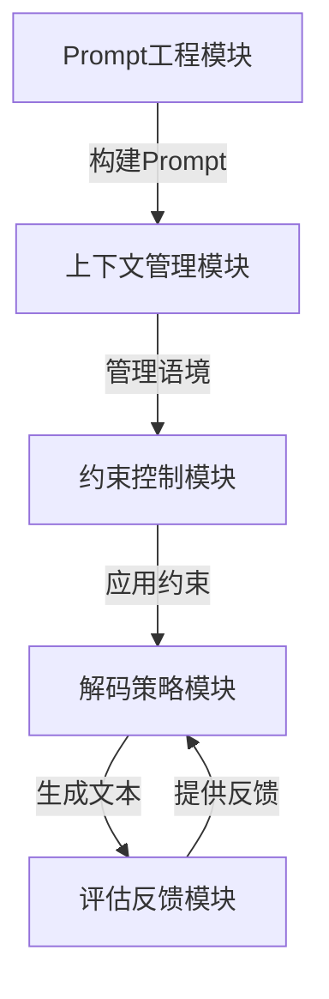

# 大规模语言模型从理论到实践 vLLM推理框架实践

## 1.背景介绍

### 1.1 人工智能的崛起

人工智能(AI)已经成为当今科技领域最热门的话题之一。随着计算能力的不断提高和算法的快速发展,AI技术在各个领域得到了广泛应用,从语音识别、图像处理到自动驾驶,无处不在。其中,自然语言处理(NLP)是AI的一个重要分支,旨在使计算机能够理解和生成人类语言。

### 1.2 大规模语言模型的兴起

近年来,大规模语言模型(Large Language Model,LLM)在NLP领域取得了突破性进展。这些模型通过在海量文本数据上进行预训练,学习到了丰富的语言知识和上下文信息,从而能够生成高质量、连贯的自然语言输出。GPT-3、PanGu-Alpha等知名语言模型均属于这一范畴。

### 1.3 vLLM推理框架的必要性

尽管大规模语言模型展现出了强大的语言生成能力,但在实际应用中,我们往往需要根据特定任务和场景对模型进行微调和控制。这就需要一个灵活、高效的推理框架,将预训练模型与下游任务相结合,实现个性化的语言生成。vLLM(Versatile Large Language Model)推理框架应运而生,旨在提供一种统一、可扩展的方式,有效利用大规模语言模型的强大功能。

## 2.核心概念与联系

### 2.1 大规模语言模型

大规模语言模型是一种基于自注意力机制(Self-Attention)和Transformer架构的神经网络模型。它通过在海量文本数据上进行无监督预训练,学习到了丰富的语言知识和上下文信息,从而能够生成高质量、连贯的自然语言输出。

这些模型通常采用自回归(Autoregressive)的生成方式,即根据输入的文本前缀,预测下一个最可能出现的词元(Token)。通过不断迭代这一过程,最终生成完整的自然语言序列。

### 2.2 vLLM推理框架

vLLM推理框架是一个灵活、高效的推理系统,旨在将预训练的大规模语言模型与下游任务相结合,实现个性化的语言生成。它提供了一系列模块和接口,支持对模型进行微调、控制和定制,以满足不同场景的需求。

该框架的核心思想是将语言生成过程分解为多个可配置的步骤,每个步骤都可以插入不同的策略或算法,从而实现对生成过程的精细控制。这种模块化设计使得框架具有很强的可扩展性和灵活性,能够适应各种复杂的应用场景。

### 2.3 核心模块

vLLM推理框架主要包括以下几个核心模块:

1. **Prompt工程模块**: 负责构建高质量的Prompt,将下游任务转换为语言模型可以理解的形式。
2. **上下文管理模块**: 管理语境信息,确保生成的文本与上下文相关且连贯。
3. **约束控制模块**: 提供各种约束策略,如词汇约束、风格约束等,以控制生成的文本符合特定要求。
4. **解码策略模块**: 包含多种解码算法,如贪婪搜索、束搜索、顶端采样等,用于生成高质量的文本。
5. **评估反馈模块**: 对生成的文本进行评估,并提供反馈,用于指导模型进行迭代优化。

这些模块相互协作,形成了一个完整的推理流程,从Prompt构建到最终文本生成,每一步都可以根据需求进行定制和优化。



## 3.核心算法原理具体操作步骤

### 3.1 Prompt工程

Prompt工程是将下游任务转换为语言模型可以理解的形式的过程。一个好的Prompt不仅能够清晰地描述任务要求,还应当考虑到模型的语言理解能力,引导模型生成符合预期的输出。

常见的Prompt工程技术包括:

1. **Few-shot学习**: 在Prompt中提供少量带标签的示例,帮助模型理解任务要求。
2. **Prompt模板**: 设计通用的Prompt模板,将任务转换为文本填空的形式。
3. **Prompt增强**: 通过添加额外的上下文信息、示例等,丰富Prompt的语义信息。

以文本分类任务为例,一个简单的Prompt可能是:

```
将以下文本分类为[正面]或[负面]:
"这家餐厅的食物非常美味,服务也很好。"
```

通过Few-shot学习,我们可以在Prompt中添加一些带标签的示例:

```
将以下文本分类为[正面]或[负面]:

"这家餐厅的食物非常美味,服务也很好。" [正面]
"等位时间太长了,服务员态度也不好。" [负面]

"我对这家餐厅的体验很满意,环境很棒。"
```

这样可以帮助模型更好地理解任务要求,生成更准确的输出。

### 3.2 上下文管理

上下文管理是确保生成的文本与上下文相关且连贯的关键步骤。在实际应用中,我们往往需要根据特定的上下文信息(如对话历史、知识库等)来生成文本。

常见的上下文管理技术包括:

1. **对话状态跟踪**: 跟踪对话的历史信息,维护对话状态。
2. **知识库集成**: 将外部知识库与语言模型集成,提供相关的背景知识。
3. **上下文向量**: 将上下文信息编码为向量,作为模型的额外输入。

以对话系统为例,我们可以将对话历史作为上下文,并将其与当前输入拼接在一起,作为模型的输入:

```
上下文: 
用户: 你好,我想预订一间双人房。
系统: 好的,请问您需要预订哪一天的房间?
用户: 我需要预订6月15日至6月18日的房间。
系统: 很抱歉,6月15日至6月18日的双人房已经被预订完了。但是我们还有6月19日至6月22日的双人房可以预订。

当前输入: 那6月19日至22日的房间可以预订吗?
```

通过有效的上下文管理,模型可以根据对话历史生成更加贴切、连贯的回复。

### 3.3 约束控制

约束控制是指在生成过程中,对输出文本施加各种约束,以确保其符合特定要求。这些约束可以是词汇约束、风格约束、主题约束等。

常见的约束控制技术包括:

1. **词汇约束**: 限制输出中出现或不出现某些词汇。
2. **风格约束**: 控制输出的风格,如正式、非正式、积极、消极等。
3. **主题约束**: 确保输出与指定主题相关。
4. **长度约束**: 控制输出文本的长度。

以文本生成任务为例,我们可以设置一些约束条件:

```
主题: 旅游
风格: 积极、生动
长度: 100-200个词
包含词汇: 美景、探险
不包含词汇: 危险、风险
```

在生成过程中,模型会根据这些约束,生成符合要求的旅游主题文本,风格积极生动,长度在100-200个词之间,包含"美景"、"探险"等词汇,但不包含"危险"、"风险"等词汇。

### 3.4 解码策略

解码策略是指在生成过程中,采用何种算法来预测下一个词元。不同的解码策略会影响生成文本的质量、多样性和计算效率。

常见的解码策略包括:

1. **贪婪搜索(Greedy Search)**: 每一步都选择概率最大的词元。
2. **束搜索(Beam Search)**: 每一步保留概率最大的k个候选词元,形成k个不同的序列。
3. **顶端采样(Top-k Sampling)**: 从概率最大的k个词元中随机采样一个。
4. **核采样(Nucleus Sampling)**: 从累积概率达到一定阈值的词元中随机采样一个。

不同的解码策略具有不同的特点。例如,贪婪搜索计算效率高,但容易导致生成的文本缺乏多样性;束搜索可以生成多样的候选序列,但计算开销较大;采样方法可以提高生成文本的多样性,但可能会引入不相关的词元。

在实际应用中,我们通常需要根据具体需求,选择合适的解码策略,或者组合使用多种策略,以获得最佳的生成效果。

## 4.数学模型和公式详细讲解举例说明

### 4.1 自注意力机制(Self-Attention)

大规模语言模型通常采用基于Transformer的架构,其核心是自注意力机制。自注意力机制能够捕捉输入序列中任意两个位置之间的依赖关系,从而更好地建模长距离依赖。

给定一个输入序列 $X = (x_1, x_2, \dots, x_n)$,自注意力机制首先计算每个位置的查询(Query)向量 $Q$、键(Key)向量 $K$ 和值(Value)向量 $V$:

$$Q = XW^Q, K = XW^K, V = XW^V$$

其中 $W^Q$、$W^K$ 和 $W^V$ 分别是可学习的权重矩阵。

然后,计算查询向量与所有键向量之间的相似性得分(注意力分数):

$$\text{Attention}(Q, K, V) = \text{softmax}(\frac{QK^T}{\sqrt{d_k}})V$$

其中 $d_k$ 是缩放因子,用于防止内积过大导致梯度消失。

最后,将注意力分数与值向量相乘,得到加权求和的注意力输出:

$$\text{Attention Output} = \text{Attention}(Q, K, V) = \sum_{i=1}^n \alpha_i v_i$$

其中 $\alpha_i$ 是第 $i$ 个位置的注意力分数,表示该位置对整个序列的重要性。

通过多头注意力机制(Multi-Head Attention),模型可以从不同的子空间捕捉不同的依赖关系,进一步提高表示能力。

### 4.2 掩码语言模型(Masked Language Model)

掩码语言模型是一种常见的预训练目标,旨在让模型学习到丰富的语言知识和上下文信息。在预训练过程中,模型需要预测被掩码(替换为特殊标记)的词元。

给定一个输入序列 $X = (x_1, x_2, \dots, x_n)$,我们随机选择一些位置进行掩码,得到掩码序列 $\tilde{X} = (\tilde{x}_1, \tilde{x}_2, \dots, \tilde{x}_n)$,其中 $\tilde{x}_i$ 可能是原始词元或特殊的掩码标记 [MASK]。

模型的目标是最大化掩码位置的条件概率:

$$\mathcal{L}_{\text{MLM}} = -\mathbb{E}_{X}\left[\sum_{i=1}^n \mathbb{1}_{\tilde{x}_i = \text{[MASK]}} \log P(x_i | \tilde{X})\right]$$

其中 $P(x_i | \tilde{X})$ 是模型预测第 $i$ 个位置的原始词元 $x_i$ 的条件概率。

通过最小化该损失函数,模型可以学习到丰富的语言知识,并且能够根据上下文信息准确预测被掩码的词元。

### 4.3 生成策略

在生成过程中,语言模型需要根据已生成的文本前缀,预测下一个最可能出现的词元。这可以通过最大化条件概率来实现:

$$x_t = \arg\max_{x} P(x | x_{<t}, c)$$

其中 $x_{<t}$ 是已生成的文本前缀,而 $c$ 是上下文信息(如Prompt、知识库等)。

然而,直接选择概率最大的词元往往会导致生成的文本