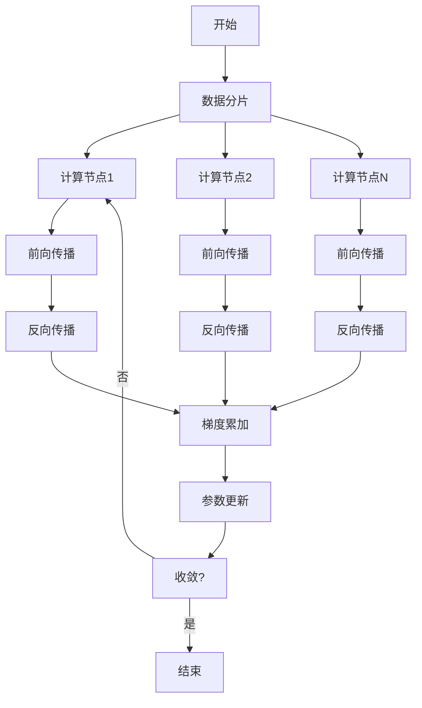
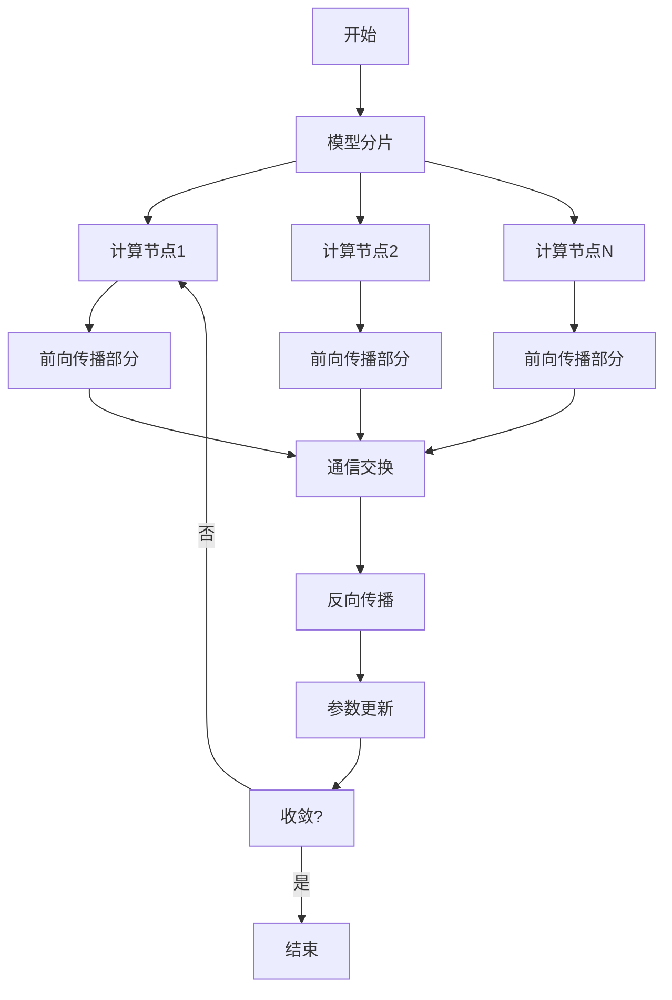
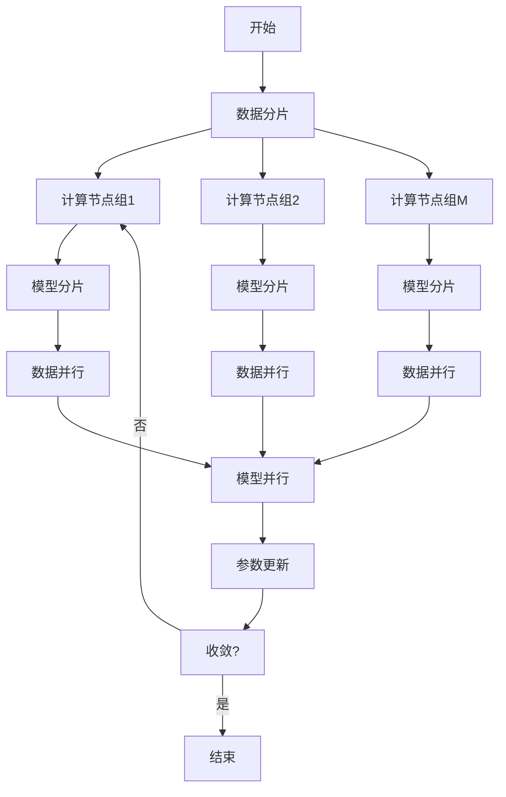

# 大规模语言模型从理论到实践 分布式训练概述

## 1.背景介绍

随着人工智能和自然语言处理领域的快速发展,大规模语言模型已经成为当前研究的热点和焦点。这些模型通过在海量文本数据上进行预训练,能够捕捉到丰富的语言知识和上下文信息,从而在下游任务中表现出优异的性能。然而,训练如此庞大的模型对计算资源的需求是巨大的,因此分布式训练技术应运而生。

分布式训练技术通过将训练任务分散到多个计算节点上并行执行,从而大幅提高了训练效率。这使得研究人员能够在合理的时间内训练出更大更强大的语言模型。本文将从理论和实践两个角度,全面介绍大规模语言模型的分布式训练技术。

## 2.核心概念与联系

### 2.1 大规模语言模型

大规模语言模型是指具有数十亿甚至上百亿参数的巨型神经网络模型。这些模型通过在海量文本语料上进行自监督预训练,学习到丰富的语义和语法知识。常见的大规模语言模型包括GPT、BERT、T5等。

### 2.2 分布式训练

分布式训练是指将训练任务分散到多个计算节点上并行执行的技术。它可以有效利用多个GPU或TPU等加速器的计算能力,从而大幅提高训练效率。

### 2.3 数据并行与模型并行

在分布式训练中,常见的并行策略有数据并行和模型并行两种:

- 数据并行: 将训练数据划分为多个分片,每个计算节点负责处理一部分数据,并定期同步梯度。
- 模型并行: 将神经网络模型划分为多个部分,每个计算节点负责计算一部分模型,并通过通信传递中间结果。

### 2.4 核心挑战

实现大规模语言模型的高效分布式训练面临以下几个核心挑战:

1. 通信开销: 多个计算节点之间需要频繁交换梯度和模型参数,产生大量通信开销。
2. 内存限制: 大规模模型需要占用大量内存,单机内存往往无法满足要求。
3. 计算效率: 需要高效利用多个加速器的计算能力,避免资源浪费。
4. 收敛性: 分布式训练可能影响模型的收敛性,需要采取特殊的优化策略。

## 3.核心算法原理具体操作步骤 

### 3.1 数据并行

数据并行是分布式训练中最常见和最直接的并行策略。其核心思想是将训练数据划分为多个分片,每个计算节点分别在本地数据分片上进行前向和反向传播计算,然后将梯度进行累加并通过通信进行同步,最后更新模型参数。具体操作步骤如下:

1. 将训练数据划分为N个分片,分发给N个计算节点。
2. 每个计算节点在本地数据分片上计算前向传播和反向传播,得到本地梯度。
3. 所有计算节点通过通信将本地梯度进行累加,得到全局梯度。
4. 使用全局梯度更新模型参数,所有节点获得新的模型参数。
5. 重复步骤2-4,直至模型收敛。

数据并行的优点是实现简单,可扩展性好。但缺点是通信开销较大,尤其是在模型参数较多的情况下。



### 3.2 模型并行

对于超大型模型,单机内存可能无法容纳整个模型。此时可以采用模型并行的策略,将模型划分为多个部分,每个计算节点负责计算一部分。具体操作步骤如下:

1. 将模型划分为N个部分,分发给N个计算节点。
2. 输入数据被广播到所有计算节点。
3. 每个计算节点在本地计算模型的一部分,得到部分输出和梯度。
4. 计算节点通过通信交换中间结果和梯度,完成前向和反向传播。
5. 所有节点更新各自负责的模型参数。
6. 重复步骤2-5,直至模型收敛。

模型并行可以有效解决内存限制的问题,但通信开销较大,实现也相对复杂。



### 3.3 混合并行

在实际应用中,数据并行和模型并行往往会结合使用,形成混合并行策略。这样可以充分利用多个计算节点的计算能力和内存资源,提高训练效率。混合并行的操作步骤包括:

1. 将训练数据划分为M个分片,模型划分为N个部分。
2. 每个计算节点负责处理一个数据分片和一个模型部分。
3. 在每个节点内部使用数据并行,在节点之间使用模型并行。
4. 节点内部进行梯度累加,节点之间进行通信交换。
5. 所有节点更新各自负责的模型参数。
6. 重复步骤2-5,直至模型收敛。

混合并行策略结合了数据并行和模型并行的优点,可以充分利用计算资源,但实现的复杂度也较高。



## 4.数学模型和公式详细讲解举例说明

在分布式训练中,通信开销是一个关键问题。我们可以使用数学模型来量化和优化通信开销。

假设有$N$个计算节点,每个节点处理$\frac{1}{N}$的训练数据。在每次迭代中,每个节点需要计算本地梯度$\nabla_i$,并将其发送到参数服务器进行累加,得到全局梯度$\nabla=\sum_{i=1}^N\nabla_i$。然后,参数服务器将全局梯度广播回每个节点,用于更新模型参数。

设模型参数的大小为$M$,梯度的大小也为$M$。在每次迭代中,每个节点需要发送$M$个浮点数,接收$M$个浮点数。假设每个浮点数占用4字节,则每个节点的通信量为:

$$
\text{通信量} = 2 \times M \times 4 \text{ 字节}
$$

对于$N$个节点,总的通信量为:

$$
\text{总通信量} = 2 \times N \times M \times 4 \text{ 字节}
$$

我们可以看到,总的通信量与节点数$N$和模型大小$M$成正比。因此,对于大规模模型,通信开销会急剧增加。

为了减少通信开销,我们可以采用梯度压缩技术。常见的梯度压缩方法包括梯度量化、稀疏化和梯度更新等。以梯度量化为例,我们可以将32位浮点数梯度量化为16位或8位整数表示,从而减少通信带宽的需求。

设梯度被量化为$b$位整数表示,则每个节点的通信量为:

$$
\text{通信量} = 2 \times M \times \frac{b}{8} \text{ 字节}
$$

对于$N$个节点,总的通信量为:

$$
\text{总通信量} = 2 \times N \times M \times \frac{b}{8} \text{ 字节}
$$

当$b=16$时,通信量仅为原始32位浮点数表示的一半。通过梯度压缩技术,我们可以显著减少通信开销,提高分布式训练的效率。

## 5.项目实践:代码实例和详细解释说明

在本节中,我们将使用PyTorch框架,实现一个简单的分布式训练示例。我们将训练一个基于LSTM的语言模型,并使用数据并行策略进行分布式训练。

### 5.1 环境准备

首先,我们需要安装PyTorch和相关依赖库:

```bash
pip install torch torchvision torchaudio
```

如果你有多个GPU,还需要安装NCCL库以支持GPU之间的通信:

```bash
pip install nvidia-nccl-cu11
```

### 5.2 数据准备

我们将使用Penn Treebank数据集作为示例数据。该数据集包含一些简单的英语句子,常用于语言模型任务。我们首先导入相关库并加载数据:

```python
import torch
from torchtext.datasets import PennTreebank

# 加载数据集
train_data, valid_data, test_data = PennTreebank()

# 构建词典
vocab = train_data.vocab
ntokens = len(vocab)
```

### 5.3 模型定义

接下来,我们定义一个基于LSTM的语言模型:

```python
import torch.nn as nn

class LSTMModel(nn.Module):
    def __init__(self, vocab_size, embedding_dim, hidden_dim, num_layers):
        super(LSTMModel, self).__init__()
        self.embedding = nn.Embedding(vocab_size, embedding_dim)
        self.lstm = nn.LSTM(embedding_dim, hidden_dim, num_layers, batch_first=True)
        self.fc = nn.Linear(hidden_dim, vocab_size)

    def forward(self, x):
        embeds = self.embedding(x)
        output, _ = self.lstm(embeds)
        logits = self.fc(output)
        return logits
```

### 5.4 分布式训练

现在,我们开始实现分布式训练。我们将使用PyTorch的`DistributedDataParallel`模块,并采用数据并行策略。

```python
import torch.distributed as dist
import torch.multiprocessing as mp

def train(rank, world_size):
    # 初始化分布式环境
    dist.init_process_group("nccl", rank=rank, world_size=world_size)

    # 创建模型
    model = LSTMModel(ntokens, 200, 200, 2)
    model = model.to(rank)
    model = nn.parallel.DistributedDataParallel(model, device_ids=[rank])

    # 准备数据
    train_sampler = torch.utils.data.distributed.DistributedSampler(train_data, num_replicas=world_size, rank=rank)
    train_loader = torch.utils.data.DataLoader(train_data, batch_size=20, sampler=train_sampler)

    # 训练循环
    optimizer = torch.optim.SGD(model.parameters(), lr=0.01)
    for epoch in range(10):
        for batch in train_loader:
            inputs, targets = batch.text, batch.target.view(-1)
            inputs, targets = inputs.to(rank), targets.to(rank)

            optimizer.zero_grad()
            outputs = model(inputs)
            loss = nn.CrossEntropyLoss()(outputs.view(-1, ntokens), targets)
            loss.backward()
            optimizer.step()

    # 清理分布式环境
    dist.destroy_process_group()

if __name__ == "__main__":
    world_size = 2  # 设置计算节点数量
    mp.spawn(train, args=(world_size,), nprocs=world_size, join=True)
```

在上面的代码中,我们首先使用`dist.init_process_group`初始化分布式环境。然后,我们创建模型,并使用`DistributedDataParallel`包装模型,实现数据并行。接下来,我们