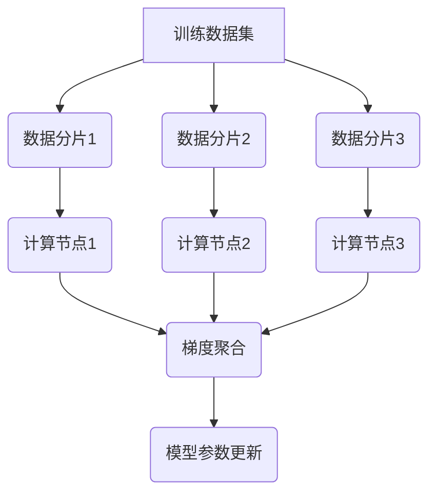
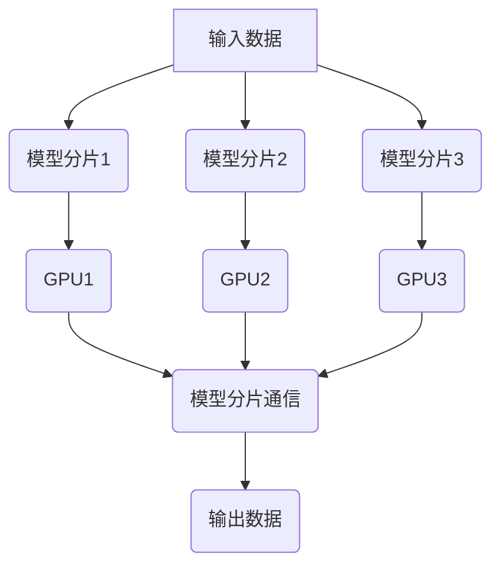
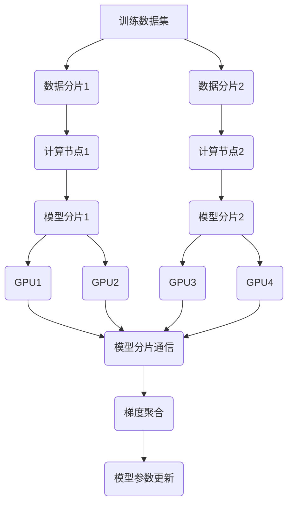
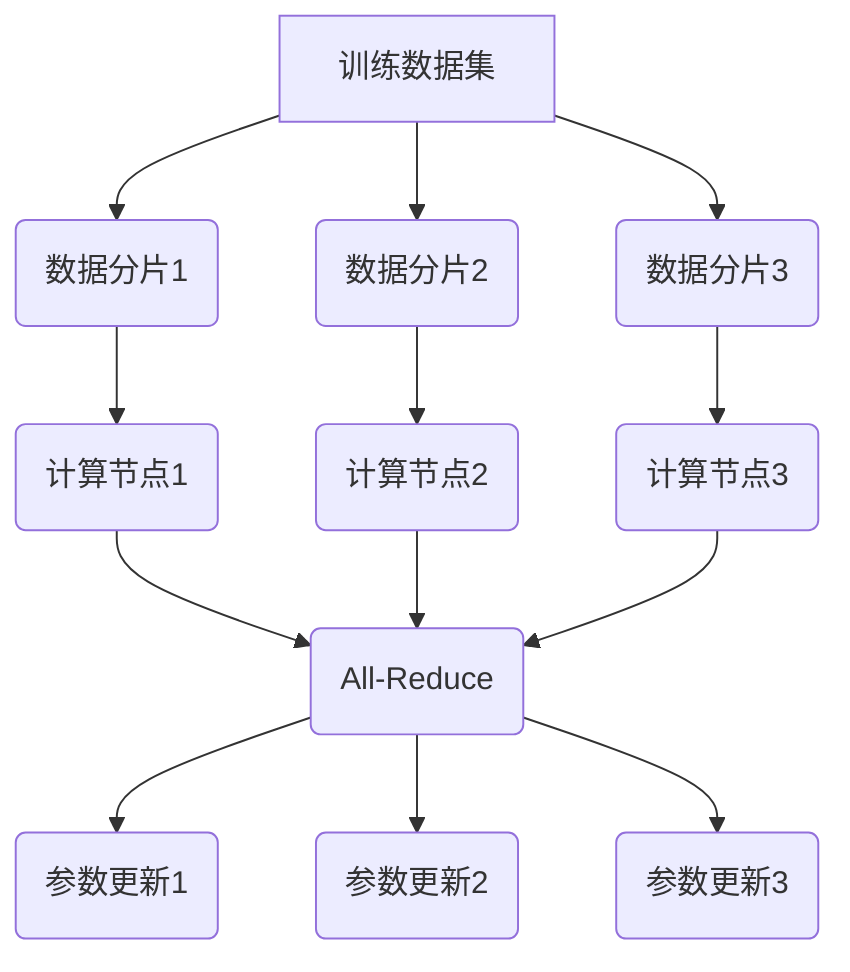
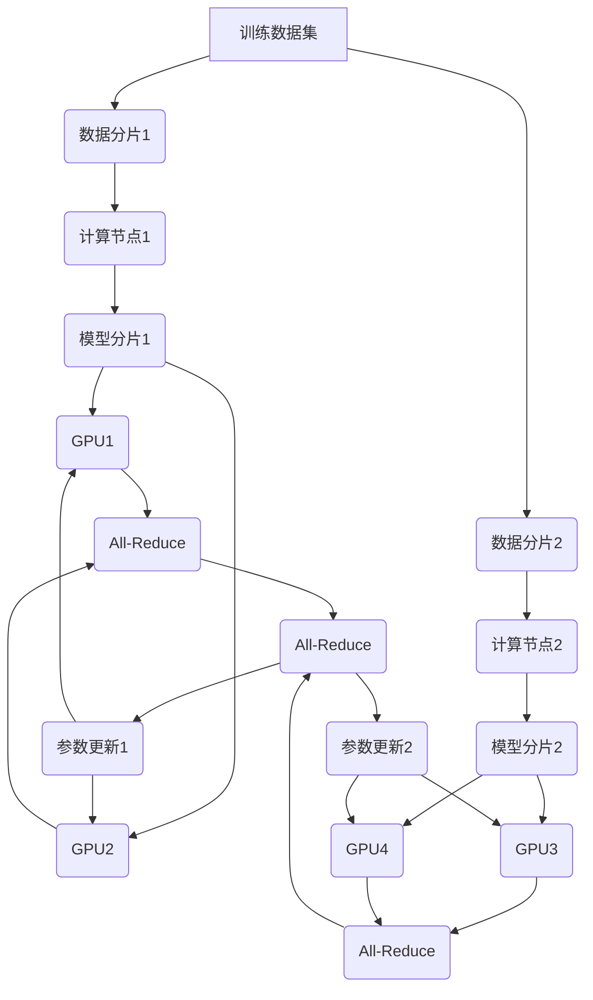

# 大规模语言模型从理论到实践 分布式训练的集群架构

## 1. 背景介绍

### 1.1 大规模语言模型的重要性

随着人工智能技术的快速发展,大规模语言模型在自然语言处理(NLP)领域扮演着越来越重要的角色。这些模型通过从海量文本数据中学习,能够捕捉语言的复杂模式和语义关系,从而在机器翻译、文本生成、问答系统等任务中表现出色。

大规模语言模型的性能主要取决于两个关键因素:模型规模和训练数据量。越大的模型和训练数据集通常能带来更好的性能,但同时也对计算资源提出了更高的要求。因此,高效的分布式训练架构对于训练大规模语言模型至关重要。

### 1.2 分布式训练的挑战

训练大规模语言模型面临着诸多挑战:

1. **数据并行性**: 海量训练数据需要在多个计算节点之间高效分发和处理。
2. **模型并行性**: 巨大的模型参数需要在多个计算设备(如GPU)之间划分和同步。
3. **通信开销**: 节点间需要频繁交换梯度和模型参数更新,产生大量通信开销。
4. **容错性**: 长时间训练过程中,任何一个节点发生故障都可能导致整个训练作废。
5. **资源利用率**: 需要高效利用分布式集群的计算、存储和网络资源。

### 1.3 本文概述

本文将详细探讨大规模语言模型分布式训练的集群架构,包括数据并行、模型并行、通信策略、容错机制和资源调度等关键组件。我们将介绍核心概念、算法原理,并通过实例代码和应用场景说明其实现和应用。最后,我们将总结未来发展趋势和挑战。

## 2. 核心概念与联系

### 2.1 数据并行

数据并行是分布式训练最常见的策略,它将训练数据均匀分割到多个计算节点,每个节点在本地数据子集上计算梯度,然后通过集中式或分散式方式汇总梯度,更新全局模型参数。



数据并行的优点是实现简单、可扩展性强,但当模型规模超过单机内存时,就需要引入模型并行。

### 2.2 模型并行

模型并行将巨大的神经网络模型分割到多个计算设备(如GPU)上,每个设备只需要存储和计算模型的一部分。这种策略可以突破单机内存限制,训练更大的模型。



模型并行需要在计算过程中频繁交换分片之间的中间结果,通信开销是一个主要瓶颈。合理的模型分片策略和高效的通信方式对性能至关重要。

### 2.3 混合并行

数据并行和模型并行可以相结合,形成混合并行策略。这种方式可以充分利用分布式集群的所有计算资源(包括多机多卡),是训练大规模模型的有力选择。



混合并行策略的实现复杂度较高,需要精心设计通信策略、容错机制和资源调度算法。

## 3. 核心算法原理具体操作步骤

### 3.1 数据并行算法

数据并行的核心算法是同步分布式随机梯度下降(Synchronous Distributed SGD),具体步骤如下:

1. 将训练数据均匀分割到N个计算节点
2. 每个节点在本地数据子集上计算梯度
3. 所有节点通过All-Reduce操作聚合局部梯度,得到全局梯度
4. 每个节点使用全局梯度更新本地模型参数副本
5. 重复上述过程,直到模型收敛



All-Reduce操作是数据并行的核心,需要高效的集中式或分散式实现,以降低通信开销。

### 3.2 模型并行算法

模型并行的核心算法是张量并行化(Tensor Parallelism),具体步骤如下:

1. 将神经网络模型分割成多个分片,每个分片分配到一个计算设备
2. 输入数据按批次传递给第一个分片,计算中间结果
3. 中间结果通过高速互连网络传递给下一个分片
4. 重复上述过程,直到最后一个分片输出结果
5. 在反向传播阶段,梯度按相反顺序流动并累积


张量并行化的关键在于合理划分模型,使不同分片之间的通信量最小化。此外,还需要高效的通信原语和内存管理策略。

### 3.3 混合并行算法

混合并行算法结合了数据并行和模型并行的优点,步骤如下:

1. 将训练数据分割到多个计算节点
2. 每个节点上,将模型进一步分割到多个计算设备
3. 每个设备在本地数据子集上计算梯度,得到局部梯度
4. 设备间通过All-Reduce操作聚合局部梯度,得到节点梯度
5. 节点间通过All-Reduce操作聚合节点梯度,得到全局梯度
6. 每个设备使用全局梯度更新本地模型分片参数
7. 重复上述过程,直到模型收敛



混合并行算法的复杂度更高,需要精心设计All-Reduce操作的流水线和重叠,以最大限度降低通信开销。

## 4. 数学模型和公式详细讲解举例说明

### 4.1 随机梯度下降(SGD)

随机梯度下降是训练神经网络模型的核心优化算法,其数学表达式如下:

$$\theta_{t+1} = \theta_t - \eta \cdot \nabla_\theta J(\theta_t; x^{(i)}; y^{(i)})$$

其中:
- $\theta_t$是当前模型参数
- $\eta$是学习率
- $J(\theta_t; x^{(i)}; y^{(i)})$是单个训练样本的损失函数
- $\nabla_\theta J(\theta_t; x^{(i)}; y^{(i)})$是损失函数关于模型参数的梯度

在每次迭代中,SGD根据单个或一小批训练样本计算梯度,并沿着梯度的反方向更新模型参数。

在分布式训练中,我们需要在多个节点上并行计算梯度,然后聚合得到全局梯度,再进行参数更新。

### 4.2 All-Reduce算法

All-Reduce是一种常用的集合通信模式,用于在多个节点之间高效地交换和累加数据。在分布式训练中,All-Reduce操作用于聚合多个节点计算的局部梯度,得到全局梯度。

All-Reduce算法的数学表达式如下:

$$\text{AllReduce}(x_1, x_2, \ldots, x_n) = \sum_{i=1}^n x_i$$

其中$x_i$是第$i$个节点持有的局部数据(如梯度)。

All-Reduce算法有多种不同的实现方式,如环形算法、双级树算法和Bucket算法等,它们在不同的网络拓扑和数据规模下具有不同的性能特点。

### 4.3 张量并行化

在模型并行中,我们需要将神经网络模型分割成多个分片,分配到不同的计算设备上。这个过程被称为张量并行化(Tensor Parallelism)。

假设一个神经网络层的计算可以表示为:

$$y = f(Wx + b)$$

其中$W$是权重矩阵,$x$是输入,$b$是偏置向量,$f$是激活函数。

在张量并行化中,我们可以将$W$按行或列划分为多个分片$W_i$,分别分配到不同的计算设备上。然后,每个设备只需要计算$y_i = f(W_ix + b_i)$,其中$b_i$是对应的偏置分片。

最终的输出$y$需要通过合并各个设备计算的$y_i$得到。这种划分方式可以有效减少每个设备的内存占用,从而支持更大的模型。

## 5. 项目实践:代码实例和详细解释说明

在这一部分,我们将提供一些分布式训练的代码示例,并详细解释其实现原理和关键点。

### 5.1 PyTorch分布式训练示例

PyTorch是一个流行的深度学习框架,它提供了强大的分布式训练功能。下面是一个使用PyTorch进行数据并行训练的简单示例:

```python
import torch
import torch.nn as nn
import torch.optim as optim
import torch.distributed as dist

# 初始化分布式环境
dist.init_process_group(backend='nccl')

# 定义模型和优化器
model = nn.Linear(10, 1)
optimizer = optim.SGD(model.parameters(), lr=0.1)

# 封装分布式模型和优化器
model = nn.parallel.DistributedDataParallel(model)
optimizer = optim.lr_scheduler.DistributedOptimizer(
                optimizer, delay_undelayed_model_allreduce=True)

# 训练循环
for epoch in range(10):
    for batch in train_loader:
        optimizer.zero_grad()
        outputs = model(batch[0])
        loss = loss_fn(outputs, batch[1])
        loss.backward()
        optimizer.step()
```

在这个示例中,我们首