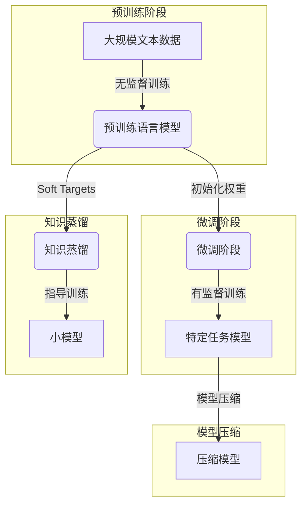

# 大规模语言模型从理论到实践：大语言模型的发展历程

## 1. 背景介绍

### 1.1 人工智能的崛起

人工智能(Artificial Intelligence, AI)作为一个跨学科的研究领域,已经存在了几十年的时间。近年来,随着计算能力的飞速提升、海量数据的积累以及算法的不断优化,人工智能取得了长足的进展,在多个领域展现出了前所未有的能力。

### 1.2 自然语言处理的重要性

在人工智能的多个分支中,自然语言处理(Natural Language Processing, NLP)是一个极为重要的领域。语言是人类进行思维和交流的基础工具,自然语言处理技术的发展不仅能够促进人机交互的自然性和效率,也为构建智能系统奠定了基础。

### 1.3 大规模语言模型的兴起

近年来,benefiting from 大规模计算集群、大数据和深度学习算法的快速发展,大规模语言模型(Large Language Model, LLM)应运而生并取得了突破性的进展。这些模型通过在大量文本数据上进行预训练,学习到了丰富的语言知识,展现出了惊人的自然语言理解和生成能力。

## 2. 核心概念与联系

### 2.1 语言模型

语言模型(Language Model, LM)是自然语言处理中的一个核心概念。它是一种概率分布模型,用于估计一个语句或者一个词序列的概率。形式化地,对于一个词序列 $W = \{w_1, w_2, ..., w_n\}$,语言模型的目标是计算该序列的概率 $P(W)$。

根据链式法则,我们可以将 $P(W)$ 分解为:

$$P(W) = P(w_1, w_2, ..., w_n) = \prod_{i=1}^{n}P(w_i|w_1, ..., w_{i-1})$$

因此,语言模型的核心任务就是估计条件概率 $P(w_i|w_1, ..., w_{i-1})$,即给定前面的词,预测当前词的概率。

### 2.2 神经网络语言模型

传统的语言模型通常基于 n-gram 统计或者句法分析等方法。随着深度学习的兴起,神经网络语言模型(Neural Network Language Model, NNLM)应运而生,它利用神经网络来建模语言的序列特性,展现出了更强的表现力。

常见的神经网络语言模型包括前馈神经网络语言模型、循环神经网络语言模型(Recurrent Neural Network Language Model, RNNLM)、长短期记忆网络语言模型(Long Short-Term Memory Language Model, LSTMLM)等。这些模型能够有效地捕捉语言的长距离依赖关系,并通过端到端的训练来直接优化语言模型的目标函数。

### 2.3 自注意力机制与 Transformer

2017 年,Transformer 模型的提出为语言模型的发展带来了里程碑式的突破。Transformer 完全基于注意力机制(Attention Mechanism)来建模序列数据,摒弃了 RNN 和 CNN 等传统架构,大大简化了模型的结构,同时通过自注意力(Self-Attention)机制有效地捕捉了长距离依赖,显著提升了模型的性能。

Transformer 的出现为大规模语言模型的发展奠定了基础,后续的 BERT、GPT 等模型都是基于 Transformer 的改进和扩展。

### 2.4 大规模语言模型

所谓大规模语言模型,是指通过在大量文本数据上进行预训练,学习到丰富的语言知识和上下文表示的语言模型。这些模型通常包含数十亿甚至上百亿的参数,能够对海量的文本数据进行有效的建模。

大规模语言模型的出现极大地提升了自然语言处理的性能,在下游任务如文本生成、机器翻译、问答系统等领域展现出了强大的能力。同时,这些模型也展现出了一定的通用性,能够通过少量的微调(fine-tuning)来适应不同的下游任务。

目前,代表性的大规模语言模型包括 GPT 系列(GPT、GPT-2、GPT-3)、BERT 系列(BERT、RoBERTa、ALBERT等)、T5、PaLM、ChatGPT 等。

## 3. 核心算法原理具体操作步骤

大规模语言模型的核心算法原理主要包括以下几个方面:

### 3.1 Transformer 编码器-解码器架构

Transformer 模型采用了编码器-解码器(Encoder-Decoder)的架构,用于处理序列到序列(Sequence-to-Sequence)的任务。编码器将输入序列编码为上下文表示,解码器则根据上下文表示和前缀生成目标序列。

编码器和解码器都是由多个相同的层组成,每一层包含了多头自注意力(Multi-Head Self-Attention)和前馈神经网络(Feed-Forward Neural Network)两个子层。

1. **多头自注意力子层**

   自注意力机制是 Transformer 的核心,它允许模型在计算每个位置的表示时,关注整个输入序列的信息。多头自注意力是将多个注意力头的结果进行拼接得到的,它能够从不同的表示子空间捕捉不同的相关性。

   具体来说,给定一个输入序列 $X = (x_1, x_2, ..., x_n)$,多头自注意力的计算过程如下:

   1) 线性投影将输入分别映射到查询(Query)、键(Key)和值(Value)空间:
      $$\begin{aligned}
      Q &= XW^Q \\
      K &= XW^K \\
      V &= XW^V
      \end{aligned}$$

   2) 计算注意力权重:
      $$\text{Attention}(Q, K, V) = \text{softmax}(\frac{QK^T}{\sqrt{d_k}})V$$

   3) 对多个注意力头的结果进行拼接:
      $$\text{MultiHead}(Q, K, V) = \text{Concat}(head_1, ..., head_h)W^O$$

2. **前馈神经网络子层**

   前馈神经网络子层是一个简单的位置wise全连接前馈神经网络,它对每个位置的表示进行独立的非线性映射。这一子层的作用是为模型引入非线性变换能力,并进一步提取高阶特征。

3. **残差连接和层归一化**

   为了更好地训练深层网络,Transformer 在每个子层后都使用了残差连接(Residual Connection)和层归一化(Layer Normalization)。残差连接有助于梯度传播,而层归一化则能够加速训练并提高模型的泛化能力。

编码器和解码器的主要区别在于,解码器还包含一个掩码(Mask)的多头自注意力子层,用于防止注意到未来的位置。此外,解码器还包含一个编码器-解码器注意力子层,它允许解码器关注编码器的输出表示。

### 3.2 预训练与微调

大规模语言模型通常采用两阶段的训练策略:预训练(Pre-training)和微调(Fine-tuning)。

1. **预训练**

   在预训练阶段,模型在大量的文本数据上进行无监督训练,目标是最大化语言模型的似然函数(或者最小化交叉熵损失)。常见的预训练目标包括:

   - 掩码语言模型(Masked Language Model, MLM):随机掩码部分输入词,模型需要预测被掩码的词。
   - 下一句预测(Next Sentence Prediction, NSP):判断两个句子是否相邻。
   - 因果语言模型(Causal Language Model, CLM):给定前缀,预测下一个词。

   通过预训练,模型能够学习到丰富的语言知识和上下文表示能力。

2. **微调**

   在微调阶段,我们将预训练好的模型作为初始化权重,在特定的下游任务数据上进行进一步的训练。由于模型已经学习到了通用的语言表示能力,只需要少量的数据和训练步骤,就能够将模型适应到新的任务上。

   常见的微调方式包括:

   - 添加一个新的输出层,针对特定任务(如文本分类、序列标注等)进行端到端的训练。
   - 在预训练模型的基础上增加一些新的层,用于特定任务的建模。
   - 对整个预训练模型进行全部微调,即在新任务上继续训练所有参数。

通过预训练和微调的两阶段训练策略,大规模语言模型能够有效地利用大量的无标注数据,并将学习到的知识迁移到各种下游任务上,从而显著提升了自然语言处理的性能。

### 3.3 模型压缩与知识蒸馏

尽管大规模语言模型展现出了强大的能力,但它们通常包含数十亿甚至上百亿的参数,导致了庞大的模型尺寸和高昂的计算开销。为了解决这一问题,研究者们提出了多种模型压缩和知识蒸馏的技术。

1. **模型压缩**

   模型压缩旨在减小模型的尺寸,降低计算和存储开销,常见的方法包括:

   - 剪枝(Pruning):移除模型中不重要的权重或者神经元。
   - 量化(Quantization):将浮点数参数量化为低比特表示。
   - 知识蒸馏(Knowledge Distillation):利用大模型指导小模型的训练。
   - 权重分解(Weight Decomposition):将权重矩阵分解为低秩形式。

2. **知识蒸馏**

   知识蒸馏是一种常用的模型压缩技术,它的核心思想是利用大模型(Teacher)的输出作为监督信号,指导小模型(Student)的训练。具体来说,我们首先在大模型上获取软目标(Soft Targets),即对于每个输入,大模型输出的是一个概率分布,而不是一个硬标签。然后,我们将小模型的输出与这些软目标进行比较,最小化它们之间的差异(如KL散度或者交叉熵损失)。

   通过知识蒸馏,小模型能够学习到大模型的知识,从而在保持较好性能的同时,大幅度降低了计算和存储开销。

### 3.4 Mermaid 流程图

以下是大规模语言模型的核心算法原理的 Mermaid 流程图:

## 4. 数学模型和公式详细讲解举例说明

在大规模语言模型中,数学模型和公式扮演着重要的角色。以下是一些核心公式的详细讲解和举例说明:

### 4.1 语言模型概率计算

语言模型的核心任务是计算一个词序列的概率。根据链式法则,我们可以将序列概率分解为条件概率的乘积:

$$P(w_1, w_2, ..., w_n) = \prod_{i=1}^{n}P(w_i|w_1, ..., w_{i-1})$$

其中,每个条件概率 $P(w_i|w_1, ..., w_{i-1})$ 表示在给定前面的词 $w_1, ..., w_{i-1}$ 的情况下,当前词 $w_i$ 出现的概率。

例如,对于一个句子 "The cat sat on the mat",我们可以计算它的概率为:

$$\begin{aligned}
P(\text{"The cat sat on the mat"}) &= P(\text{"The"}) \times P(\text{"cat"} | \text{"The"}) \times P(\text{"sat"} | \text{"The cat"}) \\
&\quad \times P(\text{"on"} | \text{"The cat sat"}) \times P(\text{"the"} | \text{"The cat sat on"}) \\
&\quad \times P(\text{"mat"} | \text{"The cat sat on the"})
\end{aligned}$$

语言模型的目标就是学习这些条件概率分布,以便能够准确地估计任意序列的概率。

### 4.2 自注意力机制

自